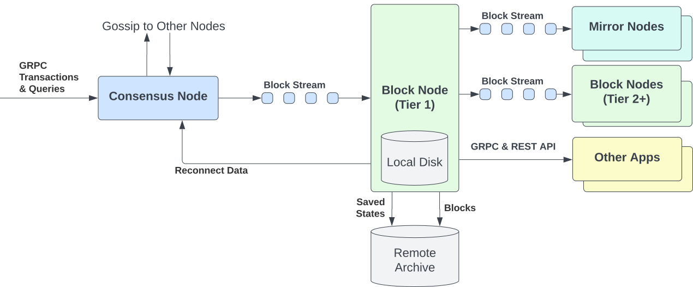

# Hiero Block Node

[](https://github.com/hiero-ledger/hiero-block-node/actions/workflows/pr-checks.yaml)
[](https://github.com/hiero-ledger/hiero-block-node/actions/workflows/e2e-tests.yaml)
[](https://codecov.io/github/hiero-ledger/hiero-block-node)

[](https://scorecard.dev/viewer/?uri=github.com/hiero-ledger/hiero-block-node)
[](https://bestpractices.coreinfrastructure.org/projects/10697)
[](https://github.com/hiero-ledger/hiero-block-node/releases)
[](https://github.com/hiero-ledger/hiero-block-node/)
[](https://docs.hiero.org/block-node-home)
[](https://discord.gg/hiero)
[](LICENSE)

A Block Node is a server that collects, verifies, and distributes the on-chain record of everything that happens on a Hiero network. Hiero is the open-source project under the Linux Foundation Decentralised Trust that powers the Hedera public network.

This repository is the implementation of [HIP-1081](https://hips.hedera.com/hip/hip-1081). The Block Node receives the block stream produced by Consensus Nodes (defined in [HIP-1056](https://hips.hedera.com/hip/hip-1056)), verifies each block's cryptographic integrity, stores the verified blockchain, and distributes blocks to Mirror Nodes, other Block Nodes, and applications via gRPC streaming APIs. Block Nodes are the new decentralized data layer replacing centralized cloud storage - and are deployed in production on Hedera mainnet and testnet.



---

## Documentation

Full documentation is organized at **[docs.hiero.org/block-node-home](https://docs.hiero.org/block-node-home)**.

### Where do I start?

|                                     I am...                                      |                                                 Read first                                                 |                                              Then...                                               |
|----------------------------------------------------------------------------------|------------------------------------------------------------------------------------------------------------|----------------------------------------------------------------------------------------------------|
| **New to Block Nodes** - want to understand what they are                        | [Block Node Introduction](docs/block-node/block-node-introduction.md)                                      | [Block Node Overview](docs/block-node/block-node-overview.md)                                      |
| **A Tier 1 operator** - Council/trusted, connecting directly to a Consensus Node | [Block Node Overview](docs/block-node/block-node-overview.md)                                              | [Production Deployment Guide](docs/block-node/operations/production-guide/overview.md)             |
| **A Tier 2 operator** - permissionless, connecting to an existing Block Node     | [Block Node Overview](docs/block-node/block-node-overview.md)                                              | [Single-Node K8s Deployment](docs/block-node/operations/single-node-k8s-deployment.md)             |
| **A developer or integrator** - want to build on Block Node APIs                 | [Block Node Introduction](docs/block-node/block-node-introduction.md)                                      | [gRPC API Quickstart](docs/block-node/api-quickstart.md)                                           |
| **A Mirror Node operator** - migrating from record files                         | [Record Stream to Block Stream Migration](docs/block-node/record-stream-to-block-stream-migration.md)      | [Connecting a Mirror Node](docs/block-node/operations/connecting-a-mirror-node-to-a-block-node.md) |
| **A Consensus Node operator** - pairing my CN with a Block Node                  | [CN to Block Node Configuration](docs/block-node/operations/consensus-node-to-block-node-configuration.md) | [On-Chain Registration](docs/block-node/block-node-on-chain-registration.md)                       |
| **Evaluating locally** - want a Block Node running in minutes                    | [Docker Compose Quickstart](docs/block-node/docker-compose-quickstart.md)                                  | [gRPC API Quickstart](docs/block-node/api-quickstart.md)                                           |
| **A contributor** - want to fix bugs or add features                             | [Contributing Guide](docs/contributing)                                                                    | [Architecture Overview](docs/block-node/architecture/architecture-overview.md)                     |

> **Not sure if you are Tier 1 or Tier 2?** Tier 1 nodes connect directly to Consensus Nodes and require Hiero Governing Council membership or authorization as a trusted network partner. Tier 2 nodes are permissionless - anyone can run one by connecting to an existing Block Node upstream. See [Block Node Overview](docs/block-node/block-node-overview.md) for the full breakdown.

---

## Try it now - no installation required

Block Nodes are live on mainnet, testnet, and previewnet. Query them directly with `grpcurl` - no API key required.

**Step 1 - Install grpcurl:**

```bash
brew install grpcurl          # macOS
# Linux: download from https://github.com/fullstorydev/grpcurl/releases
```

**Step 2 - Download the proto bundle** (required for all grpcurl calls):

```bash
BUNDLE_URL=$(curl -s https://api.github.com/repos/hiero-ledger/hiero-block-node/releases/latest \
  | grep "browser_download_url.*block-node-protobuf.*tgz" \
  | head -1 | cut -d '"' -f 4)

mkdir -p ~/bn-proto
curl -sL "$BUNDLE_URL" | tar -xzC ~/bn-proto
```

**Step 3 - Query testnet server status:**

```bash
grpcurl -plaintext -emit-defaults \
  -import-path ~/bn-proto \
  -proto block-node/api/node_service.proto \
  -d '{}' \
  s01.test.blk.sgp.lat.ope.eng.hashgraph.io:40982 \
  org.hiero.block.api.BlockNodeService/serverStatus
```

A successful response looks like this (block numbers will differ):

```json
{
  "firstAvailableBlock": "0",
  "lastAvailableBlock": "2488393",
  "onlyLatestState": true,
  "nextExpectedBlock": "2488394"
}
```

**Available public endpoints:**

|  Network   |                       Sample endpoint                        | Status port |
|------------|--------------------------------------------------------------|-------------|
| Previewnet | `lfh01.previewnet.blocknode.hashgraph-devops.com`            | 40982       |
| Testnet    | `s01.test.blk.sgp.lat.ope.eng.hashgraph.io`                  | 40982       |
| Mainnet    | see [gRPC API Quickstart](docs/block-node/api-quickstart.md) | 40982       |

Each network has multiple endpoints. Public Block Node services each run on their own port: subscribe on `40980`, block access on `40981`, status on `40982`, health (HTTP) on `40983`.

Block Node APIs are gRPC-based and work with any gRPC-compatible language - Java, Go, Python, Node.js, Rust, and more. The proto files in the bundle above are all you need to generate a client in your language of choice.

See the [gRPC API Quickstart](docs/block-node/api-quickstart.md) for the full endpoint list and complete API call examples including `getBlock`, `subscribeBlockStream`, and block proofs.

---

## Run locally (~5 minutes)

Run a Block Node on your workstation with a full observability stack (Prometheus, Grafana, Loki). This uses the developer image and is for local testing only - not for mainnet or testnet operation.

**Prerequisites:** Java 25 and Docker 24+ with Docker Compose v2.

```bash
brew install --cask temurin@25   # macOS - install Java 25 (Temurin)
# Linux / Windows: download from https://adoptium.net/temurin/releases/?version=25
```

```bash
git clone https://github.com/hiero-ledger/hiero-block-node.git
cd hiero-block-node
./gradlew :app:startDockerContainer
```

Once running, verify the node is healthy. The proto bundle from Step 2 above is also required here (the local setup uses a single port `40840` for all gRPC services, unlike the per-service ports of public endpoints):

```bash
grpcurl -plaintext -emit-defaults \
  -import-path ~/bn-proto \
  -proto block-node/api/node_service.proto \
  -d '{}' \
  localhost:40840 \
  org.hiero.block.api.BlockNodeService/serverStatus
```

See the [Docker Compose Quickstart](docs/block-node/docker-compose-quickstart.md) for the full stack details, ports, Grafana dashboards, and how to simulate an incoming block stream.

---

## Production Deployment

For production and staging environments, the Block Node is deployed on Kubernetes using the Helm chart published at `oci://ghcr.io/hiero-ledger/hiero-block-node/block-node-server`.

|                                               Guide                                               |                                     Use case                                     |
|---------------------------------------------------------------------------------------------------|----------------------------------------------------------------------------------|
| [Production Deployment Guide](docs/block-node/operations/production-guide/overview.md)            | Full Tier 1 production checklist - prerequisites, install, go-live, steady-state |
| [Solo Provisioner (GCP VM)](docs/block-node/operations/solo-weaver-single-node-k8s-deployment.md) | Provisions a GCP VM, installs Kubernetes, and deploys the Helm chart in one flow |
| [Bare Metal / Cloud VM](docs/block-node/operations/single-node-k8s-deployment.md)                 | Bring-your-own Kubernetes cluster - Tier 1 or Tier 2                             |
| [Network Ports and Protocols](docs/block-node/operations/network-ports-and-protocols.md)          | Firewall and security group rules required before any deployment                 |
| [Hardware Specifications](docs/block-node/operations/block-node-hardware-specifications.md)       | CPU, RAM, NVMe, and network requirements by deployment profile                   |
| [On-Chain Registration (HIP-1137)](docs/block-node/block-node-on-chain-registration.md)           | Required step for Tier 1 operators after deployment                              |

The Helm chart source is in [`charts/block-node-server/`](charts/block-node-server/).

---

## Building from Source

**Prerequisites:**
- Java 25 (Temurin recommended) - needed to run Gradle
- Docker 24+ with Docker Compose v2 (for integration tests and the local run target)
- IntelliJ IDEA (recommended for development)

The Gradle wrapper is included - no separate Gradle installation required.

```bash
./gradlew assemble      # compile only - fast feedback during development
./gradlew build         # compile, test, and check - run before opening a PR
./gradlew spotlessApply # auto-format (required before any commit)
```

### Repository layout

|          Directory           |                                         What it contains                                          |
|------------------------------|---------------------------------------------------------------------------------------------------|
| `block-node/`                | Core Block Node application and plugin modules                                                    |
| `common/`                    | Shared utilities, types, and literals used across modules                                         |
| `tools-and-tests/simulator/` | Block stream simulator for local testing - [docs](docs/simulator/)                                |
| `tools-and-tests/tools/`     | Command-line tools for working with block stream files - [docs](tools-and-tests/tools/README.md)  |
| `tools-and-tests/suites/`    | End-to-end test suites                                                                            |
| `charts/`                    | Helm chart for Kubernetes deployment                                                              |
| `docs/`                      | Source for all documentation (synced to [docs.hiero.org](https://docs.hiero.org/block-node-home)) |

---

## Key Documentation

### Concepts and reference

|           Topic            |                                                                                                Link                                                                                                |
|----------------------------|----------------------------------------------------------------------------------------------------------------------------------------------------------------------------------------------------|
| What is a Block Node?      | [Introduction](docs/block-node/block-node-introduction.md) - [Overview](docs/block-node/block-node-overview.md)                                                                                    |
| Architecture and internals | [Architecture Overview](docs/block-node/architecture/architecture-overview.md) - [Data Flow](docs/block-node/architecture/data-flow.md) - [Plugin System](docs/block-node/architecture/plugins.md) |
| Configuration reference    | [Configuration](docs/block-node/configuration.md)                                                                                                                                                  |
| Metrics and monitoring     | [Metrics](docs/block-node/metrics.md)                                                                                                                                                              |
| Logging reference          | [Logging](docs/block-node/logging.md)                                                                                                                                                              |
| Mirror Node integration    | [Mirror Node Integration](docs/block-node/mirror-node-integration.md) - [Record Stream Migration](docs/block-node/record-stream-to-block-stream-migration.md)                                      |
| Glossary                   | [Glossary](docs/block-node/glossary.md)                                                                                                                                                            |

### Operations

|                     Topic                      |                                                     Link                                                      |
|------------------------------------------------|---------------------------------------------------------------------------------------------------------------|
| Upgrading and resetting                        | [Resetting and Upgrading](docs/block-node/operations/resetting-and-upgrading-the-block-node.md)               |
| Disaster recovery                              | [Disaster Recovery](docs/block-node/operations/production-guide/disaster-recovery.md)                         |
| Wrapped Record Block (WRB) cutover preparation | [Preparing for WRB Cutover](docs/block-node/operations/preparing-your-block-node-for-wrb-cutover.md)          |
| Testing a deployed node                        | [Testing with the Simulator](docs/block-node/operations/testing-a-deployed-block-node-using-the-simulator.md) |
| Troubleshooting                                | [Troubleshooting Guide](docs/block-node/troubleshooting.md)                                                   |
| Getting help                                   | [Getting Help](docs/block-node/operations/production-guide/getting-help.md)                                   |

### FAQs

|      Topic      |                           Link                            |
|-----------------|-----------------------------------------------------------|
| Operator FAQ    | [Operator FAQ](docs/block-node/faq/operator-faq.md)       |
| Integration FAQ | [Integration FAQ](docs/block-node/faq/integration-faq.md) |

---

## Releases

Releases follow semantic versioning. Each release is published to:
- [GitHub Releases](https://github.com/hiero-ledger/hiero-block-node/releases) - release notes and a pre-compiled `block-node-protobuf-<VERSION>.tgz` proto bundle (required for `grpcurl` and SDK integrations)
- [GitHub Container Registry](https://github.com/hiero-ledger/hiero-block-node/pkgs/container/hiero-block-node) - OCI application images
- `oci://ghcr.io/hiero-ledger/hiero-block-node/block-node-server` - Helm chart (OCI format)

---

## Community and Support

|                                      Channel                                       |                   Use for                    |
|------------------------------------------------------------------------------------|----------------------------------------------|
| [Hiero Discord](https://discord.gg/hiero)                                          | General questions, community discussion      |
| [GitHub Discussions](https://github.com/hiero-ledger/hiero-block-node/discussions) | Design questions, proposals, longer-form Q&A |
| [GitHub Issues](https://github.com/hiero-ledger/hiero-block-node/issues)           | Bug reports, documentation improvements      |

For production incident escalation, see the [Getting Help](docs/block-node/operations/production-guide/getting-help.md) guide.

---

## Related Projects

Block Node is one component in the Hiero ecosystem:

|                                                                                                                 Project                                                                                                                 |                                    Role                                    |
|-----------------------------------------------------------------------------------------------------------------------------------------------------------------------------------------------------------------------------------------|----------------------------------------------------------------------------|
| [hiero-consensus-node](https://github.com/hiero-ledger/hiero-consensus-node)                                                                                                                                                            | Produces the block stream that Block Node receives and verifies            |
| [hiero-mirror-node](https://github.com/hiero-ledger/hiero-mirror-node)                                                                                                                                                                  | Downstream consumer of Block Node data - provides REST APIs and analytics  |
| [hiero-sdk-java](https://github.com/hiero-ledger/hiero-sdk-java) / [js](https://github.com/hiero-ledger/hiero-sdk-js) / [go](https://github.com/hiero-ledger/hiero-sdk-go) / [python](https://github.com/hiero-ledger/hiero-sdk-python) | Client SDKs for building applications on Hiero                             |
| [hiero-docs](https://github.com/hiero-ledger/hiero-docs)                                                                                                                                                                                | Source for the [docs.hiero.org](https://docs.hiero.org) documentation site |

---

## Contributing

All contributions are welcome - bug fixes, features, and documentation improvements.

1. Read the [Contributing Guide](docs/contributing) for branch naming, PR format, and review requirements.
2. Read the [Hiero Contributing Guidelines](https://github.com/hiero-ledger/.github/blob/main/CONTRIBUTING.md) for the overall project.
3. Open or pick up an [issue](https://github.com/hiero-ledger/hiero-block-node/issues) before starting work.

PRs require at least two approvals from the `@hiero-ledger/hiero-block-node-committers` team.

## Security

To report a security vulnerability, follow the [Hiero security disclosure process](https://github.com/hiero-ledger/.github/blob/main/SECURITY.md). Do not open a public issue.

## Code of Conduct

Hiero uses the Linux Foundation Decentralised Trust [Code of Conduct](https://www.lfdecentralizedtrust.org/code-of-conduct).

## License

[Apache License 2.0](LICENSE)
