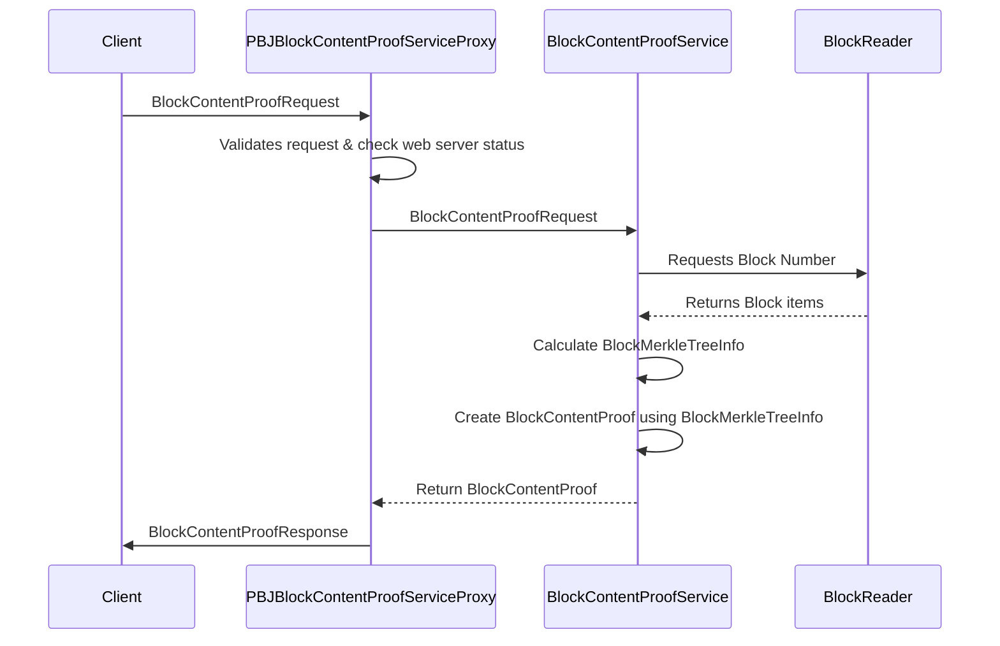

# Design Document Template

## Table of Contents

1. [Purpose](#purpose)
2. [Goals](#goals)
3. [Terms](#terms)
4. [Entities](#entities)
5. [Design](#design)
6. [Sequence Diagram](#sequence-diagram)
7. [Configuration](#configuration)
8. [Metrics](#metrics)
9. [Exceptions](#exceptions)
10. [Acceptance Tests](#acceptance-tests)

## Purpose
The purpose of this document is to define the design of the BlockContentProof feature.
The BlockContentProof API allows the BN to provide a proof of the content of a block to the client.

## Goals
1. Define the BlockContentProof struct
2. Define the BlockContentProof API
3. BN should be able to calculate the BlockContentProof given a BlockNumber and BlockItem (or BlockItemHash or BlockItemIndex)
4. A Client should be able to verify the BlockContentProof easily.

## Terms
<dl>
  <dt>BlockNumber</dt>
  <dd>A value that represents the unique number (identifier) of a given `Block`.
  It is a strictly increasing `long` value, starting from zero (`0`).</dd>

  <dt>BlockItem</dt>
  <dd>Every block is comprised of a repeated set of block_items, there are many types of block_items, but for the purpose of understanding the BlockContentProof we can divide them into 2 large groups, `inputs` and `outputs` each Kind of BlockItem can belong to these groups and this is very important in order to calculate correctly the BlockRootHash and a BlockContentProof. </dd>

  <dt>BlockItemHash</dt>
  <dd>Is a *Unique* SHA-384 hash of the block_item </dd>

  <dt>MerkleSiblingHashes</dt>
  <dd></dd>

  <dt>BlockContentProof</dt>
  <dd>A data structure that holds all the needed information to prove a given block item is part of a given block number. Is at least comprised of `BlockNumber, `BlockItemHash`, `MerkleSiblingHashes`, `BlockSignature`</dd>

  <dt>BlockRootHash</dt>
  <dd>Is a "special" merkle tree defined by the `Hiero` DLT that is comprised by `previousBlockHash`, `inputsMerkleTree`, `outputsMerkleTree` and `stateRootHash`.</dd>

  <dt>Block Signature</dt>
  <dd>Is the Signed BlockRootHash by the Network, its purpose is to verify that the BlockRootHash of a given block was signed by the network.</dd>


</dl>


## API
### block_content_proof.proto
```protobuf

 message BlockContentProof {
    uint64 block = 1; // required
    com.hedera.hapi.block.stream.BlockItem block_item = 2; // optional
    bytes block_item_hash = 3; // required
    repeated MerkleSiblingHash sibling_hashes = 4; // required
    bytes block_root_hash = 5; // optional
    bytes block_signature = 6; // required
}
```

### block_proof.proto
```protobuf
message MerkleSiblingHash {
    bool is_first = 1; // what about is_left ?
    bytes sibling_hash = 2;
}
```

### block_service.proto
```protobuf
message BlockContentProofRequest {
    uint64 block_number = 1;    
    oneof block_item {
        com.hedera.hapi.block.stream.BlockItem block_item = 1;
        bytes block_item_hash = 2;
        uint32 block_item_index = 3;
    }
}

enum BlockContentProofResponseCode {
    BLOCK_CONTENT_PROOF_UNKNOWN = 0;
    BLOCK_CONTENT_PROOF_SUCCESS = 1;
    BLOCK_CONTENT_PROOF_NOT_FOUND = 2;
    BLOCK_CONTENT_PROOF_NOT_AVAILABLE = 3;
    BLOCK_CONTENT_PROOF_INSUFFICIENT_BALANCE = 4;
    BLOCK_CONTENT_PROOF_INVALID_BLOCK_NUMBER = 5;
    BLOCK_CONTENT_PROOF_INVALID_BLOCK_ITEM_HASH = 6;
    BLOCK_CONTENT_PROOF_INTERNAL_ERROR = 7;
}

message BlockContentProofResponse {
    BlockContentProofResponseCode status = 1;
    com.hedera.hapi.block.stream.BlockContentProof block_content_proof = 2;
}

service BlockContentProofService {
    rpc getBlockContentProof(BlockContentProofRequest) returns (BlockContentProofResponse);
}
```

## Entities

### BlockContentProof
BlockContentProof is a new record that contains all the necessary data to compute the block content proof. It contains the following fields:
- block_number: long,
- block_item: BlockItem,
- block_item_hash: Bytes,
- sibling_hashes: List< MerkleSiblingHash>,
- block_root_hash: Bytes,
- block_signature: Bytes

### PBJBlockContentProofServiceProxy
PBJBlockContentProofServiceProxy is the entity responsible for handling the block content proof requests. It provides the implementation for the `getBlockContentProof` rpc endpoint.
Handles the verification of webServerStatus, handles exceptions, and wraps the response from the BlockContentProofService in a `BlockContentProofResponse` message.

### BlockContentProofService
Requests the Block to the BlockReader (Persistence Module), waits to get it and once it gets the Block it creates a new VerificationSession and provides all the items of the block including the block_proof. waits on the session to complete and returns a BlockMerkleTreeInfo.

### BlockReader
The BlockReader is responsible for reading the block items from the block store and providing them to the BlockContentProofService.

### BlockMerkleTreeInfo
Is a new record type that contains all the necessary data to compute any block item proof in the block. it contains: 
- inputsMerkleTree: List< List< Bytes>>,
- outputsMerkleTree: List< List< Bytes>>,
- previousBlockHash: Bytes,
- stateRootHash: Bytes,
- blockHash: Bytes,

## Design
1. The `PBJBlockContentProofServiceProxy` receives the block content proof requests.
2. If the request is valid and the web server is running, it forwards the request to the `BlockContentProofService`.
3. The `BlockContentProofService` requests the block from the `BlockReader`.
4. The `BlockReader` reads the block items from the block store and provides them to the `BlockContentProofService`.
5. `BlockContentProofService` calculates the `BlockMerkleTreeInfo` and creates the `BlockContentProof` using the `BlockMerkleTreeInfo`.
6. The `BlockContentProofService` returns the `BlockContentProof` to the `PBJBlockContentProofServiceProxy`.
7. The `PBJBlockContentProofServiceProxy` wraps the `BlockContentProof` in a `BlockContentProofResponse` and sends it back to the client.

## Sequence Diagram



## Configuration

## Metrics

1. BlockContentProofRequest_Success Counter
2. BlockContentProofResponse_Latency Histogram 
3. BlockContentProofResponse_NotFound Counter
4. BlockContentProofResponse_NotAvailable Counter
5. BlockContentProofResponse_Error Counter

## Exceptions
Any exception will be handled and return `BLOCK_CONTENT_PROOF_INTERNAL_ERROR` response code to the client.

## E2E Test

### Happy Path:
1. Client sends a valid BlockContentProofRequest to the BN
2. BN receives the request and returns a valid BlockContentProofResponse
3. Client receives the BlockContentProofResponse and verifies the block_item using the BlockContentProof provided by the BN.

### Block Number not found:

### Block item not found:

### Block item hash not found:

### Block item hash is invalid:

### Block item index not found

