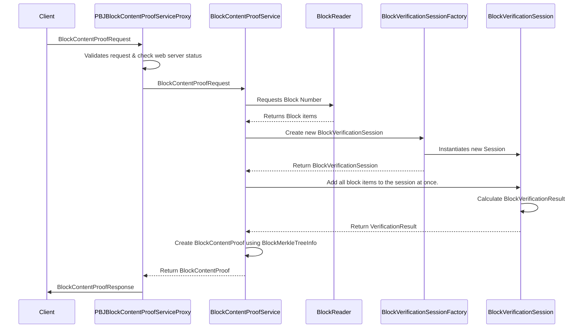

# Design Document Template

## Table of Contents

1. [Purpose](#purpose)
2. [Goals](#goals)
3. [Terms](#terms)
4. [Entities](#entities)
5. [Design](#design)
6. [Sequence Diagram](#sequence-diagram)
7. [Configuration](#configuration)
8. [Metrics](#metrics)
9. [Exceptions](#exceptions)
10. [Acceptance Tests](#acceptance-tests)

## Purpose
The BN shouldd be able to provide a proof of the content of a block given a BlockNumber and BlockItemHash the BN should be able to return a BlockContentProof that the client is able to verify. 

## Goals
1. Define the BlockContentProof struct
2. Define the BlockContentProof API
3. BN should be able to calculate the BlockContentProof given a BlockNumber and BlockItemHash
4. Re-use the existing Verification Hashing mechanism to calculate the BlockContentProof

## Terms

## API
### block_proof.proto
```protobuf

 message BlockContentProof {
    uint64 block = 1;
    com.hedera.hapi.block.stream.BlockItem block_item = 2;
    bytes block_item_hash = 3;
    repeated MerkleSiblingHash sibling_hashes = 4;
    bytes block_root_hash = 5;
    bytes block_signature = 6;
}

message MerkleSiblingHash {
    bool is_first = 1;
    bytes sibling_hash = 2;
}

```
### block_service.proto
```protobuf
message BlockContentProofRequest {
    uint64 block_number = 1;    
    oneof block_item {
        com.hedera.hapi.block.stream.BlockItem block_item = 1;
        bytes block_item_hash = 2;
    }
}

enum BlockContentProofResponseCode {
    BLOCK_CONTENT_PROOF_UNKNOWN = 0;
    BLOCK_CONTENT_PROOF_SUCCESS = 1;
    BLOCK_CONTENT_PROOF_NOT_FOUND = 2;
    BLOCK_CONTENT_PROOF_NOT_AVAILABLE = 3;
    BLOCK_CONTENT_PROOF_INSUFFICIENT_BALANCE = 4;
    BLOCK_CONTENT_PROOF_INVALID_BLOCK_NUMBER = 5;
    BLOCK_CONTENT_PROOF_INVALID_BLOCK_ITEM_HASH = 6;
    BLOCK_CONTENT_PROOF_INTERNAL_ERROR = 7;
}

message BlockContentProofResponse {
    BlockContentProofResponseCode status = 1;
    com.hedera.hapi.block.stream.BlockContentProof block_content_proof = 2;
}

service BlockContentProofService {
    rpc getBlockContentProof(BlockContentProofRequest) returns (BlockContentProofResponse);
}
```

## Entities

### BlockContentProof
BlockContentProof is a new record that contains all the necessary data to compute the block content proof. It contains the following fields:
- block_number: long,
- block_item: BlockItem,
- block_item_hash: Bytes,
- sibling_hashes: List< MerkleSiblingHash>,
- block_root_hash: Bytes,
- block_signature: Bytes

### PBJBlockContentProofServiceProxy
PBJBlockContentProofServiceProxy is the entity responsible for handling the block content proof requests. It provides the implementation for the `getBlockContentProof` rpc endpoint.
Handles the verification of webServerStatus, handles exceptions, and wraps the response from the BlockContentProofService in a `BlockContentProofResponse` message.

### BlockContentProofService
Requests the Block to the BlockReader (Persistence Module), waits to get it and once it gets the Block it creates a new VerificationSession and provides all the items of the block including the block_proof. waits on the session to complete and returns a BlockMerkleTreeInfo.

### BlockReader
The BlockReader is responsible for reading the block items from the block store and providing them to the BlockContentProofService.

### BlockVerificationSessionFactory
The BlockVerificationSessionFactory is responsible for creating new BlockVerificationSession instances and providing them with an ExecutorService.

### BlockVerificationSession
Currently, the BlockVerificationSession calculates all the merkle trees (input and output) and together with the block_proof data (previousBlockHash, stateRootHash) it calculates the block_root_hash and uses to verify the signature of the block_proof. 

The output of such process is the **Verification Result**, that we will extend to include the **BlockMerkleTreeInfo**. (all the necessary data to compute the block_root_hash is stored in the BlockMerkleTreeInfo as is being calculated, so no extra computation is needed and no less either, the only difference is that previously we discarded it and now we keep it and include it on result)

### VerificationResult
Is an existing record that contains all the output results from a verification session. it contains the following fields:
- blockNumber: long,
- blockHash: Bytes,
- status: BlockVerificationStatus (Verified or Invalid)
- blockMerkleTreeInfo: BlockMerkleTreeInfo **(new field)**

### BlockMerkleTreeInfo
Is a new record that contains all the necessary data to compute any block item proof in the block. it contains: 
- inputsMerkleTree: List< List< Bytes>>,
- outputsMerkleTree: List< List< Bytes>>,
- previousBlockHash: Bytes,
- stateRootHash: Bytes,
- blockHash: Bytes,

## Design
1. The `PBJBlockContentProofServiceProxy` receives the block content proof requests.
2. If the request is valid and the web server is running, it forwards the request to the `BlockContentProofService`.
3. The `BlockContentProofService` requests the block from the `BlockReader`.
4. The `BlockReader` reads the block items from the block store and provides them to the `BlockContentProofService`.
5. The `BlockContentProofService` creates a new `BlockVerificationSession` and provides it with the block items.
6. The `BlockVerificationSession` calculates the merkle trees and the block_root_hash and uses it to verify the signature of the block_proof.
7. The `BlockVerificationSession` returns the `VerificationResult` to the `BlockContentProofService`.
8. The `BlockContentProofService` using the MerkleTreeInfo from the `VerificationResult` creates a `BlockContentProof` and returns it to the `PBJBlockContentProofServiceProxy`.
9. The `PBJBlockContentProofServiceProxy` wraps the `BlockContentProof` in a `BlockContentProofResponse` message and sends it back to the client.
10. The client can use the `BlockContentProof` to verify the content of the block offline.

## Sequence Diagram



## Configuration

## Metrics

## Exceptions

## E2E Tests

### Happy Path:
1. Client sends a valid BlockContentProofRequest to the BN
2. BN receives the request and returns a valid BlockContentProofResponse
3. Client receives the BlockContentProofResponse and verifies the block_item using the BlockContentProof provided by the BN.

### Block Number not found:

### Block item not found:

### Block item hash not found is invalid:

