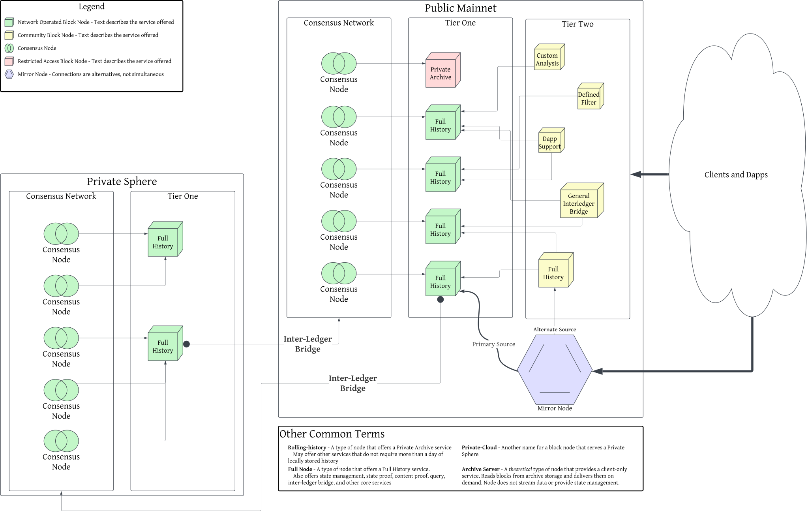

# Block Node Types

## Overview

Block Nodes can offer many services and features. The core system encompasses a
wide array of flexible options made possible by composing relatively small and
focused "plug-ins" within a framework designed to support very low latency
processing of high volume block stream data. There are many "types" of block
nodes discussed in various places, each of which is actually the same core block
node, with different combinations of "plug-ins" deployed. This demonstrates the
flexibility of the block node system to meet a specific set of needs, but the
many names and terms also leads to much confusion. This document seeks to better
define the various terms and names, as well as provide a visual representation
of where different block node instances might fit into an example network.

This document is intended for a general audience, and does not describe the
technical details of operation, access, internal "plug-ins" deployed, facilities
or any other internal detail. This document, instead, focuses on services
offered and operating intent.

## Block Node Types and Tiers Visualized

## Definitions

<dl>
<dt>Block Stream</dt>
<dd>A continuous stream of consensus network data organized into blocks. Blocks
are independent, self-contained, chained, and cryptographically verifiable
units of data.</dd>
<dt>Block Node</dt>
<dd>A software system that enables processing of block stream data for a wide
variety of purposes and in myriad ways. A Block Node may be deployed with any,
or many, set or subset of service plugins built to provide specific capabilities
within the context of processing the block stream.</dd>
<dt>Mirror Node</dt>
<dd>A service available in Hiero networks that provides extensive history and
query capabilities for that network. A Mirror Node is a client of one or more
Block Nodes, which deliver the block stream to the Mirror Node for indexing,
storage, and related purposes.</dd>
<dt>Consensus Node</dt>
<dd>One node in the consensus network of an Hiero network. Consensus Nodes
perform the critical work of executing the network consensus algorithm,
executing transactions in consensus order, maintaining a current network state,
and producing the Block Stream.</dd>
<dt>Private Sphere</dt>
<dd>An Hiero network operated on behalf of a private entity. 
Also a commercial service offered by Hashgraph Foundry Inc.</dd>
<dt>Block Node Services</dt>
<dd>
    <dl>
    <dt>Full History</dt>
    <dd>A service provided by some block nodes that choose to make available
    the entire history of the associated Hiero network, from genesis (or
    general availability in the case of the Hedera network).</dd>
    <dt>Partial History</dt>
    <dd>A service provided by some block nodes that choose to make available
    a subset of the history of the associated Hiero network, starting from
    a particular block, or for a particular duration, or based on other
    criteria.</dd>
    <dt>Private Archive</dt>
    <dd>A service provided by some block nodes that receive the block stream and
    store the data in an archive for the benefit of a particular entity, rather
    than the network as a whole. Examples include cloud buckets, long-term
    tape, or replicated local disks. Private archives are often intended for
    disaster recovery or offline analysis.</dd>
    <dt>Custom Analysis</dt>
    <dd>A theoretical service provided by a block node specialized to perform
    some form of data analysis in, or near, real time.</dd>
    <dt>General Interledger Bridge</dt>
    <dd>A theoretical service provided by a block node specialized to bridge an
    Hiero network to another general-purpose network, such as Cardano, Base,
    Ethereum, etc...</dd>
    <dt>Dapp Support</dt>
    <dd>A theoretical service provided by a block node specialized to support
    only the requirements of a specific distributed application.</dd>
    <dt>Defined Filter</dt>
    <dd>A theoretical service provided by a block node specialized to
    filter the block stream according to well-defined criteria, producing a
    modified block stream with un-desired or private data removed.
    Critically, the filtered stream is _still verifiable_ using the Block
    Proof for each block.</dd>
    </dl>
</dd>
<dt>Block Node Types</dt>
<dd>
    <dl>
    <dt>Rolling-History</dt>
    <dd>A type of node that chooses to manage only "recent" history. 
    May offer other services that do not require more than a day (or other
    limited duration) of locally stored history. Most Tier 2 nodes are expected
    to be this type of node. A "Private Archive" service could be provided
    by this type of node. Rolling-History provides a particular type of
    "Partial History" service.</dd>
    <dt>Full Node</dt>
    <dd>A type of node that chooses to manage all history and state. 
    Also offers state management, state proof, content proof, query,
    hiero-inter-ledger bridge, and other core services. This type of node may
    also offer almost any array of custom block node services.</dd>
    <dt>Light Node</dt>
    <dd>Another type of "Rolling-History" or other "Partial History"
    node. A Light Node is a good option for developing and testing new
    block stream based services, or providing services that do not require
    the full history of the network.</dd>
    <dt>Private-Cloud</dt>
    <dd>Another name for a block node that serves a Private Sphere. This type
    of node could provide almost any service, or only very few.</dd>
    <dt>Archive Server</dt>
    <dd>A theoretical type of node that provides a client-only service. 
    Reads blocks from an archival source and delivers them on demand. This type
    of Node does not stream data or provide state management.</dd>
    <dt>Community Node</dt>
    <dd>A Block Node operated by any entity other than a network council member
    or an entity contracted by the network council to operate block nodes.</dd>
    </dl>
</dd>
<dt>Block Node Tiers</dt>
<dd>
    <dl>
    <dt>Tier 1</dt>
    <dd>A Block Node that receives its Block Stream data directly from Consensus
    Nodes. Tier 1 Block Nodes are critical to the operation of the Consensus
    Network, and it is expected that, eventually, each Consensus Node operator
    will need to run their own Tier 1 Block Node in
    a "Full Node" configuration.</dd>
    <dt>Tier 2</dt>
    <dd>A Block Node that receives its Block Stream data from another Block
    Node (often a Tier 1 Block Node). The data may be received via direct
    stream, network gossip, file transfer, or any other mechanism desired.
    Tier 2 Block Nodes are still required to <i>verify the Block Stream</i>
    received, but are not required to store the full history of the network
    or provide a Full Node configuration. Some Tier 2 nodes may, nonetheless,
    _choose_ to operate a Full Node configuration and offer Full History
    services.</dd>
    </dl>
</dd>
</dl>
