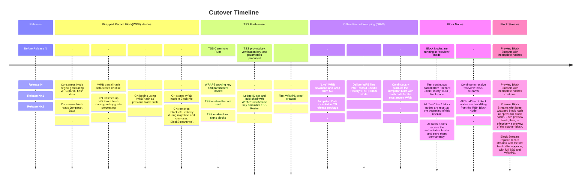

# Cutover Process and Timeline

## Overview

As part of the evolution of the Hiero ledger to support block streams, improved
network signatures, and future use cases; we must provide a mechanism for the
existing public networks to transition from record streams and individual
node signature to Block Streams, Block Nodes, and HinTS/TSS signatures.

## Goals

* Establish new WRAPS keys and parameters via a "Powers of Tau" ceremony
  executed on existing trusted network nodes and produce publicly verifiable
  outputs.
* Provide a clear structure to migrate an existing public network to the
  HinTS TSS signature process and WRAPS address book proofs.
* Provide a clear structure to migrate an existing public network from access
  to record streams via centralized S3 services to access to block streams
  via block nodes.
* Provide a clear structure to migrate an existing public network's full
  block chain history record streams to wrapped record file blocks integrated
  in block stream history with integrated validity proofs for each block.

### Definitions and Acronyms

<dl>
<dt>Wrapped Record Block (WRB)</dt><dd>
    A block generated by wrapping record stream content in a Block Item,
    adding Header and Footer details, and generating a Block Proof based
    on the individual node signatures produced for that Record File.</dd>
<dt>Jumpstart Data</dt><dd>
    A file containing the Block Hash for a specific WRB, the state of the
    historical block hash tree after hashing that block, and the block number
    of that block.</dd>
<dt>WRB Catch Up</dt><dd>
    A process where the Consensus Node Software combines a Jumpstart Data with
    the Timestamp and root hashes for subtrees 3-8 to produce a valid WRB hash.
    The Consensus Node Software then has the values needed to complete the next
    block, and that provides the hash needed for the next block, and so forth
    until the Consensus Node Software has "caught up" with the latest current
    WRB and can resume processing transactions; recording the last block hash
    and the state of the historical block hash tree in state.</dd>
<dt>Record Block History (RBH) Block Node</dt><dd>
    A block node customized to have no retention limit, receive blocks only
    through an offline out-of-process load, and available as a backfill source
    for "live" block nodes to pre-load history.</dd>
</dl>

## Process and Sequence

* Release K (<= N)
   * Include the "Powers of Tau" ceremony program with the Consensus Node
     release package.
   * Ensure the "Powers of Tau" ceremony executes during the duration of the
     release.
   * Block Nodes run in Preview mode
   * Preview Block Streams produced with incomplete hash data
* Release N
   * Consensus Node generates WRB hashes
   * Consensus Node stores WRB hash data on disk
   * WRAPS proving key and parameters downloaded by Consensus Node
   * "Offline" process downloading record files from S3
      * Generate WRB blocks from record files
      * WRB files added to "RBH" block node
      * Produce Jumpstart Data every 1000 blocks
   * Block Nodes _test_ backfill from RBH, but do not store backfilled WRBs
      * Preview blocks are accepted and stored.
   * Preview block streams continue with incomplete hashes
* Release N+1
   * Jumpstart Data is included in the Consensus Node release package, and is
     from approximately 8-10 days before the release date.
   * Consensus Node reads Jumpstart Data
      * WRB data is combined with the Jumpstart Data to complete "WRB Catch Up"
      * Consensus Node begins creating WRB block root hash with all
        necessary correct inputs.
      * Consensus Node stores the correct WRB hash in BlockInfo in state at the
        end of each block.
      * Consensus Node stores the correct WRB streaming hash tree data in state
        in BlockInfo at the end of each block.
   * TSS is enabled in Consensus Node but does not sign blocks
      * TSS creates the Ledger ID and publishes LedgerID, Initial Roster, and
        WRAPS verification key in record stream via TSS adoption transaction.
      * Consensus Node creates WRAPS proofs for each new Roster.
   * Offline process continues to generate WRB files for backfill via RBH.
   * Block Nodes are prepared for cutover
      * All "production" Tier 1 block nodes are reset to clear preview blocks.
      * All "production" Tier 1 block nodes begin rapid backfill from RBH to
        preload all history prior to cutover.
   * Preview block streams continue to "testing" block nodes and are written
     to "preview" buckets for testing and qualification.
      * Preview block hashes continue to be entirely incomplete (to reduce
        complexity).
* Release N+2
   * Consensus Node performs cutover tasks during post upgrade processing.
      * Consensus Node signs each block with TSS and WRAPS
      * Consensus Node ceases producing Record Streams
      * Consensus Node removes `BlockInfo` from state<br/>
        `BlockStreamInfo` is used after cutover and is optimized for
        block streams rather than record streams.
      * Consensus Node begins producing Block Streams
        and publishing to Block Nodes.
   * Block Nodes complete final backfill and begin receiving Block Streams.
      * Block Nodes verify TSS signature for each block.
   * RBH node is shut down once all block nodes finish backfill.
   * Block Streams become authoritative.

### How does the consensus node "catch up" with the last Wrapped Record Block hash?

This is a roughly three part process.
* The first part requires offline processing to do the following.
   1. Download every record file from the beginning
   1. Process each file to extract the record data, wrap that data in a block.
   1. Record the block hash, block number, and state of the historical block
      subtree
       * Update the current Jumpstart Data with this data after each 1000
         blocks.
* The second part requires that the Consensus Node Software record the following
  values for each record file produced for the Record Stream.
   1. Calculate the subtree hashes for the current record file data according
      to the structure documented below.
   1. For each new record, store the Consensus Time, block number, and subtree
      hash for subtrees 3,4,5,6,7, and 8 in a hash-data file.
* The Consensus Node Software will store the hash data for each record for a
  single release.
* The third part requires the following tasks
   1. The Jumpstart Data from part one must be included in the upgrade package
      for the consensus node.
   1. The Consensus Node Software will read the Jumpstart Data, and find the
      matching block in the hash-data file.
   1. The Consensus Node Software will use the values in the Jumpstart Data to
      calculate the Block Root for the matching wrapped record file block.
      * The Consensus Node Software will use the calculated Block Root and
        the data from the hash-data file to continue calculating the
        Block Root for each record file block in order
      * The Consensus Node Software will complete all Block Root calculations
        forward until reaching the current wrapped record block.
  1. The Consensus Node Software will, thereafter, maintain the previous Block
     Root hash and the state of the historical block subtree in state.


#### Block Root Tree Structure (16 fixed leaves)

```
                                    Block Root
                                         │
                           ┌─────────────┴────────────┐
                   Consensus Time              Fixed Root Tree
                    (Timestamp)                  (16 leaves)
                                                      │
                                         ┌────────────┴──────────────┐
                                    Left Subtree                  Reserved
                                         │                      (future use)
                    ┌────────────────────┴───────────────────┐
                Left-Left                                Left-Right
                    │                                        │
          ┌─────────┴─────────┐                     ┌────────┴────────┐
    left-left-left      left-left-right      left-right-left   left-right-right
          │                   │                     │                 │
    ┌─────┴────┐       ┌──────┴──────┐           ┌──┴──┐       ┌──────┴──────┐
PrevBlock  AllBlocks  State  ConsensusHeaders  Input Output  StateChanges  Trace
```
#### Fixed Leaf Positions (from design doc)

 `1` Previous Block Root Hash - Links to previous block, forming the blockchain
 `2` All Block Hashes Tree Root - Streaming merkle tree of all previous block hashes
 `3` State Root Hash - State merkle tree root at block start
 `4` Consensus Headers - EventHeader, RoundHeader items
 `5` Input Items - SignedTransaction
 `6` Output Items - BlockHeader, RecordFile items, TransactionResult, TransactionOutput items
 `7` State Changes - StateChanges items
 `8` Trace Data - TraceData items
 `9-16` Reserved - For future expansion

#### Subtree Item Types

* Consensus Headers: EVENT_HEADER, ROUND_HEADER
* Input Items: SIGNED_TRANSACTION
* Output Items: BLOCK_HEADER, RECORD_FILE, TRANSACTION_RESULT, TRANSACTION_OUTPUT
* State Changes: STATE_CHANGES
* Trace Data: TRACE_DATA

#### Additional Items (Not Hashed)

* BLOCK_FOOTER - Contains hashes already included elsewhere in the tree
* BLOCK_PROOF - Proves the hash, so cannot be part of it

### Timeline Diagram


