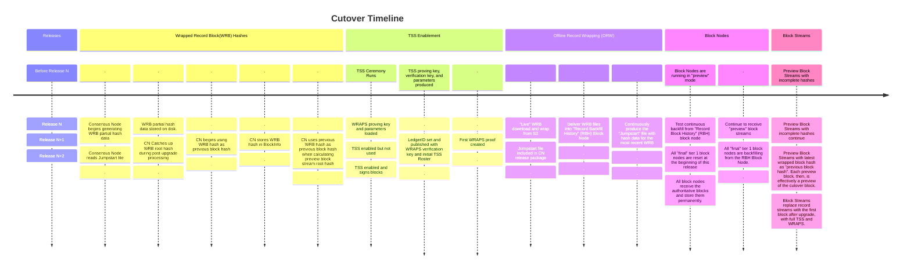

### Definitions and Acronyms
<dl>
<dt>Wrapped Record Block (WRB)</dt><dd>
    A block generated by wrapping record stream content in a Block Item,
    adding Header and Footer details, and generating a Block Proof based
    on the individual node signatures produced for that Record File.</dd>
<dt>Jumpstart File</dt><dd>
    A file containing the Block Hash for a specific WRB, the state of the
    historical block hash tree after hashing that block, and the block number
    of that block.</dd>
<dt>WRB Catch Up</dt><dd>
    A process where the Consensus Node Software combines a Jumpstart file with
    the Timestamp and root hashes for subtrees 3-8 to produce a valid WRB hash.
    The Consensus Node Software then has the values needed to complete the next
    block, and that provides the hash needed for the next block, and so forth
    until the Consensus Node Software has "caught up" with the latest current
    WRB and can resume processing transactions; recording the last block hash
    and the state of the historical block hash tree in state.</dd>
<dt></dt><dd></dd>
<dt></dt><dd></dd>
</dl>

### How does the consensus node "catch up" with the last Wrapped Record Block hash?
This is a roughly three part process.
* The first part requires offline processing to do the following.
   1. Download every record file from the beginning
   1. Process each file to extract the record data, wrap that data in a block.
   1. Record the block hash, block number, and state of the historical block subtree
       * Update the current Jumpstart file with this data after each 1000 blocks.
* The second part requires that the Consensus Node Software record the following
  values for each record file produced for the Record Stream.
   1. Calculate the subtree hashes for the current record file data according
      to the structure documented below.
   1. For each new record, store the Consensus Time, block number, and subtree hash
      for subtrees 3,4,5,6,7, and 8 in a hash-data file.
* The Consensus Node Software will store the hash data for each record for a
  single release.
* The third part requires the following tasks
   1. The Jumpstart file from part one must be included in the upgrade package
      for the consensus node.
   1. The Consensus Node Software will read the Jumpstart file, and find the
      matching block in the hash-data file.
   1. The Consensus Node Software will use the values in the Jumpstart file to
      calculate the Block Root for the matching wrapped record file block.
      * The Consensus Node Software will use the calculated Block Root and
        the data from the hash-data file to continue calculating the
        Block Root for each record file block in order
      * The Consensus Node Software will complete all Block Root calculations
        forward until reaching the current wrapped record block.
  1. The Consensus Node Software will, thereafter, maintain the previous Block
     Root hash and the state of the historical block subtree in state.


#### Block Root Tree Structure (16 fixed leaves)
```
                                    Block Root
                                         │
                           ┌─────────────┴────────────┐
                   Consensus Time              Fixed Root Tree
                    (Timestamp)                  (16 leaves)
                                                      │
                                         ┌────────────┴──────────────┐
                                    Left Subtree                  Reserved
                                         │                      (future use)
                    ┌────────────────────┴───────────────────┐
                Left-Left                                Left-Right
                    │                                        │
          ┌─────────┴─────────┐                     ┌────────┴────────┐
    left-left-left      left-left-right      left-right-left   left-right-right
          │                   │                     │                 │
    ┌─────┴────┐       ┌──────┴──────┐           ┌──┴──┐       ┌──────┴──────┐
PrevBlock  AllBlocks  State  ConsensusHeaders  Input Output  StateChanges  Trace
```
#### Fixed Leaf Positions (from design doc)
 `1` Previous Block Root Hash - Links to previous block, forming the blockchain
 `2` All Block Hashes Tree Root - Streaming merkle tree of all previous block hashes
 `3` State Root Hash - State merkle tree root at block start
 `4` Consensus Headers - EventHeader, RoundHeader items
 `5` Input Items - SignedTransaction
 `6` Output Items - BlockHeader, RecordFile items, TransactionResult, TransactionOutput items
 `7` State Changes - StateChanges items
 `8` Trace Data - TraceData items
 `9-16` Reserved - For future expansion

#### Subtree Item Types
 * Consensus Headers: EVENT_HEADER, ROUND_HEADER
 * Input Items: SIGNED_TRANSACTION
 * Output Items: BLOCK_HEADER, RECORD_FILE, TRANSACTION_RESULT, TRANSACTION_OUTPUT
 * State Changes: STATE_CHANGES
 * Trace Data: TRACE_DATA

#### Additional Items (Not Hashed)
   * BLOCK_FOOTER - Contains hashes already included elsewhere in the tree
   * BLOCK_PROOF - Proves the hash, so cannot be part of it

### Timeline Diagram

```mermaid
timeline
    title Cutover Timeline
    section Releases
        Before Release N
                  : Release N
                  : Release N+1
                  : Release N+2
    section Wrapped Record Block(WRB) Hashes
        .
                 : Consensus Node begins generating WRB partial hash data
                 : Consensus Node reads Jumpstart file
                 : .
        .
                 : WRB partial hash data stored on disk.
                 : CN Catches up WRB root hash during post-upgrade processing
                 : .
        .
                 : .
                 : CN begins using WRB hash as previous block hash
                 : .
        .
                 : .
                 : CN stores WRB hash in BlockInfo
                 : .
        .
                 : .
                 : CN uses previous WRB hash as previous block hash when calculating preview block stream root hash
                 : .
    section TSS Enablement
        TSS Ceremony Runs
                 : WRAPS proving key and parameters loaded
                 : TSS enabled but not used
                 : TSS enabled and signs blocks
        TSS proving key, verification key, and parameters produced
                 : .
                 : LedgerID set and published with WRAPS verification key and initial TSS Roster
                 : .
        .
                 : .
                 : First WRAPS proof created
                 : .
    section Offline Record Wrapping (ORW)
        .
                 : "Live" WRB download and wrap from S3
                 : Jumpstart file included in CN release package
                 : .
        .
                 : Deliver WRB files into "Record Backfill History" (RBH) Block Node
                 : .
                 : .
        .
                 : Continuously produce the "Jumpstart" file with hash data for the most recent WRB
                 : .
                 : .
    section Block Nodes
        Block Nodes are running in "preview" mode
                 : Test continuous backfill from "Record Block History" (RBH) block node
                 : All "final" tier 1 block nodes are reset at the beginning of this release
                 : All block nodes receive the authoritative blocks and store them permanently.
        .
                 : Continue to receive "preview" block streams
                 : All "final" tier 1 block nodes are backfilling from the RBH Block Node.
                 : .
    section Block Streams
        Preview Block Streams with incomplete hashes
                 : Preview Block Streams with incomplete hashes continue
                 : Preview Block Streams with latest wrapped block hash as "previous block hash". Each preview block, then, is effectively a preview of the cutover block.
                 : Block Streams replace record streams with the first block after upgrade, with full TSS and WRAPS.
```
