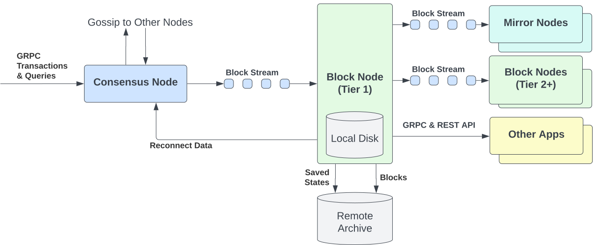

# Server

The Block Node Server Application is designed to handle the block streams output of a Hiero Consensus Node, parsing and
storing the blocks and network state information. It will also optionally provide many value adding APIs to allow
downstream applications to access block and state information.

## Key Technologies

- **Java**: Primary programming languages.
- **gRPC**: For streaming and communication.
- **Protobuf**: For specification, serialization and deserialization of block data.
- **Helidon**: Web server framework.
- **PBJ** and **PBJ-Helidon**: protocol buffer compiler and Helidon server extension.
- **Gradle**: Build and dependency management.
- **LMAX Disruptor**: For high performance inter-thread messaging.
- **System.Logger**: For logging.
- **Zstd**, **Zip** and **tar**: For file compression at rest and archival.

## Quickstart

Refer to the [Quickstart](quickstart.md) for a quick guide on how to get started with the application.

## High-Level Architecture
BlockNode is a modular, event-driven network-server built on the [Helidon](https://helidon.io/) framework.
The system is highly extensible, allowing developers to add and remove functionality via plugins.

Additional details are captured in [Architecture Overview](architecture/architecture-overview.md).

## Configuration

Refer to the [Configuration](configuration.md) for configuration options.
