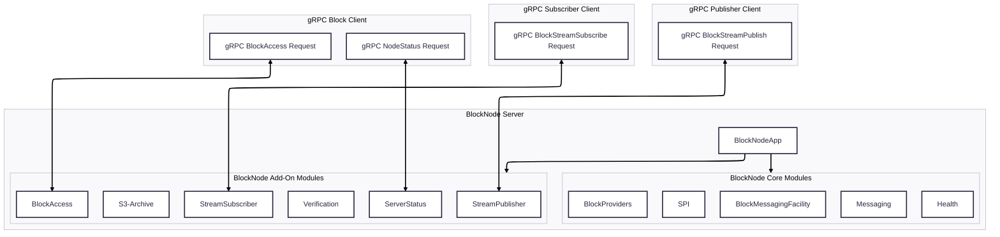

# Architecture Overview

BlockNode is a modular, event-driven web-server built on [Helidon](https://helidon.io/) framework.
The server is primarily designed to process gRPC streams of Block Items and distribute them efficiently across system
components using a plugin-based architecture for additional service processing.
The system is highly extensible, allowing developers to add new functionality via plugins.

## Key Concepts

- **Event-Driven:** BlockNode receives gRPC streams of Block Items, which are distributed to plugins and drive the processing logic.
- **Plugin System:** All major features are implemented as plugins, conforming to the `BlockNodePlugin` interface. Plugins are dynamically loaded and initialized at startup.
- **Messaging Facility:** The `BlockMessagingFacility` is responsible for distributing block items to registered handlers (plugins/components).
- **Block Management:** Historical blocks are managed by `HistoricalBlockFacilityImpl`, which aggregates multiple block providers and exposes a unified view of available blocks.

## Modules
### Main Modules

The following modules under `block-node` directory form the core of the BlockNode system, encompassed plugins and facilities are enabled by default
- `app`: Main application logic and entrypoint (`BlockNodeApp.java`).
- `spi`: Service Provider Interfaces for plugins and facilities.
- `block-providers`: Implementations for various block storage backends.
- `messaging`: Core messaging facilities for distributing block items.
- `health`: Health check and monitoring plugins.

### Additional Modules

The following modules provide additional functionality and are dynamically loaded as plugins:
- `block-access`: Interfaces and implementations for accessing block data.
- `s3-archive`: S3-based block archiving plugin.
- `server-status`: Server status monitoring plugin.
- `stream-publisher`: Stream publishing plugin for external systems.
- `stream-subscriber`: Stream subscribing plugin for external systems.
- `verification`: Block verification plugin.

## System Architecture Diagram

Additional details regarding Service interactions are illustrated in [Block-Node-Nano-Services](./../../assets/Block-Node-Nano-Services.svg) diagram.

## Plugins
BlockNode's functionality is extended through a variety of plugins, each implementing the `BlockNodePlugin` interface. Key plugins include:
- **BackfillPlugin:** Provides historical block gap filling services by retrieving missing blocks from other Block Nodes.
- **BlockAccessServicePlugin:** Provides block retrieval APIs.
- **BlocksFilesHistoricPlugin:** Handles block compression, retrieval and deletion of older persisted blocks.
- **BlocksFilesRecentPlugin:** Handles block persistence, retrieval and deletion of recently streamed blocks.
- **HealthServicePlugin:** Provides health check endpoints.
- **S3ArchivePlugin:** Archives blocks to S3 API compatible remote storage endpoints.
- **ServerStatusServicePlugin:** Provides block node status API endpoints.
- **StreamPublisherPlugin:** Provides handling logic to block stream publishing API by implementing the [communication protocol](./../../design/communication-protocol/README.md).
- **SubscriberServicePlugin:** Provide block item streaming APIs.
- **VerificationServicePlugin:** Verifies incoming blocks for integrity.

For additional details on plugins, refer to the [Plugins](./plugins.md).

## How The Block Node Works

1. **Startup:** `BlockNodeApp` loads configuration, initializes plugins, registers API services and starts the web server.
2. **Event Distribution:** Incoming gRPC block streams from a publisher are received and passed to `BlockMessagingFacility`,
   which distributes block items via a block items ring buffer to registered plugins. Additionally, registered plugins may
   put notification events onto a notification ring buffer to inform other services of available actions.
3. **Plugin Processing:** Each registered plugin processes block items and notifications independently, enabling modular and extensible workflows.

## Data Flows

Multiple data flows occur within BlockNode, primarily centered around block item processing and distribution. Key flows include:
- **Block Item Flow:** Incoming block items from gRPC streams are handled via the `StreamPublisherPlugin` and distributed to plugins via the `BlockMessagingFacility`.
- **Notification Flow:** Plugins send notifications to inform other components of events (e.g., blocks persisted, verification results).
- **Block Access Flow:** Block access requests from gRPC clients are routed to the appropriate block provider plugins for retrieval.
- **Health Check Flow:** Health check requests are handled by the `HealthServicePlugin`, providing system status information.
- **Archiving Flow:** Blocks are archived to S3-compatible storage by the `S3ArchivePlugin`.
- **Subscription Flow:** Block streams are served to subscribers via the `SubscriberServicePlugin`.
- **Verification Flow:** Incoming blocks are verified for integrity by the `VerificationServicePlugin`.
- **Backfilling Flow:** Missing historical blocks are retrieved by the `BackfillPlugin`.
- **Persistence Flow:** Blocks are persisted to disk by the `BlocksFilesRecentPlugin` and managed by the `BlocksFilesHistoricPlugin`.

These flows are illustrated in detail in the [Data Flow](data-flow.md) document.
