# Architecture Overview

The BlockNode is primarily designed to process gRPC streams of Block Items and distribute them efficiently across system
components and to clients using a plugin-based architecture for additional service processing.

## Key Concepts

- **Event-Driven:** BlockNode receives gRPC streams of Block Items, which are distributed to plugins and drive the
  processing logic.
- **Plugin System:** All major features are implemented as plugins, conforming to the `BlockNodePlugin` interface.
  Plugins are dynamically loaded and initialized at startup.
- **Messaging:** The `BlockMessagingFacility` is responsible for distributing event messages (via LMAX Disruptor) to
  registered handlers defined in plugins.
- **Block Management:** Block storage and access is managed by implementations of `BlockProviderPlugin` in cooperation
  with one implementation of the `HistoricalBlockFacility`. Together these aggregate multiple block providers and expose
  a unified view of available blocks.
- **BlockVerification:** Blocks are verified for integrity using the `VerificationServicePlugin` which build the virtual
  merkle tree and validate the block proof prior to persistence.

## Modules

The repo structure is organized into multiple Java modules, each encapsulating specific functionality.
Plugin modules are loaded dynamically at runtime using the JPMS service loader mechanism.

### Main Modules

The following modules under `block-node` directory form the core of the BlockNode system.
- `app`: Main application logic and entrypoint (`BlockNodeApp.java`).
- `spi`: Service Provider Interfaces for well known plugins and facilities.
- `messaging`: Core messaging facilities for distributing block items.
- `health`: Kubernetes Health check plugin.

### Additional Modules

The following modules provide additional functionality and are loaded as plugins if present:
- `block-access`: Plugins for accessing block data.
- `block-providers`: Plugins for various block storage backends.
- `s3-archive`: Plugins for S3-based block archiving.
- `server-status`: Plugins for Server status API.
- `stream-publisher`: Plugins for a Stream publishing API.
- `stream-subscriber`: Plugins for Stream subscribing API.
- `verification`: Plugins for Block verification.

## System Architecture Diagram

The overall architecture of BlockNode is illustrated below:

Additional details regarding Service interactions are illustrated in [Block-Node-Nano-Services](./../../assets/Block-Node-Nano-Services.svg) diagram.

## Plugins

BlockNode's functionality is extended through a variety of plugins, each implementing the `BlockNodePlugin` interface.
Key plugins include:
- **BackfillPlugin:** Guarantees the stored block stream is complete by retrieving missing blocks from other Block Nodes.
- **BlockAccessServicePlugin:** Provides a block retrieval API.
- **BlocksFilesHistoricPlugin:** Handles block persistence and retrieval of older persisted blocks.
- **BlocksFilesRecentPlugin:** Handles block persistence, retrieval, and deletion of recently streamed blocks.
- **HealthServicePlugin:** Provides kubernetes health check endpoints.
- **S3ArchivePlugin:** Archives blocks to S3 API compatible remote storage services.
- **ServerStatusServicePlugin:** Provides block node status API endpoints.
- **StreamPublisherPlugin:** Provides a block stream publishing API as documented in the [communication protocol](./../../design/communication-protocol/README.md).
- **SubscriberServicePlugin:** Provides an _unverified_ Block Subscription API.
- **VerificationServicePlugin:** Verifies incoming blocks for integrity prior to persistence.

For additional details on plugins, refer to the [Plugins](./plugins.md).

## How The Block Node Works

1. **Startup:** `BlockNodeApp` loads configuration, loads plugins, registers API services and starts the web server.
2. **Event Distribution:** Distribute events from APIs and internal notifications.

- Incoming gRPC block streams from a publisher are received and passed to the `BlockMessagingFacility`.
- Block items are distributed via a block items ring buffer to registered plugins.
- Plugins may publish notification events to the `BlockMessagingFacility`.
- Notifications are distributed via a notification ring buffer to registered plugins.

3. **Plugin Processing:** Each registered plugin processes block items and notifications independently, enabling
   dynamic, asynchronous, and extensible workflows.

## API Data Flows

Multiple API data flows occur within BlockNode, primarily centered around block item processing and distribution.
Key flows include:
- **Block Stream Publish API Flow:** Incoming block items from gRPC streams are handled via the `StreamPublisherPlugin`
and distributed to plugins via the `BlockMessagingFacility`.
- **Block Access API Flow:** Block access requests from gRPC clients are routed to the appropriate block provider
plugins for retrieval.
- **Block Stream Subscription API Flow:** The unverified block stream is served to subscribers via the
`SubscriberServicePlugin`.
- **Backfilling Flow:** Missing historical blocks are retrieved by the `BackfillPlugin`.

These flows are illustrated in detail in the [Data Flow](data-flow.md) document.
