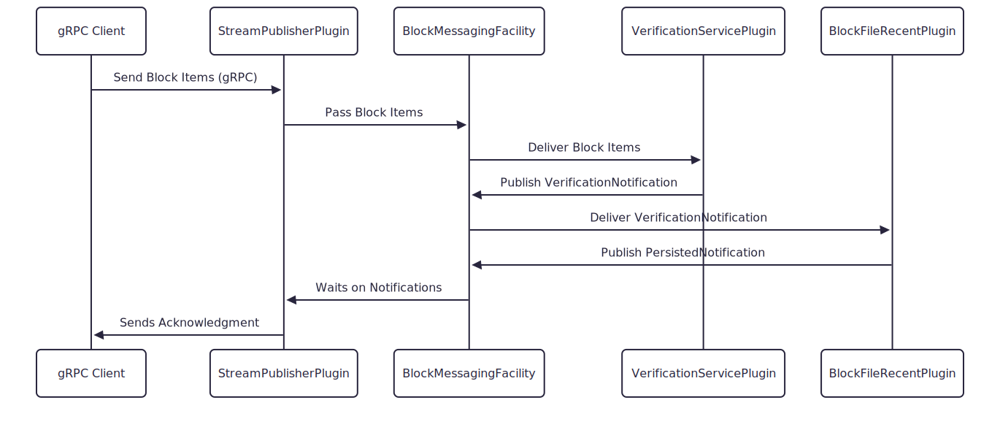

# BlockNode API Data Flows

This document describes multiple data flows between system components using its event-driven architecture.

## Block Stream Publish API Flow

** Overview should cover block items flow, merkle tree building, verification, persistence, and notification. **

or

Detailed Steps:
1. gRPC publisher client sends a stream of Block Items to a Block Node.
2. Block Node server receives the stream via the `BlockStreamPublishService` implemented by the `StreamPublisherPlugin`.
3. The `StreamPublisherPlugin` publishes the stream to the `BlockMessagingFacility`.
  - This plugin publishes Notifications when backfill is needed.
4. The `BlockMessagingFacility` broadcasts Block Items to all registered plugins (handlers). Each handler runs on a pool
  of threads managed by the `BlockMessagingFacility`, reducing context switching for efficient scalability.
5. `VerificationServicePlugin` process Block Items building the block merkle tree and verifying it upon receipt of a
  block proof.
  - This plugin publishes a `VerificationNotification` upon successful verification.
6. `BlockFilesRecentPlugin` listens for a `VerificationNotification` and persists a verified block accordingly. It also
  publishes a `PersistedNotification` upon completion.
7. `StreamPublisherPlugin` responds to a notifications asynchronously and sends responses back to the gRPC client:
  - on a successful `PersistedNotification` it sends an acknowledgment.
  - on a failed `VerificationNotification` or failed `PersistedNotification` it sends a failure message.

Note: Each plugin processes items independently making use of thread isolation

## Block Access API Flow

## Block Stream Subscription API Flow

## Backfilling Flow

