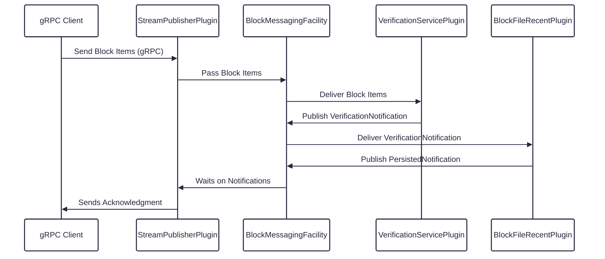

# BlockNode Data Flow

This document describes multiple data flows between system components using its event-driven architecture.

## Block Item Publish Data Flow Overview

Note: Each plugin processes items independently making use of thread isolation

1. **gRPC Client** sends a stream of Block Items to BlockNode.
2. **BlockNodeApp** receives the stream and forwards Block Items to the `BlockMessagingFacility`.
3. **BlockMessagingFacility** distributes Block Items to all registered plugins (handlers). Each handler runs on its own thread, ensuring isolation and scalability.
4. **Plugins** process Block Items according to their logic (e.g., storing, verifying, publishing, etc.).
5. Back pressure is applied if any plugin is slow, ensuring system stability.

