# BlockNode Plugin System & Extensibility

The BlockNode is designed for extensibility through a robust plugin system.
All major features are implemented as plugins, allowing developers to add, modify, or replace functionality easily.

## Plugin Architecture

- **Base Interface:** All plugins implement the `BlockNodePlugin` interface, which defines lifecycle methods
  (`init`, `start`, `stop`) and configuration hooks.
- **Messaging Facility:** The `BlockMessagingFacility` is a special plugin responsible for distributing events
  (block items or notifications) to registered handlers (other plugins/components).
  - This facility is how plugins communicate data and events between plugins.
  - This facility may be replaced, but a single implementation must be present in any Block Node.
- **Service Loading:** Plugins are discovered and loaded dynamically at startup using a JPMS a service loader.

## Plugin Lifecycle

1. **Discovery:** On startup, the `BlockNodeApp` scans for available plugins implementing `BlockNodePlugin` using JPMS
   ServiceLoader.
2. **Initialization:** Each plugin is initialized with the application context and appropriate service routing builders.
3. **Start:** Plugins are started, enabling them to register for events, process events, and interact with other
   components.
4. **Stop:** On shutdown, plugins are stopped gracefully.

## Adding a New Plugin

To add a new plugin:

1. Implement the `BlockNodePlugin` interface in your module.
2. Optionally, implement specialized interfaces (e.g., `BlockProviderPlugin`, `HistoricalBlockFacility` or
   `BlockMessagingFacility`) if your plugin replaces or extends block management and messaging capabilities.
3. Optionally, implement additional interfaces (e.g., a protobuf `ServiceInterface`) for additional capabilities.



## Example Plugin Structure

```java
public class MyCustomPlugin implements BlockNodePlugin {
    @Override
    public void init(BlockNodeContext context, ServiceBuilder builder) {
        // Initialization logic
    }
    @Override
    public void start() {
        // Start processing
    }
    @Override
    public void stop() {
        // Cleanup
    }
}
```

## Gradle Build Configuration

Plugin jars are built and assembled through Gradle configurations defined in
[`block-node/app/build.gradle.kts`](../../../block-node/app/build.gradle.kts).

### `blockNodePlugins` Configuration

The `blockNodePlugins` configuration in the app module is the authoritative list of all Block Node
plugins. It is both **consumable** (other projects like E2E suites can depend on it) and
**resolvable** (Gradle can resolve it into actual jar files). Transitive dependencies (gRPC,
Helidon, Swirlds libraries, etc.) are included automatically.

When adding a new plugin, update two places in `block-node/app/build.gradle.kts`:
1. Add the project dependency to the `blockNodePlugins` configuration in `dependencies`.
2. Add the module to `testModuleInfo` so integration tests can load it.

### Core vs Plugin Jar Filtering

The OCI image contains only core runtime jars (`mainModuleInfo` dependencies). Plugin jars and
their transitive dependencies are kept separate. At build time, tasks like `prepareDockerPlugins`
(for local Docker) and `prepareTestPlugins` (in the suites module) resolve the full plugin
classpath, then filter out any jars already present in the core runtime to avoid duplicates.

### How Other Projects Consume Plugins

The E2E suites module ([`tools-and-tests/suites/build.gradle.kts`](../../../tools-and-tests/suites/build.gradle.kts))
declares two local configurations:
- **`appCoreRuntime`** — resolves the app's core jars for exclusion filtering.
- **`testPlugins`** — resolves plugin jars from the app's `blockNodePlugins` configuration.

The `prepareTestPlugins` task subtracts core jars from plugin jars and copies the result into a
directory that gets mounted into E2E test containers.

## Deployment Configuration

The Block Node OCI image is published without plugins. Plugins are downloaded during deployment
based on Helm chart configuration. This allows operators to select exactly which plugins to load.

For deployment configuration, including pre-defined profiles and custom plugin selection, see:
- [Helm Chart Plugin Configuration](../../../charts/block-node-server/README.md#plugin-configuration)
- [Deployment with Selected Plugins Design](../../design/deployment-with-selected-plugins.md)
