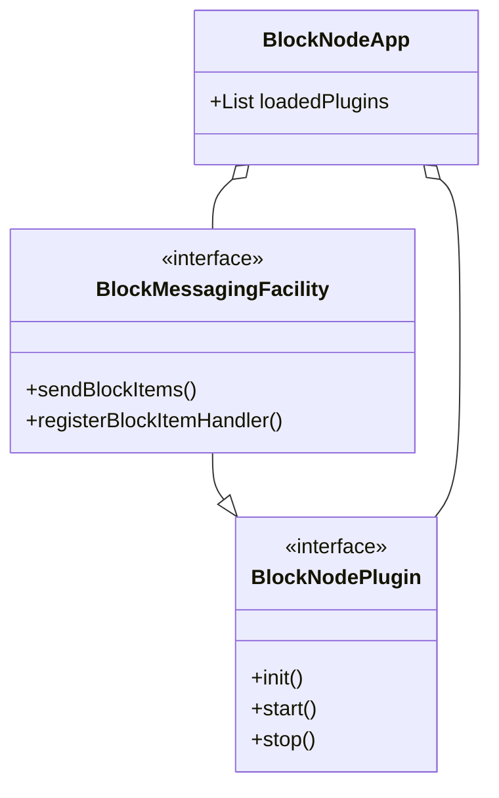

# BlockNode Plugin System & Extensibility

The BlockNode is designed for extensibility through a robust plugin system.
All major features are implemented as plugins, allowing developers to add, modify, or replace functionality easily.

## Plugin Architecture

- **Base Interface:** All plugins implement the `BlockNodePlugin` interface, which defines lifecycle methods (`init`, `start`, `stop`) and configuration hooks.
- **Messaging Facility:** The `BlockMessagingFacility` is a special plugin responsible for distributing events (block items or notifications) to registered handlers (other plugins/components).
- **Service Loading:** Plugins are discovered and loaded dynamically at startup using a service loader pattern (`ServiceLoaderFunction`).

## Plugin Lifecycle

1. **Discovery:** On startup, BlockNode scans for available plugins implementing `BlockNodePlugin`.
2. **Initialization:** Each plugin is initialized with the application context and routing builders.
3. **Start:** Plugins are started, enabling them to process events and interact with other components.
4. **Stop:** On shutdown, plugins are stopped gracefully.

## Adding a New Plugin

To add a new plugin:

1. Implement the `BlockNodePlugin` interface in your module.
2. Optionally, extend specialized interfaces (e.g., `BlockMessagingFacility`, `HealthFacility`) for additional capabilities.
3. Register your plugin as a service so it is discovered at startup.
4. Use the provided context and facilities to interact with block items, metrics, configuration, and other plugins.

## Example Plugin Structure

```java
public class MyCustomPlugin implements BlockNodePlugin {
    @Override
    public void init(BlockNodeContext context, ServiceBuilder builder) {
        // Initialization logic
    }
    @Override
    public void start() {
        // Start processing
    }
    @Override
    public void stop() {
        // Cleanup
    }
}
```

## Relationships Diagram



## Extending BlockNode

- Use the plugin system to add new features without modifying core logic.
- Take advantage of thread isolation and back pressure for scalable event processing.
- Leverage configuration and metrics APIs for robust integration.
