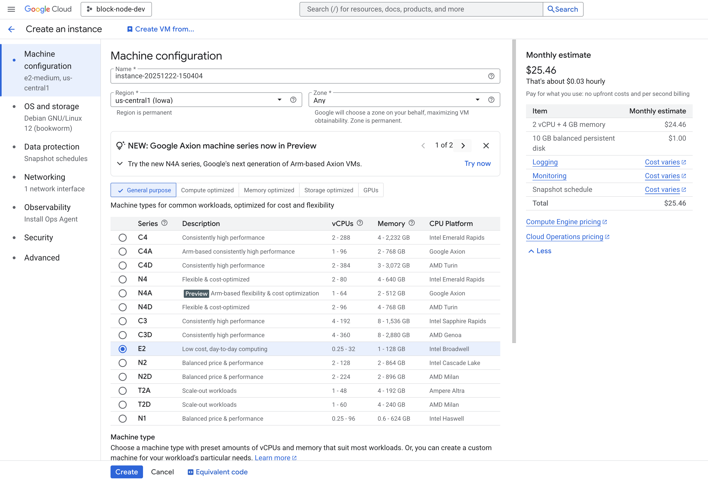
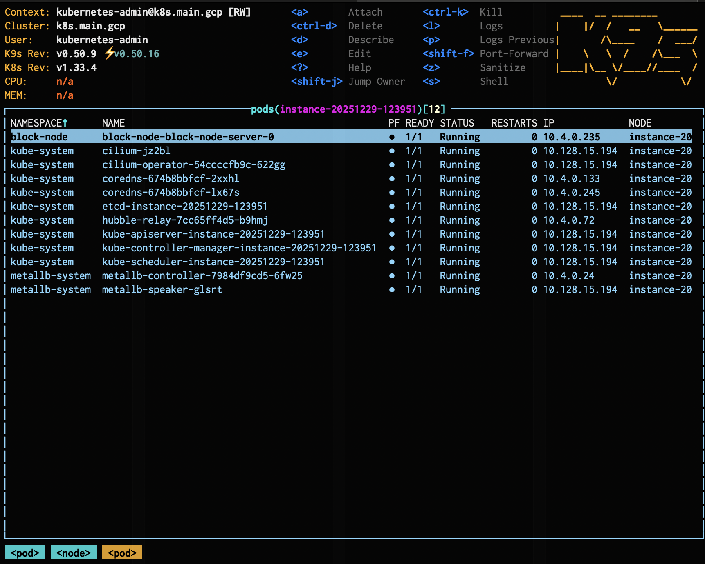

# Solo Weaver Single Node Kubernetes Deployment Guide

## Overview

This guide explains how to deploy the Hiero Block Node on a Google Cloud Platform (GCP) virtual machine (VM) using the Solo Weaver tool.
The Block Node supports the Hiero network by processing and validating Consensus Node produced blocks amongst others features.
This deployment uses the Weaver binary to provision the VM, set up Kubernetes and install the Block Node Helm chart on the VM.

This guide walks you through creating the VM, uploading the Weaver binary to it, and running the Block Node using the local profile.

While this guide focuses on GCP, node operators can deploy the Block Node on any cloud provider of their choice by following equivalent provisioning and deployment steps.

## Prerequisites

Before you begin, ensure you have:

- Access to a cloud provider account (such as Google Cloud, AWS, or Azure) with permissions to create and manage VM instances.
- The Weaver binary downloaded locally from the [**official Weaver releases page**](https://github.com/hashgraph/solo-weaver/releases) or provided as part of your node onboarding for your VM’s architecture:
  - **`weaver-linux-amd64`** for x86_64 (most standard cloud VMs).
  - **`weaver-linux-arm64`** for ARM-based VMs.
- The **`gcloud`** CLI installed and authenticated (if using Google Cloud).

## Step-by-Step Guide

### Step 1: Create a Google Cloud VM

1. In the [**Google Cloud Console**](https://console.cloud.google.com/), click **Select a project** at the top of the page.
2. Choose an existing project. If you don’t have a project, click **New project** in the popup window and follow the prompts to create one.
3. Under **Compute Engine,** Select **Create a VM**.
4. Select a machine type appropriate for your Block Node profile:
   - **For a test or local profile**: Choose at least an **E2 standard** machine (for example, **`e2-standard-2`**) so that CPU and memory are sufficient.
   - **For production (**e.g.**, `mainnet` or `testnet`)**: Select at least ~16 CPUs (e.g., 8 physical cores / 16 vCPUs).

     

5. Set the region and zone (defaults are fine unless you have a preference).

6. Select the default boot disk and operating system unless your team has specific requirements.

7. Leave other instance settings at defaults for a standard deployment.

8. Click **Create** to launch the VM.

9. Wait until the instance status is **Running** before proceeding.

### Step 2: Upload Weaver to the VM

1. Download the appropriate Weaver binary to your local machine (see [Prerequisites](#prerequisites) for the correct file).
2. In the Google Cloud Console, open your VM’s details page.
3. Select the **down arrow** next to **SSH**, then choose **View gcloud command**.
4. Copy the suggested **`gcloud compute ssh`** command displayed.
5. On your local machine, paste that command into a terminal. It will look similar to:

   ```bash
   gcloud compute ssh --zone <ZONE> <INSTANCE_NAME> --project <PROJECT_ID>
   ```
6. On your local machine, modify the copied command:
   - Change **`ssh`** to **`scp`**.
   - Set the **source path** to your Weaver binary (e.g., **`~/Downloads/weaver-linux-amd64`**).
   - Set the **destination path** to your VM (e.g., **`/home/<USER>/weaver`**).

   Example command (update with your details):

   ```bash
   gcloud compute scp ~/Downloads/weaver-linux-amd64 <INSTANCE_NAME>:/home/<USER> --zone <ZONE> --project <PROJECT_ID>
   ```
7. Run the command to upload the file.
8. When complete, the Weaver binary will be available on your VM at the specified path. (e.g., at **`/home/<USER>/weaver`).**

- **Expected output**:

  ```bash

  WARNING: The private SSH key file for gcloud does not exist.
  WARNING: The public SSH key file for gcloud does not exist.
  WARNING: You do not have an SSH key for gcloud.
  WARNING: SSH keygen will be executed to generate a key.
  Generating public/private rsa key pair.
  Enter passphrase for "/home/local-user/.ssh/google_compute_engine" (empty for no passphrase):
  Enter same passphrase again:
  Your identification has been saved in /home/local-user/.ssh/google_compute_engine
  Your public key has been saved in /home/local-user/.ssh/google_compute_engine.pub.
  The key fingerprint is:
  SHA256:EXAMPLEFINGERPRINTKEYSTRING local-user@example-host
  The key's randomart image is:
  +---[RSA 3072]----+
  |        .o+*o    |
  |       . =+B.o   |
  |      . + .=* .  |
  |       o . .o+ . |
  |        .   .o . |
  |             . . |
  |              .  |
  |                 |
  |                 |
  +----[SHA256]-----+
  Updating project ssh metadata...done.
  Updating instance ssh metadata...done.
  Waiting for SSH key to propagate.
  Warning: Permanently added 'compute.0000000000000000000' (ED25519) to the list of known hosts.
  Enter passphrase for key '/home/local-user/.ssh/google_compute_engine':
  weaver-linux-amd64                      100%   58MB   4.7MB/s   00:12

  ```

### Step 3: Connect to VM and Prepare Weaver

1. SSH into your VM:
   - Use the **SSH** button in the Google Cloud Console (browser window), or
   - Open a separate terminal on your local machine and run:

     ```bash
     gcloud compute ssh <INSTANCE_NAME> --zone=<ZONE> --project=<PROJECT_ID>
     ```
   - **Expected output**:

     ```bash

     Linux block-node-solo-vm 6.1.0-41-cloud-amd64 #1 SMP PREEMPT_DYNAMIC Debian 6.1.158-1 (2025-11-09) x86_64

     The programs included with the Debian GNU/Linux system are free software;
     the exact distribution terms for each program are described in the
     individual files in /usr/share/doc/*/copyright.

     Debian GNU/Linux comes with ABSOLUTELY NO WARRANTY, to the extent
     permitted by applicable law.

     ```
   - After connecting, run **`ls`** to confirm the Weaver binary is present in your home directory.
   - **Expected output**:

     ```bash
     weaver-linux-amd64
     ```
2. Make the binary executable, using the correct filename:

   ```bash
   chmod +x weaver-linux-amd64
   ```

   *(Use **`weaver-linux-arm64`** for ARM)*

3. Test the Weaver binary by running it without arguments:

   ```bash
   ./weaver-linux-amd64
   ```

   *(or **`./weaver-linux-arm64`** for ARM)*

   If the binary runs and prints usage or help text, Weaver is correctly installed on the VM.

   **Expected output**:

   ```bash

      Solo Weaver - A user friendly tool to provision Hedera network components

      Usage:
      weaver [command]

      Available Commands:
      block        Commands for block node type
      completion   Generate the autocompletion script for the specified shell
      consensus    Commands for consensus node type
      help         Help about any command

      Flags:
      -c, --config string   config file path
      -h, --help            help for weaver

      Use "weaver [command] --help" for more information about a command.

   ```

### Step 4: Create the **`weaver`** User

1. Run the Block Node install command with **`sudo`** and the desired profile (choose one of: **`local`**, **`previewnet`**, **`testnet`**, **`mainnet`**):

   ```bash
   sudo ./weaver-linux-amd64 block node install -p <profile>
   ```

   *(Replace **`<profile>`** with the desired value. For ARM, use **`weaver-linux-arm64`** instead.)*

2. The first run will fail and print instructions to create the **`weaver`** system user and group with specific UID/GID.

   - Copy the **`groupadd`** and **`useradd`** commands shown in the output.
   - Run them exactly as printed, including specific user/group ID numbers.
   - Expected Output:

     ```bash

     The user 'weaver' and group 'weaver' do not exist.

     Please create them via the following commands:

        sudo groupadd -g 2500 weaver
        sudo useradd -u 2500 -g 2500 -m -s /bin/bash weaver

     This will:
        * Create group 'weaver' with GID 2500
        * Create user 'weaver' with UID 2500
        * Set bash as the user's default shell

     Check error message for details or contact support

     ```
3. After creating the **`weaver`** user and group, re-run the setup command:

   ```bash
   sudo ./weaver-linux-amd64 block node install -p <profile>
   ```

Once complete, Weaver will be able to manage Kubernetes resources on your VM using the dedicated **`weaver`** system user.

**Additional Options (v0.3.0+):**

- **Custom Helm values**: **`-values <path-to-values.yaml>`**

  ```bash
  sudo ./weaver-linux-amd64 block node install -p local --values my-values.yaml
  ```
- **Custom configuration**: **`-config <path-to-config.yaml>`**

  ```bash
  sudo ./weaver-linux-amd64 block node install -p local --values my-values.yaml --config config.yaml
  ```

  **Example `config.yaml`:**

  ```bash
  log:
     level: debug
     consoleLogging: true
     fileLogging: false
  blockNode:
     namespace: "block-node"
     release: "block-node"
     chart: "oci://ghcr.io/hiero-ledger/hiero-block-node/block-node-server"
     version: "0.22.1"
     storage:
        basePath: "/mnt/fast-storage"
  ```

**Note:** **`blocknode setup`** is **deprecated**. Use **`blocknode install`** for all Weaver v0.3.0+ deployments [**Solo Weaver v0.3.0**](https://github.com/hashgraph/solo-weaver/releases/tag/v0.3.0).

### Step 5: Run Block Node Setup with the Local Profile

1. Ensure you are on the VM and the **`weaver`** binary is executable.
2. Run the Block Node setup with **`sudo`** and the local profile:

   ```bash
   sudo ./weaver-linux-amd64 blocknode setup -p <profile>
   ```

   Replace **`<profile>`** with one of: **`local`**, **`testnet`**, **`previewnet`**, or **`mainnet`**.

3. **What the setup does:**

   - Perform system and resource checks.
   - Install and configure Kubernetes components.
   - Install MetalLB for load balancing.
   - Deploy the Block Node Helm chart into the cluster.
4. The process takes several minutes and will show progress logs in your terminal.

### Step 6: Verify the Block Node Deployment

After completing the setup, confirm that your Block Node is deployed and running by checking the Kubernetes cluster:

1. Verify with **`kubectl`** (recommended)
   1. From the VM (where Weaver configured Kubernetes access), list all pods:

      ```bash
      kubectl get pods -A
      ```
   2. Look for Block Node pods. Ensure they show **`Running`** status and all containers are ready (e.g., **`1/1`** or **`2/2`**).
2. Verify with **K9s** (optional):

   If you prefer a text-based Kubernetes dashboard:

   1. Ensure [**Install `k9s`**](https://k9scli.io/) is available on your VM or on a machine that can reach the cluster.

   2. To Inspect pods, namespaces, and logs. Run:

   ```bash
   k9s
   ```

   To list pods across all namespaces, press 0:
   

   To list instances in all namespaces, press o:
   

3. Confirm the Block Node `StatefulSet/Pods` are healthy.

If the pods are running and healthy, your Block Node is successfully installed and running on the Google Cloud VM.

### Step 7: Test Block Node Accessibility with grpcurl

1. **Install grpcurl** using the package manager of your system:
   - Debian/Ubuntu: **`apt-get install grpcurl`**
   - macOS: **`brew install grpcurl`**
   - Other systems: Download from [**grpcurl releases**](https://github.com/fullstorydev/grpcurl/releases)
2. **Download and extract the latest protobuf files** from the official release:

   ```bash
   export VERSION=0.24.0; curl -L https://github.com/hiero-ledger/hiero-block-node/releases/download/v$VERSION/block-node-protobuf-$VERSION.tgz -o block-node-protobuf-$VERSION.tgz

   tar -xzf block-node-protobuf-0.24.0.tgz
   ```
3. **Call the `serverStatus` endpoint** to verify the node is accessible:

   ```bash
   grpcurl -plaintext -emit-defaults -import-path block-node-protobuf-<VERSION> -proto block-node/api/node_service.proto -d '{}' <BLOCK_NODE_IP>:<GRPC_PORT> org.hiero.block.api.BlockNodeService/serverStatus
   ```

   - <BLOCK_NODE_IP> is the external IP of your Block Node VM. For GCP, you can find this on the VM’s Details page under External IP.
   - <GRPC_PORT> is the gRPC service port exposed by your Block Node (e.g., 40840).
4. **Review the output** for status information confirming the node is running and serving requests.

   Expected output:

   ```bash
   {
      "firstAvailableBlock": "18446744073709551615",
      "lastAvailableBlock": "18446744073709551615",
      "onlyLatestState": false,
      "versionInformation": null
   }

   ```

### Step 8: Deprovisioning and Shutdown

If you need to permanently remove a Block Node deployment (for decommissioning, upgrades, or migration):

- **Test environments:** Delete the VM from the Compute Engine page in Google Cloud Console to remove all associated resources.
- **Production nodes:** Follow organizational and project-specific procedures for graceful shutdown, backup, and ongoing monitoring to avoid service interruption or data loss.

## Troubleshooting

See below for common errors, causes, and solutions during Block Node setup:

1. Error: “Profile not set”
   - **Cause:** The **`Block Node install`** command was run without specifying a profile.
   - **Fix:** Re-run with a valid profile, for example:

     ```bash
     sudo ./weaver-linux-amd64 blocknode install -p local
     ```
2. Error: “Requires super user privilege”
   - **Cause:** The **`blocknode install -p`** command was run without **`sudo`**.
   - **Fix:** Add **`sudo`** before your command:

   ```bash
   sudo ./weaver-linux-amd64 blocknode install -p local
   ```
3. Error: Missing **`weaver`** User and/or Group
   - **Cause:** First **`sudo`** run; the **`weaver`** system user and group are not yet created.
   - **Fix:** Run the **`groupadd`** and **`useradd`** commands shown in the error output, then re-run the setup.
4. Error: “CPU does not meet Block Node requirements” or “Insufficient memory”
   - **Cause:** The VM machine type is too small for the selected profile.
   - **Fix:**
     - Delete your current VM.
     - Create a new VM with a larger machine type (e.g., **`e2-standard-2`** or higher for **`local`**; higher specs for production profiles).
     - Repeat the installation steps.
