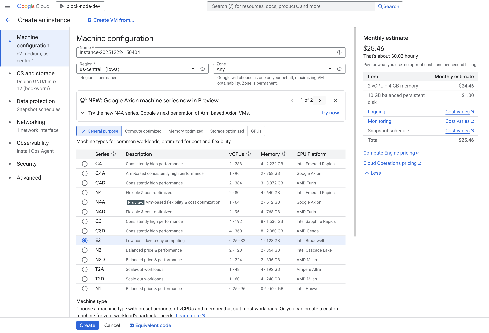
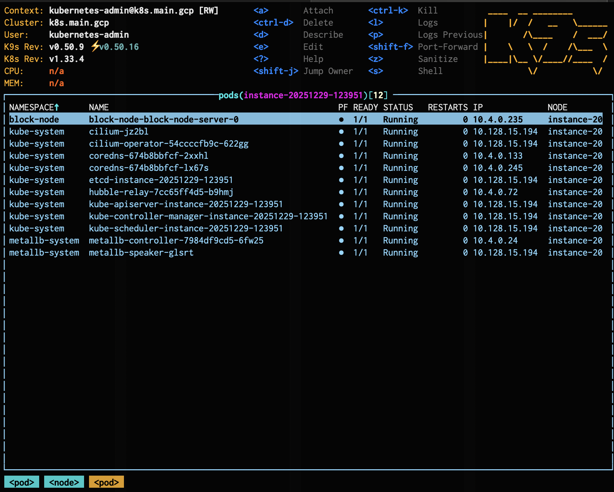

# Solo Weaver Single Node Kubernetes Deployment Guide

## Overview

This guide explains how to deploy the Hiero Block Node on a Google Cloud Platform (GCP) virtual machine (VM) using the Solo Weaver tool.
The Block Node supports the Hiero network by processing and validating Consensus Node produced blocks amongst others features.
This deployment uses the Solo Weaver binary to provision the VM, set up Kubernetes and install the Block Node Helm chart on the VM.

This guide walks you through creating the VM, uploading the Solo Weaver binary to it, and running the Block Node using the local profile.

While this guide focuses on GCP, node operators can deploy the Block Node on any cloud provider of their choice by following equivalent provisioning and deployment steps.

## Prerequisites

Before you begin, ensure you have:

- Access to a cloud provider account (such as Google Cloud, AWS, or Azure) with permissions to create and manage VM instances.
- The Solo Weaver binary downloaded locally from the [**official Solo Weaver releases page**](https://github.com/hashgraph/solo-weaver/releases) or provided as part of your node onboarding for your VM’s architecture:
  - **`solo-provisioner-linux-amd64`** for x86_64 (most standard cloud VMs).
  - **`solo-provisioner-linux-arm64`** for ARM-based VMs.
- The **`gcloud`** CLI installed and authenticated (if using Google Cloud).

## Step-by-Step Guide

### Step 1: Create a Google Cloud VM

1. In the [**Google Cloud Console**](https://console.cloud.google.com/), click **Select a project** at the top of the page.
2. Choose an existing project. If you don’t have a project, click **New project** in the popup window and follow the prompts to create one.
3. Under **Compute Engine,** Select **Create a VM**.
4. Select a machine type appropriate for your Block Node profile:
   - **For a test profile**: Choose at least an **E2 standard** machine (for example, **`e2-standard-2`**) so that CPU and memory are sufficient.
   - **For productio Profile**:
     - Perfnet: Select at least ~8 CPUs (e.g.8 vCPUs, 16 GB Memory).
     - Previewnet: Select at least ~48 CPUs (e.g.48 vCPUs, 256 GB Memory).
     - Mainnet: Select at least ~8 CPUs (e.g.8 vCPUs, 16 GB Memory).

     

5. Set the region and zone (defaults are fine unless you have a preference).

6. Select the default boot disk and operating system unless your team has specific requirements.

7. Leave other instance settings at defaults for a standard deployment.

8. Click **Create** to launch the VM.

9. Wait until the instance status is **Running** before proceeding.

### Step 2: Install Solo Provisioner

1. In the Google Cloud Console, open your VM’s details page.
2. Select the **down arrow** next to **SSH**, then choose **View gcloud command**.
3. Copy the suggested **`gcloud compute ssh`** command displayed.
4. On your local machine, run the command into a terminal. It will look similar to:

   ```bash
   gcloud compute ssh --zone <ZONE> <INSTANCE_NAME> --project <PROJECT_ID>
   ```

- **Expected output**:

  ```bash

  WARNING: The private SSH key file for gcloud does not exist.
  WARNING: The public SSH key file for gcloud does not exist.
  WARNING: You do not have an SSH key for gcloud.
  WARNING: SSH keygen will be executed to generate a key.
  Generating public/private rsa key pair.
  Enter passphrase (empty for no passphrase):
  Enter same passphrase again:
  Your identification has been saved in /home/local-user/.ssh/google_compute_engine
  Your public key has been saved in /home/local-user/.ssh/google_compute_engine.pub.
  The key fingerprint is:
  SHA256:EXAMPLEFINGERPRINTKEYSTRING local-user@example-host
  The key's randomart image is:
  +---[RSA 3072]----+
  |        .o+*o    |
  |       . =+B.o   |
  |      . + .=* .  |
  |       o . .o+ . |
  |        .   .o . |
  |             . . |
  |              .  |
  |                 |
  |                 |
  +----[SHA256]-----+
  Updating project ssh metadata...done.
  Updating instance ssh metadata...done.
  Waiting for SSH key to propagate.
  Warning: Permanently added 'compute.0000000000000000000' (ED25519) to the list of known hosts.
  ```

5. Install the tool using the official script:

   ```bash
   curl -sSL https://raw.githubusercontent.com/hashgraph/solo-weaver/main/install.sh | bash
   ```

- **Expected output**:

  ```bash
  🔍 Fetching latest release info...
  🔖 Latest release: v0.8.0
  Binary File ID: 353998752
  Checksum File ID: 353998741
  ⬇️ Downloading asset 353998752 → solo-provisioner-linux-amd64 ...
  % Total    % Received % Xferd  Average Speed   Time    Time     Time  Current
                                      Dload  Upload   Total   Spent    Left  Speed
     0     0    0     0    0     0      0      0 --:--:-- --:--:-- --:--:--     0
     100 72.3M  100 72.3M    0     0  75.1M      0 --:--:-- --:--:-- --:--:-- 75.1M
  ⬇️ Downloading asset 353998741 → solo-provisioner-linux-amd64.sha256 ...
     % Total    % Received % Xferd  Average Speed   Time    Time     Time  Current
                                      Dload  Upload   Total   Spent    Left  Speed
     0     0    0     0    0     0      0      0 --:--:-- --:--:-- --:--:--     0
     100    95  100    95    0     0    285      0 --:--:-- --:--:-- --:--:--   285
  🔐 Verifying SHA256...
  ✅ Checksum OK
  Installing Solo Provisioner...
  2026-02-23T12:30:04Z INF Starting privilege validation pid=8844 step_id=validate-privileges
  2026-02-23T12:30:04Z INF Superuser privilege validated pid=8844
  2026-02-23T12:30:04Z INF Privilege validation step completed successfully pid=8844 status=success step_id=validate-privileges
  2026-02-23T12:30:04Z INF Setting up home directory structure pid=8844 step_id=home_directories
  2026-02-23T12:30:04Z INF Home directory structure setup successfully pid=8844 status=success step_id=home_directories
  2026-02-23T12:30:04Z INF Created symlink to solo-provisioner binary in /usr/local/bin pid=8844 symlink_path=/usr/local/bin/solo-provisioner weaver_path=/opt/solo/weaver/bin/solo-provisioner
  2026-02-23T12:30:04Z INF Solo Provisioner installed successfully pid=8844 weaver_path=/opt/solo/weaver/bin/solo-provisioner
  2026-02-23T12:30:04Z INF Workflow report is saved pid=8844 report_path=/opt/solo/weaver/logs/setup_report_20260223_123004.yaml
  2026-02-23T12:30:04Z INF Solo Provisioner is installed successfully; run 'solo-provisioner -h' to see available commands pid=8844
  🎉 Solo Provisioner installed successfully!
  Solo Provisioner - A user friendly tool to provision Hedera network components

  Usage:
  solo-provisioner [flags]
  solo-provisioner [command]

  Available Commands:
  install     Perform self-installation of Solo Provisioner
  uninstall   Uninstall Solo Provisioner from the local system
  kube        Manage Kubernetes Cluster & its components
  block       Manage a Hedera Block Node & its components
  teleport    Manage Teleport agents for secure access
  alloy       Manage Grafana Alloy observability stack
  version     Show version
  help        Help about any command
  completion  Generate the autocompletion script for the specified shell

  Flags:
  -c, --config string   config file path
  -h, --help            help for solo-provisioner
  -o, --output string   Output format (yaml|json) (default "yaml")
  -v, --version         Show version

  Use "solo-provisioner [command] --help" for more information about a command.
  ```

1. Verify that the provisioner is working as expected:

   ```bash
   solo-provisioner -h
   ```

- **Expected output**:

  If the command runs and prints usage or help text, Solo Provisioner is correctly installed on the VM.

  ```bash
  Solo Provisioner - A user friendly tool to provision Hedera network components

  Usage:
  solo-provisioner [flags]
  solo-provisioner [command]

  Available Commands:
  install     Perform self-installation of Solo Provisioner
  uninstall   Uninstall Solo Provisioner from the local system
  kube        Manage Kubernetes Cluster & its components
  block       Manage a Hedera Block Node & its components
  teleport    Manage Teleport agents for secure access
  alloy       Manage Grafana Alloy observability stack
  version     Show version
  help        Help about any command
  completion  Generate the autocompletion script for the specified shell

  Flags:
  -c, --config string   config file path
  -h, --help            help for solo-provisioner
  -o, --output string   Output format (yaml|json) (default "yaml")
  -v, --version         Show version

  Use "solo-provisioner [command] --help" for more information about a command.
  ```

### Step 3: Create the **`weaver`** User

1. Run the Block Node install command with **`sudo`** and the desired profile (choose one of: **`perfnet`**, **`testnet`**, **`mainnet`**):

   ```bash
   sudo solo-provisioner block node install -p <profile>
   ```

   *(Replace **`<profile>`** with the desired value.)*

2. The first run will fail and print instructions to create the **`weaver`** system user and group with specific UID/GID.

   - Copy the **`groupadd`** and **`useradd`** commands shown in the output.
   - Run them exactly as printed, including specific user/group ID numbers.
   - Expected Output:

     ```bash
     The user 'weaver' and group 'weaver' do not exist.

     Please create them with the following commands:

     sudo groupadd -g 2500 weaver
     sudo useradd -u 2500 -g 2500 -m -s /bin/bash weaver

     These commands will:
     • Create group 'weaver' with GID 2500
     • Create user 'weaver' with UID 2500
     • Create a home directory (-m)
     • Set bash as the default shell

     ```
3. After creating the **`weaver`** user and group, re-run the setup command:

   ```bash
   sudo solo-provisioner block node install -p <profile>
   ```

Once complete, Weaver will be able to manage Kubernetes resources on your VM using the dedicated **`weaver`** system user.

**Additional Options (v0.3.0+):**

- **Custom Helm values**: **`-values <path-to-values.yaml>`**

  ```bash
  sudo solo-provisioner block node install -p testnet --values my-values.yaml
  ```
- **Custom configuration**: **`-config <path-to-config.yaml>`**

  ```bash
  sudo solo-provisioner block node install -p testnet --values my-values.yaml --config config.yaml
  ```

  **Example `config.yaml`:**

  ```bash
  log:
     level: debug
     consoleLogging: true
     fileLogging: false
  blockNode:
     namespace: "block-node"
     release: "block-node"
     chart: "oci://ghcr.io/hiero-ledger/hiero-block-node/block-node-server"
     version: "0.22.1"
     storage:
        basePath: "/mnt/fast-storage"
  ```

**Note:** **`block node setup`** is **deprecated**. Use **`block node install`** for all Weaver v0.3.0+ deployments [**Solo Weaver v0.3.0**](https://github.com/hashgraph/solo-weaver/releases/tag/v0.3.0).

### Step 4: Run Block Node Setup with the Local Profile

1. Ensure you are on the VM and the **`weaver`** binary is executable.
2. Run the Block Node setup with **`sudo`** and the local profile:

   ```bash
   sudo solo-provisioner block node setup -p <profile>
   ```

   Replace **`<profile>`** with one of: **`local`**, **`testnet`**, **`previewnet`**, or **`mainnet`**.

3. **What the setup does:**

   - Perform system and resource checks.
   - Install and configure Kubernetes components.
   - Install MetalLB for load balancing.
   - Deploy the Block Node Helm chart into the cluster.
4. The process takes several minutes and will show progress logs in your terminal.

### Step 5: Verify the Block Node Deployment

After completing the setup, confirm that your Block Node is deployed and running by checking the Kubernetes cluster:

1. Verify with **`kubectl`** (recommended)
   1. From the VM (where Weaver configured Kubernetes access), list all pods:

      ```bash
      kubectl get pods -A
      ```
   2. Look for Block Node pods. Ensure they show **`Running`** status and all containers are ready (e.g., **`1/1`** or **`2/2`**).
2. Verify with **K9s** (optional):

   If you prefer a text-based Kubernetes dashboard:

   1. Ensure [**Install `k9s`**](https://k9scli.io/) is available on your VM or on a machine that can reach the cluster.

   2. To Inspect pods, namespaces, and logs. Run:

      ```bash
      k9s
      ```

      To list pods across all namespaces, press 0:
      

      To list instances in all namespaces, press o:
      

   3. Confirm the Block Node `StatefulSet/Pods` are healthy.

If the pods are running and healthy, your Block Node is successfully installed and running on the Google Cloud VM.

### Step 6: Test Block Node Accessibility with grpcurl

1. **Install grpcurl**:

   ```bash
   curl -L https://github.com/fullstorydev/grpcurl/releases/download/v1.8.7/grpcurl_1.8.7_linux_x86_64.tar.gz -o grpcurl.tar.gz
   sudo tar -xzf grpcurl.tar.gz -C /usr/local/bin grpcurl
   rm grpcurl.tar.gz
   ```
2. **Download and extract the latest protobuf files** from the official release:

   ```bash
   curl -s https://api.github.com/repos/hiero-ledger/hiero-block-node/releases/latest | grep "browser_download_url.*block-node-protobuf.*tgz" | cut -d : -f 2,3 | tr -d \" | wget -qi -
   ```
3. **Call the `serverStatus` endpoint** to verify the node is accessible:

   ```bash
   grpcurl -plaintext -emit-defaults -import-path block-node-protobuf-<VERSION> -proto block-node/api/node_service.proto -d '{}' <BLOCK_NODE_IP>:<GRPC_PORT> org.hiero.block.api.BlockNodeService/serverStatus
   ```

   - <BLOCK_NODE_IP> is the external IP of your Block Node VM. For GCP, you can find this on the VM’s Details page under External IP.
   - <GRPC_PORT> is the gRPC service port exposed by your Block Node (e.g., 40840).
4. **Review the output** for status information confirming the node is running and serving requests.

   Expected output:

   ```bash
   {
      "firstAvailableBlock": "18446744073709551615",
      "lastAvailableBlock": "18446744073709551615",
      "onlyLatestState": false,
      "versionInformation": null
   }

   ```

> Note: The value `18446744073709551615` means the node has not stored any blocks yet. After the node finishes syncing, these fields will show real block numbers.

### Step 7: Deprovisioning and Shutdown

If you need to permanently remove a Block Node deployment (for decommissioning, upgrades, or migration):

- **Test environments:** Delete the VM from the Compute Engine page in Google Cloud Console to remove all associated resources.
- **Production nodes:** Follow organizational and project-specific procedures for graceful shutdown, backup, and ongoing monitoring to avoid service interruption or data loss.

## Troubleshooting

See below for common errors, causes, and solutions during Block Node setup:

1. Error: “Profile not set”
   - **Cause:** The **`Block Node install`** command was run without specifying a profile.
   - **Fix:** Re-run with a valid profile, for example:

     ```bash
     sudo solo-provisioner block node install -p testnet
     ```
2. Error: “Requires super user privilege”
   - **Cause:** The **`block node install -p`** command was run without **`sudo`**.
   - **Fix:** Add **`sudo`** before your command:

   ```bash
   sudo solo-provisioner block node install -p testnet
   ```
3. Error: Missing **`weaver`** User and/or Group
   - **Cause:** First **`sudo`** run; the **`weaver`** system user and group are not yet created.
   - **Fix:** Run the **`groupadd`** and **`useradd`** commands shown in the error output, then re-run the setup.
4. Error: “CPU does not meet Block Node requirements” or “Insufficient memory”
   - **Cause:** The VM machine type is too small for the selected profile.
   - **Fix:**
     - Delete your current VM.
     - Create a new VM with a larger machine type (e.g., **`e2-standard-2`** or higher for **`testnet`**; higher specs for production profiles).
     - Repeat the installation steps.
