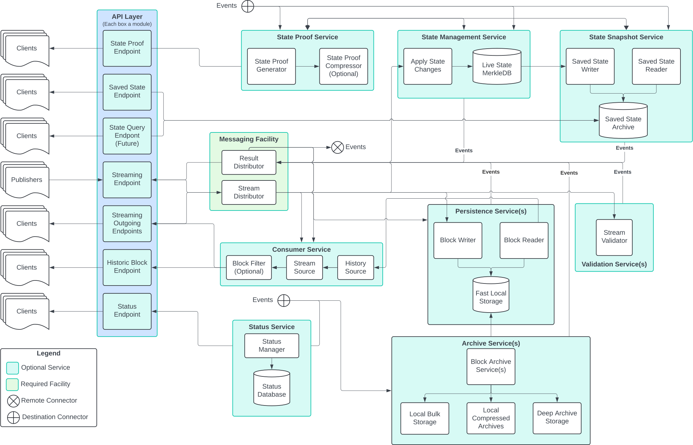

# Block Node Nano-Service Approach

## Abstract

To date, block node has been developed under pressure and with changing,
incomplete, or inaccurate requirements. As a result, the system is tightly
interconnected, and suffers from a difficulty making changes to one segment
of the system without also impacting unrelated segments. To address this, and
ensure the Block Node is able to be extended, enhanced, and deployed in the
manner required for all current identified usage, a modified structure of
the system is herein detailed.

## Revised Diagram

## Definitions

<dl>
<dt>Event</dt>
<dd>A Java object defined by the messaging service that enables each other
service to publish a service-defined object with content specific to that
service. Note, the name of this object is not defined in this document.
"Event" is a generic term.</dd>
<dt>Service</dt>
<dd>A Java module that is deployed with a particular installation of the Hiero
Block Node. These modules are housed in independent jars to make adding and
removing services in a custom deployment easier.</dd>
<dt>Facility</dt>
<dd>A Java module that is deployed with every installation of the Hiero Block
Node. These modules are housed in independent jars, but are directly loaded at
block node startup to ensure all facilities are available before any
services are loaded.</dd>
</dl>

## Core Concepts

1. Helidon and API objects are restricted to the API layer.
   * The less we flow these externally defined interfaces and classes through
     the system, the more easily we can potentially make outward facing API
     changes without reworking the internal design.
2. Services are not required to be present in every deployment of the block
   node.
3. No service should depend on classes or interfaces from another service.
   * That service might not be deployed, and each service should be removable
     without breaking other services. The exception is the Messaging service.
   * To this end, services should be independent modules with clearly defined
     and carefully controlled interactions.
   * Interactions between services should be based on a very limited set of
     `Record` messages ("Events") that are passed between services (blindly)
     by the Messaging facility rather than interfaces or direct method calls.
4. Facilities, which provide capabilities that are core to the block node
   operation are always present and may be depended on directly by services.
   * Facilities include the following
     * Messaging - core message delivery to and among services.
     * Metrics - Publication of OTEL metrics.
     * Logging - Emitting OTEL-compatible diagnostic log events.
     * Service loading - Loading services via the JVM ServiceLoader.
     * Registration - Enabling services to obtain references to facilities.
   * Facilities should _not_ have any API exposed to external clients.
   * We must remain vigilant to avoid packing facilities with interfaces or
     extra classes. There is always a temptation to make facilities into
     "controller" or "router" objects that replace message publication.
   * Facilities should be as slim as possible.
5. Two facilities are particularly critical, Messaging and Registration
   * Messaging is where data and events are published (presumably
     via LMAX Disruptor instances) among other services.
   * Registration is the interface that provides direct references to
     facilities (including messaging) for all services.
6. There is an assumption in this approach that Messaging offers both "push"
   and "pull" options for receiving messages, and each service may choose the
   most appropriate interaction for that specific service.
   * A persistence service, for instance, might use "push" for simplicity and
     because it does not benefit from holding items within Messaging, but
     a streaming client service might use "pull" in order to allow each of
     many remote clients to be receiving data at slightly varying rates and
     more easily switch from live to historical and back if a particular
     client falls behind and later "catches up".
7. Most services both publish and observe the service "event" messages
   * By listening for events, any service can react to changes in any other
     service, but also behave reasonably when another service does not exist.
   * Publishing an event (rather than calling an API) makes it easy for each
     service to focus entirely on its own function and not try to work out the
     highly complex possible interactions with all other possible services.
   * Some services (e.g. Archive service) won't make sense if _nothing_
     publishes
     a particular event, but even then the service need not be concerned with
     the how/what/why of a event, and need only react if and when a event is
     encountered with the relevant type and content.
8. Many services will _also_ listen to the main data messages (List<BlockItem>)
   which is the primary data flowing through the system.
   * Note that Publisher service is also not required, so this flow of data
     might
     be empty, or might be produced from some other source.
   * There _might_ also be a stream of "historical" blocks used to serve client
     requests for those blocks. This is still to be determined.
9. Configuration for a service is entirely restricted to that service, and does
   not determine what "version" of a service or whether a service is running.
   * It _might_ assist multiple loaded "versions" to identify a conflict.
10. The JVM `ServiceLoader` is used to load every service that is present, this
    may include multiple services of the same "type" (e.g. multiple archive
    services, multiple persistence services, etc...).
    * It is up to the particular services to ensure that either multiple
      different versions cooperate properly or an error is published on
      startup that multiple incompatible services are loaded. Generally it's
      cleanest if multiple services of the same type are able to work
      independently without issues. If that isn't possible, a service-
      specific configuration is a good alternative.

## Expected Benefits

1. Services are decomposed to small units, often what is thought of as a single
   process is accomplished by multiple nano-services. This makes each such
   service both simple and focused. This also makes adding, removing, and
   modifying these services much easier and faster.
   * It's also much easier to test services with nothing more than a mock of the
     "Messaging" service; which further improves velocity.
2. Composing services may be easier to reason about than composing interfaces,
   and systems composed of independent services are easier to modify and revise
   than systems with many interacting method calls or complex module
   interactions.
3. It is much easier to reason about concurrency for a single focused service
   than it is for a larger and more interconnected set of components.

## Considerations and Possible Concerns

1. Sending messages between services is not as efficient as calling a method.
   * This is true, but publishing a message consumed by an unknown set of
     (potentially) several services is significantly more efficient than trying
     to manage an uncertain (and possibly large) number of direct method calls.
     We are electing to prioritize emergent behavior and capability over
     direct-call efficiency. Theoretical efficiency aside, we have chosen a
     messaging subsystem that is very nearly the same efficiency as direct
     method calls, and is even faster in some highly concurrent situations.
2. Some services may not make any sense without other services. For example,
   a Content Proof service might not be able to function without a State
   Management service and/or State Snapshot service.
   * If a particular service requires other services, it should document the
     expected events (e.g. publish "Need Snapshot For Instant{date/time}" and
     expect "Deliver Snapshot For Instant{date1/time1}") and also document
     behavior if the response-type event is not published.
   * Every service should function, at least to the level of not throwing
     exceptions, regardless of which other services are, or are not, present.
   * While a service may require certain _messages_ to function correctly
     (e.g. a "Deliver Snapshot For Instant..." message in the example above),
     the service _must not_ concern itself with _what_ produces those messages
     or _how_. This ensures that all services function as intended even if
     other services are replaced with completely different, but _compatible_
     services.
