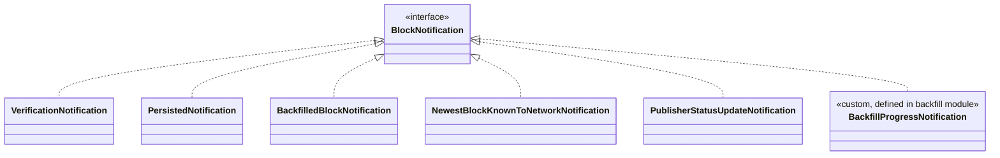
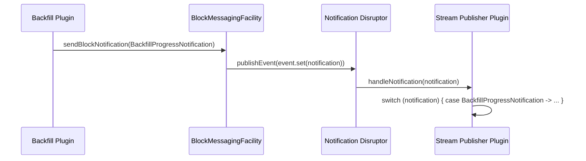
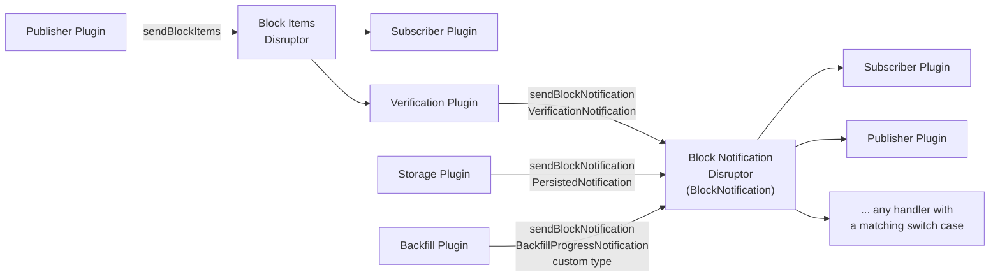

# Generic Block Notifications

Status: Proposed
Tracking issue: [#1431](https://github.com/hiero-ledger/hiero-block-node/issues/1431)
Related: [plugin-architecture.md](current-plugin-architecture.md), [Nano-Service-Approach.md](Nano-Service-Approach.md)

## Table of Contents

1. [Purpose](#purpose)
2. [Goals](#goals)
3. [Non-Goals](#non-goals)
4. [Terms](#terms)
5. [Current Design (Problem)](#current-design-problem)
6. [Design](#design)
7. [Worked Example](#worked-example)
8. [Migration](#migration)
9. [Testing Plugin](#testing-plugin)
10. [Diagrams](#diagrams)
11. [Open Questions](#open-questions)

## Purpose

`BlockNotificationHandler` and `BlockMessagingFacility` hardcode one method pair per notification
type. Adding a notification today means editing five files across two modules. A plugin outside
`facility-messaging`/`spi-plugins` cannot introduce its own notification type at all.

This document defines a generic `BlockNotification` type so any plugin — core or third-party — can
define, emit, and consume its own notifications without touching the messaging facility.

## Goals

- A plugin defines a new notification type in its own module. No change to `spi-plugins` or
  `facility-messaging` is required.
- One send method, one handler method, one ring-buffer field, regardless of how many notification
  types exist.
- Existing notification behavior (threading, back-pressure, per-handler virtual thread) is
  unchanged.
- The messaging facility stays blind to notification content, per
  [Nano-Service-Approach.md](Nano-Service-Approach.md) principle 3 ("no service should depend on
  classes or interfaces from another service") — the facility depends only on the marker
  interface, never on a specific notification type.

## Non-Goals

- **Discovery/listing of registered notification types at runtime.** Not required to unblock
  plugin authors. Can be layered on later as an optional registry without changing the interfaces
  defined here.
- **Cross-node or network delivery.** This is in-process, single-JVM messaging only.
- **Changes to the block item stream** (`BlockItems`, `BlockItemHandler`,
  `NoBackPressureBlockItemHandler`). Unaffected — this document is scoped to the notification ring
  only.

## Terms

<dl>
  <dt>BlockNotification</dt>
  <dd>Marker interface. Any record implementing it can be sent through the notification ring.</dd>

  <dt>Known notification</dt>
  <dd>A <code>BlockNotification</code> defined in <code>spi-plugins</code>, visible to every
  module. The five existing notifications become known notifications.</dd>

  <dt>Custom notification</dt>
  <dd>A <code>BlockNotification</code> defined inside a plugin module. Only plugins with a
  compile-time dependency on that record can consume it.</dd>

  <dt>Notification handler</dt>
  <dd>A plugin's implementation of <code>BlockNotificationHandler</code>, registered with the
  facility to receive every notification on its own virtual thread.</dd>
</dl>

## Current Design (Problem)

Adding one notification type today touches:

| # |                           File                            |                              Change required                              |
|---|-----------------------------------------------------------|---------------------------------------------------------------------------|
| 1 | `spi-plugins/.../VerificationNotification.java` (example) | new record                                                                |
| 2 | `spi-plugins/.../BlockMessagingFacility.java`             | new `sendX(...)` method                                                   |
| 3 | `spi-plugins/.../BlockNotificationHandler.java`           | new `default void handleX(...) {}` method                                 |
| 4 | `facility-messaging/.../BlockNotificationRingEvent.java`  | new field + `set(X)` + `getX()`                                           |
| 5 | `facility-messaging/.../BlockMessagingFacilityImpl.java`  | new `sendX` impl + counter metric + `else if` branch in the dispatch loop |

None of this is plugin-specific logic — it is bookkeeping repeated per type. A third-party plugin
cannot make these edits because it does not own `spi-plugins` or `facility-messaging`.

## Design

### 1. Marker interface

```java
// spi-plugins/.../blockmessaging/BlockNotification.java
package org.hiero.block.node.spi.blockmessaging;

public interface BlockNotification {}
```

Plain interface, not sealed. Sealing would let the compiler check `switch` exhaustiveness, but it
also closes the type to any implementer outside this module — which defeats the purpose. Every
`switch` on `BlockNotification` needs a `default` branch regardless.

The five existing notifications add `implements BlockNotification`. No other change to their
shape.

### 2. Ring event collapses to one field

```java
// facility-messaging/.../BlockNotificationRingEvent.java
public final class BlockNotificationRingEvent {
    private BlockNotification notification;

    public void set(final BlockNotification notification) {
        this.notification = notification;
    }

    public BlockNotification get() {
        return notification;
    }
}
```

Replaces five fields, five `set(X)` overloads, five `getX()` getters.

### 3. Facility: one send method

```java
// BlockMessagingFacility.java
void sendBlockNotification(final BlockNotification notification);
```

Replaces `sendBlockVerification`, `sendBlockPersisted`, `sendBackfilledBlockNotification`,
`sendNewestBlockKnownToNetwork`, `sendPublisherStatusUpdate`. Per
[CLAUDE.md](../../../CLAUDE.md)'s no-backwards-compatibility-shim guidance, these five methods are
removed, not deprecated — this is an internal SPI with a small number of call sites, all inside
this repository, all updated in the same change.

### 4. Handler: one dispatch method

```java
// BlockNotificationHandler.java
public interface BlockNotificationHandler extends GatingHandler {
    void handleNotification(BlockNotification notification);
}
```

Replaces `handleVerification`, `handlePersisted`, `handleBackfilled`,
`handleNewestBlockKnownToNetwork`, `handlePublisherStatusUpdate`. No default no-op — a plugin that
registers a handler wants to react to at least one notification type; a `switch` with a `default`
branch below expresses "ignore everything else" explicitly instead of silently.

Consumers use pattern-matching `switch` (Java 21+) to dispatch:

```java
@Override
public void handleNotification(BlockNotification notification) {
    switch (notification) {
        case VerificationNotification v -> handleVerification(v);
        case PersistedNotification p -> handlePersisted(p);
        case MyCustomNotification c -> handleCustom(c);
        default -> { /* not a type this handler cares about */ }
    }
}
```

### 5. `BlockMessagingFacilityImpl` dispatch loop collapses

```java
final InformedEventHandler<BlockNotificationRingEvent> informedEventHandler =
        (event, sequence, endOfBatch, percentageBehindRingHead) -> handler.handleNotification(event.get());
```

One line replaces the five-branch `if/else if` chain. The facility never inspects notification
content — it forwards the reference, unchanged from today's behavior for the underlying
Disruptor mechanics (threading, back-pressure, gating).

### 6. Metrics

`ProofVerificationMetrics` already uses a labeled counter (`LongCounter.builder(key)
.addDynamicLabelNames(...)`, resolved per call via `getOrCreateLabeled(name, value, ...)`) — see
`block-verification/.../metrics/ProofVerificationMetrics.java:38-89`. The facility reuses that
pattern instead of one counter per notification type:

```java
private static final String LABEL_NOTIFICATION_TYPE = "notification_type";

private static final MetricKey<LongCounter> METRIC_MESSAGING_BLOCK_NOTIFICATIONS_SENT =
        MetricKey.of("messaging_block_notifications_sent", LongCounter.class).addCategory(METRICS_CATEGORY);

// init
notificationsSentCounter = metricRegistry.register(
        LongCounter.builder(METRIC_MESSAGING_BLOCK_NOTIFICATIONS_SENT)
                .setDescription("Notifications sent, by type")
                .addDynamicLabelNames(LABEL_NOTIFICATION_TYPE));

// on sendBlockNotification(notification)
notificationsSentCounter
        .getOrCreateLabeled(LABEL_NOTIFICATION_TYPE, notification.getClass().getSimpleName())
        .increment();
```

This replaces the five per-type counters (`METRIC_MESSAGING_BLOCK_VERIFICATION_NOTIFICATIONS`,
etc.) with one metric, while keeping the same per-type breakdown in Prometheus — including for
custom notification types the facility has never seen a class for at compile time. Cardinality is
bounded by the number of distinct `BlockNotification` classes loaded in the JVM (a handful, fixed
by deployment), not by user-controlled data, so unbounded-label risk does not apply here.

The queue/listener gauges (`messaging_notification_queue_percent_used`,
`messaging_no_of_notification_listeners`) are already type-agnostic — unchanged.

### 7. Package convention for custom notifications

A plugin's custom notification records live in a `<module>.messaging` sub-package, mirroring the
SPI's `blockmessaging` package name:

```
org.hiero.block.node.backfill.messaging.BackfillProgressNotification
```

To let another module consume it, the defining module exports that package in `module-info.java`:

```java
// backfill/module-info.java
exports org.hiero.block.node.backfill.messaging to
        org.hiero.block.node.stream.publisher;
```

|               Option                |                                                Trade-off                                                |
|-------------------------------------|---------------------------------------------------------------------------------------------------------|
| `exports ... to <specific modules>` | Strong encapsulation; every new consumer requires a one-line edit to the producer's `module-info.java`. |
| `exports ...` (open to all)         | No producer-side edit needed per new consumer; any module on the classpath can read the type.           |

Recommendation: use targeted `exports ... to` for notifications intended for a small, known set of
consumers (matches existing JPMS conventions in this repo, e.g. `backfill`'s config export). Use an
open `exports` only for notifications meant to be broadly consumable (e.g. by third-party plugins
not known at compile time).

## Worked Example

A plugin (`backfill`) defines and emits a custom notification; another plugin (`stream-publisher`)
consumes it.

```java
// backfill/.../messaging/BackfillProgressNotification.java
package org.hiero.block.node.backfill.messaging;

public record BackfillProgressNotification(long fromBlock, long toBlock, int percentComplete)
        implements BlockNotification {}
```

```java
// backfill/.../BackfillPlugin.java
context.blockMessaging()
        .sendBlockNotification(new BackfillProgressNotification(fromBlock, toBlock, percentComplete));
```

```java
// stream-publisher/module-info.java
requires org.hiero.block.node.backfill; // for the notification record only
```

```java
// stream-publisher/.../PublisherPlugin.java
@Override
public void handleNotification(BlockNotification notification) {
    switch (notification) {
        case BackfillProgressNotification b -> log.log(DEBUG, "Backfill at {0}%", b.percentComplete());
        default -> {}
    }
}
```

`stream-publisher` depends only on the `BackfillProgressNotification` record — never on
`BackfillPlugin` or any backfill service class. This preserves nano-service isolation: backfill
can be removed from a deployment and `stream-publisher`'s `switch` simply never matches that case.

## Migration

|                    Old call                    |                             New call                             |
|------------------------------------------------|------------------------------------------------------------------|
| `sendBlockVerification(n)`                     | `sendBlockNotification(n)`                                       |
| `sendBlockPersisted(n)`                        | `sendBlockNotification(n)`                                       |
| `sendBackfilledBlockNotification(n)`           | `sendBlockNotification(n)`                                       |
| `sendNewestBlockKnownToNetwork(n)`             | `sendBlockNotification(n)`                                       |
| `sendPublisherStatusUpdate(n)`                 | `sendBlockNotification(n)`                                       |
| `handleVerification(VerificationNotification)` | `case VerificationNotification v -> ...` in `handleNotification` |
| (same pattern for the other four handlers)     | (same pattern)                                                   |

All call sites are inside this repository (`grep` for `sendBlock(Verification\|Persisted...)` and
`handle(Verification\|Persisted...)` across `block-node/`). This is a single mechanical pass, done
in one change — no transition period, no deprecated wrappers.

## Testing Plugin

Per issue #1431's task list, a test validates the generic path end-to-end without any change to
`spi-plugins` or `facility-messaging`:
`facility-messaging/src/test/java/org/hiero/block/server/messaging/CustomNotificationTest.java`.

- Defines a `PingNotification(int sequence)` record implementing `BlockNotification` inline in the
  test — a stand-in for a type a third-party plugin would define, unknown to `spi-plugins` or
  `facility-messaging` at compile time.
- Registers a `BlockNotificationHandler` against the real `BlockMessagingFacilityImpl` (not a test
  double) and records every `PingNotification` it receives.
- Sends several `PingNotification`s and asserts they arrive in order, exactly once, and all on the
  same thread (the handler's own dedicated thread).
- Proves: a notification type introduced outside this module flows through the real
  Disruptor-backed pipeline with the same delivery guarantees (ordering, exactly-once, dedicated
  handler thread) as the five built-in notification types, using only the public
  `BlockMessagingFacility`/`BlockNotification` contract.

A full ServiceLoader-discovered plugin exercising this (as opposed to a direct unit test against
the facility) was considered but not built — the facility is what's generic here, not any
particular plugin's wiring, so a unit test against `BlockMessagingFacilityImpl` proves the same
thing with far less infrastructure. Revisit only if end-to-end/solo testing specifically needs a
real plugin example.

## Diagrams

### Type structure



### Emit and dispatch (generic + custom, same path)



### Messaging architecture (updated)



## Open Questions

- **Backward compatibility window**: none planned — see [Migration](#migration). Flag here if a
  downstream consumer outside this repo depends on the five typed methods directly.
- **Discovery**: out of scope (see [Non-Goals](#non-goals)). Revisit only if a concrete consumer
  (e.g. an admin/debug endpoint) needs to list live notification types.
