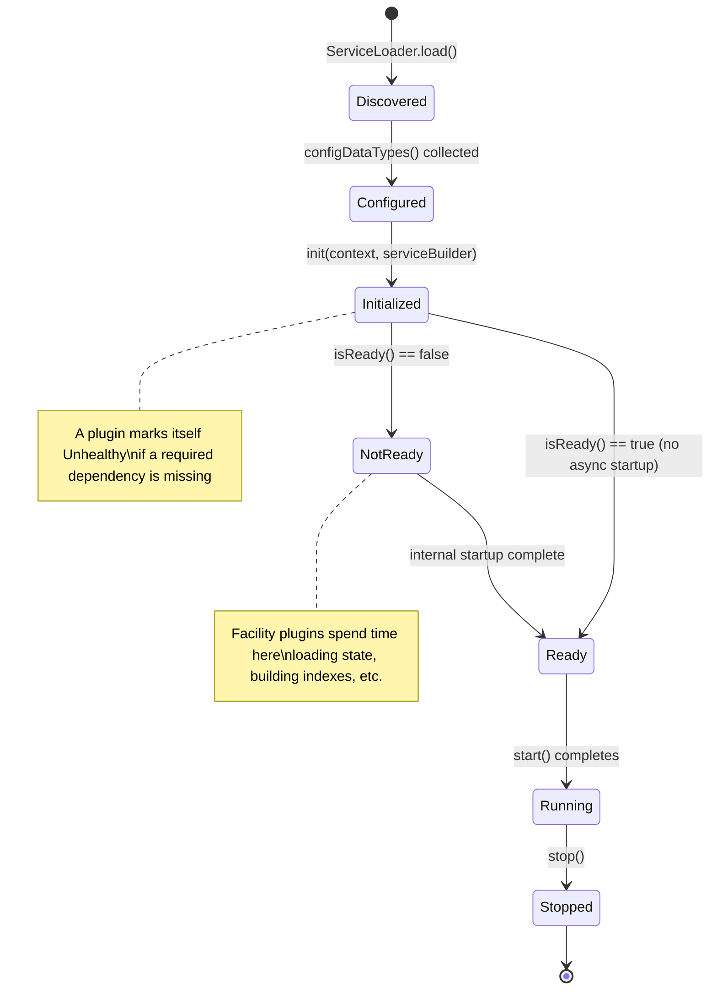
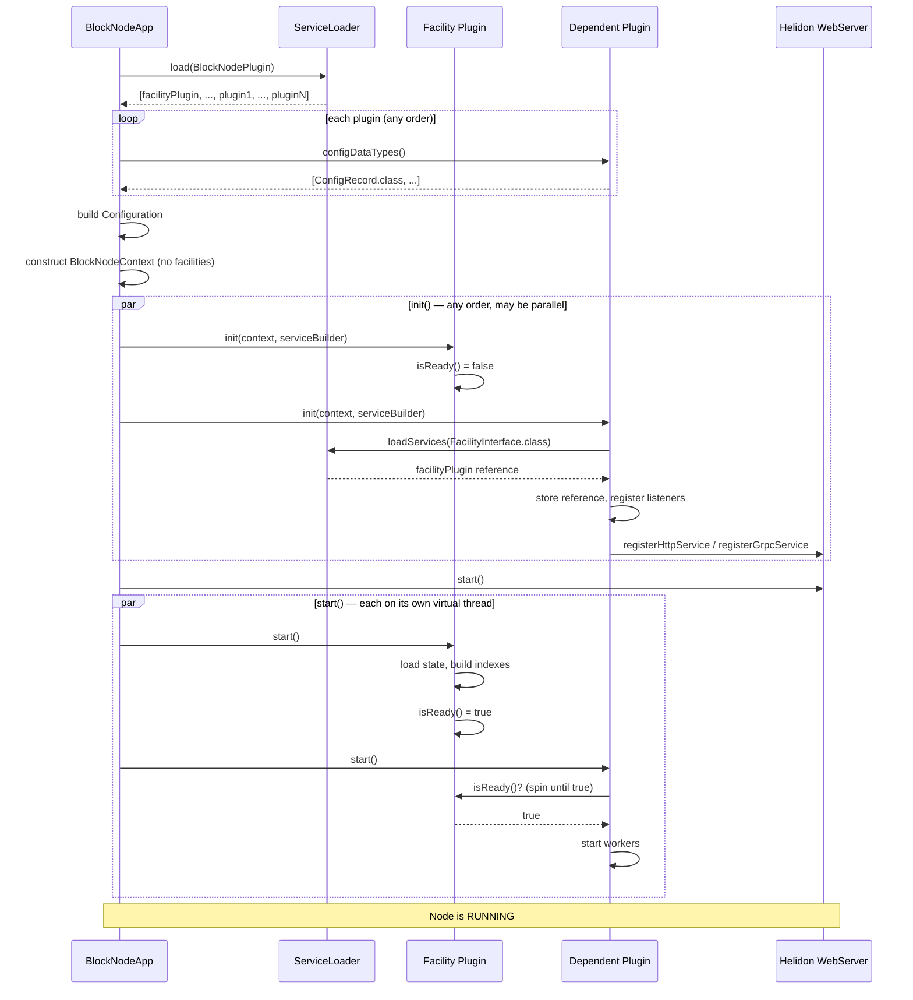
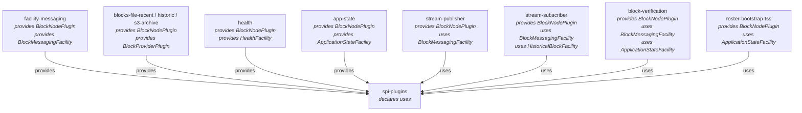
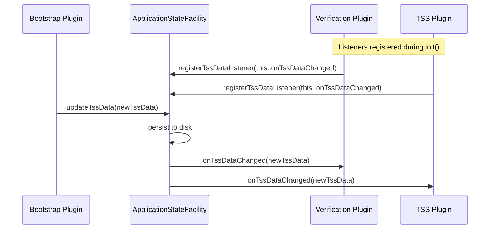

# New Plugin Architecture

## Table of Contents

1. [Purpose](#purpose)
2. [Goals](#goals)
3. [Terms](#terms)
4. [Entities](#entities)
5. [Design](#design)
6. [Diagram](#diagram)
7. [Configuration](#configuration)
8. [Metrics](#metrics)
9. [Exceptions](#exceptions)
10. [Acceptance Tests](#acceptance-tests)

## Purpose

The Block Node is composed of many independently-developed functional components: block publishing, subscribing, verification, persistence, health checking, cloud archival, roster bootstrapping, and more. Rather than wiring these together statically at compile time, the Block Node uses a **plugin architecture** that discovers, configures, and manages the lifecycle of each component at runtime.

This document describes a revised design of that architecture. The previous design ([plugin-architecture.md](plugin-architecture.md)) injected facilities into a shared `BlockNodeContext` record, which created an implicit coupling between the application bootstrap code and every facility type. This revision treats **facilities as plugins** — each facility implements `BlockNodePlugin`, exposes its own typed interface as a JPMS service, and is discovered by dependent plugins via `ServiceLoader` in their own `init()` method. The application bootstrap code becomes facility-agnostic. Dependency resolution and readiness coordination move into the plugins themselves.

## Goals

- Allow functional components — including facilities — to be added, replaced, or removed without modifying the application bootstrap code.
- Remove facilities from `BlockNodeContext`; each facility is discovered directly by dependent plugins via `ServiceLoader`.
- Allow `init()` to execute in any order, or in parallel, with no assumptions about other plugins being initialized.
- Allow `start()` to coordinate readiness with facility plugins via `isReady()`, without the application imposing an ordering constraint.
- Ensure plugins that cannot satisfy a required dependency mark themselves as unhealthy rather than throwing, so the rest of the plugins can continue to start.
- Support typed, immutable configuration for each plugin using Java records and the Swirlds Config API.
- Remain entirely within the Java Platform Module System so that module boundaries are enforced by the JVM.

## Terms

<dl>
  <dt>Plugin</dt>
  <dd>Any class that implements <code>BlockNodePlugin</code> and is registered as a Java module service. Plugins are the unit of extension — each adds a distinct capability to the running Block Node.</dd>

  <dt>Facility Plugin</dt>
  <dd>A plugin that also implements a facility-specific interface (e.g., <code>BlockMessagingFacility</code>, <code>HistoricalBlockFacility</code>, <code>ApplicationStateFacility</code>) and registers that interface as a JPMS service. Other plugins that depend on the facility discover it via <code>ServiceLoader</code> of the facility interface, not via <code>BlockNodeContext</code>.</dd>

  <dt>SPI</dt>
  <dd>Service Provider Interface — a Java interface declared in the <code>spi-plugins</code> module and consumed via <code>java.util.ServiceLoader</code>. Plugins provide implementations of SPI interfaces in their own modules.</dd>

  <dt>BlockNodeContext</dt>
  <dd>A slimmed-down immutable Java record passed to every plugin during <code>init()</code>. It carries only infrastructure concerns: <code>Configuration</code>, <code>MetricRegistry</code>, <code>ServiceLoaderFunction</code>, <code>ThreadPoolManager</code>, and <code>BlockNodeVersions</code>. Facilities are no longer fields on this record.</dd>

  <dt>ServiceBuilder</dt>
  <dd>An interface passed alongside <code>BlockNodeContext</code> during <code>init()</code> that allows plugins to register HTTP and gRPC service routes on the Helidon web server.</dd>

  <dt>Disruptor</dt>
  <dd>The LMAX Disruptor ring buffer used by the <code>BlockMessagingFacility</code> plugin as the underlying transport for both block-item distribution and block-notification events between plugins.</dd>

  <dt>BlockProviderPlugin</dt>
  <dd>A specialization of <code>BlockNodePlugin</code> that contributes a source of historical blocks (e.g., file system, S3, RAM cache). The <code>HistoricalBlockFacility</code> plugin composes all registered providers in priority order.</dd>

  <dt>isReady()</dt>
  <dd>A method on <code>BlockNodePlugin</code> that returns <code>true</code> when the plugin is fully initialized and ready to serve its callers. Facility plugins expose this so dependent plugins can spin-wait in <code>start()</code> before attempting to use the facility.</dd>
</dl>

## Entities

### `BlockNodePlugin` (interface)

The root SPI interface. Every plugin (including facility plugins) implements this interface. All methods have default no-op or default-value implementations so plugins only override what they need.

|             Method              |                  When called                  |                                                                                                                                  Purpose                                                                                                                                  |
|---------------------------------|-----------------------------------------------|---------------------------------------------------------------------------------------------------------------------------------------------------------------------------------------------------------------------------------------------------------------------------|
| `name()`                        | Anytime                                       | Human-readable identifier; defaults to the simple class name.                                                                                                                                                                                                             |
| `version()`                     | After load                                    | Returns the plugin's version from its JAR manifest.                                                                                                                                                                                                                       |
| `configDataTypes()`             | Before config load                            | Declares `@ConfigData`-annotated record classes the plugin needs. All types are collected from every plugin before configuration is built.                                                                                                                                |
| `init(context, serviceBuilder)` | During startup, any order                     | Plugin uses `ServiceLoader` to locate facility plugins it depends on. Logs an error and marks itself unhealthy if a required dependency is missing. Registers HTTP/gRPC routes. Must not start background threads. Must not assume any other plugin has been initialized. |
| `isReady()`                     | Anytime after `init()`                        | Returns `true` when the plugin is ready to serve callers. Defaults to `true`; facility plugins override this to reflect their internal startup state.                                                                                                                     |
| `start()`                       | After all `init()` calls, on a virtual thread | Loads data and resources. Waits on required facility plugins via `isReady()` before proceeding. Starts background worker threads.                                                                                                                                         |
| `stop()`                        | During graceful shutdown                      | Closes resources, stops worker threads.                                                                                                                                                                                                                                   |

### `BlockNodeContext` (record)

An immutable record injected into every plugin during `init()`. Contains only infrastructure concerns shared by all plugins. Facilities are no longer fields here — plugins that need a facility resolve it via `context.serviceLoader()`.

|        Field        |          Type           |                                       Description                                        |
|---------------------|-------------------------|------------------------------------------------------------------------------------------|
| `configuration`     | `Configuration`         | Swirlds typed configuration. Plugins call `configuration.getConfigData(MyConfig.class)`. |
| `metricRegistry`    | `MetricRegistry`        | Register counters, gauges, and histograms.                                               |
| `serviceLoader`     | `ServiceLoaderFunction` | Load facility plugins and other SPI extensions at runtime.                               |
| `threadPoolManager` | `ThreadPoolManager`     | Create managed virtual-thread or platform-thread executors.                              |
| `blockNodeVersions` | `BlockNodeVersions`     | Version information for all loaded plugins.                                              |

### `ServiceBuilder` (interface)

Passed to plugins during `init()`. Allows plugins to register routes without a direct dependency on Helidon.

```java
void registerHttpService(String path, HttpService... service);
void registerGrpcService(ServiceInterface service);
```

### Facility Plugin Interfaces

Each facility is defined by its own interface in the `spi-plugins` module. A facility plugin implements both `BlockNodePlugin` and its facility interface. The facility interface is registered as a JPMS service independently of `BlockNodePlugin`.

#### `BlockMessagingFacility` (facility interface)

The inter-plugin event bus. Built on LMAX Disruptor ring buffers for high-throughput, low-latency delivery.

**Block Items** — a stream of `BlockItems` records carrying unparsed protobuf items for one logical block:
- `sendBlockItems(BlockItems)` — called by the publisher plugin for every batch received from a Consensus Node.
- `registerBlockItemHandler(BlockItemHandler, cpuIntensive, name)` — subscribe with back-pressure; a slow handler slows the producer.
- `registerNoBackpressureBlockItemHandler(...)` — subscribe without back-pressure; if the handler falls 80% behind, `onTooFarBehindError()` is called instead of blocking the producer.

**Block Notifications** — five typed notification events for block lifecycle milestones:

|              Notification               |       Sender        |                          Meaning                           |
|-----------------------------------------|---------------------|------------------------------------------------------------|
| `VerificationNotification`              | Verification plugin | Block passed or failed cryptographic verification.         |
| `PersistedNotification`                 | Storage plugins     | Block has been durably written by a provider.              |
| `BackfilledBlockNotification`           | Backfill plugin     | A previously missing block was retrieved and stored.       |
| `NewestBlockKnownToNetworkNotification` | Publisher plugin    | Consensus Node has reported the latest known block header. |
| `PublisherStatusUpdateNotification`     | Publisher plugin    | Publisher connection state changed.                        |

Any plugin may subscribe to notifications via `registerBlockNotificationHandler(BlockNotificationHandler, ...)`.

#### `HistoricalBlockFacility` (facility interface)

Aggregates all registered `BlockProviderPlugin` implementations and presents a unified read interface:

- `block(long blockNumber)` → `BlockAccessor` — queries providers in descending priority order; returns the first non-null result.
- `availableBlocks()` → `BlockRangeSet` — the union of all providers' available ranges.

#### `HealthFacility` (facility interface)

```java
enum State { STARTING, RUNNING, SHUTTING_DOWN }
State blockNodeState();
void shutdown(String className, String reason);
```

The `HealthServicePlugin` registers `/healthz/livez` and `/healthz/readyz` HTTP endpoints that return `200 OK` while the state is `RUNNING` and `503 Service Unavailable` otherwise.

#### `ApplicationStateFacility` (facility interface)

Owns and persists the mutable node state (`TssData`, `NodeAddressBook`). These fields have been removed from `BlockNodeContext`. Plugins that need this state discover the facility via `ServiceLoader` and register change listeners directly.

```java
// State access
TssData tssData();
NodeAddressBook nodeAddressBook();

// State mutation (persists to disk and notifies listeners)
void updateTssData(TssData tssData);
boolean updateAddressBook(NodeAddressBook nodeAddressBook);

// Change listener registration
void registerTssDataListener(Consumer<TssData> listener);
void registerAddressBookListener(Consumer<NodeAddressBook> listener);
```

Plugins register listeners in `init()` so they receive updates as soon as the facility becomes ready. The facility delivers the current value immediately upon listener registration if state is already available, and delivers each subsequent update as it occurs.

### `BlockProviderPlugin` (interface)

Specialization of `BlockNodePlugin` for block storage backends. Each provider declares a `defaultPriority()` (higher = preferred). The `HistoricalBlockFacility` plugin loads all providers and sorts them by priority.

## Design

### Facility Plugin Pattern

Every facility follows the same pattern:

1. **Define** a facility interface in `spi-plugins` (e.g., `BlockMessagingFacility`).
2. **Implement** the facility interface and `BlockNodePlugin` in a dedicated module (e.g., `facility-messaging`).
3. **Register** both `BlockNodePlugin` and the facility interface as JPMS services in `module-info.java`.
4. **Override** `isReady()` to return `true` only after internal startup is complete.

Dependent plugins declare `uses <FacilityInterface>` in their own `module-info.java` and resolve the facility in `init()`:

```java
// stream-publisher/module-info.java
uses org.hiero.block.node.spi.blockmessaging.BlockMessagingFacility;

// PublisherPlugin.java
@Override
public void init(BlockNodeContext context, ServiceBuilder serviceBuilder) {
    messaging = context.serviceLoader()
        .loadServices(BlockMessagingFacility.class)
        .findFirst()
        .orElse(null);
    if (messaging == null) {
        log.log(ERROR, "Required BlockMessagingFacility not found — publisher marked unhealthy");
        markUnhealthy();
    }
}

@Override
public void start() {
    // Wait for the facility to be ready before starting workers
    while (!messaging.isReady()) {
        Thread.sleep(Duration.ofMillis(10));
    }
    startWorkerThreads();
}
```

### Plugin Discovery and Bootstrap Sequence

```
1. BlockNodeApp loads all BlockNodePlugin implementations via ServiceLoader.
   (This includes facility plugins, which also provide BlockNodePlugin.)

2. Collect configDataTypes() from every plugin + built-in config types.

3. Load Configuration from sources (classpath properties, environment variables,
   system properties) using the collected record types.

4. Construct BlockNodeContext with infrastructure fields only
   (configuration, metricRegistry, serviceLoader, threadPoolManager, blockNodeVersions).

5. Call plugin.init(context, serviceBuilder) for every plugin.
   - Order is not guaranteed; init() calls may run in parallel.
   - Each plugin uses context.serviceLoader() to discover facility plugins it needs.
   - Missing required facilities are logged and the plugin marks itself unhealthy.
   - Plugins register HTTP/gRPC routes via ServiceBuilder.
   - Plugins register state-change listeners with ApplicationStateFacility.

6. Start Helidon WebServer using routes accumulated in ServiceBuilder.

7. Call plugin.start() for every plugin, each on its own virtual thread.
   - start() may call isReady() on facility plugins and wait until they are ready.
   - Facility plugins reach isReady() == true once their own internal startup completes.
   - Non-facility plugins start their workers once dependencies are ready.

8. Node is RUNNING once all plugins have started (or been marked unhealthy).

9. State changes (TssData, NodeAddressBook) are pushed directly to registered
   listeners by ApplicationStateFacility. No onContextUpdate() broadcast occurs.

10. On shutdown signal:
    a. Transition to SHUTTING_DOWN.
    b. Wait for configurable shutdown delay.
    c. Stop WebServer.
    d. Call plugin.stop() for every plugin.
    e. Close MetricRegistry.
    f. Exit JVM.
```

### Module System Integration

Every module declares its service registrations in `module-info.java`. Facility modules register both `BlockNodePlugin` (so the app discovers them) and their facility interface (so dependent plugins can discover them directly).

```java
// spi-plugins module-info.java
uses org.hiero.block.node.spi.BlockNodePlugin;
uses org.hiero.block.node.spi.blockmessaging.BlockMessagingFacility;
uses org.hiero.block.node.spi.historicalblocks.HistoricalBlockFacility;
uses org.hiero.block.node.spi.historicalblocks.BlockProviderPlugin;
uses org.hiero.block.node.spi.health.HealthFacility;
uses org.hiero.block.node.spi.state.ApplicationStateFacility;

// facility-messaging module-info.java
provides org.hiero.block.node.spi.BlockNodePlugin
    with BlockMessagingFacilityImpl;
provides org.hiero.block.node.spi.blockmessaging.BlockMessagingFacility
    with BlockMessagingFacilityImpl;

// stream-publisher module-info.java
uses org.hiero.block.node.spi.blockmessaging.BlockMessagingFacility;
provides org.hiero.block.node.spi.BlockNodePlugin
    with PublisherPlugin;

// roster-bootstrap-tss module-info.java
uses org.hiero.block.node.spi.state.ApplicationStateFacility;
provides org.hiero.block.node.spi.BlockNodePlugin
    with TssBootstrapPlugin;
```

Adding a new plugin requires only:
1. Implementing `BlockNodePlugin` (or a specialization).
2. Declaring `provides org.hiero.block.node.spi.BlockNodePlugin with YourPlugin` in `module-info.java`.
3. Declaring `uses <FacilityInterface>` for each facility the plugin depends on.
4. Adding the module to the Gradle build.

No changes to `BlockNodeApp` or any existing plugin are required.

### `init()` Ordering and Parallelism

Because `init()` may run in any order or in parallel, it must be entirely self-contained:

- It must not call methods on other plugins directly.
- It must not assume that any facility plugin's `isReady()` returns `true`.
- It **may** call `context.serviceLoader().loadServices(FacilityInterface.class)` to obtain a reference to a facility plugin (the plugin object exists even if not yet ready).
- It **may** call `facility.registerTssDataListener(...)` on `ApplicationStateFacility` — listener registration is safe before the facility is ready; the first delivery occurs once ready.
- It **must** log an error and mark itself unhealthy if a required facility is not found.

### `start()` Readiness Coordination

`start()` runs on a virtual thread spawned by the application. Because virtual threads are cheap, a plugin may spin-wait on a dependency's `isReady()` without consuming a platform thread:

```java
@Override
public void start() {
    // Block this virtual thread until the messaging facility is ready.
    // Virtual thread parking is cheap — no platform thread is consumed.
    while (!messaging.isReady()) {
        Thread.sleep(Duration.ofMillis(10));
    }
    // Now safe to use the facility.
    messaging.registerBlockItemHandler(this, false, name());
    startWorkerThread();
}
```

The `isReady()` contract for facility plugins:
- Returns `false` from construction until the facility has loaded its state and is ready to serve calls.
- Returns `true` permanently thereafter (facilities do not go back to non-ready once started).
- Is safe to call from any thread at any time.

### Mutable State Propagation via `ApplicationStateFacility`

`TssData` and `NodeAddressBook` are owned by the `ApplicationStateFacility` plugin. Interested plugins register listeners in `init()`. State updates flow as follows:

```
Bootstrap Plugin
    │
    ▼ applicationState.updateTssData(newData)
ApplicationStateFacilityImpl
    │
    ├── Persist to disk (JSON)
    ├── Store in memory (volatile reference)
    │
    ▼ notify registered listeners
    │
    ├── TssBootstrapPlugin.onTssDataChanged(newData)
    ├── VerificationPlugin.onTssDataChanged(newData)
    └── ... any other registered listener
```

This replaces the previous `onContextUpdate()` broadcast and the reconstruction of `BlockNodeContext`. Each listener is called directly and handles only the state it cares about.

### Inter-Plugin Messaging

Unchanged from the previous architecture. The `BlockMessagingFacility` plugin provides two independent LMAX Disruptor ring buffers:

```
Publisher Plugin
      │
      ▼  sendBlockItems()
┌─────────────────────┐
│  Block Items Buffer  │  (Disruptor ring)
└─────────────────────┘
      │           │
      ▼           ▼
 Subscriber    Verification    ...  (N handlers, each with optional back-pressure)

Block Lifecycle Events (verification, persistence, backfill, etc.)
      │
      ▼  sendBlockVerification() / sendBlockPersisted() / ...
┌────────────────────────────┐
│  Block Notification Buffer  │  (Disruptor ring)
└────────────────────────────┘
      │           │
      ▼           ▼
  Subscriber   Publisher   ...  (N handlers)
```

Handlers registered with back-pressure (default) slow the producer if they fall behind. Handlers registered without back-pressure (`NoBackPressureBlockItemHandler`) receive `onTooFarBehindError()` when they fall more than 80% of the ring size behind.

### Typed Configuration

Unchanged from the previous architecture. Each plugin declares the `@ConfigData`-annotated record classes it needs in `configDataTypes()`. All types from all plugins are aggregated before configuration is loaded.

```java
// Declaring config needs
@Override
public List<Class<? extends Record>> configDataTypes() {
    return List.of(PublisherConfig.class);
}

// Using config in init()
@Override
public void init(BlockNodeContext context, ServiceBuilder serviceBuilder) {
    PublisherConfig config = context.configuration().getConfigData(PublisherConfig.class);
}
```

Configuration sources are applied in ascending priority order:
1. Classpath (`application.properties`)
2. Environment variables (auto-mapped: `BLOCK_NODE_PUBLISHER_MAX_CONNECTIONS` → `publisher.maxConnections`)
3. System properties

## Diagram

### Plugin Lifecycle



### Startup Sequence



### Facility Plugin Module Registration



### State Change Listener Flow



## Configuration

The plugin architecture itself has no configuration. Each plugin declares its own configuration needs. The global sources and priorities are:

|                Source                | Priority |                  Example                  |
|--------------------------------------|----------|-------------------------------------------|
| System properties                    | Highest  | `-Dpublisher.maxConnections=10`           |
| Environment variables                | Middle   | `BLOCK_NODE_PUBLISHER_MAX_CONNECTIONS=10` |
| `application.properties` (classpath) | Lowest   | `publisher.maxConnections=10`             |

Environment variable mapping: `BLOCK_NODE_` prefix is stripped, remaining text is lowercased with `_` converted to `.` to match property key format.

## Metrics

No metrics are defined by the plugin framework itself. Each plugin is expected to register its metrics in `init()` using `context.metricRegistry()`. The standard category name for all block node metrics is defined as a constant on `BlockNodePlugin`:

```java
String METRICS_CATEGORY = "blocknode";
```

The `HistoricalBlockFacility` plugin registers two observable gauges:
- `blocknode.oldestBlockNumber` — oldest block available across all providers.
- `blocknode.newestBlockNumber` — newest block available across all providers.

## Exceptions

|                        Condition                         |                                                                        Behavior                                                                        |
|----------------------------------------------------------|--------------------------------------------------------------------------------------------------------------------------------------------------------|
| A required facility interface has no registered provider | The dependent plugin logs an error in `init()`, marks itself unhealthy, and does not start. Other plugins are unaffected.                              |
| A plugin's `init()` throws an unchecked exception        | The exception is caught by the app; the plugin is marked unhealthy and skipped during `start()`. Other plugins continue.                               |
| A plugin's `start()` throws                              | The exception is logged; the plugin is considered failed. Other plugins on their own virtual threads are not affected.                                 |
| A plugin's `stop()` throws                               | The exception is logged; remaining plugins are still stopped.                                                                                          |
| A facility plugin's `isReady()` never returns `true`     | A dependent plugin's `start()` spins indefinitely. A startup watchdog timeout (configurable) should be implemented to detect and abort this condition. |
| A `NoBackPressureBlockItemHandler` falls 80% behind      | `onTooFarBehindError()` is called on that handler; the publisher is not blocked.                                                                       |
| A back-pressure `BlockItemHandler` falls behind          | The publisher thread blocks until the handler catches up, applying flow control end-to-end.                                                            |
| `ApplicationStateFacility.updateAddressBook()` fails     | Returns `false`; the caller is responsible for retry logic.                                                                                            |

## Acceptance Tests

- **Plugin discovery**: Starting the node with N plugins registered in `module-info.java` results in exactly N plugins having their `init()` and `start()` called, as confirmed by log output or a version-listing endpoint.
- **Facility as plugin**: A facility plugin (e.g., `BlockMessagingFacilityImpl`) appears in the list of loaded `BlockNodePlugin` instances and has its `init()`, `start()`, and `stop()` called by the application.
- **Facility discovery by dependent**: A dependent plugin that calls `context.serviceLoader().loadServices(BlockMessagingFacility.class)` in `init()` receives the same object instance as the one loaded as a `BlockNodePlugin`.
- **init() order independence**: Calling `init()` on all plugins in reverse alphabetical order produces the same end state as calling them in forward alphabetical order. No plugin fails due to ordering.
- **Missing dependency handling**: Removing a required facility's JAR from the module path causes the dependent plugin to log an error and mark itself unhealthy, while all other plugins start normally.
- **isReady() gate**: A dependent plugin's `start()` does not proceed past the readiness check until the facility plugin's `isReady()` returns `true`. Verified by injecting an artificial delay in a facility's `start()` and observing the dependent plugin waits.
- **ApplicationStateFacility listener — initial delivery**: A plugin that registers a `TssDataListener` after the `ApplicationStateFacility` is ready receives the current `TssData` immediately upon registration.
- **ApplicationStateFacility listener — update delivery**: Calling `applicationStateFacility.updateTssData(newData)` results in every registered listener being called with `newData`. No `onContextUpdate()` broadcast occurs; `BlockNodeContext` is not reconstructed.
- **ApplicationStateFacility listener — NodeAddressBook**: Calling `applicationStateFacility.updateAddressBook(newBook)` delivers `newBook` to all registered `AddressBookListener` instances.
- **Plugin isolation**: Removing a non-facility plugin's JAR from the module path causes the node to start without that plugin's functionality, without failures in unrelated plugins.
- **Back-pressure**: A block-item handler that sleeps for 100 ms per batch reduces the observed throughput of `sendBlockItems()` to match, without deadlock or data loss.
- **No-back-pressure skip**: A `NoBackPressureBlockItemHandler` that processes slowly receives `onTooFarBehindError()` calls under sustained load without causing the publisher to block.
- **Configuration scoping**: A plugin's `@ConfigData` record is populated from its declared property keys; unrelated keys from other plugins do not affect its values.
- **Graceful shutdown**: `stop()` is called on every plugin (including facility plugins), the web server closes, and the JVM exits with code 0.
- **HTTP route registration**: A plugin that calls `serviceBuilder.registerHttpService("/foo", ...)` in `init()` has its handler reachable at `GET /foo` once `start()` completes.
- **gRPC route registration**: A plugin that calls `serviceBuilder.registerGrpcService(...)` has its service reachable via HTTP/2 gRPC once `start()` completes.
- **Block provider priority**: When two `BlockProviderPlugin` implementations both have a block at number N, the provider with the higher `defaultPriority()` value is the one whose `BlockAccessor` is returned by `HistoricalBlockFacility.block(N)`.
