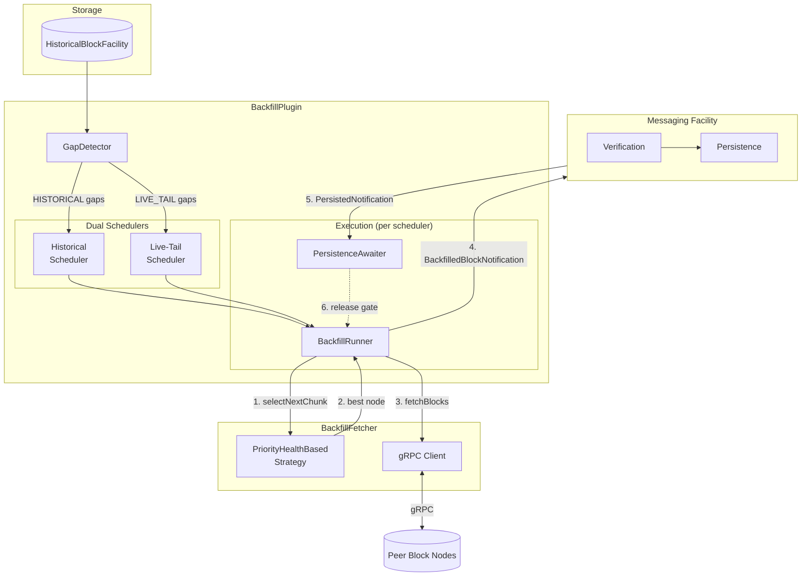
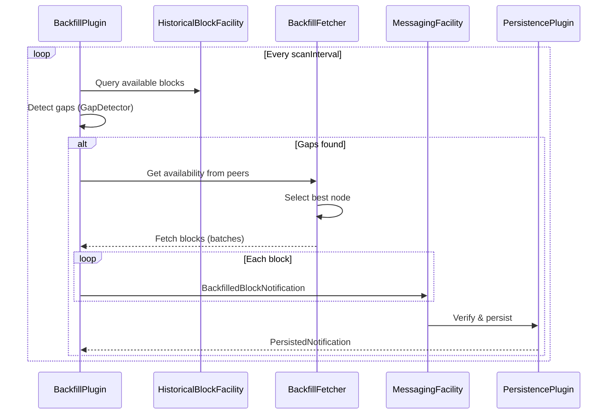
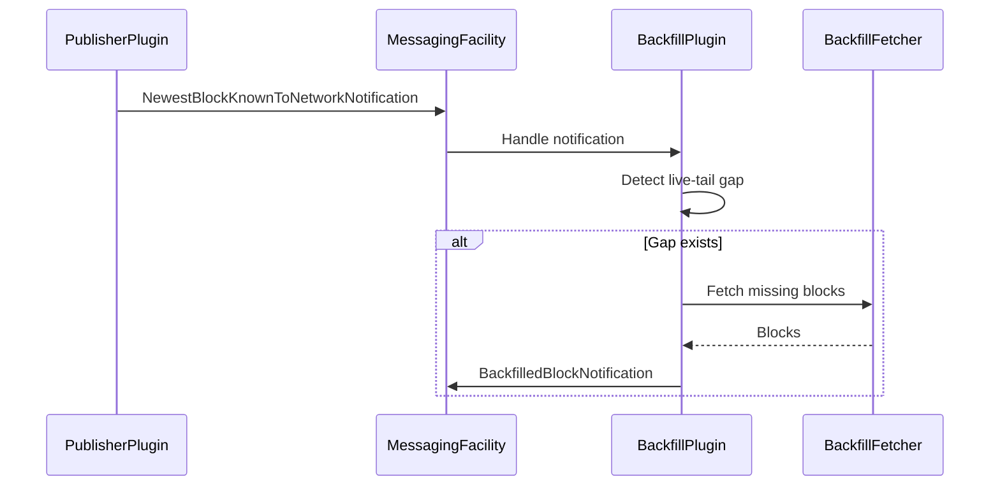
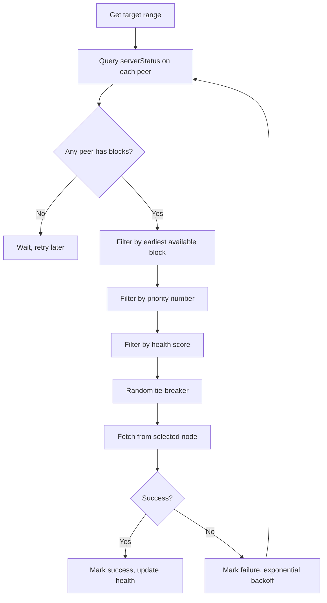

# Backfill Plugin Design Document

## Table of Contents

1. [Purpose](#purpose)
2. [Goals](#goals)
3. [Architecture](#architecture)
4. [Design Flows](#design-flows)
   - [Health Score System](#health-score-system)
5. [Configuration](#configuration)
6. [Metrics](#metrics)
7. [Acceptance Tests](#acceptance-tests)

## Purpose

Detect missing gaps in the stored block sequence and autonomously fetch missing blocks from peer block nodes.

## Goals

1. Detect gaps on start-up and continuously while running
2. Fetch missing blocks from configurable peer block nodes
3. Asynchronously recover blocks without blocking live ingestion
4. Provide instrumentation, logging, and metrics

## Architecture



### Components

|            Component            |                                 Description                                 |
|---------------------------------|-----------------------------------------------------------------------------|
| **GapDetector**                 | Scans storage for missing blocks, classifies as `HISTORICAL` or `LIVE_TAIL` |
| **BackfillTaskScheduler**       | Bounded FIFO queue with single worker thread                                |
| **BackfillRunner**              | Orchestrates fetch → dispatch → await persistence cycle                     |
| **BackfillPersistenceAwaiter**  | Tracks in-flight blocks, blocks until persisted                             |
| **BackfillFetcher**             | Manages peer connections, health tracking, retries with backoff             |
| **PriorityHealthBasedStrategy** | Selects peer by: earliest block → priority → health → random                |

### Dual-Scheduler Design

Two independent schedulers prevent historical backfill from blocking live-tail:

| Scheduler  |          Purpose          |  Queue Size  |
|------------|---------------------------|--------------|
| Historical | Old gaps, FIFO processing | 20 (default) |
| Live-Tail  | Recent gaps, stay current | 10 (default) |

Each has its own `BackfillRunner`, `BackfillFetcher`, and `BackfillPersistenceAwaiter`.

## Design Flows

### Autonomous Backfill

The plugin periodically scans for gaps and fetches missing blocks:



### On-Demand Backfill

Triggered when `NewestBlockKnownToNetworkNotification` is received (e.g., from PublisherPlugin):



### Node Selection Flow



### Health Score System

Tracks peer node reliability to prefer healthy, fast nodes. Lower score = better node.

**Score:** `(failures × healthPenaltyPerFailure) + avgLatencyMs`

- **Success**: Resets failures to 0, tracks latency
- **Failure**: Increments failures, applies exponential backoff (`initialRetryDelay × 2^failures`, capped at `maxBackoffMs`)

Nodes in backoff are skipped entirely until the backoff period expires.

## Configuration

### Plugin Configuration

Properties are set via the Block Node configuration system (prefix: `backfill.`):

|          Property           |  Type   | Default |                 Description                 |
|-----------------------------|---------|---------|---------------------------------------------|
| `startBlock`                | long    | 0       | First block number to consider for backfill |
| `endBlock`                  | long    | -1      | Last block (-1 = unlimited)                 |
| `blockNodeSourcesPath`      | String  | ""      | Path to peer nodes JSON file                |
| `scanInterval`              | int     | 60000   | Gap detection interval in ms                |
| `maxRetries`                | int     | 3       | Max retry attempts per fetch                |
| `initialRetryDelay`         | int     | 5000    | Initial retry delay in ms                   |
| `fetchBatchSize`            | int     | 10      | Blocks per gRPC request                     |
| `delayBetweenBatches`       | int     | 1000    | Delay between batches in ms                 |
| `initialDelay`              | int     | 15000   | Startup delay in ms                         |
| `perBlockProcessingTimeout` | int     | 1000    | Per-block processing timeout in ms          |
| `grpcOverallTimeout`        | int     | 60000   | gRPC timeout fallback in ms                 |
| `enableTLS`                 | boolean | false   | Enable TLS for gRPC connections             |
| `greedy`                    | boolean | false   | Fetch blocks ahead of local storage         |
| `historicalQueueCapacity`   | int     | 20      | Historical queue size                       |
| `liveTailQueueCapacity`     | int     | 10      | Live-tail queue size                        |
| `healthPenaltyPerFailure`   | double  | 1000.0  | Health score penalty per failure            |
| `maxBackoffMs`              | long    | 300000  | Maximum backoff duration in ms              |

### Peer Nodes Configuration (JSON)

The `blockNodeSourcesPath` file defines peer block nodes:

```json
{
  "nodes": [
    {
      "address": "peer1.example.com",
      "port": 8080,
      "priority": 1
    },
    {
      "address": "peer2.example.com",
      "port": 8080,
      "priority": 2,
      "node_id": "peer-2",
      "name": "Backup Peer",
      "grpc_webclient_tuning": {
        "connect_timeout": 45000,
        "read_timeout": 60000
      }
    }
  ]
}
```

|          Field          |  Type   | Required |           Description            |
|-------------------------|---------|----------|----------------------------------|
| `address`               | string  | Yes      | Hostname or IP address           |
| `port`                  | integer | Yes      | gRPC port                        |
| `priority`              | integer | Yes      | Selection priority (0 = highest) |
| `node_id`               | string  | No       | Unique identifier for logging    |
| `name`                  | string  | No       | Human-readable label             |
| `grpc_webclient_tuning` | object  | No       | Per-node gRPC tuning (see below) |

#### gRPC Tuning Options

All fields optional. Timeouts default to `grpcOverallTimeout`, others have sensible defaults.

|         Field          | Default |          Description          |
|------------------------|---------|-------------------------------|
| `connect_timeout`      | global  | Connection timeout in ms      |
| `read_timeout`         | global  | Read timeout in ms            |
| `poll_wait_time`       | global  | Poll wait time in ms          |
| `prior_knowledge`      | true    | Skip HTTP/1.1 upgrade         |
| `max_frame_size`       | 2MB     | HTTP/2 max frame size         |
| `initial_window_size`  | 2MB     | HTTP/2 flow control window    |
| `initial_buffer_size`  | 2MB     | gRPC buffer size              |
| `flow_control_timeout` | 10000   | Flow control timeout in ms    |
| `max_header_list_size` | 8192    | Max header list size          |
| `ping_enabled`         | true    | Enable HTTP/2 keep-alive ping |
| `ping_timeout`         | 500     | Ping timeout in ms            |

## Metrics

All metrics use the `backfill` category prefix.

### Counters

|            Metric            |             Description             |
|------------------------------|-------------------------------------|
| `backfill_gaps_detected`     | Total number of gaps detected       |
| `backfill_blocks_fetched`    | Total blocks fetched from peers     |
| `backfill_blocks_backfilled` | Total blocks successfully persisted |
| `backfill_fetch_errors`      | Total fetch failures                |
| `backfill_retries`           | Total retry attempts                |

### Gauges

|          Metric           |               Description                |
|---------------------------|------------------------------------------|
| `backfill_status`         | Current status (0 = idle, 1 = running)   |
| `backfill_pending_blocks` | Blocks awaiting persistence confirmation |

## Acceptance Tests

### Unit Test Scenarios

- Autonomous backfill with gaps detected
- Priority fallback when primary peer unavailable
- No backfill when no peers have required blocks
- On-demand backfill triggered by notification
- Concurrent historical and live-tail backfill
- Gap available across multiple peers

### E2E Test Scenarios

**Autonomous Happy Path:**
1. Start two block nodes - one with full range (source), one with gaps
2. Verify gaps are detected and backfilled from source
3. Verify blocks persisted correctly

**On-Demand Happy Path:**
1. Start two block nodes
2. Send `NewestBlockKnownToNetworkNotification` indicating newer blocks
3. Verify live-tail gap backfilled

**Combined Autonomous + On-Demand:**
1. Start with historical gaps and live-tail gaps
2. Verify both are processed concurrently without blocking each other
