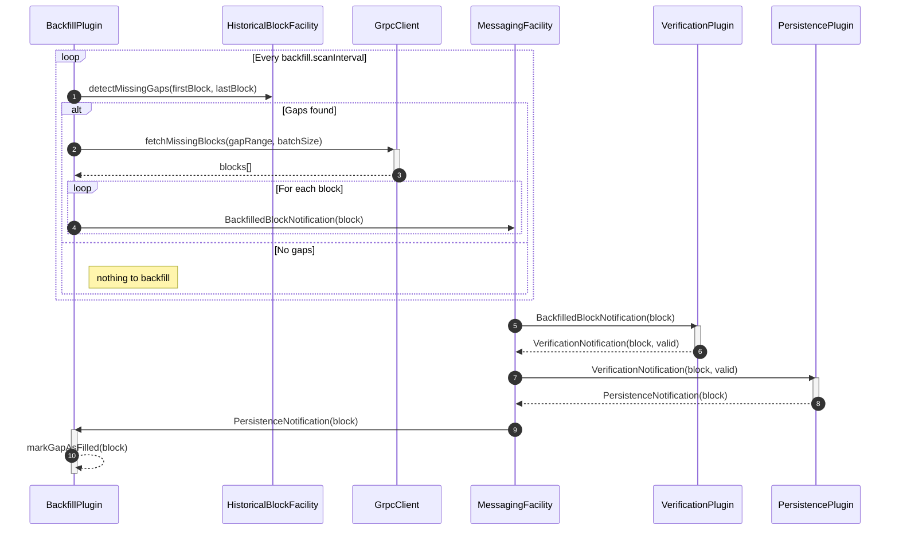
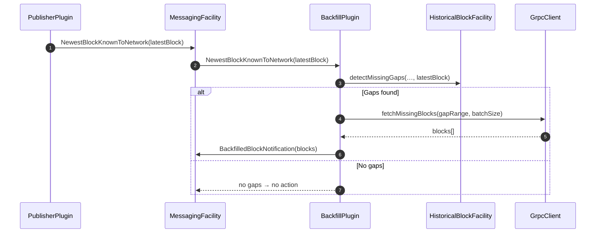
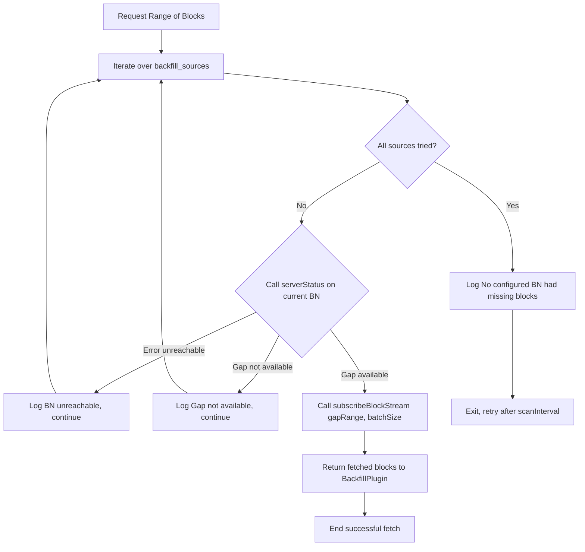

# Backfill Plugin Design Document

## Table of Contents

1. [Purpose](#purpose)
2. [Goals](#goals)
3. [Terms](#terms)
4. [Entities](#entities)
5. [Design](#design)
6. [Diagram](#diagram)
7. [Configuration](#configuration)
8. [Metrics](#metrics)
9. [Exceptions](#exceptions)
10. [Acceptance Tests](#acceptance-tests)

## Purpose

This plugin purpose is to detect missing gaps in the intended stored block sequence, then autonomously and asynchronously fetch the missing blocks from another source and store them.

## Goals

1. Detect gaps on start-up and while running.
2. Fetch missing blocks from another BN, must be configurable.
3. Asynchronously recover (fetch and store) the missing blocks, without blocking the live ingestion path (new incoming blocks).
4. Instrumentation, logging, metrics and error handling for the backfill process.

## Terms

<dl>
  <dt>Missing Gap</dt>
  <dd>Its a contiguous range of missing blocks, could be a single one.</dd>
  <dt>Backfill</dt>
  <dd>The process of fetching and storing missing blocks in the local storage.</dd>
  <dt>Grpc Client</dt>
  <dd>A client that connects to another Block Node to fetch missing blocks.</dd>
  <dt>BackfilledBlockNotification</dt>
  <dd>A new Notification Type that can be published to the Messaging Facility, it is intended to contain a whole block that was fetched from another source and is being backfilled into the system. </dd>
  <dt>NewestBlockKnownToNetwork</dt>
  <dd>Notification sent by a plugin, including a "publisher" plugin, to indicate that the BlockNode is behind and must be brought up-to-date. This is often handled by a "backfill" plugin by immediately requesting the missing blocks.</dd>
  <dt>BlockSource</dt>
  <dd>A new Enum that will be added to existing notification types: `VerificationNotification` and `PersistedNotification` to indicate the original source where the block is coming from, currently it will only have two values: `Publisher`, `Backfill`</dd>

</dl>

## Entities

### BackfillPlugin

- The main plugin that manages the backfill process.
- Orchestrates runs, gap detection, fetching, and message processing.
- Handles configuration and initialization.
- Implements the `Block Node Plugin` interface.

### MessagingFacility

Block Node's messaging system used for communication between plugins.

### HistoricalBlockFacility

A facility that provides access to historical blocks, this is available for all plugins.

## Design

There are two flows for backfilling, Autonomous and On-Demand.

### Autonomous Backfill

The plugin will autonomously detect gaps in the block range and fetch missing blocks from a configured source.

1. At start-up a loop is defined that runs every `backfill.scanInterval`
2. At every interval the plugin detects missing gaps in the intended block range against the actual stored blocks using the `HistoricalBlockFacility`.
3. If gaps are found, it initiates the backfill process.
4. The plugin uses a gRPC client to connect to another Block Node (configured via `backfill_sources`) to fetch the missing blocks.
5. Once the blocks are fetched, the plugin creates a `BlockNotification` of type `BackfilledBlockNotification` and sends it to the `MessagingFacility`.
6. The `VerificationPlugin` will then process the `BackfilledBlockNotification` and if the block is valid, it will create a `VerificationNotification` and send it to the `MessagingFacility` for further processing.
7. The PersistencePlugin will then store the block in the local storage.
8. The `BackfillPlugin` will receive the `PersistenceNotification` and update its internal state accordingly, marking the backfill process as complete for that block.

## Diagram



### On-Demand Backfill

The plugin can also be triggered on-demand to backfill missing blocks when the latest block known to the network is received.

1. The plugin can also be triggered on-demand by sending a `NewestBlockKnownToNetwork` message to the `MessagingFacility`, usually this would be done by the `PublisherPlugin` or any other plugin that knows the latest block.
2. BackfillPlugin will handle the `NewestBlockKnownToNetwork` message and will check if there are any gaps in the block range available in the local storage.
3. If gaps are found, it will initiate the backfill process as described in the Autonomous Backfill section.
4. The process will be the same as the Autonomous Backfill, but it will be triggered by the `NewestBlockKnownToNetwork` message instead of the periodic scan.



### gRPC Client

The gRPC client is used to connect to another Block Node to fetch the missing blocks. It will be configured with the `backfill_sources` parameter, which is a list of HOST:PORT pairs of the Block Nodes to connect to.
- Fetching blocks will be done in batches, the size of which can be configured with the `backfill.fetchBatchSize` parameter.
- For each BN configured, the client will perform an `BlockNodeService/serverStatus` call to check if the missing gap is available in the remote BN, if it is not available, it will skip that BN and continue with the next one.
- If the remote BN is not available, it will log an info and continue with the next one.
- If the BN has the missing blocks, it will fetch them in batches using the `BlockStreamSubscribeService/subscribeBlockStream`
- If none of the configured BNs have the missing blocks, it will log an info and continue with the next iteration after the configured interval.



### BlockNode Sources Configuration File Structure

```json
{
  "nodes": [
    {
      "address": "localhost",
      "port": 40800,
      "priority": 1
    },
    {
      "address": "node2.example.com",
      "port": 40902,
      "priority": 2
    }
  ]
}
```

** Initial implementations will only support `address`:`port` that could be a hostname or an IP address, and `port` as a number, once BlockNode supports Address Book, we can use `nodeId` as well.

** Name is the internal label for the node given by the operator, is only used for observability (logging and tracking) purposes.

### gRPC Client Configuration Overrides

The backfill plugin supports granular configuration of gRPC client parameters. Operators can override specific timeout values without needing a new software release.

#### Configuration Parameters

| Parameter | Default | Description |
|-----------|---------|-------------|
| `backfill.grpcOverallTimeout` | 60000 | Default timeout in milliseconds for all gRPC operations (connect, read, poll) |
| `backfill.grpcConnectTimeout` | -1 | Connection timeout in milliseconds. If set to -1 or not specified, uses `grpcOverallTimeout` |
| `backfill.grpcReadTimeout` | -1 | Read timeout in milliseconds. If set to -1 or not specified, uses `grpcOverallTimeout` |
| `backfill.grpcPollWaitTime` | -1 | Poll wait time in milliseconds. If set to -1 or not specified, uses `grpcOverallTimeout` |

#### Example Configuration

**Using default overall timeout:**

```yaml
backfill:
  grpcOverallTimeout: 60000
```

**Overriding specific timeouts:**

```yaml
backfill:
  grpcOverallTimeout: 60000
  grpcConnectTimeout: 30000  # 30 seconds for connection
  grpcReadTimeout: 90000     # 90 seconds for read operations
  grpcPollWaitTime: 45000    # 45 seconds for polling
```

**Partial overrides (others fall back to overall timeout):**

```yaml
backfill:
  grpcOverallTimeout: 60000
  grpcConnectTimeout: 20000  # Only override connection timeout
  # grpcReadTimeout and grpcPollWaitTime will use grpcOverallTimeout (60000ms)
```


This allows operators to fine-tune gRPC client behavior for different network conditions or backfill scenarios without requiring code changes.

## Exceptions

Since the whole process is asynchronous, the plugin will not throw exceptions directly, but will log errors and retry fetching blocks based on the configuration, after a certain number of retries it will log the error and continue the next iteration after the configured interval.

## Acceptance Tests

This section of the design document will be removed once there is a E2E Test Plan in place.

As part of the initial implementation, the following test scenarios will be covered as Unit Tests.

- Autonomous Backfill Happy Test
- Priority 1 BN is unavailable, fallback to 2nd priority BN
- Backfill found no available block-nodes, should not backfill
- On-Demand Backfill Happy Test
- Combined Autonomous and On-Demand Happy Test at the same time
- Backfill Autonomous, GAP available within 2 different backfill sources

And the following scenarios will be covered using the E2E Tests Suite:

**Autonomous Happy-Path:** 2 BNs, one with a full block range (source), the other with some missing blocks.
- Start both BNs.
- Verify that the BN with missing blocks detects the gaps and backfills them from the other BN
- Verify that the missing blocks are stored in the local storage.

**On-Demand Happy-Path:** 2 BNs, one with a full block range (source), the other with less blocks than the full range (source).
- Start both BNs.
- While both BNs are running, send a `NewestBlockKnownToNetwork` message to the BN with a newer blocks.
- Verify that the BN with missing blocks backfills the missing blocks from the other BN.

** Combined Autonomous and On-Demand:** 2 BNs, one with a full block range (source), the other with some missing blocks at the start and some at the end.
- Start both BNs.
- Verify that the BN with missing blocks detects the initial gaps and backfills them from the other BN.
- While historical backfill is running, send a `NewestBlockKnownToNetwork` message to the BN indicating newer blocks.
- Verify that the BN with missing blocks backfills the missing blocks from the other BN.
