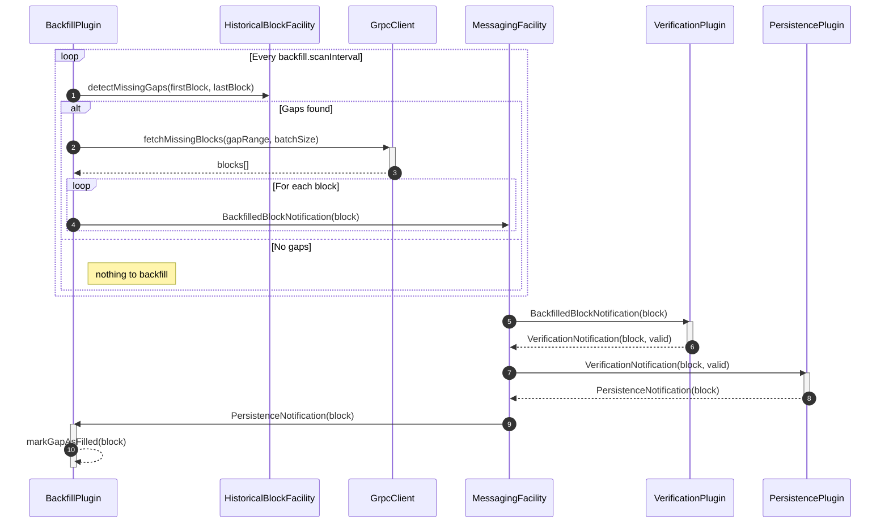

# Backfill Plugin Design Document

## Table of Contents

1. [Purpose](#purpose)
2. [Goals](#goals)
3. [Terms](#terms)
4. [Entities](#entities)
5. [Design](#design)
6. [Diagram](#diagram)
7. [Configuration](#configuration)
8. [Metrics](#metrics)
9. [Exceptions](#exceptions)
10. [Acceptance Tests](#acceptance-tests)

## Purpose

This plugin purpose is to detect missing gaps in the intended stored block sequence, then autonomously and asynchronously fetch the missing blocks from another source and store them.

## Goals

1. Detect gaps on start-up an while running.
2. Fetch missing blocks from another BN, most be configurable.
3. Asynchronously recovery (fetch and store) the missing blocks, without blocking the live ingestion path (new coming blocks).
4. Instrumentation, logging, metrics and error handling for the backfill process.

## Terms

<dl>
  <dt>Missing Gap</dt>
  <dd>Its a contiguous range of missing blocks, could be a single one.</dd>
  <dt>Backfill</dt>
  <dd>The process of fetching and storing missing blocks in the local storage.</dd>
    <dt>Grpc Client</dt>
    <dd> A client that connects to another Block Node to fetch missing blocks.</dd>

</dl>

## Entities

### BackfillPlugin

- The main plugin that manages the backfill process.
- Orchestrates runs, gap detection, fetching, and message processing.
- Handles configuration and initialization.
- Implements the `Block Node Plugin` interface.

### MessagingFacility

Block Node's messaging system used for communication between plugins and components.

### HistoricalBlockFacility

A facility that provides access to historical blocks, this is available for all plugins.

## Design

1. At start-up a loop is defined that runs every `backfill.scanInterval`
2. At every interval the plugin detects missing gaps in the intended block range against the actual stored blocks using the `HistoricalBlockFacility`.
3. If gaps are found, it initiates the backfill process.
4. The plugin uses a gRPC client to connect to another Block Node (configured via `backfill_sources`) to fetch the missing blocks.
5. Once the blocks are fetched, the plugin creates a `BlockNotification` of type `BackfilledBlockNotification` and sends it to the `MessagingFacility`.
6. The `VerificationPlugin` will then process the `BackfilledBlockNotification` and if the block is valid, it will create a `VerificationNotification` and send it to the `MessagingFacility` for further processing.
7. The PersistencePlugin will then store the block in the local storage.
8. The `BackfillPlugin` will receive the `PersistenceNotification` and update its internal state accordingly, marking the backfill process as complete for that block.

## Diagram

## Configuration

<dl>
  <dt>first_block_available</dt>
  <dd>The first block that this BN deploy wants to have available, default=0</dd>
  <dt>last_block_to_store</dt>
  <dd>for some historical purpose specific BNs, there could be a maximum amount of blocks</dd>
  <dt>backfill_sources</dt>
  <dd>Endpoint for another BN deployment in format, List of HOST:PORT</dd>
    <dt>backfill.scanInterval</dt>
    <dd>Interval in seconds to scan for missing gaps, default=60 (skip if previous task is already running)</dd>
    <dt>backfill.maxRetries<dt>
    <dd>Maximum number of retries to fetch a missing block, default=3 (with exponential back-off)</dd>
    <dt>backfill.fetchBatchSize</dt>
    <dd>Number of blocks to fetch in a single gRPC call, default=100</dd>

</dl>

## Metrics

<dl>
  <dt>backfill_gaps_detected</dt>
  <dd>Counter for the number of gaps detected during the backfill process.</dd>
  <dt>backfill_blocks_fetched</dt>
  <dd>Counter for the number of blocks fetched during the backfill process.</dd>
  <dt>backfill_blocks_stored</dt>
  <dd>Counter for the number of blocks successfully stored in the local storage.</dd>
  <dt>backfill_fetch_errors</dt>
  <dd>Counter for the number of errors encountered while fetching blocks.</dd>
</dl>

## Exceptions

Since the whole process is asynchronous, the plugin will not throw exceptions directly, but will log errors and retry fetching blocks based on the configuration, after a certain number of retries it will log the error and continue the next iteration after the configured interval.

## Acceptance Tests

- **Test 1:** Verify that the plugin detects gaps correctly on start-up. (initial backfill)
  - We need 2 BNs, one with a full block range.
  - Start a BN with a missing block range.
  - Verify that the plugin detects the missing blocks and initiates the backfill process using the configured BN1 as the source.
- **Test 2:** Verify that the plugin detects gaps while running. (ongoing backfill)
  - Start two BNs with a full block range.
  - While the BNs is running, remove some blocks from the local storage of the second BN.
  - Verify that the plugin detects the missing blocks and initiates the backfill process using the configured BN1 as the source.
