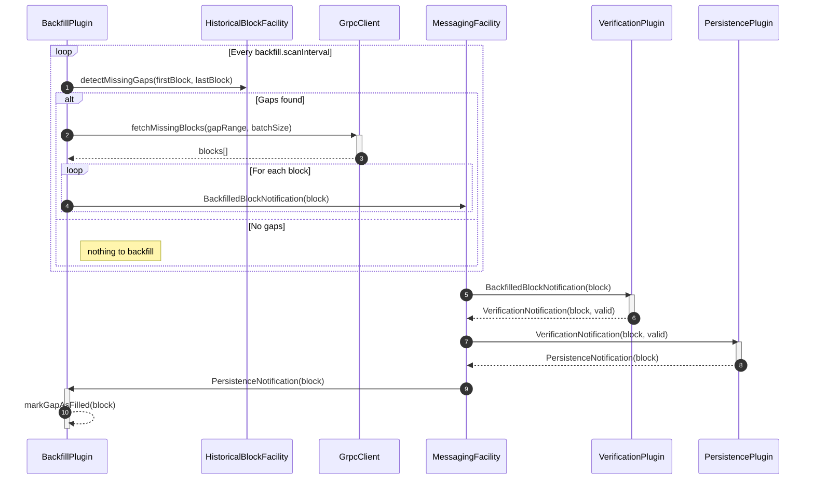
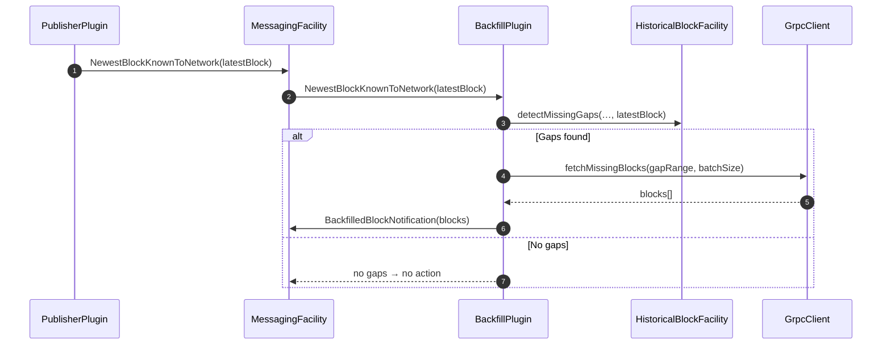
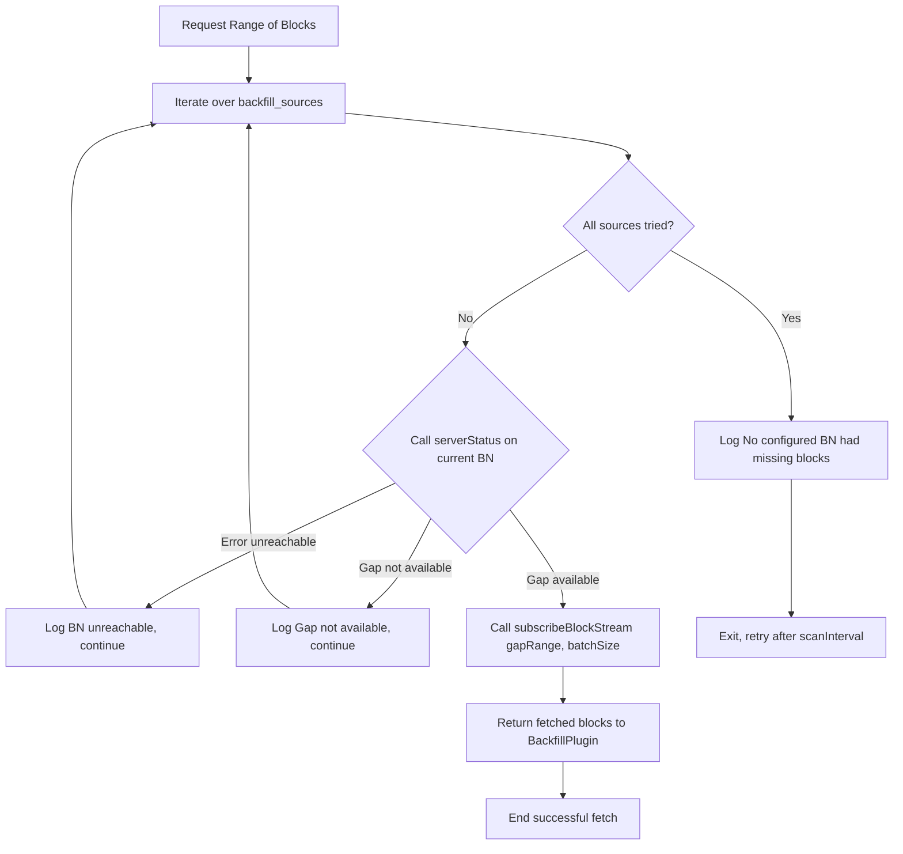

# Backfill Plugin Design Document

## Table of Contents

1. [Purpose](#purpose)
2. [Goals](#goals)
3. [Terms](#terms)
4. [Entities](#entities)
5. [Design](#design)
6. [Diagram](#diagram)
7. [Configuration](#configuration)
8. [Metrics](#metrics)
9. [Exceptions](#exceptions)
10. [Acceptance Tests](#acceptance-tests)

## Purpose

This plugin purpose is to detect missing gaps in the intended stored block sequence, then autonomously and asynchronously fetch the missing blocks from another source and store them.

## Goals

1. Detect gaps on start-up an while running.
2. Fetch missing blocks from another BN, most be configurable.
3. Asynchronously recovery (fetch and store) the missing blocks, without blocking the live ingestion path (new coming blocks).
4. Instrumentation, logging, metrics and error handling for the backfill process.

## Terms

<dl>
  <dt>Missing Gap</dt>
  <dd>Its a contiguous range of missing blocks, could be a single one.</dd>
  <dt>Backfill</dt>
  <dd>The process of fetching and storing missing blocks in the local storage.</dd>
    <dt>Grpc Client</dt>
    <dd> A client that connects to another Block Node to fetch missing blocks.</dd>

</dl>

## Entities

### BackfillPlugin

- The main plugin that manages the backfill process.
- Orchestrates runs, gap detection, fetching, and message processing.
- Handles configuration and initialization.
- Implements the `Block Node Plugin` interface.

### MessagingFacility

Block Node's messaging system used for communication between plugins and components.

### HistoricalBlockFacility

A facility that provides access to historical blocks, this is available for all plugins.

## Design

There are two flows for backfilling, Autonomous and On-Demand.

### Autonomous Backfill

The plugin will autonomously detect gaps in the block range and fetch missing blocks from a configured source.

1. At start-up a loop is defined that runs every `backfill.scanInterval`
2. At every interval the plugin detects missing gaps in the intended block range against the actual stored blocks using the `HistoricalBlockFacility`.
3. If gaps are found, it initiates the backfill process.
4. The plugin uses a gRPC client to connect to another Block Node (configured via `backfill_sources`) to fetch the missing blocks.
5. Once the blocks are fetched, the plugin creates a `BlockNotification` of type `BackfilledBlockNotification` and sends it to the `MessagingFacility`.
6. The `VerificationPlugin` will then process the `BackfilledBlockNotification` and if the block is valid, it will create a `VerificationNotification` and send it to the `MessagingFacility` for further processing.
7. The PersistencePlugin will then store the block in the local storage.
8. The `BackfillPlugin` will receive the `PersistenceNotification` and update its internal state accordingly, marking the backfill process as complete for that block.

## Diagram

### On-Demand Backfill

The plugin can also be triggered on-demand to backfill missing blocks when the latest block known to the network is received.

1. The plugin can also be triggered on-demand by sending a `NewestBlockKnownToNetwork` message to the `MessagingFacility`, usually this would be done by the `PublisherPlugin` or any other plugin that knows the latest block.
2. BackfillPlugin will handle the `NewestBlockKnownToNetwork` message and will check if there are any gaps in the block range available in the local storage.
3. If gaps are found, it will initiate the backfill process as described in the Autonomous Backfill section.
4. The process will be the same as the Autonomous Backfill, but it will be triggered by the `NewestBlockKnownToNetwork` message instead of the periodic scan.

### gRPC Client

The gRPC client is used to connect to another Block Node to fetch the missing blocks. It will be configured with the `backfill_sources` parameter, which is a list of HOST:PORT pairs of the Block Nodes to connect to.
- Fetching blocks will be done in batches, the size of which can be configured with the `backfill.fetchBatchSize` parameter.
- For each BN configured, the client will perform an `BlockNodeService/serverStatus` call to check if the missing gap is available in the remote BN, if it is not available, it will skip that BN and continue with the next one.
- If the remote BN is not available, it will log an error and continue with the next one.
- If the BN has the missing blocks, it will fetch them in batches using the `BlockStreamSubscribeService/subscribeBlockStream`
- If none of the configured BNs have the missing blocks, it will log an error and continue with the next iteration after the configured interval.

## Configuration

|     Configuration Property     |                                     Description                                      | Default |
|--------------------------------|--------------------------------------------------------------------------------------|---------|
| `backfill.firstBlockAvailable` | The first block that this BN deploy wants to have available                          | 0       |
| `backfill.lastBlockToStore`    | For some historical-purpose–specific BNs, there could be a maximum number of blocks  | -1      |
| `backfill.blockNodeSources`    | Endpoint for another BN deployment, as a list of `HOST:PORT`                         | —       |
| `backfill.scanIntervalSecs`    | Interval in seconds to scan for missing gaps (skips if the previous task is running) | 60      |
| `backfill.maxRetries`          | Maximum number of retries to fetch a missing block (with exponential back-off)       | 3       |
| `backfill.fetchBatchSize`      | Number of blocks to fetch in a single gRPC call                                      | 100     |

## Metrics

|          Metric           |                             Description                              |  Type   |
|---------------------------|----------------------------------------------------------------------|---------|
| `backfill_gaps_detected`  | Number of gaps detected during the backfill process.                 | Counter |
| `backfill_blocks_fetched` | Number of blocks fetched during the backfill process.                | Counter |
| `backfill_blocks_stored`  | Number of blocks successfully stored in the local storage.           | Counter |
| `backfill_fetch_errors`   | Number of errors encountered while fetching blocks.                  | Counter |
| `backfill_status`         | Current status of the backfill process (e.g., idle, running, error). | Gauge   |
| `backfill_queue_size`     | Current amount of blocks pending to be backfilled.                   | Gauge   |

## Exceptions

Since the whole process is asynchronous, the plugin will not throw exceptions directly, but will log errors and retry fetching blocks based on the configuration, after a certain number of retries it will log the error and continue the next iteration after the configured interval.

## Acceptance Tests

- **Test 1:** Verify that the plugin detects gaps correctly on start-up. (initial backfill)
  - We need 2 BNs, one with a full block range.
  - Start a BN with a missing block range.
  - Verify that the plugin detects the missing blocks and initiates the backfill process using the configured BN1 as the source.
- **Test 2:** Verify that the plugin detects gaps while running. (ongoing backfill)
  - Start two BNs with a full block range.
  - While the BNs is running, remove some blocks from the local storage of the second BN.
  - Verify that the plugin detects the missing blocks and initiates the backfill process using the configured BN1 as the source.
