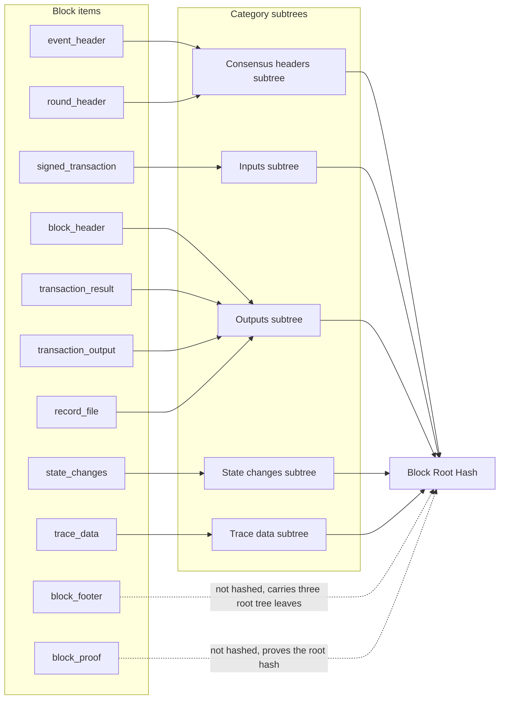
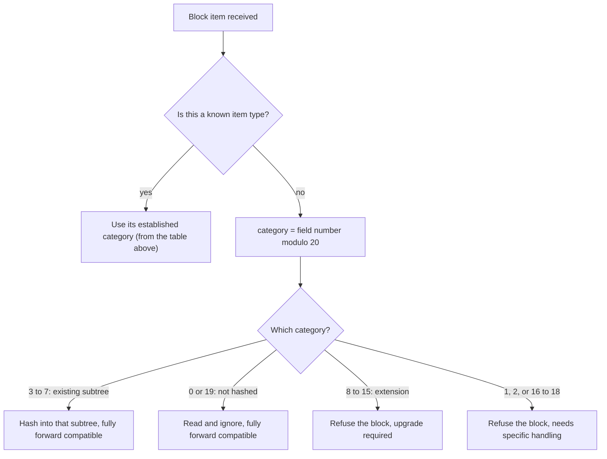
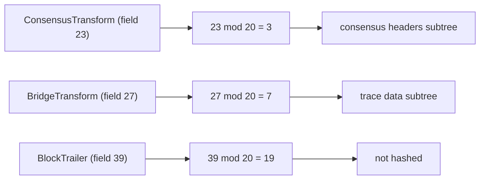

# Block Stream Forward Compatibility Design

## Table of Contents

1. [Purpose](#purpose)
2. [Goals](#goals)
3. [Terms](#terms)
4. [Entities](#entities)
5. [Design](#design)
6. [Diagram](#diagram)
7. [Configuration](#configuration)
8. [Metrics](#metrics)
9. [Exceptions](#exceptions)
10. [Acceptance Tests](#acceptance-tests)

## Purpose

A block arrives as a stream of block items. To verify a block, the Block Node
groups these items into a small number of **categories**, hashes each category
into its own **subtree**, and combines the subtree roots into the block's
**root hash**. The category an item belongs to is decided from the item's type.

Today that decision is only made for the item types that exist now. If the block
stream later gains a new item type, which is an *ordinary additive change* to the
block stream format, an older Block Node has no rule for it and rejects the
block, even though the block is *perfectly valid*. That leaves the Block Node
*backward looking*, because it has to be upgraded in lockstep with every format
addition.

This document describes how to make block hashing **forward compatible**. Known
item types keep their current category. New item types are assigned to a category
by a fixed, published **numbering rule** based on the item's field number, so a
Block Node can correctly hash a block that contains item types which did not
exist when the node was built. This works for every category that already has a
place in the block's hash tree, and it needs no code change.

This document is a companion to the
[Block Verification](./block-verification.md) design, since forward compatibility
is a property of the hashing step described there.

> **Note on the source of truth.** The numbering rule is defined by the block
> stream format itself, not by the Block Node. Earlier drafts of the rule have
> already changed before implementation, so the numbering **must be confirmed
> against the current block stream format definition before implementing**. If
> the format changes the rule, **the format wins**, and this design has to be
> brought back in line with it.

## Goals

1. Every item type defined today **must** continue to be placed in exactly the
   same category, so existing blocks hash identically and nothing regresses.
2. An item type that was unknown when the Block Node was built **must** still be
   placed in the correct category using only the numbering rule, as long as that
   category already exists in the block's hash tree.
3. Future item types that are explicitly defined as **not part of the block hash**
   must be safely ignored.
4. The rule **must** be deterministic and identical on every Block Node, so two
   nodes always compute the same hash for the same block.
5. Where forward compatibility cannot be achieved without an upgrade, the Block
   Node **must** fail clearly and refuse the block. It must *never guess*, and it
   must *never* produce a hash that could disagree with an upgraded node.

## Terms

<dl>
<dt><code>Block Item</code></dt><dd>A single, self-contained element of the block
stream, such as a header, an event, a transaction, its result, state changes, or
trace data.</dd>
<dt><code>Category</code></dt><dd>The logical bucket an item is placed in for
hashing: <code>consensus headers</code>, <code>inputs</code>,
<code>outputs</code>, <code>state changes</code>, or <code>trace data</code>.
Each category is hashed independently into its own subtree.</dd>
<dt><code>Subtree</code></dt><dd>The independent hash tree built from all items in
one category. Its root becomes a leaf of the block's root hash tree.</dd>
<dt><code>Block Root Hash</code></dt><dd>The single hash that identifies a block.
It is formed by combining the category subtree roots with a few block level
values.</dd>
<dt><code>Field Number</code></dt><dd>The number assigned to each item type in the
block stream format. It is stable across releases and is the value the numbering
rule is applied to.</dd>
<dt><code>Numbering Rule</code></dt><dd>The published convention that assigns any
newly added item type to a category based on its field number, so the category is
known without any node side knowledge of the new type.</dd>
<dt><code>Forward Compatibility</code></dt><dd>The ability of an existing Block
Node to correctly process a block that contains item types introduced after that
node was built.</dd>
<dt><code>Extension Category</code></dt><dd>A category reserved for a future
subtree that does not yet exist in the block's hash tree.</dd>
<dt><code>Not Hashed</code></dt><dd>An item that is intentionally left out of the
block hash, for example the block footer and the block proof. It is read but
contributes nothing to any subtree.</dd>
</dl>

## Entities

### The Block Stream Format

This is the authoritative definition of block items and the numbering rule. It
lists the item types that exist today, reserves positions for future additions,
and states how any future addition maps to a category. The Block Node treats this
as a **contract** and follows the rule rather than inventing its own.

### The Hashing Step

This is the stage of verification that reads the items of a block, places each
one into its category, and produces the block root hash. It is the only place
that needs to know the category of an item, so it is also the only place that
applies the forward compatibility rule.

### The Five Categories and the Block Root Hash

Five categories are hashed today: `consensus headers`, `inputs`, `outputs`,
`state changes`, and `trace data`. Their subtree roots, together with a few block
level values (the previous block's hash, the running root of all prior blocks,
the start of block state root, and the block timestamp), are combined into the
block root hash. The shape of this combination is **fixed**. There are exactly
five category leaves, so a category that does not yet have a leaf cannot be folded
into the hash without changing the tree.

## Design

### The Structure of the Block Stream

Each item in the block stream **SHALL** be self-contained and independent, with
the following constraints applicable to the *unfiltered* stream:

- A block **SHALL** start with a `header`.
- A block **SHALL** end with a `state_proof`.
- A `block_header` **SHALL** be followed by an `event_header`.
- An `event_header` **SHALL** be followed by one or more `event_transaction`
  items.
- An `event_transaction` **SHOULD** be followed by a `transaction_result`.
- A `transaction_result` **MAY** be followed by one or more
  `transaction_output`s.
- A `transaction_result` (or a `transaction_output`, if present) **MAY** be
  followed by one or more `state_changes`.

This forms the following required sequence for each block, which is then repeated
within the block stream, indefinitely. Note that there is no container structure
in the stream; the indentation below is only to highlight repeated subsequences.
The order of items within each block below is **REQUIRED** and **SHALL NOT**
change.

```text
header
  repeated {
    start_event
    repeated {
      event_transaction
      transaction_result
      (optional) transaction_output
      (optional) repeated state_changes
      (optional) filtered_single_item
    }
    block_footer
    repeated block_proof
  }
```

A filtered stream may exclude some items above, depending on filter criteria. A
filtered item is replaced with a merkle path and hash value to maintain block
stream verifiability.

A block item **SHALL** be individually and directly processed to create the item
hash. Items to be hashed **MUST NOT** be contained within another item, and items
which might be filtered out of the stream **MUST NOT** be contained in other
items.

### Today's Item Types

Every item type that exists now has a settled assignment to a subtree category.
These assignments are fixed and are **not** derived from the numbering rule:

|        Category         |                                                Item types                                                 |
|-------------------------|-----------------------------------------------------------------------------------------------------------|
| `consensus headers`     | `event_header`, `round_header`                                                                            |
| `inputs`                | `signed_transaction`                                                                                      |
| `outputs`               | `block_header`, `transaction_result`, `transaction_output`, `record_file`                                 |
| `state changes`         | `state_changes`                                                                                           |
| `trace data`            | `trace_data`                                                                                              |
| any subtree             | `filtered_single_item`, `redacted_item` (each contains its own path in the tree and must be fully parsed) |
| no subtree (not hashed) | `block_footer`, `block_proof`                                                                             |

Two of the not-hashed items deserve a note:

- `block_footer` is a container for the first three leaves of the block root tree
  (previous block root hash, all block hashes tree root, and state root hash); it
  is not itself a leaf in the tree.
- `block_proof` contains the cryptographic proof of the block hash; it is not
  part of the block root hash computation.

Some items need a little extra handling *beyond* being placed in a category.
Reading the format version from the block header is one example, and letting a
filtered or redacted item state its own target subtree is another. That handling
stays as it is.

**None of this changes.** The point of the design is only what happens for item
types that do not exist yet.

### The Numbering Rule for Future Item Types

To maximize forward compatibility, and to minimize the need to coordinate
deployments of different systems creating and processing block streams in the
future, the block stream format requires the following rule for field numbering.
Fields numbered **20 and above** MUST be numbered so that:

```text
category = N modulo 20        (N is the actual field number)
```

The resulting category number means:

| Category (N mod 20) |                       Meaning                        | Forward compatible? |
|---------------------|------------------------------------------------------|---------------------|
| 0                   | Not hashed (not part of the block proof merkle tree) | Yes                 |
| 1                   | Requires specific handling                           | No                  |
| 2                   | Requires specific handling                           | No                  |
| 3                   | `consensus headers`                                  | Yes                 |
| 4                   | `inputs`                                             | Yes                 |
| 5                   | `outputs`                                            | Yes                 |
| 6                   | `state changes`                                      | Yes                 |
| 7                   | `trace data`                                         | Yes                 |
| 8                   | Extension 0                                          | Not yet             |
| 9                   | Extension 1                                          | Not yet             |
| 10                  | Extension 2                                          | Not yet             |
| 11                  | Extension 3                                          | Not yet             |
| 12                  | Extension 4                                          | Not yet             |
| 13                  | Extension 5                                          | Not yet             |
| 14                  | Extension 6                                          | Not yet             |
| 15                  | Extension 7                                          | Not yet             |
| 16 to 18            | Reserved for future use                              | No                  |
| 19                  | Not hashed (not part of the block proof merkle tree) | Yes                 |

Reading the table by kind:

- **Categories 0 and 19** are not hashed. A future item here is read and ignored,
  and it contributes nothing to the block hash. Also *fully forward compatible*.
- **Categories 1 and 2** are for items that need specific handling that the rule
  alone cannot express. These are *not forward compatible* and require an update.
- **Categories 3 to 7** are the five subtrees that already exist. A future item
  here is hashed into that subtree exactly like any other item, with no code
  change. This is *full forward compatibility*.
- **Categories 8 to 15** are `extension categories`, reserved for subtrees that do
  not exist yet. The category is known, but there is nowhere to fold the item into
  the block root hash. See
  [Where forward compatibility ends](#where-forward-compatibility-ends).
- **Categories 16 to 18** are reserved and carry no meaning yet.

### Worked Examples

A future update adds three new item types: a `BlockTrailer` which is not part of
the merkle tree, a `ConsensusTransform` which belongs in consensus headers, and a
`BridgeTransform` which belongs in trace data. All three fields are at least 20,
so they are additions and the rule applies:

- `BlockTrailer` is field `39`. `39 modulo 20 = 19`, so it is **not hashed** and
  is safely ignored.
- `ConsensusTransform` is field `23`. `23 modulo 20 = 3`, so it is a
  **`consensus headers`** item and is hashed into that subtree.
- `BridgeTransform` is field `27`. `27 modulo 20 = 7`, so it is a
  **`trace data`** item and is hashed into that subtree.

A Block Node built before any of these existed hashes the first block that
contains them correctly, with no code change, because each one lands in a category
that already has a place in the hash tree (or is explicitly not hashed).

### Where Forward Compatibility Ends

Forward compatibility is complete for categories 3 to 7 (the existing subtrees)
and for categories 0 and 19 (not hashed). It **cannot** be complete for
`extension categories` (8 to 15). The block root hash is built from a fixed set of
category leaves, so a subtree that has not been added yet has no leaf, and an item
in an extension category cannot be added to the hash without an upgrade that adds
the subtree and extends the tree. The same is true for the "requires specific
handling" categories (1 and 2) and the reserved categories (16 to 18).

When a Block Node meets an item in one of these categories, it has to **refuse the
block** rather than drop the item or place it somewhere plausible. Either shortcut
would let two nodes compute *different hashes for the same block*, which is the
exact problem verification exists to prevent. Refusing the block is safe, and it
also makes the situation obvious, because it shows that the block stream has moved
ahead of this node and an upgrade is needed.

## Diagram

How today's item types feed the subtrees, and how the subtrees form the block
root hash:



How a single block item is placed:



The worked examples, applied through the rule:



The five category leaves are **fixed**. A future extension category has no leaf
in the block root hash, which is why such items require an upgrade before they can
be hashed.

## Configuration

No configuration is introduced, and the rule is intentionally **not
configurable**. The numbering rule comes from the block stream format, and making
it adjustable per node would let two nodes disagree on a block's hash. The
existing verification configuration is unchanged.

## Metrics

No new metrics are required, but a few would make forward compatibility events
visible to operators and give early warning of a needed upgrade:

- a count of future item types placed into an existing category by the rule,
- a count of future items safely ignored as `not hashed`,
- a count of blocks refused because an item fell into an `extension category`, a
  "requires specific handling" category, or a reserved category that this node
  cannot yet hash.

## Exceptions

Hashing does not surface internal errors to callers. It reports a **verification
failure** for the block instead.

- A future item that maps to an existing category (3 to 7) or to `not hashed`
  (0 or 19) is handled normally and is not a failure.
- A future item that maps to an `extension category` (8 to 15), a "requires
  specific handling" category (1 or 2), or a reserved category (16 to 18) causes
  the block to be refused, with a clear failure showing that an upgrade is
  required. It is never silently dropped or placed elsewhere.
- A malformed or unexpected item that does not fit the rule at all is treated as a
  **parse failure**, as it is today.

## Acceptance Tests

1. **No regression.** Every item type that exists today is placed in the same
   category and produces the same block root hash as before this change.
2. **New item, existing category.** A block containing a simulated future item
   whose `field number modulo 20` is 3 to 7 hashes to the same value a node would
   produce if it had always known that item type.
3. **New item, not hashed.** A block containing a simulated future item whose
   `field number modulo 20` is 0 or 19 verifies successfully, with the item left
   out of every category.
4. **Extension category refused.** A block containing a simulated future item
   whose `field number modulo 20` is 8 to 15 (or 1, 2, or 16 to 18) is refused
   with the designated failure. It is never accepted and never silently dropped.
5. **Two nodes agree.** For each case above, independent runs compute identical
   block root hashes for identical input.
6. **Stays in step with the format.** A test ties the rule used for hashing to the
   rule published in the block stream format, so any future change to the format's
   numbering breaks the build rather than drifting apart unnoticed.
