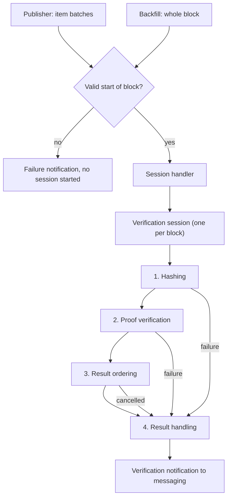
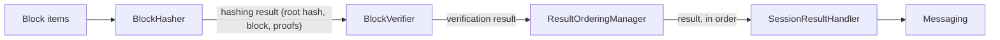
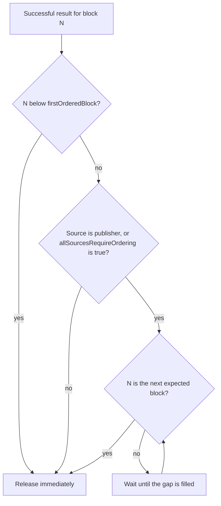
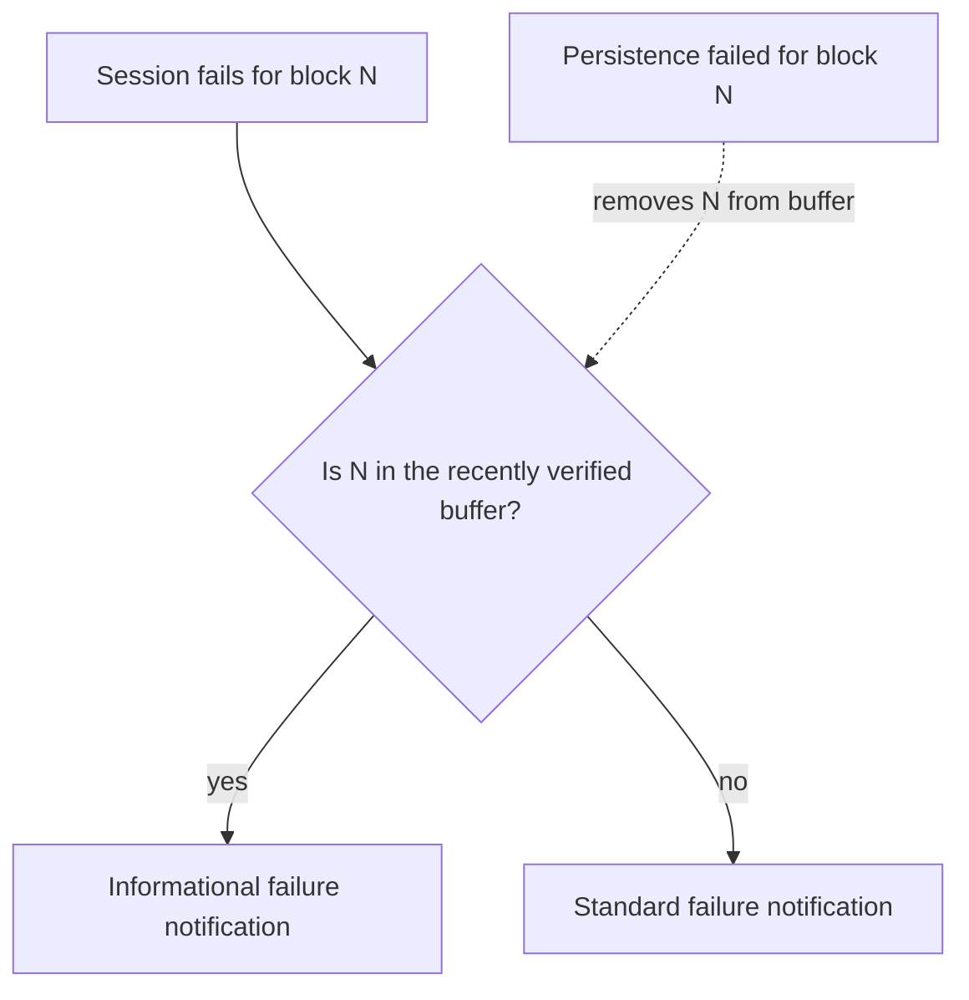
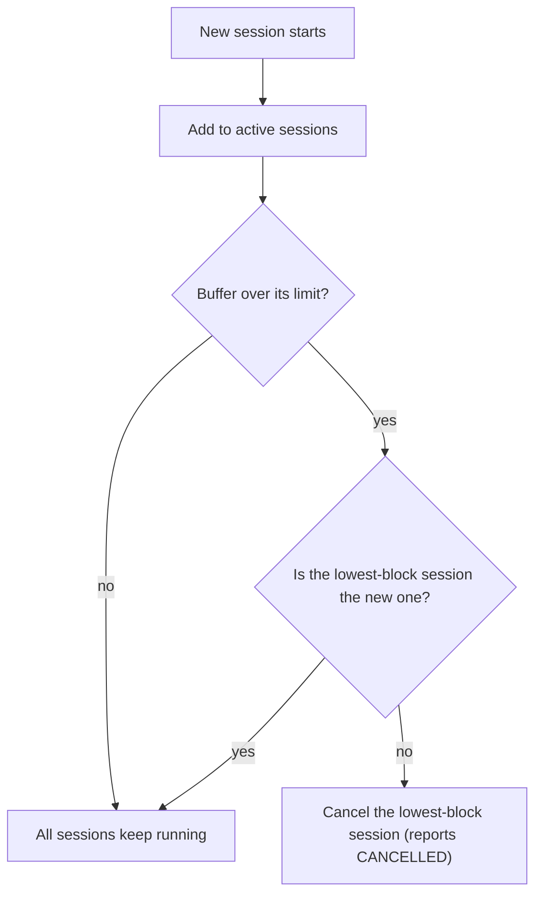

# Block Verification Design

## Table of Contents

1. [Purpose](#purpose)
2. [Goals](#goals)
3. [Terms](#terms)
4. [Entities](#entities)
5. [Design](#design)
6. [Diagram](#diagram)
7. [Configuration](#configuration)
8. [Metrics](#metrics)
9. [Exceptions](#exceptions)
10. [Acceptance Tests](#acceptance-tests)

## Purpose

The Block Node receives blocks from different types of sources. Once received,
blocks must pass **verification** before they can be safely propagated
downstream. Verification is the process through which we confirm that a block,
received from any source, is valid and not tampered with. It is the central
point of the Block Node, and it is implemented by the **Verification Service
Plugin**.

- Upon *successful* verification, the plugin propagates the block downstream via
  the internal messaging system.
- Upon *failed* verification, be that a bad proof, a parse failure, missing
  mandatory items or fields, or any other reason, the plugin conveys the failure
  throughout the Block Node via the internal messaging system.
- In both cases, any plugin can take an appropriate action.

Due to the asynchronous nature of the Block Node and the way blocks are received
from different sources, strict ordering of block *reception* cannot be
guaranteed. It is therefore a requirement of the plugin to ensure a **strong
ordering** of successful verification messages, so that downstream plugins see a
contiguous, in order stream of verified blocks they can process safely.

> **Companion document.** The hashing stage of verification, including how block
> items are placed into subtree categories and how the design stays forward
> compatible with future item types, is described in
> [Block Stream Forward Compatibility](./block-stream-forward-compatibility.md).

## Goals

1. The Block Node **must** be able to receive blocks as raw data from any given
   source.
2. The Block Node **must** be able to start a verification session for every
   received block, and every session must always produce a result.
3. The Block Node **must** accurately convey verification results downstream via
   the internal messaging system.
   - Successful verifications **must** be propagated strictly in order, subject
     to the ordering configuration described below.
   - Failures **must** be propagated immediately, without ordering.
4. The plugin **must** bound its resource usage: the number of simultaneously
   active sessions is limited, and older sessions make room for newer ones.
5. A failure for a block that was *recently verified successfully* **must** be
   distinguishable from a first-time failure, so downstream plugins can treat it
   as informational.

## Terms

<dl>
<dt><code>Publisher</code></dt><dd>A type of data source that publishes
(streams) blocks as raw data to the Block Node, one batch of items at a
time.</dd>
<dt><code>Backfill</code></dt><dd>A type of data source that supplies whole,
complete blocks, typically to fill historical gaps.</dd>
<dt><code>Block Items</code></dt><dd>The data pieces (header, events,
transactions, results, state changes, proofs) that make up a block.</dd>
<dt><code>Block Root Hash</code></dt><dd>The single hash that identifies a
block, computed from the block's items during the hashing stage.</dd>
<dt><code>Verification Session</code></dt><dd>An asynchronous unit of work that
verifies a single block from start to finish and always produces a result.</dd>
<dt><code>Session Stage</code></dt><dd>One of the distinct, chained steps a
session passes through: hashing, proof verification, result ordering, and
result handling.</dd>
<dt><code>Session Handler</code></dt><dd>The component that creates, manages,
and cancels sessions, routes incoming data to the correct session, and enforces
the active sessions limit.</dd>
<dt><code>Verification Notification</code></dt><dd>A message sent to the
internal messaging system that conveys the result of a verification session,
including failure details when verification did not succeed.</dd>
<dt><code>Informational Failure</code></dt><dd>A failure reported for a block
that was recently verified successfully. It signals that the failure is not a
new integrity problem for the chain, since a verified copy of the block already
passed through.</dd>
<dt><code>Last Verified Block</code></dt><dd>The highest block number whose
successful verification has been propagated. Ordering of successes is enforced
against this value.</dd>
</dl>

## Entities

### VerificationServicePlugin

The main plugin class. It listens for live block items from the publisher,
backfilled block notifications, persistence notifications, and application
state updates. On startup it establishes the initial *last verified block* from
the highest persisted block known to application state. For each incoming block
it validates the start of the block (a header must be present and its number
must match), then hands the items to the session handler. It owns the shared
state the sessions work against: the last verified block and the recently
verified blocks buffer.

### BlockSessionHandler

Creates, manages, and cancels verification sessions. It routes publisher item
batches to the active publisher session and starts a new session for each
backfilled block. It enforces the **active sessions buffer**: a configurable
maximum number of simultaneously running sessions.

### CompletableVerificationSession

The session implementation. One session verifies one block. The session is a
chain of four distinct stages, each handing its output to the next. Sessions
run asynchronously on a dedicated executor, can be cancelled at any point, and
always end in the result handling stage.

#### The Four Stages

| Stage |        Component        |          Input           |                            Output                             |
|-------|-------------------------|--------------------------|---------------------------------------------------------------|
| 1     | `BlockHasher`           | block items, in batches  | a hashing result (block root hash plus block data and proofs) |
| 2     | `BlockVerifier`         | the hashing result       | a verification result (verified block and its root hash)      |
| 3     | `ResultOrderingManager` | the verification result  | the same result, released in order                            |
| 4     | `SessionResultHandler`  | the result, or a failure | a verification notification to messaging                      |

### VerificationDataProvider

Supplies the cryptographic material the verifiers need: TSS data received
through application state updates, and RSA public keys resolved from the
address book for the block being verified.

### BadBlockDumper

An optional diagnostics helper. When enabled, it writes the raw bytes and a
metadata sidecar of a failing block to disk, at most once per block and failure
type, and purges old dumps daily.

## Design

### Receiving Blocks

The plugin is *source agnostic*: every block is verified by the same rules, and
the source is only carried along in the result notification. There are two
sources today:

- **Publisher**: blocks arrive as a stream of item batches. The publisher
  guarantees that once a block starts, its items arrive in order. It cannot
  guarantee that a block will finish. If a new block starts before the previous
  one ended, the previous session is cancelled, since the stream has clearly
  moved on.
- **Backfill**: blocks arrive whole, one complete block per notification. Each
  is wrapped as a single batch that is both the start and the end of the block,
  and a session is started for it.

Before any session is started, the plugin validates the start of the block: the
first item must be a block header and the header's number must match the block
number announced with the items. If this validation fails, a failure
notification is sent immediately and no session is created.

### The Session Stages

Every session passes through four distinct stages, chained so that each stage
begins only when the previous one has produced its output. A failure at any
stage skips the remaining work and goes straight to result handling.

1. **Hashing.** The `BlockHasher` consumes the block's item batches as they
   arrive and incrementally hashes them into the block's subtrees, producing the
   block root hash together with the collected block data and proofs. How items
   map to subtrees, and how this stage remains forward compatible with future
   item types, is described in
   [Block Stream Forward Compatibility](./block-stream-forward-compatibility.md).
2. **Proof verification.** The `BlockVerifier` checks every proof present in the
   block against the computed root hash. Each recognized proof type (TSS, RSA
   record file, state proof) has its own verifier. *All* proofs present must
   pass; a single failed proof fails the block. A block with no usable proof
   fails as missing a mandatory item.
3. **Result ordering.** The `ResultOrderingManager` holds a *successful* result
   until it is its turn to be released, following the last verified block. This
   is what turns out-of-order verification into an in-order stream of successes.
   Failures never pass through this stage; they are reported immediately.
4. **Result handling.** The `SessionResultHandler` turns the outcome into a
   verification notification and sends it to messaging. On success it also
   advances the last verified block and records the block in the recently
   verified buffer. On failure it decides whether the failure is informational,
   optionally dumps the bad block for diagnostics, and updates metrics.

### The Active Sessions Buffer

The session handler keeps all running sessions in a bounded buffer, sized by
`activeSessionsBufferSize`. Every new session is added to the buffer. If the
buffer would exceed its size, room is made by **cancelling the session that is
verifying the lowest block number**, unless that session is the one that was
just started. A cancelled session reports a `CANCELLED` failure through the
normal result handling path. This bounds resource usage while preferring to
keep the most recent work: the oldest, likely stalled or superseded session is
the one to go.

### The Recently Verified Blocks Buffer and Informational Failures

The plugin keeps a bounded queue of the block numbers that were most recently
verified successfully, sized by `recentlyVerifiedBlocksBufferSize`. When the
queue is full, the oldest entry is dropped.

When a session fails for some block, the result handler checks this buffer. If
the block is present, the failure is reported as **informational** rather than
standard: a verified copy of that block has already passed through, so the new
failure does not put the chain's integrity in question. Downstream plugins can
react accordingly based on informational status of a failure.

There is one important interaction with persistence. If a recently verified
block later *fails to persist*, the plugin removes it from the buffer. The
block will inevitably be received and verified again, and a failure on that
retry must be treated as a standard failure, not an informational one.

### Ordering of Successful Results

Successful results are released strictly in order of block number, one after
the last verified block. A session whose block is more than one ahead of the
last verified block waits until the gap is filled. Two settings shape this
behavior:

- **`firstOrderedBlock`** sets the first block number that requires strict
  ordering. Blocks *below* this number never wait: their successes are reported
  immediately. This establishes the starting point of the ordered stream, which
  matters when a node begins its history mid-chain. The default of `0` means
  every block is ordered. At startup, if no last verified block is known yet,
  the first successful verification establishes it.
- **`allSourcesRequireOrdering`** controls which sources are subject to
  ordering. Blocks from the publisher are *always* strictly ordered. When this
  setting is `true` (the default), blocks from every other source are ordered
  too. When `false`, other sources (such as backfill) report success
  immediately, which can create gaps in the last verified sequence. This is an
  understood and accepted trade off for nodes that prioritize backfill
  throughput.

> **Note.** `allSourcesRequireOrdering` should remain `true` on all *Tier 1*
> Block Nodes.

Failures are never ordered. A failure is reported the moment it happens, from
whichever stage produced it.

### Failure Types

Every failed session reports a failure type in its notification. The
**informational flag is orthogonal to the type**: any failure type is reported
as informational when the block is in the recently verified buffer, and as
standard otherwise.

|        Failure type         |                                             Meaning                                             | Can be informational |
|-----------------------------|-------------------------------------------------------------------------------------------------|----------------------|
| `BAD_BLOCK_PROOF`           | A proof did not verify against the computed root hash                                           | yes                  |
| `UNABLE_TO_PARSE`           | The block or one of its items could not be parsed                                               | yes                  |
| `MISSING_MANDATORY_ITEM`    | A mandatory item (header, footer, at least one usable proof) is missing                         | yes                  |
| `MISSING_MANDATORY_FIELD`   | A mandatory item is present but a required field has no value                                   | yes                  |
| `MISSING_VERIFICATION_DATA` | Required verification data is unavailable (TSS data, RSA keys, or a required algorithm)         | yes                  |
| `UNRECOGNIZED_PROOF_TYPE`   | The proof(s) provided for the block are not of a recognized type                                | yes                  |
| `UNSUPPORTED_HAPI_VERSION`  | The block declares a HAPI version the node does not support                                     | yes                  |
| `CANCELLED`                 | The session was cancelled before completing (superseded, evicted from the buffer, or shut down) | yes                  |
| `UNKNOWN_ERROR`             | An unexpected error occurred during verification                                                | yes                  |

## Diagram

The overall workflow, from reception to notification:

The session stages and what flows between them:

How the ordering of successes works:

How a failure becomes standard or informational:

How the active sessions buffer makes room:

## Configuration

Configuration prefix: `verification`

|              Property              |                  Default                   |                                                                              Description                                                                               |
|------------------------------------|--------------------------------------------|------------------------------------------------------------------------------------------------------------------------------------------------------------------------|
| `recentlyVerifiedBlocksBufferSize` | `100`                                      | Maximum number of recently verified block numbers kept for the informational failure check. When full, the oldest entry is dropped.                                    |
| `activeSessionsBufferSize`         | `100`                                      | Maximum number of simultaneously active sessions. When exceeded, the session verifying the lowest block is cancelled to make room, unless it is the newly started one. |
| `firstOrderedBlock`                | `0`                                        | The first block number that requires strict ordering. Blocks below this value report success immediately, without waiting for order.                                   |
| `allSourcesRequireOrdering`        | `true`                                     | If `true`, successes from every source are strictly ordered. If `false`, only publisher blocks are ordered. Should remain `true` on Tier 1 Block Nodes.                |
| `dumpEnabled`                      | `false`                                    | Whether to write failing block bytes and metadata to disk for diagnostics.                                                                                             |
| `dumpDirectoryPath`                | `/opt/hiero/block-node/verification/dumps` | Directory where bad block dump files are written.                                                                                                                      |
| `dumpRetentionDays`                | `7`                                        | How many days dump files are retained before the daily purge removes them.                                                                                             |

## Metrics

All metrics are in the `blocknode` category. Metrics are grouped per **metric
holder**, the component that owns and records them, so the four groups below
mirror the session pipeline: the session handler, the hashing stage, the proof
verification stage, and the result handling stage.

|                                     Metric                                      |     Type     |                     Labels                     |                           Description                            |
|---------------------------------------------------------------------------------|--------------|------------------------------------------------|------------------------------------------------------------------|
| _** [Session Handler Metrics](#session-handler-metrics) &nbsp;**_       |              |                                                |                                                                  |
| [`verification_blocks_received`](#verification_blocks_received)                 | Counter      | none                                           | Blocks received for verification, one per session started        |
| _** [Hashing Metrics](#hashing-metrics) &nbsp;**_                       |              |                                                |                                                                  |
| [`hashing_block_time`](#hashing_block_time)                                     | Counter (ns) | none                                           | Cumulative time spent hashing blocks                             |
| _** [Proof Verification Metrics](#proof-verification-metrics) &nbsp;**_ |              |                                                |                                                                  |
| [`verification_proof_total`](#verification_proof_total)                         | Counter      | `proof_type="tss"`, `result="success"`         | TSS proofs that verified against the block root hash             |
| [`verification_proof_total`](#verification_proof_total)                         | Counter      | `proof_type="tss"`, `result="failure"`         | TSS proofs that failed to verify                                 |
| [`verification_proof_total`](#verification_proof_total)                         | Counter      | `proof_type="rsa"`, `result="success"`         | Record file (WRB RSA) proofs that verified                       |
| [`verification_proof_total`](#verification_proof_total)                         | Counter      | `proof_type="rsa"`, `result="failure"`         | Record file (WRB RSA) proofs that failed to verify               |
| [`verification_proof_total`](#verification_proof_total)                         | Counter      | `proof_type="state_proof"`, `result="success"` | State proofs that verified                                       |
| [`verification_proof_total`](#verification_proof_total)                         | Counter      | `proof_type="state_proof"`, `result="failure"` | State proofs that failed to verify                               |
| [`rsa_roster_mismatch_total`](#rsa_roster_mismatch_total)                       | Counter      | none                                           | RSA signatures from node ids absent from the loaded address book |
| [`verification_block_time`](#verification_block_time)                           | Counter (ns) | none                                           | Cumulative time from session start through proof verification    |
| _** [Result Handling Metrics](#result-handling-metrics) &nbsp;**_       |              |                                                |                                                                  |
| [`verification_blocks_verified`](#verification_blocks_verified)                 | Counter      | none                                           | Blocks that passed verification                                  |
| [`verification_blocks_failed`](#verification_blocks_failed)                     | Counter      | none                                           | Blocks that failed verification                                  |
| [`verification_blocks_error`](#verification_blocks_error)                       | Counter      | none                                           | Internal errors during verification                              |

### Session Handler Metrics

Owned by the session handler, which creates and manages sessions.

#### `verification_blocks_received`

Increments each time the session handler starts a new session, one per block,
regardless of source. Every block the plugin attempts to verify is counted
here, whether it later succeeds, fails, or is cancelled. Comparing this
counter with the verified and failed counters shows how many blocks are still
in flight.

### Hashing Metrics

Owned by the hashing stage, the first stage of every session.

#### `hashing_block_time`

Accumulates, in nanoseconds, the time the hashing stage spent on a block,
measured from the moment the hasher starts consuming items to the moment the
block root hash is produced. It only grows for blocks that complete hashing; a
block that fails mid-hash contributes nothing. Dividing its growth by the
received counter approximates the average hashing time per block.

### Proof Verification Metrics

Owned by the proof verification stage, the second stage of every session.

#### `verification_proof_total`

A single counter with the `proof_type` and `result` dynamic labels, resolved
into six pre-created series, one per proof type and result combination (the
six rows in the table above). It increments once **per proof checked**, not
per block: a block carrying several proofs contributes several increments. The
`proof_type` label identifies which verifier ran (`tss` for TSS proofs, `rsa`
for record file proofs, `state_proof` for state proofs) and the `result` label
records whether that single proof passed or failed. A rise in any `failure`
series is the earliest, most specific signal of which proof path is rejecting
blocks.

#### `rsa_roster_mismatch_total`

Increments once per RSA signature whose node id is not present in the loaded
address book. Such signatures are *skipped*, not failed, so this counter
rising while the RSA failure series stays flat indicates an address book that
does not fully cover the blocks being verified, rather than tampered blocks.

#### `verification_block_time`

Accumulates, in nanoseconds, the time from session start through the end of
proof verification, so it includes hashing. It records nothing for failed
blocks and excludes any time spent waiting in the ordering stage. The
difference between its growth and that of `hashing_block_time` approximates
the time spent purely on proof cryptography.

### Result Handling Metrics

Owned by the result handling stage, the final stage of every session.

#### `verification_blocks_verified`

Increments when a success notification is sent, after ordering. This is the
count of blocks the rest of the Block Node may safely consume.

#### `verification_blocks_failed`

Increments when a failure notification is sent, for every failure type,
informational or not, including cancellations. A failed block never also
counts as verified.

#### `verification_blocks_error`

Increments *in addition to* the failed counter when the failure was an
unexpected internal error, or when result handling itself encountered an
error. It is the signal that something went wrong in the plugin rather than in
the block: a healthy node can see failures, but this counter should stay at
zero.

## Exceptions

The plugin never lets an error escape to its callers. Every error condition
ends in a verification notification, and the plugin keeps running.

- **Invalid start of block.** The first item of a new block is not a header, or
  the header's number does not match. A failure notification is sent and no
  session is started.
- **Stage failure.** A stage that cannot continue (parse failure, missing item
  or field, bad proof, missing verification data) raises a session failure
  carrying the block number, source, and failure type. The result handling
  stage turns it into a failure notification.
- **Cancellation.** A session cancelled for any reason (superseded by a new
  publisher block, evicted from the active sessions buffer, or plugin shutdown)
  reports a `CANCELLED` failure.
- **Unexpected errors.** Any unexpected error, in a stage or in the plugin's
  own handling, is reported as `UNKNOWN_ERROR` and counted in the error metric.
  The plugin logs the details and continues.
- **Notification send failure.** If sending a notification itself fails, the
  failure is logged and the plugin carries on. It must never throw.
- **Diagnostics.** When enabled, failing blocks are dumped to disk with a
  metadata sidecar, at most once per block and failure type, so a retried bad
  block cannot flood the disk. Dump failures are logged and never affect
  verification.

## Acceptance Tests

1. **Every block gets a result.** For any received block, from any source, a
   verification notification is eventually sent: success or failure, never
   silence.
2. **Stage handoff.** A block that fails hashing never reaches proof
   verification; a block that fails proof verification never reaches ordering;
   in both cases the failure notification carries the correct failure type.
3. **Ordered successes.** With ordering enabled, successful notifications are
   emitted strictly in order of block number, even when sessions complete out
   of order.
4. **First ordered block.** Blocks below `firstOrderedBlock` report success
   immediately, and blocks at or above it wait their turn.
5. **Source ordering setting.** With `allSourcesRequireOrdering` set to
   `false`, a backfilled block ahead of the last verified block reports
   success immediately; with `true`, it waits.
6. **Active sessions buffer.** When more sessions are started than the buffer
   allows, the session verifying the lowest block is cancelled and reports
   `CANCELLED`; the newest session is never the one evicted.
7. **Informational failures.** A failure for a block present in the recently
   verified buffer is reported as informational; the same failure for a block
   not in the buffer is standard.
8. **Persistence interaction.** After a failed persistence notification for a
   recently verified block, a subsequent verification failure for that block is
   reported as standard, not informational.
9. **Publisher supersession.** When a new block starts before the previous one
   ended, the previous session is cancelled and reports `CANCELLED`, and the
   new block verifies normally.
10. **Failure types.** Each failure type in the table above is produced by the
    condition it describes, and the informational flag is controlled solely by
    the recently verified buffer.
11. **Metrics.** Each metric in the table above changes exactly when its
    description says it should, including the labeled proof counter for each
    proof type and result.
