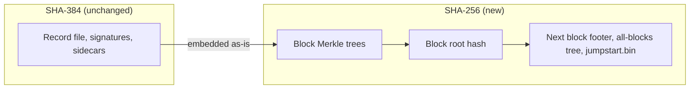
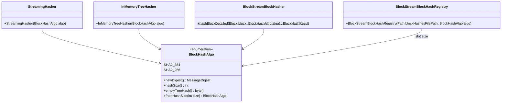
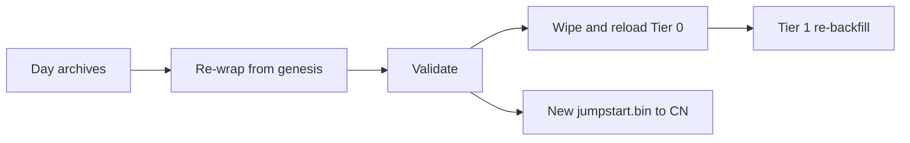

# Change CLI's block-hash algorithm from SHA-384 to SHA-256

## Table of Contents

1. [Purpose](#purpose)
2. [Goals](#goals)
3. [Terms](#terms)
4. [Entities](#entities)
5. [Design](#design)
6. [Diagram](#diagram)
7. [Configuration](#configuration)
8. [Metrics](#metrics)
9. [Exceptions](#exceptions)
10. [Acceptance Tests](#acceptance-tests)

## Purpose

The Hiero stack is dropping the home-grown WRAPS in favor of more conservative,
Nova reference implementation of TSS's RAPS/WRAPS + HINTS proof scheme. Part of this
pivot is a hash algorithm change for state and block hashing: SHA-384 goes to SHA-256.

So after the switch the system has to live with both algorithms at once: SHA-384 for the
legacy record-file content that a WRB embeds and whose RSA signatures prove it,
and SHA-256 for everything the block stream layer computes over that content.

As every block’s hash feeds the next block’s footer and the all-blocks tree, a change at genesis
invalidates every Wrapped Record Block (WRB) after it. Therefore, the full history of all
the networks must be re-wrapped from genesis, and every consumer of the old WRBs must be
reset onto the new chain.

## Goals

1. Wrap producers (`blocks wrap`, `days live-sequential`) **must** emit WRBs whose header, footer
   and chain use SHA-256
2. Non fresh chain producers (`blocks repair-zips`) **must** use the algorithm of the directory being
   repaired (SHA-384 or SHA-256)
3. Validation (`blocks validate` and its validations) **must** recompute with the algorithm that the
   block declares

## Terms

<dl>
  <dt>All-blocks tree</dt>
  <dd>Streaming Merkle tree over the root hashes of all previous blocks. Block N's footer carries its root before
  block N is added (<code>root_hash_of_all_block_hashes_tree</code>)</dd>

  <dt>Block root hash</dt>
  <dd>The single hash that identifies a block. Not stored in the block itself, but chained into the
  next block's footer, the all-blocks tree, the CLI state files and the jumpstart data</dd>

  <dt>Empty-tree hash</dt>
  <dd>Hash used for an empty subtree, the reserved leaves of the fixed root tree and the genesis previous hash</dd>

  <dt>Fixed root tree</dt>
  <dd>The 16-leaf Merkle tree that combines the footer hashes, the item subtrees and 8 reserved leaves into the block
  root hash</dd>

  <dt>Hash registry</dt>
  <dd><code>blockStreamBlockHashes.bin</code>: headerless array of fixed-width block root hashes, one slot per block,
  in the wrap output directory</dd>

  <dt>Jumpstart data</dt>
  <dd><code>jumpstart.bin</code>: last wrapped block number, block hash, consensus-timestamp hash, output-items root
  and open all-blocks tree state. Consumed by the CN to continue the chain from the last WRB</dd>

  <dt>Re-wrap</dt>
  <dd>Wrapping the full history of a network again from genesis, into a fresh output directory, with the new
  algorithm</dd>

  <dt>Resume guard</dt>
  <dd>Check on start of a wrap producer that refuses to continue an output directory whose blocks use another
  algorithm</dd>

  <dt>Tier 0</dt>
  <dd>Special-purpose Block Node that receives the WRBs from the CLI and serves them to other Block Nodes</dd>

  <dt>Tier 1</dt>
  <dd>Block Nodes that backfill historical WRBs from Tier 0</dd>

  <dt>Wrapped Record Blocks (WRBs)</dt>
  <dd>Block stream form of historical record files. Contain BlockHeader, RecordFileItem, BlockFooter
  and BlockProof</dd>

  <dt>Wrap output directory</dt>
  <dd>Directory given to <code>blocks wrap -o</code> or <code>days live-sequential --wrap-output-dir</code>.
  Holds the wrapped blocks and the state files that let a run resume</dd>
</dl>

## Entities

### `BlockHashAlgo` (enum)

- Lives in `blocks/model/hashing`, values `SHA2_384` and `SHA2_256`.
- Single source of the block-hashing algorithm: provides a new `MessageDigest`, the hash size (48 or 32 bytes)
  and the empty-tree hash `H(0x00)`.

### `OutputDirAlgorithmDetector` (helper)

- Returns the algorithm of an output directory from the hash width in its `streamingMerkleTree.bin`,
  falling back to the footer hash width of the newest wrapped block when the snapshot is missing or empty.
- Returns nothing for an empty directory.

## Design

### Two hash domains

- Record file domain stays SHA-384
  - Record file hashes, v2/v5/v6 running hashes, signed file hashes, sidecar hashes and
    the SHA384withRSA signature checks
  - This data was signed years ago and cannot be re-hashed without breaking the signatures
- Block domain becomes SHA-256
  - Everything the CLI computes for the block stream: item leaves, subtrees, the 16-leaf fixed root tree,
    the block root hash, the previous-block-hash chain, the all-blocks tree and the empty-tree
    hash
  - These are the values carried in `BlockFooter`, in the CLI state files and in `jumpstart.bin`

### The algorithm as a single value

- Block-hashing classes in `blocks/model/hashing` stop calling `utils/Sha384.java` and take the
  algorithm as a parameter.
- A new enum, `BlockHashAlgo`, with the values `SHA2_384` and `SHA2_256`, is the single source
  of the block algorithm
  - Each value provides a new `MessageDigest`, its hash size (48 or 32 bytes) and its
    empty-tree hash
  - The hash width is always derived from the enum, never kept as a separate constant

### Where each command gets the algorithm

- Producing a new chain (`blocks wrap`, `days live-sequential`)
  - The algorithm is chosen once per run, SHA-256 by default
  - It is used for every block of the run and everything derived from it.
- Repairing an existing chain (`blocks repair-zips`)
  - The algorithm is taken from the output directory being repaired, never from the default
  - `MissingBlockFiller` rebuilds the all-blocks tree from that directory's `streamingMerkleTree.bin` and
    hash registry and compares each recomputed block hash with the registry entry
- Consuming (`blocks validate` and its validations, `blocks push`, `blocks bulk-load`)
  - The algorithm is taken from each block's footer hash width
  - 32 bytes for SHA-256 and 48 bytes for SHA-384

### No mixed chains

- A run, its state files and its output directory hold exactly one algorithm
- A re-wrap always starts in a fresh output directory
- The state files that let a command continue a chain do not record the algorithm explicitly
  - `blockStreamBlockHashes.bin` is a headerless array of fixed-width slots, so its width cannot be read from the file
  - `streamingMerkleTree.bin` holds `long leafCount`, `int hashCount` and then the pending subtree hashes, so its
    hash width is `(size - 12) / hashCount` whenever `hashCount > 0`, which holds for any non-empty tree
- To guard against mixing chains without changing any file format, a small helper (`OutputDirAlgorithmDetector`)
  is introduced
  - It first derives the algorithm from the width in `streamingMerkleTree.bin`: a small file read, with no block
    decompression or parsing and no difference between zipped and unzipped output
  - It falls back to the footer hash width of the newest wrapped block when the snapshot is missing or empty,
    e.g. a run stopped before its first checkpoint
  - A width other than 32 or 48 bytes, or a size that does not divide evenly, is reported as a corrupt file
  - State files keep their current layout

### Jumpstart format

- `jumpstart.bin` holds the block hash, consensus-timestamp hash, output-items root and open all-blocks
  tree state
- They are all hardcoded to 48 bytes with no version marker
- It is written by `blocks wrap` and `days live-sequential` and read by various internal and external
  tools (Solo E2E, consensus node)
- It becomes a versioned layout that carries the algorithm or hash width, agreed with the CN team,
  and all writers and readers are updated together.

### Operational flow

Per network, previewnet and testnet first as a rehearsal and mainnet last:

1. Re-wrap from genesis with SHA-256 into a fresh output directory, reading the existing day archives.
2. Run a full `blocks validate` on the result.
3. Upgrade Tier 0 to the block node release that verifies SHA-256 WRBs, wipe its block stores, `block-ranges.json`
   and the CLI bulk-load resume state, then bulk-load the new WRBs.
4. Restart `days live-sequential` from the re-wrapped tip with a fresh state directory, and resume live push
   to Tier 0.
5. Tier 1 nodes wipe their stored WRBs and range state and re-backfill from Tier 0
6. Deliver the new `jumpstart.bin` to the CN release package once the mainnet re-wrap is validated.

## Diagram

Only the block layer changes algorithm; the record-file content and its RSA proof stay SHA-384:

The block-hashing classes take the algorithm from a new enum instead of calling `Sha384`, which stays for
record-file hashes only.

Re-wrap, per network:

## Configuration

One new command line option selects the block-hashing algorithm of a run that produces a new chain.

- Option name is `--hash-algorithm`
- The values are the `BlockHashAlgo` enum constants, parsed by picocli; any other value is rejected before the run
  starts.
- `SHA2_256` is default
- `SHA2_384` stays available to reproduce and compare older outputs and fixtures.
- On resume, the value must match the algorithm of the blocks already in the wrap output directory, otherwise the
  resume guard aborts the run.
- `blocks repair-zips`, `blocks validate`, `blocks push` and `blocks bulk-load` do not take the option.
  They use the algorithm of the output directory they repair or of the blocks they read

## Metrics

## Exceptions

## Acceptance Tests

1. **No behavior change for SHA-384.** Wrapping the `2019-09-13.tar.zstd` test day with SHA-384 before and
   after the change produces byte-identical block zips, `blockStreamBlockHashes.bin`, `streamingMerkleTree.bin`
   and `jumpstart.bin`, and the existing tests pass without edits.
2. **Hashing core under both algorithms.** `HashingUtils`, `StreamingHasher`, `InMemoryTreeHasher`,
   `BlockStreamBlockHasher` and `BlockStreamBlockHashRegistry`, including save and load,
   produce 32-byte hashes for SHA-256 and 48-byte hashes for SHA-384.
3. **Golden vectors.** SHA-256 block roots, footer hashes and the empty-tree hash for the CN reference
   record files (v2, v5, v6, genesis, a block after an address-book change) match the values from the
   CN implementation.
4. **SHA-256 by default.** `blocks wrap` and `days live-sequential` emit WRBs with 32-byte footer hashes
   by default, and 48-byte ones when SHA-384 is selected.
5. **Record-file domain unchanged.** Record file, running, signed file and sidecar hashes and RSA signature
   checks still use SHA-384, and `days validate` passes as before.
6. **Resume guard.** Resuming `blocks wrap` or `days live-sequential` with SHA-256 on a SHA-384 output
   directory, or the other way round, aborts with a clear message and writes no blocks.
7. **Repair keeps the directory's algorithm.** `blocks repair-zips` fills missing blocks in both a
   SHA-384 and a SHA-256 output directory, and every recomputed block hash matches its registry entry.
8. **Validation of both sets.** `blocks validate` passes on a SHA-256 set and on an old SHA-384 set
   with the same command.
9. **Mixed chain rejected.** `blocks validate` reports an error for a chain whose footer hash
   width changes part way.
10. **Jumpstart readers.** `JumpstartValidation`, `extractJumpstartData.py` and `validate_jumpstart_format.py`
    read the new `jumpstart.bin` layout written by `blocks wrap` and `days live-sequential`.
11. **Cross-check with the CN.** The Solo E2E `wrb-cli-wrap-and-compare.sh` flow shows SHA-256 WRB hashes
    equal to the CN-produced hashes.
