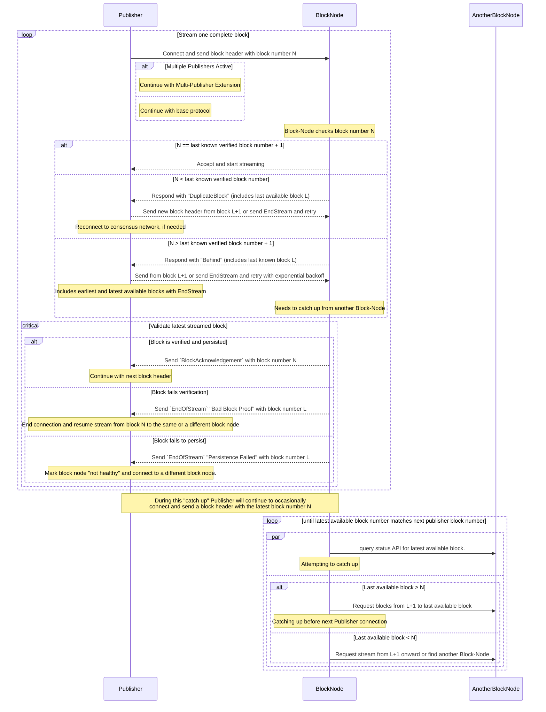
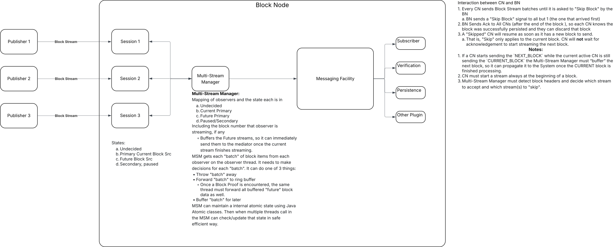
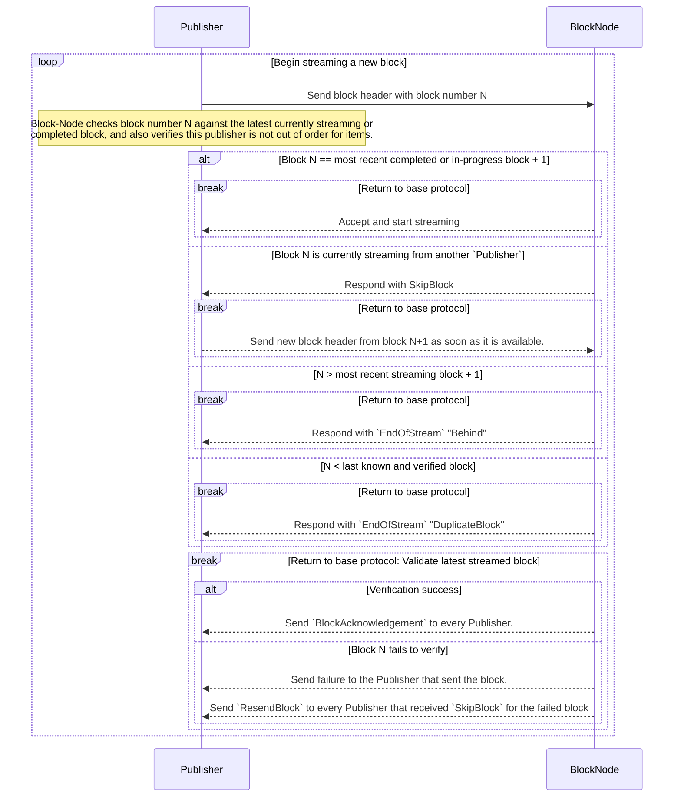
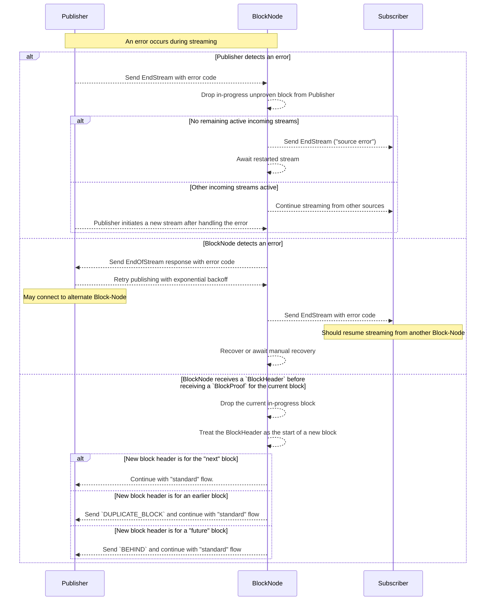

# Block-Node Connect Protocol for `publishBlockStream`

## Table of Contents

1. [Abstract](#abstract)
   1. [Reliability note](#reliability-note)
1. [Definitions](#definitions)
1. [Base Protocol](#base-protocol)
   1. [Base Protocol Diagram](#base-protocol-diagram)
1. [Multiple Publisher Extension](#multiple-publisher-extension)
   1. [Multiple Publisher Diagram](#multiple-publisher-extension-diagram)
   1. [Pipeline Example Diagram](#pipeline-example-diagram)
1. [Error Handling](#error-handling)
   1. [Error Handling Diagram](#error-handling-diagram)

## Abstract

This protocol describes how a Publisher and Block-Node SHALL interact for
the `publishBlockStream` API. The protocol provides for either side of the
stream to signal an orderly end of the stream, for the Block-Node to signal
that it has fallen behind the publisher, for the Block-Node to signal that the
publisher has fallen behind the Block-Node, and describes basic error
conditions. The protocol also includes specific provision for how both
publisher and Block-Node will behave when a Block-Node must spend time to
"catch up" to a publisher by requesting older blocks from another Block-Node.
This protocol does not describe behavior related to the similar "pull" API
`subscribeBlockStream` or to the "catch up" process.

### Reliability note

This protocol is very careful about error conditions. A Consensus Node
publishing to a Block-Node faces a hard requirement that if a block is not
validated and persisted within a short time, the Consensus Node must stop
processing entirely until it does have assurance that its blocks are
validated and persisted. This occurs because the Block Stream is the actual
"block chain" for the network, and if even one block is lost, then the chain
is broken; with disastrous consequences. Consensus nodes are one of the
core clients of this protocol as Publisher, so a core assumption of this
protocol is that if anything occurs to suggest to a publisher that a block
node might fail to store blocks permanently, the publisher should end the
stream and retry (either to another Block-Node, or after a short delay).

## Definitions

<dl>
<dt>Block-Node</dt>
<dd>A software system intended to store and process a Block Stream.  The API for
    a Block-Node is defined in HIP 1056, among others.</dd>

<dt>Block Number</dt>
<dd>A monotonically increasing number assigned by consensus to each block produced
  by the network.</dd>

<dt>Publisher</dt>
<dd>An entity publishing blocks to a Block-Node via the `publishBlockStream` API
  This is typically a Consensus Node or another Block-Node.</dd>

<dt>Subscriber</dt>
<dd>An entity that subscribes to a verified or unverified Block Stream from a
  Block-Node.</dd>

<dt>Verified Block</dt>
<dd>A verified block is a block for which a Block Proof is received and for which
  the TSS signature of the network ledger ID is valid.</dd>
</dl>

## Base Protocol

This protocol describes the basic interactions when a single Publisher is
communicating with a single Block-Node. A subsequent section will describe
the interactions when multiple Publishers are communicating with a single Block
Node.

* Publisher, on connect, sends a block header, this contains a block number.
  * If this is the next block, no problem, start streaming.
  * If this is less than last known verified block, respond with
    "DuplicateBlock"
    * Response includes the last known block, so Publisher can perhaps do its
      own catch up or reconnect.
    * This REQUIRES Publisher to check and resend block header, or end the
      stream and restart.
    * This includes if Publisher sends a block less than the last known block,
      but this Block-Node, for some reason, does not actually hold that
      earlier block.
      * In this case the Block-Node _must_ retrieve the missing block(s) from
        another Block-Node to fill the gaps, but SHALL always respond to
        Publisher with the very latest known and verified block. The
        streaming API is only for current data, not for filling gaps.
  * If this is greater than next block, this Block-Node missed one or more
    blocks and is behind.
    * Respond with "Behind"
      * This includes the last known and verified block number.
      * Publisher will send from block after that block, or send
        `EndOfStream` and retry with exponential backoff.
      * Publisher will include earliest known block with end of stream, so
        this Block-Node has an idea of the range to catch up.
        * This is _advisory_, and will almost certainly change before the
          Block-Node can finish "catching up".
      * If Publisher retries before the Block-Node is able to "catch up",
        the Block-Node MUST record the offered block number, and continue
        trying to "catch up" to that. The response is still "Behind" with
        the last known block number.
        * This allows Publisher to jump in to "catch up" directly if
          the Block-Node is behind, but close enough, by sending earlier
          block(s) instead of `EndOfStream`.
      * The Block-Node will need a failure detection if the required target
        block doesn't get "closer" with each connection from Publisher.
    * If Publisher ends stream, the Block-Node needs to catch up from another
      Block-Node
      * Query a Block-Node "status" API, to get the last available block.
        * If it is greater than or equal to the block number Publisher sent
          * Ask for a range, last-known-block+1 to last-available-block.
          * Hopefully catch up before next Publisher connection.
        * If it is less than the block number Publisher sent
          * Either ask for a stream last-known-block+1 to "infinite" and
            quit when caught up OR ask another Block-Node, in case all
            needed blocks available elsewhere.
  * Each Publisher connect will send a block header, repeat above process until
    the Block-Node gets a matched block number or Publisher can finish
    catching up that Block-Node.
    * > Note, a Block-Node can (re)enter "catch up" _any_ time that Block-Node
        gets the next block from Publisher with a block number that is not what
        the Block Node expects. This simplifies logic for working out when to
        retry or reset a stream.
  * A Publisher _may_ choose to implement routine reset and rebalance.
    * Publisher, strictly after sending a `BlockProof` and before sending the
      next `BlockHeader`, shall send an `EndStream` with code `RESET`.
    * Block-Node shall close the connection. If the Publisher failed to follow
      protocol and sent this reset in the middle of a block, that partially
      complete block _must_ be discarded.
    * Publisher _should_ randomly select a Block-Node (which might be the same
      Block-Node), and shall initiate a new publish connection to continue
      streaming Block Stream data from its earliest available un-acknowledged
      block.

### Base Protocol Diagram

## Multiple Publisher Extension

This extension adds to the base protocol to describe how the Publisher and
Block-Node will interact when there are multiple Publishers connected to a
single Block-Node.

Nothing in this extension changes the base protocol. In particular the
verification and acknowledgement processes are unchanged.

The core element of multiple-publisher support is that only one Publisher
should send the full block content for a given block, but this should also
be the "fastest" Publisher for each block. The Block-Node will accept the first
Block Header received for each block, and ask all the other publishers to not
send the remainder of the block; resuming with the next block.

If any situation arises where the received block data is incomplete, not valid,
or becomes slow or delayed, the Block-Node will ask all publishers to resend
that block and again select the "fastest", with the exception that the previous
"winner" cannot be selected for the failed block. This ensures that a publisher
that is "unhealthy" will not be reselected for the same failed block.

* Publisher, on connect, sends a block header, this contains a block number.
  * If this publisher is the _first_ to send that block header, then processing
    continues as in the base protocol.
  * If this publisher is _not_ the first to send that block header, then
    the Block-Node will reply with "SkipBlock".
    * The Publisher will not send the remainder of that block, but will resume
      sending data with the next Block Header.
      * This Publisher _may_ be able to resume _before_ the `BlockProof` for
        the current block is available, and _should_ do so.
    * The Publisher _must_ still expect acknowledgement for the "skipped" block
      and _must not_ remove that block from cache until it is acknowledged.
    * A Publisher _may_ receive a "ResendBlock" response from the Block-Node
      if the Publisher must resend the "skipped" block. The Publisher should
      then resume sending data from the "skipped" block Header for the block
      number specified in `ResendBlock`.
      * Note, it is entirely possible to receive another "SkipBlock" after
        receiving a "ResendBlock" response, and should be handled as above.
        This is possible because a Block-Node will send the "ResendBlock" to
        all Publishers at the same time, and another Publisher may still
        "win the race" to send the full block.
  * If, while receiving a block from one node, another node _completes_ a later
    block, the Block-Node _may_ choose to send `EndStream` with status `TIMEOUT`
    to the current streaming Publisher for the earlier block, and _must_ then
    send `ResendBlock` to all other publishers, specifying the block number that
    _was_ being sent by the first Publisher.
    * The term "complete" here means the `BlockProof` is received for a block.
      it does _not_ imply the block has been verified or persisted, however.
  * Example
    > * Alice "wins" the race and starts sending block 9
    >   * Bob receives a "SkipBlock"
    >   * Carol receives a "SkipBlock"
    > * Bob "wins" the race and starts sending block 10
    >   * Carol receives a "SkipBlock"
    >   * Alice is still sending block 9
    > * Carol "wins" and starts sending block 11 (this is unusual, and may
        already indicate a concern)
    > * Bob sends the `BlockProof` for block 10
    >   * Bob tries to send block 11 and receives a `SkipBlock`
    >     * Here we _might_ want to send `EndOfStream` to Alice, and
            `ResendBlock(9)` to Bob and Carol.
    >       * We might also wait for _Carol_ to send a `BlockProof` for block
              11 instead.
    >     * A Block-Node _may_ retain the copy of block 10 that Bob sent, if it
            is "complete", but this is an optimization decision.
    >     * A Block-Node _must not_ acknowledge block 10 before it has
            verified, persisted, and acknowledged block 9.
    * There is a [timeline](#multiple-publisher-extension-diagram) below to help
      clarify the ordering of these events.
  * The Block-Node _may_ also implement a time-out process for the
    _current streaming_ publisher only.
    * If the current streaming publisher is timed out, the behavior is the same
      as the example above for when a "skipped" publisher completes a later
      block.
    * A publisher may reasonably require up to 2 block times to complete a block
      due to signature gathering. A Block-Node _must not_ timeout a publisher
      on a shorter timeframe than this; to do otherwise may leave the Block-Node
      unable to successfully receive any blocks.

### Multiple Publisher Extension Diagram

### Pipeline Example Diagram

```mermaid
gantt
    title Block Publication "Pipeline" Diagram
    %% We just need order, not days, so (mis)use milliseconds for the times
    dateFormat SSS
    axisFormat %L
    tickInterval 5millisecond
    section Alice
      Block 9 (EndOfStream[TIMEOUT]) :active, 006, 022
      Recovery :active, 023, 030
      Connect :active, 031, 032
      Block 9 (Duplicate[10]) :done, 032, 033
      Update acknowledged blocks (10) :active, 033, 034
      Block 11 (SkipBlock) :done, 034, 035
      Block 12 (Completed) :active, 036, 041
    section Bob
      Block 9 (SkipBlock) :done, 006, 007
      Block 10 (Completed) :active, bb10c, 014, 022
      Block 9 (ResendBlock) :done, brb9, 022, 023
      Block 9 (Completed) :active, 022, 030
      Block 10 (SkipBlock) :done, 030, 031
      Block 11 (SkipBlock) :done, 032, 033
      Block 12 (SkipBlock) :done, 037, 038
    section Carol
      Block 9 (SkipBlock) :done, 006, 007
      Block 10 (SkipBlock) :done, 014, 015
      Block 11 (Interrupted) :active, 019, 022
      Block 9 (ResendBlock) :done, 022, 023 
      Block 9 (SkipBlock) :done, 023, 024
      Block 10 (SkipBlock) :done, 023, 024
      Block 11 (Completed) :active, 023, 038
      Block 12 (SkipBlock) :done, 039, 040
     section BlockNode
      Detect Block 9 timeout :milestone, after bb10c, before brb9
      Block 9 Acknowledge :milestone, 031, 031
      Block 10 Acknowledge :milestone, 031, 031
      Block 11 Acknowledge :milestone, 039, 039
      Block 12 Acknowledge :milestone, 042, 042
```

## Error Handling

* If Publisher detects an internal error at any time
  * Next message will be an `EndStream` item with an appropriate error code.
  * Block-Node will drop any in-progress unproven block from that Publisher,
    and, if no remaining active incoming streams, notify all Subscribers with
    an `EndStream` item specifying "source error".
  * Block-Node will continue streaming from other incoming stream sources, if
    any, or await a restarted stream if no other incoming stream sources.
* If a Block-Node detects an internal error at any time
  * Block-Node will send an `EndOfStream` response to all incoming streams, with
    appropriate status code.
    * Publisher, on receiving the end stream, will retry publishing the
      stream; and will use exponential backoff if the Block-Node failure
      continues.
      * If Publisher has multiple "downstream" Block-Node options, a
        Publisher _may_ connect to an alternate Block-Node for reliability
        and mark the failed Block-Node as a backup.
  * Block-Node will send `EndStream` to all Subscribers with appropriate
    status code.
    * Subscribers _should_ resume streaming from another Block-Node
  * Block-Node will either recover or await manual recovery.

### Error Handling Diagram

