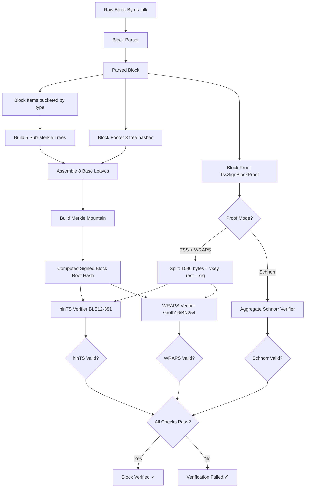
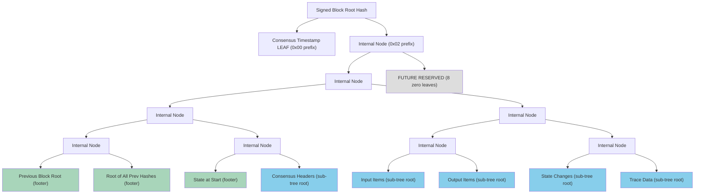
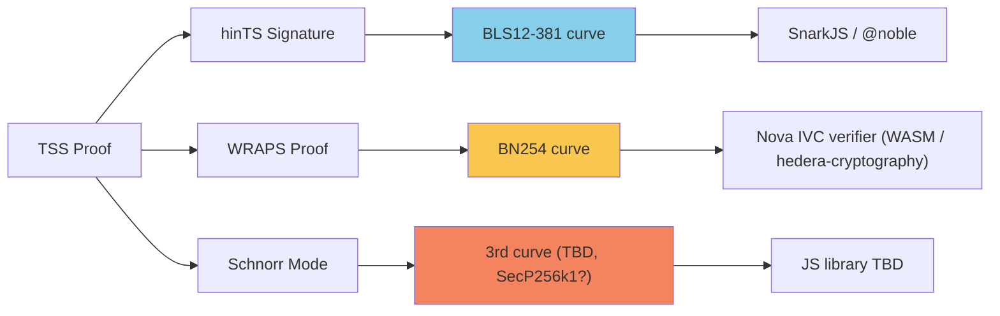

# Block Verification JS Library — Design Document

> **Template:** Based on [hiero-block-node design-doc-template](https://github.com/hiero-ledger/hiero-block-node/blob/main/docs/design/design-doc-template.md)

| Field | Value |
| --- | --- |
| **Author** | Ejaz Merchant |
| **Status** | In Development |
| **Last Updated** | March 31, 2026 |
| **HIPs** | HIP-1056 (Block Streams), HIP-1200 (hinTS/TSS), HIP-1081 (Block Nodes) |
| **Collaborators** | Fredy - Merkle tree & block structure · Rohit - TSS/BLS cryptography · Nana - Block Node coordination · Piotr - BlockyDevs Tech Lead |

---

## Table of Contents

1. [Purpose](#purpose)
2. [Getting Started](#getting-started-theoretical)
3. [Goals](#goals)
4. [Terms](#terms)
5. [Entities](#entities)
6. [Design](#design)
7. [Diagram](#diagram)
8. [Configuration](#configuration)
9. [Metrics](#metrics)
10. [Exceptions](#exceptions)
11. [Acceptance Tests](#acceptance-tests)

---

## Purpose

Provide a JavaScript/TypeScript library that enables trustless verification of Hedera blocks using the HIP-1056 Block Stream format, HIP-1081 Block Node infrastructure, and HIP-1200 hinTS threshold signature scheme. This library will allow developers, block nodes, mirror nodes, and external verifiers to:

1. Verify block integrity by reconstructing Merkle trees and comparing root hashes
2. Verify TSS (hinTS + WRAPS) signatures on block roots using BLS cryptography
3. Generate and verify content proofs for individual block items
4. (Stretch) Enable smart contract verification of block proofs

This supports the community's ability to independently validate Hedera block data without trusting centralized infrastructure. The library is also intended to serve as a reference implementation so if you want to build your own verifier in another language or embed verification directly in a DApp, this document describes the full approach.

---

## Goals

| Priority | Goal | Success Criteria |
| --- | --- | --- |
| P0 | Block hash verification (no TSS) | Library produces the correct SHA-384 block root hash, verifiable against known test vectors |
| P0 | TSS signature verification (hinTS) | Library verifies BLS threshold signatures using BLS12-381 on v0.72+ blocks |
| P0 | WRAPS proof verification (Groth16) | Library verifies Groth16 ZK proofs on BN254 proving address book chain of trust |
| P1 | Block content proof generation | Library generates minimal Merkle proofs for any block item |
| P1 | Block content proof verification | Library verifies proofs against trusted block roots |
| P1 | Bootstrap mode verification | Required for Solo, testnet, and PreviewNet. Not required for mainnet cutover. Blocks before WRAPS ceremony completion use Aggregate Schnorr Signatures on a third elliptic curve (TBD) |
| P2 | Smart contract proof verification (stretch) | Proofs verifiable on-chain via EVM contract |

### Non-Goals

- Block storage or indexing
- Block streaming or subscription
- Consensus participation
- Key management for signing (verification only)
- WASM compilation as a primary target (Rust can compile to WASM and run in browsers; iOS wrapping has known limitations. Pure JS remains the long-term goal.)

---

## Terms

| Term | Definition |
| --- | --- |
| **Block** | A unit of data in the HIP-1056 Block Stream containing transactions, state changes, and metadata, organized as a Merkle Mountain with a signed root. |
| **Block Item** | An individual element within a block (transaction, event, state change) that becomes a leaf in one of the block's five sub-Merkle trees. |
| **Merkle Mountain** | The hierarchical tree structure combining a consensus timestamp leaf, 3 block footer values, 5 computed sub-tree roots, and 8 reserved leaves to produce the Signed Block Root Hash. *(Formerly: Virtual Merkle Tree)* |
| **Sub-Merkle Tree** | One of five per-type Merkle trees built from block items: consensus headers, input items, output items, state change items, and trace data items. |
| **Merkle Proof (Content Proof)** | A minimal set of sibling hashes traversing both the sub-tree and the Merkle Mountain to reconstruct the block root. Proves a block item exists within a block. |
| **TSS (Threshold Signature Scheme)** | The collective proof that a block is valid. Consists of two parts: a **hinTS** signature and a **WRAPS** proof. |
| **hinTS** | Hedera's custom threshold signature scheme (HIP-1200). Proves that ≥ 1/2 of the network by stake weight signed off on the block. Uses BLS12-381 elliptic curve operations. |
| **WRAPS** | The ZK-SNARK component of TSS that verifies the address book (validator set) is a legitimate descendant of genesis. Uses a Nova IVC proof scheme on BN254, with a Groth16 decider proof nested inside. |
| **BLS (Boneh-Lynn-Shacham)** | A signature scheme using pairing-based cryptography. "BLS" can refer to either the signature scheme or the BLS12-381 elliptic curve as context matters. |
| **BLS12-381** | The elliptic curve used for hinTS signature verification. This is the curve, not the signature scheme. |
| **BN254** | The elliptic curve used for WRAPS/Groth16 proof verification. A second curve required alongside BLS12-381. |
| **Groth16** | A popular ZK-SNARK proof system. WRAPS proofs are Groth16 proofs. Verified using BN254. |
| **ArkWorks** | The Rust elliptic curve library used by `hedera-cryptography`. Serialization compatibility with the chosen JS library must be confirmed. |
| **Verification Key (hinTS)** | Embedded in the block proof's `TssSignBlockProof.block_signature` field. First 1096 bytes = verification key, remainder = signature. |
| **Verification Key (WRAPS)** | Hard-coded in the library. Used to verify the Groth16 proof. Produced by the TSS ceremony (HIP-1398). |
| **Threshold** | The fraction of stake weight required for a valid hinTS signature. Hard-coded to **numerator=1, denominator=2** (half the network). Same for testnet and mainnet. |
| **Bootstrap Mode** | The period before a WRAPS proof is available. Uses Aggregate Schnorr Signatures on a third elliptic curve. |
| **Block Proof** | The `TssSignBlockProof` protobuf message containing the TSS signature components embedded in the Block Stream. |
| **Ledger ID** | The 32-byte Poseidon hash of the Genesis Address Book. The root of the entire trust chain. Supplied by the caller to enable the strongest verification guarantee. |
| **State Proof** | A Merkle proof variant that proves a specific item exists within a block and anchors it to the block root. Uses the same cryptography as a content proof but requires an additional set of sibling hashes in the Merkle path. The same state proof format is used by Clipper for cross-network message verification. |

---

## Entities

### Input Entities

| Entity | Source | Format | Notes |
| --- | --- | --- | --- |
| Block | Block Node | Protobuf (HIP-1056), `.blk` binary | Source must be a Block Node (HIP-1081). Mirror Nodes do not expose `.blk` files. Use proto definitions from `hiero-consensus-node` tag `v0.72.0-alpha.3` |
| Ledger ID | Caller-supplied | 32-byte Poseidon hash | Poseidon hash of Genesis Address Book. Published via system transaction in block 0 or Record Stream at cutover. Acts as trust root for WRAPS proof verification. |
| Block Proof | Embedded in Block Stream | `TssSignBlockProof` protobuf | First 1096 bytes = hinTS verification key, remainder = hinTS signature |
| WRAPS Verification Key | Hard-coded in library | BN254 point | Produced by TSS ceremony (HIP-1398); verifies Groth16 proof |
| Block Footer | Embedded in block | 3 hash values | Previous block root, root of all previous hashes, state at start of block as read directly, no computation needed |

### Output Entities

| Entity | Description |
| --- | --- |
| Merkle Root | 48-byte hash representing entire block contents |
| Content Proof | Array of sibling hashes + positions traversing sub-tree → Merkle Mountain → root |
| Verification Result | Boolean indicating valid/invalid signature or proof, with error details |

### Internal Entities

| Entity | Description |
| --- | --- |
| Merkle Mountain | Hierarchical tree combining timestamp leaf + internal nodes + 8 base leaves + 8 reserved leaves |
| Sub-Merkle Trees (×5) | Per-type trees for: consensus headers, input items, output items, state changes, trace data |
| Leaf Hash | `SHA384(0x00 \|\| protobuf-bytes)` — prefix byte `0x00` for leaves |
| Internal Node Hash | `SHA384(0x02 \|\| left-48-bytes \|\| right-48-bytes)` — prefix byte `0x02` for 2-child nodes |
| Single-Child Node Hash | `SHA384(0x01 \|\| child-48-bytes)` — prefix byte `0x01` |
| Parsed Block | JavaScript object representation of protobuf block |

---

## Design

### Architecture Overview

The library consists of five main components:

1. **Block Parser** - Deserializes protobuf-encoded blocks into JS objects
2. **Merkle Tree Builder** - Constructs Merkle Mountain from block items, computes root
3. **Proof Generator** - Creates minimal inclusion proofs for block items
4. **hinTS Verifier** - Validates hinTS threshold signatures (BLS12-381)
5. **WRAPS Verifier** - Validates Groth16 ZK proofs for address book chain of trust (BN254)

---

### Implementation Approach Options

The deterministic parts of verification include block parsing, item bucketing, Merkle Mountain construction, and proof generation are straightforward TypeScript and are not in dispute. The open question is how to implement full TSS cryptographic verification (hinTS + WRAPS) for the Beta milestone.

**Note on maintenance commitment:** Choosing the library path means committing to a permanently maintained artifact. Once published, developers will use it in production regardless of how it is framed. This means an ongoing release cycle, security responsibility, and a team assigned to keep it current. This is the same commitment as an SDK. The options below should be evaluated with that in mind.

Both options are documented here with tradeoffs so reviewers and the community can understand what was considered and why a path was chosen.

### Option A: Pure TypeScript/JavaScript

Use existing JS cryptographic libraries (SnarkJS, `@noble/bls12-381`) to implement hinTS and WRAPS verification entirely in TypeScript.

| Dimension | Assessment |
| --- | --- |
| Correctness risk | High as BN254 and Groth16 interoperability with ArkWorks proof artifacts is unproven in JS |
| Serialization compatibility | Unknown as it requires parsing sample TSS proofs to confirm |
| Community buildability | Best since pure JS/TS, no toolchain beyond npm |
| Browser support | Best since no native dependencies |
| Packaging complexity | Lowest via standard npm package |
| Long-term maintainability | Medium as it depends on JS crypto library health |

Why not chosen for Beta: Correctness risk is too high without serialization compatibility testing. Remains the target for a future phase once compatibility is confirmed.

---

### Option B: Rust-Backed Provider via `TssVerificationProvider` Interface *(Recommended for Beta)*

Write all orchestration in pure TypeScript with a clean `TssVerificationProvider` interface for the crypto layer. The initial implementation is backed by `hedera-cryptography` (Rust). The interface allows the Rust backend to be swapped for a pure JS implementation later without any API changes for consumers.

| Dimension | Assessment |
| --- | --- |
| Correctness risk | Low with Rust/ArkWorks native, same ecosystem as Consensus Node proof generation |
| Serialization compatibility | High as assumed guaranteed compatibility with ArkWorks artifacts |
| Community buildability | Medium since it requires Rust toolchain, but TS orchestration layer is pure JS |
| Browser support | Deferred to possible via WASM in a future phase; iOS wrapping has known limitations |
| Packaging complexity | Medium as pre-built binaries can remove Rust toolchain requirement for consumers |
| Long-term maintainability | Best as clean provider interface; JS implementation can replace Rust transparently |

Why chosen for Beta: Correct by construction. Because the public TypeScript API is stable and the crypto backend is behind an interface, upgrading from Rust to pure JS later is invisible to consumers.

### Recommended Architecture: Phased Hybrid

- **Phase 1 - Alpha (March 31 - April 14):** Deterministic TypeScript core only. Define `TssVerificationProvider` interface. No crypto backend.
- **Phase 2 - Beta (April 15 - May 1):** Plug in Option B (Rust-backed provider). Full TSS verification, correct by construction.
- **Phase 3 - Post-Beta:** Evaluate Option A (pure JS) as a drop-in replacement once ArkWorks serialization compatibility is confirmed. Swap is transparent to consumers.

### Open Questions: Library vs Reference Documentation

**Resolved.** The spike run by BlockyDevs (PR #2411) produced approximately 1,100 lines of TypeScript across 10 source files against real block fixtures. This definitively confirms that this is a library, not a code snippet or reference documentation. The library path is locked for Beta scope and beyond.

---

## Spike Findings (PR #2411)

The BlockyDevs team (led by Piotr) ran a spike against real block fixtures, the results of which resolved several open questions and shaped the Beta design.

**Scope:** ~1,100 lines of TypeScript across 10 source files.

**Fixtures tested:**

| Fixture | Layout | Result |
| --- | --- | --- |
| `block-0.blk.zstd` | genesis-schnorr | Schnorr VERIFIED (2/2 signers) |
| `block-10.blk.zstd` | genesis-schnorr | Schnorr VERIFIED (2/2 signers) |
| `block-1000.blk.zstd` | WRAPS | Deserialization SUCCESS, ledger ID MATCH |

**Key findings:**

- `block-1000.blk.zstd` is the first confirmed WRAPS fixture (3,432-byte layout). The 704-byte WRAPS suffix is a Nova IVC ProofData bundle containing: IVC step counter, z_0/z_i state vectors, Nova instance commitments, a nested Groth16 decider proof, KZG opening proofs, and fold data.
- Schnorr verification is fully working in pure JS using BabyJubjub + Blake2s + Poseidon.
- **snarkjs compatibility question is closed** — not applicable. The WRAPS proof is a Nova IVC envelope, not a bare Groth16 proof. SnarkJS cannot verify it.
- **New open question:** WASM compilation feasibility of the Rust Nova IVC verifier from `hedera-cryptography` (pending confirmation from Rohit).

---

### Trust and Bootstrap Model

The library's verification guarantees are only as strong as the trust assumptions made at bootstrap. These assumptions are made explicit in every return value.

**What the library proves when all checks pass:**

- **Block integrity** - content hashes to the reported Signed Block Root Hash
- **Consensus weight threshold** - hinTS signature proves ≥ 51% of stake weight signed this block root
- **Address book legitimacy** - WRAPS proof proves the address book is a legitimate descendant of the Genesis Address Book

**Trust levels:**

| Trust Level | How Achieved | `verifyBlock()` Behavior |
| --- | --- | --- |
| Ledger ID anchored | Caller supplies `ledgerId` | WRAPS chain verified back to genesis. Strongest guarantee. |
| Block 0 anchored | No `ledgerId` supplied | WRAPS chain verified back to block 0 address book. Practical default. |
| Schnorr only | Pre-ceremony blocks | No WRAPS proof available. Aggregate Schnorr signature only. |
| Hash only | `verifyBlockHash()` | No signature verification. Alpha transitional only. |

Before the WRAPS trusted setup ceremony (HIP-1398) has run on mainnet, blocks carry Aggregate Schnorr Signatures instead of WRAPS proofs. The library returns `wrapsValid: null` in this case indicating WRAPS is not available, not that it failed.

---

### Component 1: Block Parser

**Responsibility:** Convert raw block bytes into structured JavaScript objects.

**Approach:**

- Use `protobufjs` to parse HIP-1056 protobuf format
- Load `.proto` definitions from `hiero-consensus-node` at tag `v0.72.0-alpha.3`, under `hapi/hedera-protobuf-java-api/src/main/proto/block/stream/`
- Use `BlockItemUnparsed` from `org.hiero.block.internal` as the parsing contract. Each block item field is typed as `bytes`, meaning items decode as raw `Uint8Array` with no further deserialization required.
- Extract block items in timestamp order, preserving arrival sequence
- Extract block proof (`TssSignBlockProof`) and the lengths are protocol constants and are not configureable

Block items are parsed shallowly by design. The parsing boundary is defined by `BlockItemUnparsed` from `org.hiero.block.internal`. Each item field is typed as `bytes`, so items are extracted as a raw byte array plus their type identifier with no nested deserialization, rather than fully deserialized into nested protobuf objects. This is a performance requirement with full deserialization in JavaScript at production TPS will cause failures on any meaningful block size. The hash for each item is computed directly from its raw bytes, matching the approach in the Java Block Node reference implementation. Full deserialization is only performed on items the caller explicitly needs to inspect.

Filtered access pattern: Because block items are parsed shallowly as type + raw bytes, callers can efficiently filter to only the items they care about before doing any further processing. For example, an application interested only in state changes affecting specific accounts can discard all other item types after the initial shallow parse without paying the cost of deeper deserialization. This pattern should be a first-class supported usage of the library and the API should not force callers to process the full Block Stream when they only need a subset.

```typescript
interface BlockParser {
  parse(blockBytes: Uint8Array): ParsedBlock;
}

interface ParsedBlock {
  blockNumber: number;
  header: BlockHeader;
  footer: BlockFooter;
  items: BucketedBlockItems;
  proof: TssBlockProof;
}

interface BucketedBlockItems {
  consensusHeaders: BlockItem[];
  inputItems: BlockItem[];
  outputItems: BlockItem[];
  stateChanges: BlockItem[];
  traceData: BlockItem[];
}

interface TssBlockProof {
  verificationKey: Uint8Array;  // 1096 bytes
  signature: Uint8Array;        // 1632 bytes
  abProof: Uint8Array;          // 704 bytes (WRAPS) or 192 bytes (Schnorr)
}
```

Note: The proof mode (`tss` vs `tss_wraps` vs `schnorr`) is resolved internally by the library. Callers pass block bytes and receive a result. They should never need to inspect or branch on proof type themselves.

---

### Component 2: Merkle Tree Builder

**Responsibility:** Construct the Merkle Mountain from block items, matching Consensus Node logic exactly.

The Merkle Mountain is NOT a flat tree of all items. It is a hierarchical structure — see the [Merkle Mountain Structure](#merkle-mountain-structure) diagram below.

**Algorithm:**

```text
All hashes use SHA2-384. This is specified in all four hash lines in that same block:

1. BUCKET block items by type (5 buckets, preserving order within each):
   consensus_headers, input_items, output_items, state_changes, trace_data

2. BUILD 5 sub-Merkle trees (one per bucket):
   - Leaf:          SHA384(0x00 || protobuf_serialize(item))
   - Internal node: SHA384(0x02 || left_48_bytes || right_48_bytes)
   - Single child:  SHA384(0x01 || child_48_bytes)

3. EXTRACT 3 footer values (no computation needed):
   previous_block_root_hash, root_of_all_previous_hashes, state_at_start_of_block

4. ASSEMBLE 8 base leaves:
   [footer_prev_root, footer_all_prev_hashes, footer_state_start,
    subtree_consensus, subtree_input, subtree_output, subtree_state, subtree_trace]

5. BUILD Merkle Mountain from 8 base leaves upward.
   Right side has 8 RESERVED zero leaves.

6. COMBINE with consensus timestamp at root level:
   timestamp_leaf = SHA384(0x00 || consensus_timestamp_bytes)
   root = SHA384(0x02 || timestamp_leaf || mountain_node)

7. RETURN: Signed Block Root Hash
```

```typescript
interface MerkleTreeBuilder {
  build(parsed: ParsedBlock): MerkleMountain;
}

interface MerkleMountain {
  root: Uint8Array;
  subTreeRoots: {
    consensusHeaders: Uint8Array;
    inputItems: Uint8Array;
    outputItems: Uint8Array;
    stateChanges: Uint8Array;
    traceData: Uint8Array;
  };
  getProof(itemType: string, itemIndex: number): MerkleProof;
}
```

Reference implementation: `ExtendedMerkleTreeSessionTest.java` in `hiero-block-node`. Source of truth: `BlockStreamManagerInput` in `hiero-consensus-node` at tag `v0.72.0-alpha.3`.

---

### Component 3: Proof Generator

**Responsibility:** Generate minimal Merkle proofs for individual block items.

A proof traverses two levels: within the sub-tree (item → sub-tree root), then through the Merkle Mountain (sub-tree root → block root).

A state proof is a variant of a content proof that follows the same two-level traversal but includes an additional set of sibling hashes beyond the block root.

```typescript
interface MerkleProof {
  leafHash: Uint8Array;
  itemType: string;
  subTreePath: Array<{ hash: Uint8Array; position: 'left' | 'right' }>;
  mountainPath: Array<{ hash: Uint8Array; position: 'left' | 'right' }>;
}

interface ProofVerifier {
  verify(proof: MerkleProof, root: Uint8Array): boolean;
}
```

---

### Component 4: hinTS Verifier

**Responsibility:** Verify that ≥ 1/2 of network stake weight signed off on the block root.

**Elliptic Curve:** BLS12-381

The selected library must be audited, actively maintained, and widely adopted in the crypto and web3 ecosystem. Serialization compatibility with ArkWorks must be confirmed by parsing a sample TSS proof before implementation begins.

```typescript
interface HintsVerifier {
  verify(
    blockRootHash: Uint8Array,
    ledgerId: Uint8Array,
    verificationKey: Uint8Array,
    signature: Uint8Array,
    thresholdNumerator?: number,    // Default: 1
    thresholdDenominator?: number   // Default: 2
  ): boolean;
}
```

---

### Component 5: WRAPS Verifier

**Responsibility:** Verify the Nova IVC proof that the address book is a legitimate descendant of genesis.

**Elliptic Curve:** BN254

The 704-byte WRAPS suffix is a Nova IVC ProofData bundle, not a bare Groth16 proof. This means SnarkJS cannot be used: SnarkJS only supports bare Groth16 inputs, not the Nova IVC envelope. No JavaScript-native Nova IVC verifier currently exists.

Operations are implementable with a BN254 pairing library. WASM remains one path; pure JS is now also in scope. Working closely with team to determine the right approach.

```typescript
interface WrapsVerifier {
  verify(wrapsProof: Uint8Array): boolean;
  // Verification key is hard-coded internally
  // Beta: backed by WASM build of hedera-cryptography Rust Nova IVC verifier
}
```

---

### Component 6: Aggregate Schnorr Signature Verifier

**Responsibility:** Verify Aggregate Schnorr Signatures during the period before a WRAPS proof is available.

**Elliptic Curve:** Third curve (TBD as different from BLS12-381 and BN254).

This mode is only active before the TSS ceremony has run. Most applications will never encounter it. Until this component is implemented, the library returns an explicit `UnsupportedProofModeError` rather than failing silently.

---

### TSS Verification Inputs

The six potential components required for full TSS verification, and where each originates:

> *Diagram: TSS Verification Inputs — see Notion source for image.*

---

### Full TSS Verification Pipeline

```text
TSS Proof Verification:
├── 1. Verify WRAPS proof (Groth16 on BN254)
│       Uses hard-coded verification key
│       Proves: address book is legitimate descendant of genesis
│
├── 2. Extract hinTS components from block proof:
│       hinTS verification key (first 1096 bytes)
│       hinTS signature (remaining bytes)
│
└── 3. Verify hinTS signature (BLS12-381)
        Uses extracted verification key
        Proves: ≥ 1/2 of network by weight signed the block root
```

---

### Public API

```typescript
// === Block Hash Verification (Alpha) ===
export function verifyBlockHash(block: Uint8Array): VerificationResult;

// === Full TSS Verification (Beta) ===
// ledgerId: Poseidon hash of Genesis Address Book (trust root)
// If omitted, falls back to block-0-anchored mode
// The proof type (hinTS, WRAPS, Schnorr) is resolved internally
// Callers supply block bytes and receive a structured result with no knowledge of proof mode required
export function verifyBlock(
  block: Uint8Array,
  ledgerId?: Uint8Array
): FullVerificationResult;

// === Content Proofs (Beta) ===
export function generateProof(
  block: Uint8Array,
  itemType: BlockItemType,
  itemIndex: number
): MerkleProof;

export function verifyProof(
  proof: MerkleProof,
  root: Uint8Array
): boolean;

// === Types ===
type BlockItemType = 'consensus_headers' | 'input' | 'output' | 'state_changes' | 'trace_data';

interface VerificationResult {
  valid: boolean;
  computedRoot: Uint8Array;
  error?: string;
}

interface FullVerificationResult extends VerificationResult {
  hintsValid: boolean;
  wrapsValid: boolean | null;  // null = WRAPS not yet available (pre-ceremony)
  trustLevel: 'ledger_id_anchored' | 'block_0_anchored' | 'schnorr_only' | 'hash_only';
}
```

---

## Diagram

### Full Verification Pipeline



### Merkle Mountain Structure



Green = from block footer (free). Blue = computed sub-Merkle tree roots. Gray = reserved/zero.

### Three Elliptic Curves



---

## Configuration

| Parameter | Type | Default | Description |
| --- | --- | --- | --- |
| `protoTag` | string | `'v0.72.0-alpha.3'` | Consensus Node proto tag version |
| `protoPath` | string | `'./proto'` | Path to local `.proto` definitions |
| `leafPrefix` | byte | `0x00` | Prefix byte for leaf hashing |
| `internalPrefix` | byte | `0x02` | Prefix byte for 2-child internal node hashing |
| `singleChildPrefix` | byte | `0x01` | Prefix byte for single-child internal node hashing |
| `thresholdNumerator` | number | `1` | hinTS threshold numerator |
| `thresholdDenominator` | number | `2` | hinTS threshold denominator |

---

## Metrics

| Metric | Type | Description |
| --- | --- | --- |
| `block_parse_duration_ms` | histogram | Time to parse block from bytes |
| `merkle_subtree_build_duration_ms` | histogram | Time to construct each sub-Merkle tree |
| `merkle_mountain_build_duration_ms` | histogram | Time to assemble Merkle Mountain |
| `proof_generation_duration_ms` | histogram | Time to generate content proof |
| `hints_verify_duration_ms` | histogram | Time to verify hinTS signature (BLS12-381) |
| `wraps_verify_duration_ms` | histogram | Time to verify WRAPS/Groth16 proof (BN254) |
| `verification_success_total` | counter | Total successful verifications |
| `verification_failure_total` | counter | Total failed verifications |

---

## Exceptions

| Exception | Condition | Handling |
| --- | --- | --- |
| `ParseError` | Invalid protobuf format or wrong proto version | Return error with position and expected version |
| `MerkleError` | Tree construction fails (bad item bucketing, hash mismatch) | Return error with item index and bucket type |
| `ProofError` | Invalid proof structure or path length | Return error with details |
| `HintsSignatureError` | hinTS BLS verification fails | Return `{ valid: false, hintsValid: false }` |
| `WrapsProofError` | WRAPS Groth16 verification fails | Return `{ valid: false, wrapsValid: false }` |
| `KeyExtractionError` | Block proof byte array is shorter than expected or malformed | Return error with expected format |
| `CurveCompatibilityError` | JS library cannot parse ArkWorks-serialized elements | Return error identifying the incompatible library |
| `UnsupportedProofModeError` | Aggregate Schnorr Signature verification requested but not yet implemented | Return explicit unsupported error do not return `false` or fail silently |

---

## Acceptance Tests

### Alpha Milestone (March 31 - April 14th) - Block Hash Verification

| Test | Input | Expected Output |
| --- | --- | --- |
| Parse valid TSS block 0 | TSS block 0 `.blk` fixture | Parsed block object with correct structure |
| Parse valid TSS block 50 | TSS block 50 `.blk` fixture | Parsed block object with all items bucketed |
| Build sub-trees + Merkle Mountain (block 0) | Genesis block (footer hashes = zero) | Root hash matching block proof root |
| Build sub-trees + Merkle Mountain (block 50) | Non-genesis block with real footer hashes | Root hash matching block proof root |
| Verify hash match | Block + expected root | `{ valid: true }` |
| Verify hash mismatch | Block + wrong root | `{ valid: false }` |
| Extract signature components | Block proof bytes | hinTS verification key + hinTS signature + WRAPS proof |

### Beta Milestone (April 15 - May 1st) - TSS Verification + Proofs

| Test | Input | Expected Output |
| --- | --- | --- |
| Verify hinTS signature (block 0) | TSS block 0 + extracted key | `{ hintsValid: true }` |
| Verify hinTS signature (block 50) | TSS block 50 + extracted key | `{ hintsValid: true }` |
| Reject tampered signature | Block with flipped first byte of signature | `{ hintsValid: false }` |
| Reject tampered block hash | Block with flipped first byte of root | `{ hintsValid: false }` |
| Parse valid WRAPS block 0 | WRAPS block 0 `.blk` fixture | Parsed block with `trustLevel: 'ledger_id_anchored'` |
| Parse valid WRAPS block 50 | WRAPS block 50 `.blk` fixture | Parsed block with settled address book and `trustLevel: 'ledger_id_anchored'` |
| Verify WRAPS proof (WRAPS block 0) | WRAPS block 0 | `{ wrapsValid: true, trustLevel: 'ledger_id_anchored' }` |
| Verify WRAPS proof (WRAPS block 50) | WRAPS block 50 | `{ wrapsValid: true, trustLevel: 'ledger_id_anchored' }` |
| Full TSS verification | GRAPS block + both proofs | `{ valid: true, hintsValid: true, wrapsValid: true }` |
| Generate content proof | Block + item type + item index | Valid proof object with sub-tree + mountain paths |
| Verify valid content proof | Proof + correct root | `true` |
| Reject invalid content proof | Proof + wrong root | `false` |
| Verify proof for all items in bucket | Block with N items in one bucket | N valid proofs |

---

## Getting Started (Theoretical)

Blocks must be sourced from a Block Node (HIP-1081). Block Nodes expose `.blk` files in the HIP-1056 protobuf format. Mirror Nodes consume record streams and do not expose raw block data.

Proto definitions are in [`hiero-consensus-node`](https://github.com/hiero-ledger/hiero-consensus-node) at tag `v0.72.0-alpha.3`, under `hapi/hedera-protobuf-java-api/src/main/proto/block/stream/`.

**Alpha - block hash verification:**

```typescript
import { verifyBlockHash } from '@hiero/block-verification';

const result = verifyBlockHash(blockBytes);
// { valid: true, computedRoot: Uint8Array }
```

**Beta - full TSS verification:**

```typescript
import { verifyBlock } from '@hiero/block-verification';

// Optionally supply ledgerId (Poseidon hash of Genesis Address Book)
// for the strongest trust guarantee. If omitted, falls back to block-0-anchored mode.
const result = verifyBlock(blockBytes, ledgerId);
// { valid: true, hintsValid: true, wrapsValid: true, trustLevel: 'ledger_id_anchored' }
```

---

## Author

Ejaz Merchant · Last Updated: March 31, 2026 · Status: In Development
