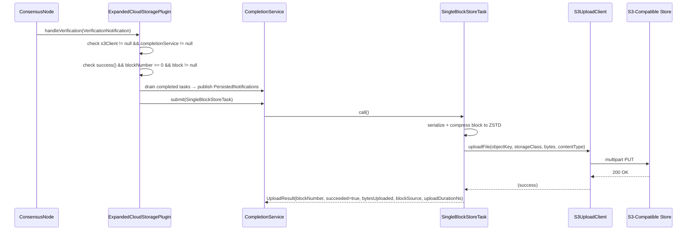
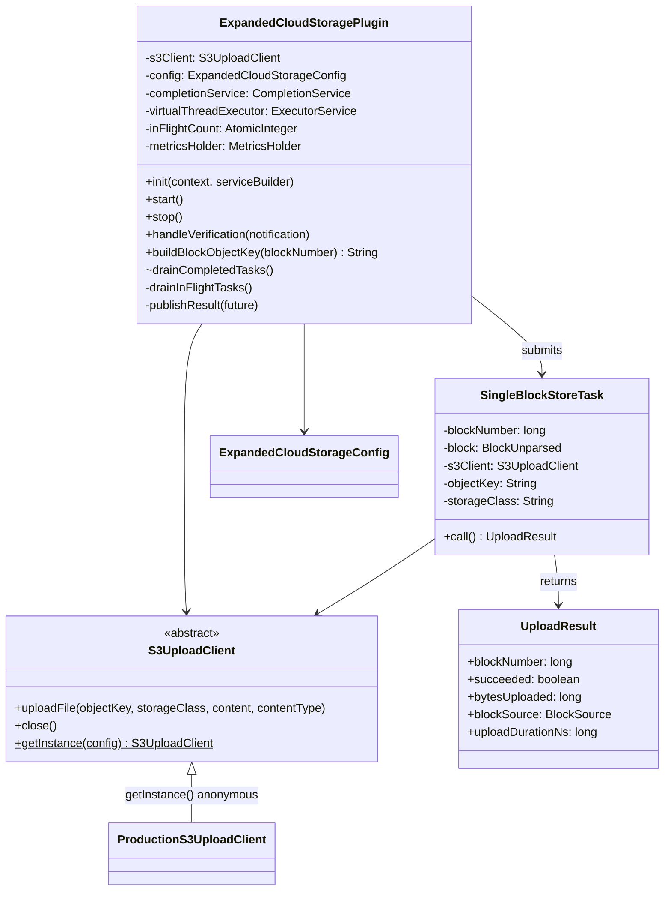

# Cloud Expanded Plugin

## Table of Contents

1. [Purpose](#purpose)
2. [Goals](#goals)
3. [Terms](#terms)
4. [Entities](#entities)
5. [Design](#design)
6. [Diagram](#diagram)
7. [Configuration](#configuration)
8. [Metrics](#metrics)
9. [Exceptions](#exceptions)
10. [Acceptance Tests](#acceptance-tests)

## Purpose

The `cloud-expanded` plugin uploads each individually-verified block as a compressed
`.blk.zstd` object directly to any S3-compatible object store (AWS S3, GCS via S3-interop,
etc.). Unlike the previous `s3-archive` plugin, which batched blocks into large tar
archives, this plugin uploads **one block per S3 object** — making individual blocks
immediately queryable and suitable for consumers that need block-level granularity in the
cloud.

## Goals

* The ECSP must store every block, as received, after verification.
* The ECSP must store each verified block as a single ZStandard-compressed file using ZSTD-compressed
  Protobuf encoding.
* The ECSP must adhere to a file pattern as defined below.
* The ECSP must store all blocks as files or objects in a cloud storage system.
* The ECSP must not report success until data is stored such that it can be
  recovered if the local system fails unexpectedly, including a failure that
  results in complete and unrecoverable loss of all local storage.
* The ECSP must support any S3-compatible store (AWS S3, GCS S3-interop, etc)
  backed by the `com.hedera.bucky:bucky-client` library.

## Terms

<dl>
  <dt>Cloud Storage</dt>
  <dd>Any storage API that stores data remotely with very high
      availability and reliability. Multiple such APIs may be supported
      by the plugin and controlled by configuration.<br/>
      An example of a common cloud storage API is S3 storage.</dd>

  <dt>S3-compatible object store</dt>
  <dd>Any storage service that implements the AWS S3 REST API, including AWS S3 and Google Cloud
      Storage (via S3 interoperability).</dd>

  <dt>Object key</dt>
  <dd>The full path of an object within an S3 bucket, e.g.
      <code>blocks/0000/0000/0000/0000/001.blk.zstd</code>.</dd>

  <dt>ZSTD_PROTOBUF</dt>
  <dd>The block encoding that serialises a block as Protobuf then ZSTD-compresses it. This is
      the canonical on-disk and in-cloud format.</dd>

  <dt>bucky-client</dt>
  <dd><code>com.hedera.bucky:bucky-client</code> — the Hedera S3 client library on Maven
      Central. Provides <code>com.hedera.bucky.S3Client</code> (a final concrete class) and
      the exception hierarchy <code>S3ClientException</code> →
      <code>S3ClientInitializationException</code> / <code>S3ResponseException</code>.</dd>

  <dt>S3UploadClient</dt>
  <dd>Package-private abstract class that abstracts the S3 upload operation. The production
      instance is obtained via <code>S3UploadClient.getInstance(config)</code>, which wraps
      <code>com.hedera.bucky.S3Client</code> directly. Unit tests subclass it directly to
      capture or throw without requiring a real S3 endpoint or Mockito.</dd>

  <dt>S3ResponseException</dt>
  <dd>A <code>com.hedera.bucky.S3ClientException</code> subtype thrown when the S3 service
      returns a non-success HTTP response. Carries the HTTP status code
      (<code>getResponseStatusCode()</code>), raw response body
      (<code>getResponseBody()</code>), and response headers
      (<code>getResponseHeaders()</code>).</dd>
</dl>

## Entities

### `S3UploadClient` (abstract class)

Package-private abstract class in `org.hiero.block.node.cloud.expanded`. Exposes
a single upload method and `close()`:

- `uploadFile(objectKey, storageClass, Iterator<byte[]> content, contentType)` — throws
  `com.hedera.bucky.S3ClientException, IOException`
- `close()`

The static factory `S3UploadClient.getInstance(ExpandedCloudStorageConfig)` returns a concrete
anonymous subclass that delegates to `com.hedera.bucky.S3Client`. Tests subclass
`S3UploadClient` directly without any mocking framework.

### `SingleBlockStoreTask`

`Callable<UploadResult>` submitted per block to the `CompletionService`. Responsible for:
1. Serialising the block to Protobuf bytes (`BlockUnparsed.PROTOBUF.toBytes(block)`).
2. Compressing to ZSTD (`CompressionType.ZSTD.compress(...)`).
3. Uploading via `S3UploadClient.uploadFile()` directly, relying on S3 SDK connection/socket timeouts.

Returns `UploadResult(blockNumber, succeeded, bytesUploaded, blockSource, uploadDurationNs)`.
The `uploadDurationNs` field records wall-clock time of the upload call in nanoseconds, used
to populate the latency metric. Failures (`S3ClientException`, `IOException`) are captured as
`succeeded=false` and `bytesUploaded=0` so the `CompletionService` always receives a result —
exceptions never propagate to the caller.

### `ExpandedCloudStorageConfig`

`@ConfigData("cloud.expanded")` record carrying all plugin settings. The
`storageClass` field is typed as `StorageClass` (an enum), which causes the config
framework to reject unknown values at startup. The `uploadTimeoutSeconds` field carries
`@Min(1)` for framework-level range validation.

### `ExpandedCloudStoragePlugin`

Implements `BlockNodePlugin` and `BlockNotificationHandler`. Listens for
`VerificationNotification`, builds the S3 object key, and submits one `SingleBlockStoreTask`
per verified block to a `CompletionService` backed by a virtual-thread executor.

The notification handler is always registered during `init()`. If `start()` fails to create
the S3 client, `completionService` remains `null` and all `handleVerification` calls are
no-ops for the duration of the process.

## Design

### Trigger: `VerificationNotification`

The plugin registers as a `BlockNotificationHandler` and reacts to `VerificationNotification`
events. Block bytes are taken directly from `notification.block()`, eliminating any dependency
on the local historical block provider and allowing cloud upload to run in parallel with local
file storage.

### Upload flow (`handleVerification`)

1. **Guard**: return immediately if `s3Client == null` or `completionService == null` (plugin
   inactive due to S3 client creation failure).
2. **Guard**: `notification.success() == false` → skip (log TRACE).
3. **Guard**: `notification.blockNumber() < 0` → skip (log TRACE).
4. **Guard**: `notification.block() == null` → skip (log WARNING).
5. **Drain**: poll `CompletionService` for any previously completed upload tasks; publish a
   `PersistedNotification` for each result (success or failure).
6. Build object key using `buildBlockObjectKey(blockNumber)`.
7. Increment `inFlightCount` and submit `SingleBlockStoreTask` to the `CompletionService`.

Inside `SingleBlockStoreTask.call()`:
- Record `uploadStartNs = System.nanoTime()`.
- Serialise and ZSTD-compress the block bytes.
- Upload via `S3UploadClient.uploadFile()` directly.
- Return `UploadResult(blockNumber, succeeded, bytesUploaded, blockSource, uploadDurationNs)`.

### Shutdown drain (`stop`)

`stop()` calls `drainInFlightTasks()` followed by a final non-blocking `drainCompletedTasks()`:

- `drainInFlightTasks()` — polls with a deadline of `uploadTimeoutSeconds` from now, draining
  and publishing results until `inFlightCount` reaches zero or the deadline expires.
- `drainCompletedTasks()` — a final non-blocking sweep that collects any tasks that landed
  between the deadline check and `close()`.

After draining, `s3Client.close()` is called and the reference cleared.

### Publishing results (`publishResult`)

`publishResult` decrements `inFlightCount` and:
1. Returns immediately (log WARNING) if the future was cancelled.
2. Calls `future.get()` to retrieve the `UploadResult`.
3. Publishes `PersistedNotification(blockNumber, succeeded, 0, blockSource)`.
4. Increments `uploadsTotal` or `uploadFailuresTotal` depending on `result.succeeded()`.
5. Always increments `uploadBytesTotal` by `result.bytesUploaded()` (zero on failure).
6. Always increments `uploadLatencyNs` by `result.uploadDurationNs()`.

### Object key format

```
{objectKeyPrefix}/AAAA/BBBB/CCCC/DDDD/EEE.blk.zstd
```

The 19-digit zero-padded block number is split into four 4-digit folder groups plus a 3-digit
leaf (4/4/4/4/3) for lexicographic ordering and S3 prefix partitioning.

| Block number |                Object key                 |
|--------------|-------------------------------------------|
| 1            | `blocks/0000/0000/0000/0000/001.blk.zstd` |
| 1 234 567    | `blocks/0000/0000/0000/1234/567.blk.zstd` |
| 108 273 182  | `blocks/0000/0000/0010/8273/182.blk.zstd` |

If `objectKeyPrefix` is blank, the hierarchy key is used bare (no leading `/`).

Zero-padding is computed via integer division to produce each segment directly (no string
formatting of the full 19-digit number):

```java
long seg1 = blockNumber / 1_000_000_000_000_000L;
long seg2 = blockNumber / 100_000_000_000L % 10_000L;
long seg3 = blockNumber / 10_000_000L        % 10_000L;
long seg4 = blockNumber / 1_000L             % 10_000L;
long seg5 = blockNumber                      % 1_000L;
```

### Misconfiguration handling

If `cloud.expanded.endpointUrl` is blank or the S3 client fails to initialise at
startup (e.g. invalid credentials, unreachable endpoint), the plugin logs a WARNING and
remains inactive for the duration of the process — `completionService` stays `null` and
all `handleVerification` calls are no-ops.

**Intent**: once per-plugin health checks are supported, a misconfigured plugin should be
marked **UNHEALTHY** and surfaced through the `/health` endpoint rather than silently
degrading.

## Diagram

### Upload sequence



### Class relationships



## Configuration

All properties are under the `cloud.expanded` namespace.

|                   Property                    |       Default       |                                   Description                                    |
|-----------------------------------------------|---------------------|----------------------------------------------------------------------------------|
| `cloud.expanded.endpointUrl`                  | `""`                | S3-compatible endpoint URL. **Required. Blank value causes plugin to log a WARNING and be inactive.** |
| `cloud.expanded.bucketName`                   | `block-node-blocks` | Name of the S3 bucket.                                                           |
| `cloud.expanded.objectKeyPrefix`              | `blocks`            | Prefix prepended to every object key.                                            |
| `cloud.expanded.storageClass`                 | `STANDARD`          | S3 storage class (`STANDARD`). Validated as enum at startup.                     |
| `cloud.expanded.regionName`                   | `us-east-1`         | AWS / S3-compatible region.                                                      |
| `cloud.expanded.accessKey`                    | `""`                | S3 access key (not logged).                                                      |
| `cloud.expanded.secretKey`                    | `""`                | S3 secret key (not logged).                                                      |
| `cloud.expanded.uploadTimeoutSeconds`         | `60`                | Max seconds to wait for in-flight uploads during `stop()`. Min value: 1.         |

## Metrics

All counters are registered under the `hiero_block_node` Prometheus category via
`MetricsHolder.createMetrics(MetricRegistry)` in `start()`. Each counter uses the
`org.hiero.metrics.LongCounter` / `MetricKey` API.

|                  Metric name                         |                                 Description                                 |
|------------------------------------------------------|-----------------------------------------------------------------------------|
| `cloud_expanded_total_uploads`                       | Number of blocks successfully uploaded to S3-compatible storage.            |
| `cloud_expanded_total_upload_failures`               | Number of block uploads that failed (S3 error, timeout, compression error). |
| `cloud_expanded_total_upload_bytes`                  | Total compressed bytes successfully uploaded to S3-compatible storage.      |
| `cloud_expanded_upload_latency_ns`                   | Total wall-clock time spent in upload calls, in nanoseconds (success + failure). |

Counters are registered in `start()`. If `start()` fails (e.g., S3 client creation error),
`metricsHolder` remains `null` and no counters are registered.

## Exceptions

|                     Exception                      |           Source            |                                                                                                   Handling                                                                                                   |
|----------------------------------------------------|-----------------------------|--------------------------------------------------------------------------------------------------------------------------------------------------------------------------------------------------------------|
| `com.hedera.bucky.S3ResponseException`             | `S3UploadClient.uploadFile` | Logged at WARNING (includes HTTP status code, body); upload marked failed; `PersistedNotification` sent with `succeeded=false`; plugin continues. Carries `getResponseStatusCode()` and `getResponseBody()`. |
| `com.hedera.bucky.S3ClientException`               | `S3UploadClient.uploadFile` | Logged at WARNING; upload marked failed; `PersistedNotification` sent with `succeeded=false`; plugin continues.                                                                                              |
| `IOException`                                      | `S3UploadClient.uploadFile` | Logged at WARNING; upload marked failed; `PersistedNotification` sent with `succeeded=false`; plugin continues.                                                                                              |
| `com.hedera.bucky.S3ClientInitializationException` | `S3UploadClient.getInstance`| Logged at WARNING in `start()`; `s3Client` remains `null`; plugin is effectively inactive (all subsequent `handleVerification` calls are no-ops).                                                            |
| Block bytes empty after compression                | `SingleBlockStoreTask.call` | Logged at WARNING; upload skipped; `PersistedNotification` sent with `succeeded=false`.                                                                                                                      |

The plugin is designed to be **fault-isolated**: no exception from S3 will propagate up to
crash the node.

## Acceptance Tests

1. **Correct object key format**: block number `1234567` →
   `blocks/0000/0000/0000/1234/567.blk.zstd` (4/4/4/4/3 folder hierarchy).
2. **Correct content type**: `uploadFile` is called with `"application/octet-stream"`.
3. **Correct storage class**: `uploadFile` receives the configured `storageClass` value.
4. **Failed verification skip**: `VerificationNotification` with `success=false` → no upload.
5. **S3ResponseException isolation**: `S3ResponseException` (any 4xx/5xx HTTP code) thrown
   by `uploadFile` → plugin logs WARNING, does not rethrow, sends `PersistedNotification`
   with `succeeded=false`.
6. **S3ClientException isolation**: base `S3ClientException` → same handling as above.
7. **Integration (S3Mock)**: after `handleVerification` for blocks 100–104, all five objects
   appear in the S3Mock bucket with the correct folder-hierarchy keys.
8. **PersistedNotification on success**: successful upload publishes
   `PersistedNotification(blockNumber, succeeded=true)`.
9. **PersistedNotification on failure**: failed upload publishes
   `PersistedNotification(blockNumber, succeeded=false)`.
10. **Latency metric recorded**: `uploadLatencyNs` counter is incremented for both successful
    and failed uploads.
