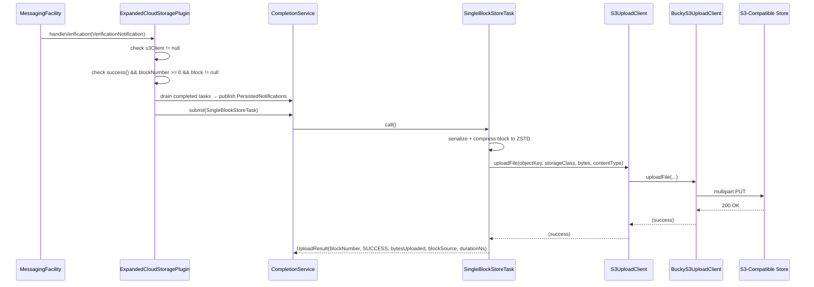
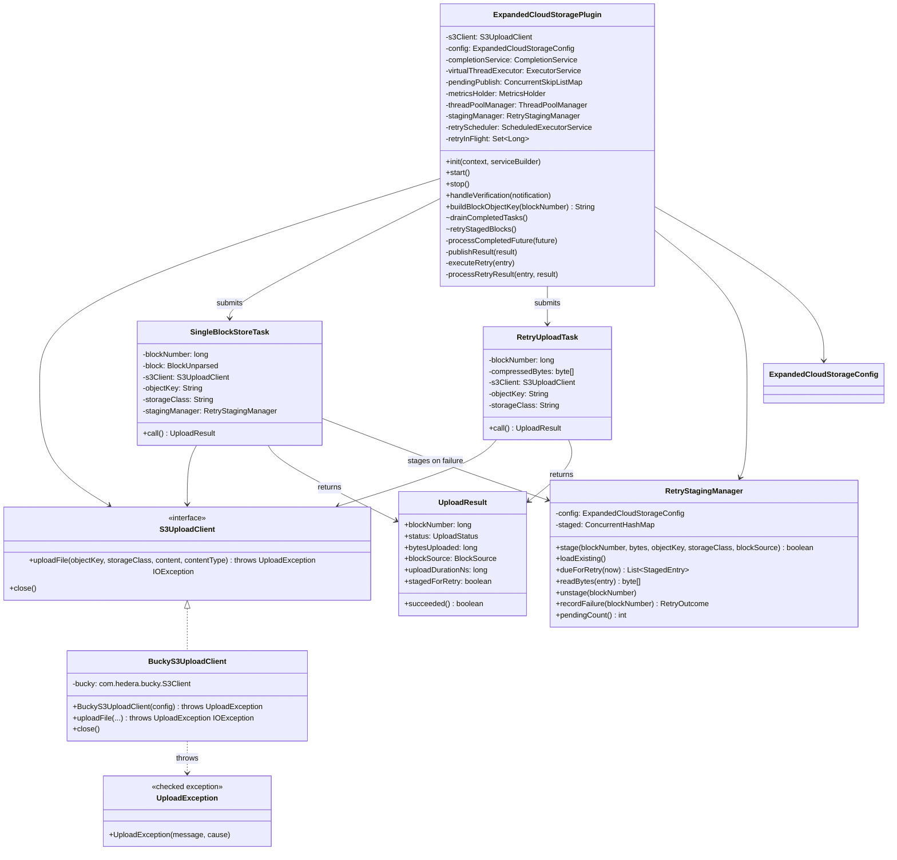

# Cloud Storage Expanded Plugin

## Table of Contents

1. [Purpose](#purpose)
2. [Goals](#goals)
3. [Terms](#terms)
4. [Entities](#entities)
5. [Design](#design)
6. [Diagram](#diagram)
7. [Configuration](#configuration)
8. [Metrics](#metrics)
9. [Exceptions](#exceptions)
10. [Acceptance Tests](#acceptance-tests)

## Purpose

The `cloud-storage-expanded` plugin (CSEP) uploads each individually-verified block as a compressed
`.blk.zstd` object directly to any S3-compatible object store (AWS S3, GCS via S3-interop,
etc.). Unlike the previous `s3-archive` plugin, which batched blocks into large tar
archives, this plugin uploads **one block per S3 object** — making individual blocks
immediately queryable and suitable for consumers that need block-level granularity in the
cloud.

## Goals

* The plugin must store every block, as received, after verification.
* The plugin must store each verified block as a single ZStandard-compressed file using ZSTD-compressed
  Protobuf encoding.
* The plugin must adhere to a file pattern as defined below.
* The plugin must store all blocks as files or objects in a cloud storage system.
* The plugin must not report success until data is stored such that it can be
  recovered if the local system fails unexpectedly, including a failure that
  results in complete and unrecoverable loss of all local storage.
* The plugin must support any S3-compatible store (AWS S3, GCS S3-interop, etc)
  backed by the `com.hedera.bucky:bucky-client` library.

## Terms

<dl>
  <dt>Cloud Storage</dt>
  <dd>Any storage API that stores data remotely with very high
      availability and reliability. Multiple such APIs may be supported
      by the plugin and controlled by configuration.<br/>
      An example of a common cloud storage API is S3 storage.</dd>

  <dt>S3-compatible object store</dt>
  <dd>Any storage service that implements the AWS S3 REST API, including AWS S3 and Google Cloud
      Storage (via S3 interoperability).</dd>

  <dt>Object key</dt>
  <dd>The full path of an object within an S3 bucket, e.g.
      <code>blocks/0000/0000/0000/0000/001.blk.zstd</code>.</dd>

  <dt>ZSTD_PROTOBUF</dt>
  <dd>The block encoding that serialises a block as Protobuf then ZSTD-compresses it. This is
      the canonical on-disk and in-cloud format.</dd>

  <dt>bucky-client</dt>
  <dd><code>com.hedera.bucky:bucky-client</code> — the Hedera S3 client library on Maven
      Central. Provides <code>com.hedera.bucky.S3Client</code> (a final concrete class) and
      the exception hierarchy <code>S3ClientException</code> →
      <code>S3ClientInitializationException</code> / <code>S3ResponseException</code>.
      These types are an implementation detail confined to <code>BuckyS3UploadClient</code>;
      no other class in the package imports them.</dd>

  <dt>S3UploadClient</dt>
  <dd>Package-private interface that abstracts the S3 upload operation. It exposes only
      <code>uploadFile(...)</code> and <code>close()</code>, throwing
      <code>UploadException</code> or <code>IOException</code> — no bucky types.
      Unit tests implement it directly to capture calls or simulate failures without requiring
      a real S3 endpoint or a mocking framework.</dd>

  <dt>BuckyS3UploadClient</dt>
  <dd>Package-private final class that is the sole production implementation of
      <code>S3UploadClient</code>. Wraps <code>com.hedera.bucky.S3Client</code> and
      translates all bucky exceptions (<code>S3ClientInitializationException</code>,
      <code>S3ClientException</code>) into <code>UploadException</code> at the boundary
      so that bucky is fully contained within this one class.</dd>

  <dt>UploadException</dt>
  <dd>Package-private checked exception thrown by <code>S3UploadClient.uploadFile</code>
      and by the <code>BuckyS3UploadClient</code> constructor to signal an S3 service
      error (auth failure, 4xx/5xx response, or initialisation failure). Distinguished
      from <code>IOException</code>, which signals a transport-level failure. Callers use
      this distinction to set <code>UploadStatus.S3_ERROR</code> vs
      <code>UploadStatus.IO_ERROR</code>.</dd>
</dl>

## Entities

### `S3UploadClient` (interface)

Package-private interface in `org.hiero.block.node.cloud.storage.expanded`. Defines the
upload contract used by the rest of the package. Exposes:

- `uploadFile(objectKey, storageClass, Iterator<byte[]> content, contentType)` — throws
  `UploadException, IOException`
- `close()` (from `AutoCloseable`)

The sole production implementation is `BuckyS3UploadClient`, instantiated directly in
`ExpandedCloudStoragePlugin.start()`. Tests implement `S3UploadClient` directly, never
importing bucky types.

### `BuckyS3UploadClient` (concrete class)

Package-private final class. The only class in the package that imports
`com.hedera.bucky.*`. Wraps `com.hedera.bucky.S3Client` and provides the translation
boundary:

- Constructor: catches `S3ClientInitializationException` → rethrows as `UploadException`.
- `uploadFile(...)`: delegates to `bucky.uploadFile(...)`; catches `S3ClientException`
  → rethrows as `UploadException`.
- `close()`: delegates to `bucky.close()`.

Having a named concrete class (rather than an anonymous inner class) makes it visible by
name in stack traces and heap dumps.

### `UploadException`

Package-private checked exception. Wraps any bucky S3 error (initialisation failure,
service error, HTTP error response) so that the rest of the package is decoupled from
bucky's exception hierarchy. Always wraps the original cause for diagnostics.

### `SingleBlockStoreTask`

`Callable<UploadResult>` submitted per block to the `CompletionService`. Responsible for:
1. Serialising the block to Protobuf bytes via `BlockUnparsed.PROTOBUF.write(block, streamingData)`
written into a `ByteArrayOutputStream`.
2. Compressing to ZSTD (`CompressionType.ZSTD.compress(...)`).
3. Uploading via `S3UploadClient.uploadFile()` directly, relying on S3 SDK connection/socket timeouts.

Returns `UploadResult(blockNumber, status, bytesUploaded, blockSource, uploadDurationNs, stagedForRetry)`.
The `uploadDurationNs` field records wall-clock time of the upload call in nanoseconds, used
to populate the latency metric. Failures (`UploadException`, `IOException`) are captured as
`succeeded=false` and `bytesUploaded=0` so the `CompletionService` always receives a result —
exceptions never propagate to the caller. On `S3_ERROR` / `IO_ERROR`, the task hands the
already-compressed bytes to `RetryStagingManager.stage(...)`; `stagedForRetry` reflects whether
staging succeeded (`false` for `COMPRESSION_ERROR`, since there are no valid bytes to stage, or if
`stage(...)` itself was rejected).

The `UploadStatus` enum distinguishes failure types:

|       Status        |                     Cause                      |
|---------------------|------------------------------------------------|
| `SUCCESS`           | Upload completed successfully                  |
| `S3_ERROR`          | `UploadException` (S3 service or auth error)   |
| `IO_ERROR`          | `IOException` (transport / socket error)       |
| `COMPRESSION_ERROR` | Compressed bytes were empty (should not occur) |

### `RetryStagingManager`

Package-private class encapsulating the on-disk retry queue for blocks whose upload failed.
Each staged block is written as a `{blockNumber}.blk.zstd` blob plus a
`{blockNumber}.meta.properties` sidecar (via `java.util.Properties`) under
`retryStagingDirectoryPath`. An in-memory `ConcurrentHashMap<Long, StagedEntry>` mirrors the
sidecars for fast lookup; `loadExisting()` rebuilds this index from disk on `start()` so blocks
staged before a restart are not lost — any sidecar/blob file whose counterpart is missing, or
whose filename or content cannot be parsed, is logged and deleted rather than crashing startup.

Key operations: `stage(...)` (writes both files; no-op returning `false` if `retryEnabled` is
`false`), `dueForRetry(now)` (entries whose backoff has elapsed), `readBytes(entry)`,
`unstage(blockNumber)` (deletes both files), and `recordFailure(blockNumber)` (grows the
backoff exponentially — `delay = min(baseBackoff << (attempts-1), maxBackoff)` — and returns
`EXHAUSTED` once `retryMaxAttempts` or `retryMaxAgeHours` is exceeded, at which point both files
are deleted).

### `RetryUploadTask`

Package-private `Callable<UploadResult>` used for retry attempts. Takes the block number,
pre-compressed bytes read back from disk, and the upload target; calls
`S3UploadClient.uploadFile(...)` directly — no compression step, since the bytes were already
compressed when originally staged. Reuses `SingleBlockStoreTask.UploadResult`; `stagedForRetry`
is always `false` on its results, since the retry pipeline in `ExpandedCloudStoragePlugin`
handles staging bookkeeping itself (`unstage` / `recordFailure`) rather than re-staging an
already-staged block.

### `ExpandedCloudStorageConfig`

`@ConfigData("cloud.storage.expanded")` record carrying all plugin settings. The
`storageClass` field is typed as `StorageClass` (an enum), which causes the config
framework to reject unknown values at startup. `uploadTimeoutSeconds` and the `retry*` numeric
fields carry `@Min(1)` for framework-level range validation.

### `ExpandedCloudStoragePlugin`

Implements `BlockNodePlugin` and `BlockNotificationHandler`. Listens for
`VerificationNotification`, builds the S3 object key, and submits one `SingleBlockStoreTask`
per verified block to a `CompletionService` backed by a virtual-thread executor.

The notification handler is always registered during `init()`. If `start()` fails to create
the S3 client (blank endpoint URL, bad credentials, unreachable endpoint), `s3Client` remains
`null` and all `handleVerification` calls are no-ops for the duration of the process
(`completionService` is always created regardless).

When `retryEnabled` is `true`, `start()` also creates the staging directory, calls
`RetryStagingManager.loadExisting()`, and schedules `retryStagedBlocks()` on a dedicated
single-thread scheduled executor (`ThreadPoolManager.createSingleThreadScheduledExecutor`) at
`retryIntervalSeconds` intervals. `stop()` shuts this scheduler down first (`shutdownNow()` — no
await needed, since staged files persist on disk and are picked up again by the next `start()`).

## Design

### Trigger: `VerificationNotification`

The plugin registers as a `BlockNotificationHandler` and reacts to `VerificationNotification`
events. Block bytes are taken directly from `notification.block()`, eliminating any dependency
on the local historical block provider and allowing cloud upload to run in parallel with local
file storage.

### Upload flow (`handleVerification`)

1. **Guard**: log TRACE and return if `s3Client == null` (plugin inactive — S3 client failed to
   initialise).
2. **Guard**: `notification.success() == false` → skip (log TRACE).
3. **Guard**: `notification.blockNumber() < 0` → skip (log INFO).
4. **Guard**: `notification.block() == null` → skip (log INFO).
5. **Drain**: poll `CompletionService` for any previously completed upload tasks; publish a
   `PersistedNotification` for each result (success or failure).
6. Build object key using `buildBlockObjectKey(blockNumber)`.
7. Submit `SingleBlockStoreTask` to the `CompletionService`.

Inside `SingleBlockStoreTask.call()`:
- Record `uploadStartNs = System.nanoTime()`.
- Serialise and ZSTD-compress the block bytes.
- Upload via `S3UploadClient.uploadFile()` directly.
- Return `UploadResult(blockNumber, status, bytesUploaded, blockSource, uploadDurationNs)`.

### Shutdown drain (`stop`)

`stop()` unregisters from block notifications, then shuts down the virtual-thread executor
and waits up to `uploadTimeoutSeconds` for in-flight uploads to complete:

- `virtualThreadExecutor.shutdown()` — stops accepting new tasks (none expected since
  notification handling was unregistered above).
- `virtualThreadExecutor.awaitTermination(uploadTimeoutSeconds, SECONDS)` — blocks until all
  submitted tasks finish or the timeout elapses.
- A final non-blocking `drainCompletedTasks()` sweep publishes results for any tasks that
  completed during the wait.

After draining, `s3Client.close()` is called and the reference cleared.

### Processing and publishing results

Results flow through two methods:

**`processCompletedFuture(future)`** — called per drained future:
1. If the future was cancelled (expected during shutdown): logs TRACE and skips.
2. Otherwise calls `future.get()` and stages the `UploadResult` in `pendingPublish` keyed by
block number.
3. On `ExecutionException` (unexpected `RuntimeException` escaped the task): increments
`uploadFailuresTotal` and logs WARNING. No `PersistedNotification` is sent for this case.

**`publishResult(result)`** — called per staged result in ascending block-number order:
1. On success: publishes `PersistedNotification(blockNumber, true, 0, blockSource)`; increments
`uploadsTotal` and `uploadBytesTotal` by `bytesUploaded`.
2. On failure **with** `stagedForRetry == true`: publishes **no** notification yet — logs INFO and
updates the `cloud_expanded_pending_retry_blocks` gauge. The deferred `succeeded=false` fires
later, only once retries are exhausted (see [Background retry](#background-retry) below).
3. On failure **without** `stagedForRetry` (compression error, or retry disabled/staging
rejected): publishes `PersistedNotification(blockNumber, false, 0, blockSource)` immediately;
increments `uploadFailuresTotal`, logs INFO.
4. Always increments `uploadLatencyNs` by `uploadDurationNs`.

### Background retry

**Why deferred, not immediate, on failure:** two downstream consumers overreact to an immediate
`succeeded=false` for what may be a merely-transient S3 error — `LiveStreamPublisherManager`
tears down all live publisher connections for `BlockSource.PUBLISHER`, and `BackfillPlugin`
re-fetches the block from a peer. Since the block already passed verification and just needs an
S3 retry, `succeeded=false` is deferred until local retries are exhausted (or staging itself
isn't possible) rather than sent on the first failure.

When `retryStagingDirectoryPath()` and enough attempts remain, a failed upload's compressed bytes
are staged via `RetryStagingManager.stage(...)` instead of being discarded. The scheduled tick
`retryStagedBlocks()`:
1. Returns immediately if `s3Client == null`.
2. For each `RetryStagingManager.dueForRetry(now)` entry not already retrying
(`retryInFlight` guards against a second concurrent attempt for the same block), submits a
`RetryUploadTask` on `virtualThreadExecutor` — independent of `completionService` /
`pendingPublish`, since that machinery exists to keep the *live* stream monotonically
increasing, and retries are out-of-band corrections for already-verified blocks.

`processRetryResult(entry, result)` applies the outcome:
- **Success**: `RetryStagingManager.unstage(...)`, publish `PersistedNotification(true)`,
increment `retrySuccessTotal` + `uploadsTotal` + `uploadBytesTotal`.
- **Failure, `RETRYING`**: `RetryStagingManager.recordFailure(...)` grows the backoff; log DEBUG;
no notification yet.
- **Failure, `EXHAUSTED`**: publish `PersistedNotification(false)`, increment
`retryExhaustedTotal` + `uploadFailuresTotal`, log WARNING — this is the "silently missing"
failure mode the feature exists to surface.

The `cloud_expanded_pending_retry_blocks` gauge is refreshed after every outcome that changes the
staged set.

### Object key format

```
{objectKeyPrefix}/AAAA/BBBB/CCCC/DDDD/EEE.blk.zstd
```

The 19-digit zero-padded block number is split into four 4-digit folder groups plus a 3-digit
leaf (4/4/4/4/3) for lexicographic ordering and S3 prefix partitioning.

| Block number |                Object key                 |
|--------------|-------------------------------------------|
| 1            | `blocks/0000/0000/0000/0000/001.blk.zstd` |
| 1 234 567    | `blocks/0000/0000/0000/1234/567.blk.zstd` |
| 108 273 182  | `blocks/0000/0000/0010/8273/182.blk.zstd` |

If `objectKeyPrefix` is blank, the hierarchy key is used bare (no leading `/`).

Zero-padding is computed via integer division to produce each segment directly (no string
formatting of the full 19-digit number):

```java
long seg1 = blockNumber / 1_000_000_000_000_000L;
long seg2 = blockNumber / 100_000_000_000L % 10_000L;
long seg3 = blockNumber / 10_000_000L        % 10_000L;
long seg4 = blockNumber / 1_000L             % 10_000L;
long seg5 = blockNumber                      % 1_000L;
```

### Misconfiguration handling

If `cloud.storage.expanded.endpointUrl` is blank or the S3 client fails to initialise at
startup (e.g. invalid credentials, unreachable endpoint), `BuckyS3UploadClient`'s
constructor throws `UploadException`. The plugin catches this in `start()`, logs a WARNING,
and `s3Client` remains `null` — all `handleVerification` calls are no-ops for the duration
of the process. `completionService` and `metricsHolder` are still created normally.

**Intent**: once per-plugin health checks are supported, a misconfigured plugin should be
marked **UNHEALTHY** and surfaced appropriately rather than silently degrading.

## Diagram

### Upload sequence



### Class relationships



## Configuration

All properties are under the `cloud.storage.expanded` namespace.

|                      Property                      |                           Default                            |                                                Description                                                |
|----------------------------------------------------|--------------------------------------------------------------|-----------------------------------------------------------------------------------------------------------|
| `cloud.storage.expanded.endpointUrl`               | `""`                                                         | S3-compatible endpoint URL. **Required. Blank value causes plugin to log a WARNING and be inactive.**     |
| `cloud.storage.expanded.bucketName`                | `""`                                                         | Name of the S3 bucket. Required when plugin is active.                                                    |
| `cloud.storage.expanded.objectKeyPrefix`           | `""`                                                         | Prefix prepended to every object key. Set to empty string for no prefix.                                  |
| `cloud.storage.expanded.storageClass`              | `STANDARD`                                                   | S3 storage class (`STANDARD`). Validated as enum at startup.                                              |
| `cloud.storage.expanded.regionName`                | `""`                                                         | AWS / S3-compatible region. Required when plugin is active.                                               |
| `cloud.storage.expanded.accessKey`                 | `""`                                                         | S3 access key (not logged). Leave blank to use env vars or IAM role.                                      |
| `cloud.storage.expanded.secretKey`                 | `""`                                                         | S3 secret key (not logged). Leave blank to use env vars or IAM role.                                      |
| `cloud.storage.expanded.uploadTimeoutSeconds`      | `60`                                                         | Max seconds to wait for in-flight uploads during `stop()`. Min value: 1.                                  |
| `cloud.storage.expanded.retryEnabled`              | `true`                                                       | Whether failed uploads are staged to disk and retried in the background instead of failing immediately.   |
| `cloud.storage.expanded.retryStagingDirectoryPath` | `/opt/hiero/block-node/cloud-storage-expanded/retry-staging` | Directory where compressed bytes of failed uploads are staged for background retry.                       |
| `cloud.storage.expanded.retryIntervalSeconds`      | `30`                                                         | How often the background retry tick scans for staged blocks due for another attempt. Min value: 1.        |
| `cloud.storage.expanded.retryBaseBackoffSeconds`   | `30`                                                         | Initial backoff delay before the first retry attempt. Min value: 1.                                       |
| `cloud.storage.expanded.retryMaxBackoffSeconds`    | `900`                                                        | Upper bound on the exponential backoff delay between retries. Min value: 1.                               |
| `cloud.storage.expanded.retryMaxAttempts`          | `20`                                                         | Maximum retry attempts before a staged block is dropped and reported as a terminal failure. Min value: 1. |
| `cloud.storage.expanded.retryMaxAgeHours`          | `6`                                                          | Maximum time a block may remain staged for retry, regardless of `retryMaxAttempts`. Min value: 1.         |

**Why `retryMaxAgeHours` defaults to 6, not higher:** at the default backoff settings,
`retryMaxAttempts=20` alone already exhausts a block after ~4h of cumulative backoff (the
exponential delay hits the 900s cap on the 5th retry). So `retryMaxAttempts` is the bound that
actually binds in practice; `retryMaxAgeHours` is set a bit above that as a secondary backstop,
not the primary ceiling. Tune the two together if you change the backoff settings.

### Credential options

Three strategies are supported, in priority order:

1. **Config properties** — set `cloud.storage.expanded.accessKey` and `cloud.storage.expanded.secretKey`
   directly. Use `${CLOUD_EXPANDED_ACCESS_KEY}` in the value to avoid embedding credentials
   in config files on disk (Swirlds Config supports environment-variable substitution).
2. **Environment variables** — if `accessKey` and `secretKey` are blank, the underlying
   S3 client falls back to: `CLOUD_EXPANDED_ACCESS_KEY` / `CLOUD_EXPANDED_SECRET_KEY`.
3. **IAM / instance role** — leave both fields blank and attach an IAM role with
   `s3:PutObject` on the bucket. Recommended for cloud-native deployments
   (EC2 / ECS / GKE Workload Identity).

## Metrics

All counters are registered under the `hiero_block_node` Prometheus category via
`MetricsHolder.createMetrics(MetricRegistry)` in `start()`. Each counter uses the
`org.hiero.metrics.LongCounter` / `MetricKey` API.

|              Metric name               |                                                        Description                                                         |
|----------------------------------------|----------------------------------------------------------------------------------------------------------------------------|
| `cloud_expanded_total_uploads`         | Number of blocks successfully uploaded to S3-compatible storage (first attempt or retry).                                  |
| `cloud_expanded_total_upload_failures` | Number of block uploads that ended in terminal failure (compression error, retry disabled/rejected, or retries exhausted). |
| `cloud_expanded_total_upload_bytes`    | Total compressed bytes successfully uploaded to S3-compatible storage.                                                     |
| `cloud_expanded_upload_latency_ns`     | Total wall-clock time spent in upload calls, in nanoseconds (success + failure).                                           |
| `cloud_expanded_pending_retry_blocks`  | Gauge: current number of blocks staged on disk and awaiting a background retry upload.                                     |
| `cloud_expanded_retry_success_total`   | Number of blocks recovered by a later background retry after an initial upload failure.                                    |
| `cloud_expanded_retry_exhausted_total` | Number of blocks dropped after exhausting all background retry attempts.                                                   |

`cloud_expanded_total_upload_failures` changed meaning with the retry feature: it now counts
*terminal* failures only, not every single failed attempt — a block that fails once and later
recovers via retry does **not** increment it.

Counters are registered in `start()`. If `start()` fails (e.g., S3 client creation error),
`metricsHolder` remains `null` and no counters are registered.

## Exceptions

|                 Exception                  |                      Source                       |                                                                                                     Handling                                                                                                      |
|--------------------------------------------|---------------------------------------------------|-------------------------------------------------------------------------------------------------------------------------------------------------------------------------------------------------------------------|
| `UploadException`                          | `S3UploadClient.uploadFile`                       | Logged at WARNING; upload marked `S3_ERROR`; compressed bytes staged for retry (`stagedForRetry=true`) if `retryEnabled`, else `PersistedNotification` sent immediately with `succeeded=false`; plugin continues. |
| `IOException`                              | `S3UploadClient.uploadFile`                       | Same handling as `UploadException`, marked `IO_ERROR`.                                                                                                                                                            |
| `UploadException` (init)                   | `BuckyS3UploadClient` constructor                 | Caught in `start()`; logged at WARNING; `s3Client` remains `null`; plugin is effectively inactive (all subsequent `handleVerification` calls are no-ops).                                                         |
| Block bytes empty after compression        | `SingleBlockStoreTask.call`                       | Logged at WARNING; upload skipped; `PersistedNotification` sent with `succeeded=false` immediately (`COMPRESSION_ERROR` status; nothing valid to stage).                                                          |
| `UploadException` / `IOException` (retry)  | `S3UploadClient.uploadFile` via `RetryUploadTask` | Logged at DEBUG (expected during backoff, not the first-failure signal); `RetryStagingManager.recordFailure` grows backoff or exhausts.                                                                           |
| Corrupt / unreadable retry sidecar or blob | `RetryStagingManager.loadExisting`                | Logged at WARNING; malformed file(s) deleted; recovery of other staged blocks is unaffected — never propagates to abort `start()`.                                                                                |

`UploadException` is a package-private wrapper that isolates the rest of the package from
bucky's exception hierarchy. `BuckyS3UploadClient` is the only class that imports
`com.hedera.bucky.*`; it translates all bucky exceptions into `UploadException` at the
boundary.

The plugin is designed to be **fault-isolated**: no exception from S3 will propagate up to
crash the node.

## Acceptance Tests

1. **Correct object key format**: block number `1234567` →
   `blocks/0000/0000/0000/1234/567.blk.zstd` (4/4/4/4/3 folder hierarchy).
2. **Correct content type**: `uploadFile` is called with `"application/octet-stream"`.
3. **Correct storage class**: `uploadFile` receives the configured `storageClass` value.
4. **Failed verification skip**: `VerificationNotification` with `success=false` → no upload.
5. **`UploadException` isolation**: `UploadException` thrown by `uploadFile` → plugin does
   not rethrow; with `retryEnabled=false`, sends `PersistedNotification` with `succeeded=false`
   immediately.
6. **`IOException` isolation**: `IOException` thrown by `uploadFile` → same handling as above.
7. **Uploads skipped on blank s3 credentials**: If `bucketName`, `endPointUrl` or `regionName` are blank →
   `BuckyS3UploadClient` constructor throws `UploadException` → plugin logs WARNING and
   `handleVerification` is a no-op and uploads are not attempted.
8. **Integration (S3Mock)**: after `handleVerification` for blocks 100–104, all five objects
   appear in the S3Mock bucket with the correct folder-hierarchy keys.
9. **PersistedNotification on success**: successful upload publishes
   `PersistedNotification(blockNumber, succeeded=true)`.
10. **PersistedNotification on failure**: with `retryEnabled=false`, failed upload publishes
    `PersistedNotification(blockNumber, succeeded=false)` immediately.
11. **Latency metric recorded**: `uploadLatencyNs` counter is incremented for both successful
    and failed uploads.
12. **stop() drains before close**: in-flight uploads complete and publish
    `PersistedNotification` before `stop()` calls `s3Client.close()`.
13. **ExecutionException isolation**: unchecked exception escaping `SingleBlockStoreTask.call()`
    increments `uploadFailuresTotal`, sends no `PersistedNotification`, and does not propagate.
14. **Deferred notification on staged failure**: with retry enabled (default), a failed upload
    stages the compressed bytes to disk and sends **no** `PersistedNotification` yet; the
    `cloud_expanded_pending_retry_blocks` gauge reflects the staged block.
15. **Retry recovers a transient failure**: driving `retryStagedBlocks()` after a block that
    failed once now succeeds → publishes `PersistedNotification(succeeded=true)`, clears
    staging, increments `cloud_expanded_retry_success_total`.
16. **Retry exhaustion**: with `retryMaxAttempts=1`, the first retry tick after a persistent
    failure exhausts immediately → publishes `PersistedNotification(succeeded=false)`,
    increments `cloud_expanded_retry_exhausted_total`.
17. **Restart recovery**: a block staged to disk (by an earlier process, or a `stop()`ped
    instance) is recovered by `RetryStagingManager.loadExisting()` on the next `start()` — the
    pending-retry gauge reflects it, and it can still be retried to completion.
18. **Malformed staging files tolerated**: a stray file in the staging directory with a
    non-numeric name, or a sidecar with corrupt/missing fields, is logged and deleted by
    `loadExisting()` without aborting `start()` or losing other legitimately staged blocks.
19. **`stage()` respects `retryEnabled=false`**: with retry disabled, `stage(...)` is a no-op
    that writes no files and returns `false`, so a disabled retry feature never left stale
    files nor logged spurious disk-fault warnings.
