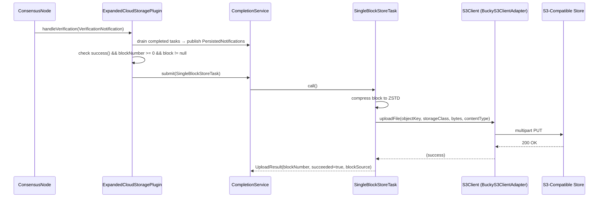
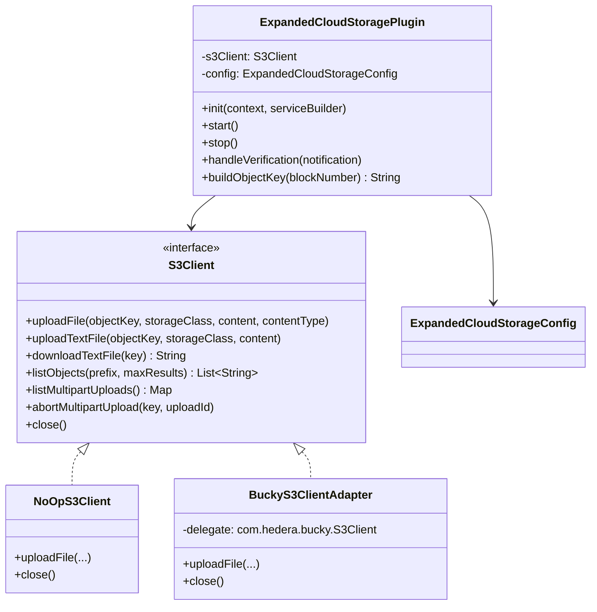

# Expanded Cloud Storage Plugin

## Table of Contents

1. [Purpose](#purpose)
2. [Goals](#goals)
3. [Terms](#terms)
4. [Entities](#entities)
5. [Design](#design)
6. [Diagram](#diagram)
7. [Configuration](#configuration)
8. [Metrics](#metrics)
9. [Exceptions](#exceptions)
10. [Acceptance Tests](#acceptance-tests)

## Purpose

The `expanded-cloud-storage` plugin uploads each individually-verified block as a compressed
`.blk.zstd` object directly to any S3-compatible object store (AWS S3, GCS via S3-interop,
MinIO, etc.). Unlike the existing `s3-archive` plugin, which batches blocks into large tar
archives, this plugin uploads **one block per S3 object** — making individual blocks
immediately queryable and suitable for consumers that need block-level granularity in the
cloud.

## Goals

- Upload each verified block as a single `.blk.zstd` S3 object using ZSTD-compressed
  Protobuf encoding.
- Support any S3-compatible store (AWS S3, GCS S3-interop, MinIO) via a pluggable
  `S3Client` interface backed by the `com.hedera.bucky:bucky-client` library.
- Provide a zero-cost disabled state (blank `endpointUrl` → plugin skips registration).
- (Future) Extend to `BlockProviderPlugin` to serve blocks back from S3 for gap-fill and
  disaster recovery.

## Terms

<dl>
  <dt>S3-compatible object store</dt>
  <dd>Any storage service that implements the AWS S3 REST API, including AWS S3, Google Cloud
      Storage (via S3 interoperability), and MinIO.</dd>

  <dt>Object key</dt>
  <dd>The full path of an object within an S3 bucket, e.g.
      <code>blocks/0000/0000/0000/0000/001.blk.zstd</code>.</dd>

  <dt>ZSTD_PROTOBUF</dt>
  <dd>The block encoding that serialises a block as Protobuf then ZSTD-compresses it. This is
      the canonical on-disk and in-cloud format.</dd>

  <dt>bucky-client</dt>
  <dd><code>com.hedera.bucky:bucky-client</code> — the Hedera S3 client library on Maven
      Central. Provides <code>com.hedera.bucky.S3Client</code> (a final concrete class) and
      the exception hierarchy <code>S3ClientException</code> →
      <code>S3ClientInitializationException</code> / <code>S3ResponseException</code>.</dd>

  <dt>S3ResponseException</dt>
  <dd>A <code>com.hedera.bucky.S3ClientException</code> subtype thrown when the S3 service
      returns a non-success HTTP response. Carries the HTTP status code
      (<code>getResponseStatusCode()</code>), raw response body
      (<code>getResponseBody()</code>), and response headers
      (<code>getResponseHeaders()</code>).</dd>

  <dt>BuckyS3ClientAdapter</dt>
  <dd>The production implementation of the local <code>S3Client</code> interface, wrapping
      <code>com.hedera.bucky.S3Client</code> with thin delegation — no exception translation
      needed.</dd>

  <dt>NoOpS3Client</dt>
  <dd>A no-operation <code>S3Client</code> implementation used in unit tests; logs all calls
      at INFO level, returns empty/null, never throws.</dd>
</dl>

## Entities

### `S3Client` (interface)
Defined in `org.hiero.block.node.expanded.cloud.storage`. Mirrors bucky's public API.
The production implementation is `BuckyS3ClientAdapter`; `NoOpS3Client` is used for testing.

Key methods (all declare `throws com.hedera.bucky.S3ClientException, IOException`):
- `uploadFile(objectKey, storageClass, Iterator<byte[]> content, contentType)`
- `uploadTextFile(objectKey, storageClass, content)`
- `downloadTextFile(key)`
- `listObjects(prefix, maxResults)`
- `listMultipartUploads()`
- `abortMultipartUpload(key, uploadId)`
- `close()`

### `BuckyS3ClientAdapter`
Production adapter wrapping `com.hedera.bucky.S3Client`. Constructed from
`ExpandedCloudStorageConfig`; no exception translation is required because bucky throws
`com.hedera.bucky.S3ResponseException` (a subtype of `com.hedera.bucky.S3ClientException`),
which satisfies the interface's declared throws clause directly.

### `NoOpS3Client`
No-op stub implementing `S3Client`; used in unit tests.

### `ExpandedCloudStorageConfig`
`@ConfigData("expanded.cloud.storage")` record carrying all plugin settings.

### `ExpandedCloudStoragePlugin`
Implements `BlockNodePlugin` and `BlockNotificationHandler`. Listens for
`VerificationNotification`, compresses block bytes to ZSTD, and uploads one `.blk.zstd`
object per block via a `CompletionService` backed by a virtual-thread executor.

## Design

### Trigger: `VerificationNotification`

The plugin registers as a `BlockNotificationHandler` and reacts to `VerificationNotification`
events. Block bytes are taken directly from `notification.block()`, eliminating any dependency
on the local historical block provider and allowing cloud upload to run in parallel with local
file storage.

### Upload flow (`handleVerification`)

1. **Drain**: poll `CompletionService` for any previously completed upload tasks; publish a
   `PersistedNotification` for each (success or failure).
2. **Guard**: `notification.success() == false` → skip (log TRACE).
3. **Guard**: `notification.blockNumber() < 0` → skip (log TRACE).
4. **Guard**: `notification.block() == null` → skip (log WARNING).
5. Compress block: `CompressionType.ZSTD.compress(BlockUnparsed.PROTOBUF.toBytes(block))`.
6. Build object key using the 4-digit folder hierarchy (see below).
7. Submit `SingleBlockStoreTask` to the `CompletionService`.

### Object key format

```
{objectKeyPrefix}/AAAA/BBBB/CCCC/DDDD/EEE.blk.zstd
```

The 19-digit zero-padded block number is split into four 4-digit folder groups plus a 3-digit
leaf (4/4/4/4/3) for lexicographic ordering and S3 prefix partitioning.

| Block number | Object key |
|---|---|
| 1 | `blocks/0000/0000/0000/0000/001.blk.zstd` |
| 1 234 567 | `blocks/0000/0000/0000/1234/567.blk.zstd` |
| 108 273 182 | `blocks/0000/0000/0010/8273/182.blk.zstd` |

### Enabled / disabled guard

If `expanded.cloud.storage.endpointUrl` is blank (the default), the plugin logs an INFO
message and returns from `init()` without registering a notification handler.

### Future: `BlockProviderPlugin` (download path)

A follow-on issue will extend the plugin to implement `BlockProviderPlugin`, enabling blocks
stored in S3 to be retrieved by the block node for gap-fill or disaster recovery. The MVP
is write-only.

## Diagram

### Upload sequence



### Class relationships



## Configuration

All properties are under the `expanded.cloud.storage` namespace.

| Property | Default | Description |
|---|---|---|
| `expanded.cloud.storage.endpointUrl` | `""` | S3-compatible endpoint URL. **Blank disables the plugin.** |
| `expanded.cloud.storage.bucketName` | `block-node-blocks` | Name of the S3 bucket. |
| `expanded.cloud.storage.objectKeyPrefix` | `blocks` | Prefix prepended to every object key. |
| `expanded.cloud.storage.storageClass` | `STANDARD` | S3 storage class (e.g. `STANDARD`, `GLACIER`). |
| `expanded.cloud.storage.regionName` | `us-east-1` | AWS / S3-compatible region. |
| `expanded.cloud.storage.accessKey` | `""` | S3 access key (not logged). |
| `expanded.cloud.storage.secretKey` | `""` | S3 secret key (not logged). |
| `expanded.cloud.storage.uploadTimeoutSeconds` | `60` | Max seconds per upload before treating as failed. |
| `expanded.cloud.storage.maxConcurrentUploads` | `4` | Max parallel in-flight uploads. |

## Metrics

No custom metrics are defined for the MVP. A follow-on issue should add:

- `expanded_cloud_storage_uploads_total` — counter of successful block uploads.
- `expanded_cloud_storage_upload_failures_total` — counter of failed uploads (S3 errors).
- `expanded_cloud_storage_upload_bytes_total` — total bytes uploaded.

## Exceptions

| Exception | Source | Handling |
|---|---|---|
| `com.hedera.bucky.S3ResponseException` | `BuckyS3ClientAdapter.uploadFile()` | Logged at WARNING (includes HTTP status code, body); upload marked failed; plugin continues. `S3ResponseException` carries `getResponseStatusCode()`, `getResponseBody()`, and `getResponseHeaders()` for diagnostics. |
| `com.hedera.bucky.S3ClientException` | `BuckyS3ClientAdapter.uploadFile()` | Logged at WARNING; upload marked failed; plugin continues. |
| `IOException` | `BuckyS3ClientAdapter.uploadFile()` | Logged at WARNING; upload marked failed; plugin continues. |
| `com.hedera.bucky.S3ClientInitializationException` | `BuckyS3ClientAdapter` constructor | Logged at WARNING; plugin sets `enabled = false`. |
| Block bytes empty | `SingleBlockStoreTask.call()` | Logged at WARNING; upload skipped; `PersistedNotification` sent with `succeeded=false`. |

The plugin is designed to be **fault-isolated**: no exception from S3 will propagate up to
crash the node.

## Acceptance Tests

1. **Disabled by default**: with blank `endpointUrl`, no `BlockNotificationHandler` is
   registered and no S3 calls are made.
2. **Correct object key format**: block number `1234567` →
   `blocks/0000/0000/0000/1234/567.blk.zstd` (4/4/4/4/3 folder hierarchy).
3. **Correct content type**: `uploadFile` is called with `"application/octet-stream"`.
4. **Correct storage class**: `uploadFile` receives the configured `storageClass` value.
5. **Failed verification skip**: `VerificationNotification` with `success=false` → no upload.
6. **S3ResponseException isolation**: `S3ResponseException` (any 4xx/5xx HTTP code) thrown
   by `uploadFile` → plugin logs WARNING, does not rethrow, sends `PersistedNotification`
   with `succeeded=false`.
7. **S3ClientException isolation**: base `S3ClientException` → same handling as above.
8. **Integration (MinIO)**: after `handleVerification` for blocks 100–104, all five objects
   appear in the MinIO bucket with non-empty content.
9. **PersistedNotification on success**: successful upload publishes
   `PersistedNotification(blockNumber, succeeded=true)`.
10. **PersistedNotification on failure**: failed upload publishes
    `PersistedNotification(blockNumber, succeeded=false)`.
