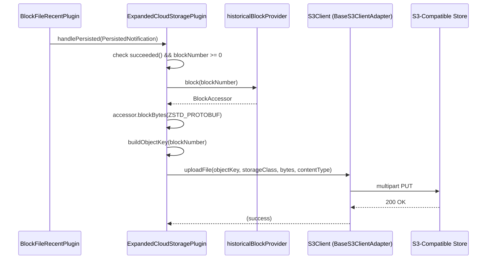
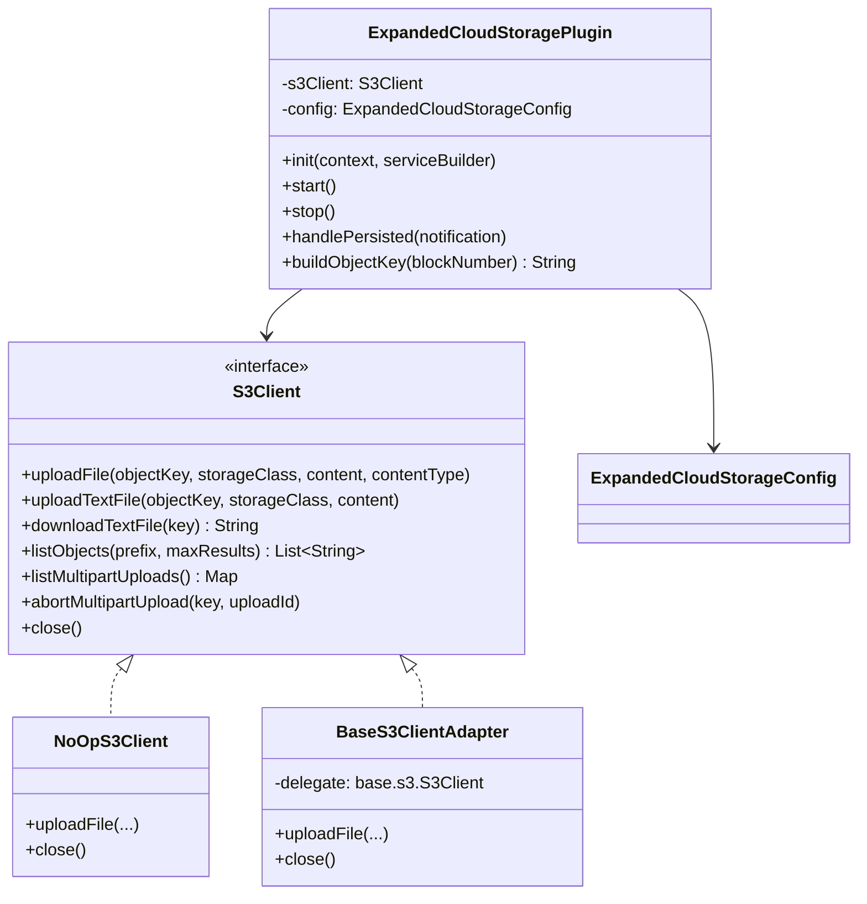

# Expanded Cloud Storage Plugin

## Table of Contents

1. [Purpose](#purpose)
2. [Goals](#goals)
3. [Terms](#terms)
4. [Entities](#entities)
5. [Design](#design)
6. [Diagram](#diagram)
7. [Configuration](#configuration)
8. [Metrics](#metrics)
9. [Exceptions](#exceptions)
10. [Acceptance Tests](#acceptance-tests)

## Purpose

The `expanded-cloud-storage` plugin uploads each individually-verified block as a compressed
`.blk.zstd` object directly to any S3-compatible object store (AWS S3, GCS via S3-interop,
MinIO, etc.). Unlike the existing `s3-archive` plugin, which batches blocks into large tar
archives, this plugin uploads **one block per S3 object** — making individual blocks
immediately queryable and suitable for consumers that need block-level granularity in the
cloud.

## Goals

- Upload each persisted block as a single `.blk.zstd` S3 object using ZSTD-compressed
  Protobuf encoding (`Format.ZSTD_PROTOBUF`).
- Support any S3-compatible store (AWS S3, GCS S3-interop, MinIO) via a pluggable
  `S3Client` interface.
- Provide a zero-cost disabled state (blank `endpointUrl` → plugin skips registration).
- Establish a clean swap path to `hedera-bucky` when it becomes available on Maven Central:
  a thin adapter class is all that changes — no plugin logic or test modifications required.
- (Future) Extend to `BlockProviderPlugin` to serve blocks back from S3 for gap-fill and
  disaster recovery.

## Terms

<dl>
  <dt>S3-compatible object store</dt>
  <dd>Any storage service that implements the AWS S3 REST API, including AWS S3, Google Cloud
      Storage (via S3 interoperability), and MinIO.</dd>

  <dt>Object key</dt>
  <dd>The full path of an object within an S3 bucket, e.g.
      <code>blocks/0000000000001234567.blk.zstd</code>.</dd>

  <dt>ZSTD_PROTOBUF</dt>
  <dd>The <code>BlockAccessor.Format</code> that returns a block serialised as Protobuf and
      then ZSTD-compressed. This is the canonical on-disk and in-cloud format.</dd>

  <dt>PersistedNotification</dt>
  <dd>A block messaging event emitted by <code>BlockFileRecentPlugin</code> after a block has
      been written to local disk. It carries the block number and a success flag.</dd>

  <dt>hedera-bucky</dt>
  <dd>A future Hedera library that will provide a production-grade S3 client. Not yet
      available on Maven Central at the time of this writing.</dd>

  <dt>BaseS3ClientAdapter</dt>
  <dd>The current production implementation of the <code>S3Client</code> interface, wrapping
      the concrete <code>org.hiero.block.node.base.s3.S3Client</code>.</dd>

  <dt>NoOpS3Client</dt>
  <dd>A no-operation <code>S3Client</code> implementation used in unit tests; logs all calls
      at INFO level, returns empty/null, never throws.</dd>
</dl>

## Entities

### `S3Client` (interface)
Defined in `org.hiero.block.node.expanded.cloud.storage`. Mirrors hedera-bucky's public API
so that a future `HederaBuckyS3ClientAdapter` is a thin delegation wrapper — no changes to
plugin logic required.

Key methods:
- `uploadFile(objectKey, storageClass, Iterator<byte[]> content, contentType)`
- `uploadTextFile(objectKey, storageClass, content)`
- `downloadTextFile(key)`
- `listObjects(prefix, maxResults)`
- `listMultipartUploads()`
- `abortMultipartUpload(key, uploadId)`
- `close()`

### `S3ClientException`
Checked exception base class for all S3 client failures, mirroring hedera-bucky's
`S3ResponseException` hierarchy.

### `NoOpS3Client`
No-op stub implementing `S3Client`; used in unit tests.

### `BaseS3ClientAdapter`
Production adapter wrapping `org.hiero.block.node.base.s3.S3Client`. Translates
`org.hiero.block.node.base.s3.S3ClientException` to `S3ClientException` at the boundary so
plugin logic never imports base-module exception types.

### `ExpandedCloudStorageConfig`
`@ConfigData("expanded.cloud.storage")` record carrying all plugin settings.

### `ExpandedCloudStoragePlugin`
Implements `BlockNodePlugin` and `BlockNotificationHandler`. Listens for
`PersistedNotification`, fetches ZSTD-compressed block bytes, and uploads one `.blk.zstd`
object per block.

## Design

### Trigger: `PersistedNotification`

The plugin registers as a `BlockNotificationHandler` and reacts to `PersistedNotification`
events. These are fired by `BlockFileRecentPlugin` after a block has been written to local
disk, meaning the block is already verified and available via `historicalBlockProvider`.
This mirrors the `s3-archive` plugin's approach and avoids double-verifying or coupling to
the verification path.

### Upload flow (`handlePersisted`)

1. **Guard**: `notification.succeeded() == false` → skip (log TRACE).
2. **Guard**: `notification.blockNumber() < 0` → skip (log TRACE).
3. Retrieve `BlockAccessor` from `context.historicalBlockProvider().block(blockNumber)`.
4. Obtain bytes: `accessor.blockBytes(Format.ZSTD_PROTOBUF).toByteArray()` — already
   compressed, no extra work needed.
5. Build object key: `{objectKeyPrefix}/{zeroPadded(blockNumber)}.blk.zstd` (19-digit
   zero-padding ensures lexicographic order equals numeric order).
6. Wrap bytes in a single-element `Iterator<byte[]>`.
7. Call `s3Client.uploadFile(objectKey, storageClass, iterator, "application/octet-stream")`.
8. On `S3ClientException` or `IOException`: log WARNING, do **not** rethrow — plugin must
   not crash the node.

### Object key format

```
{objectKeyPrefix}/{zeroPaddedBlockNumber}.blk.zstd
```

`zeroPaddedBlockNumber` is formatted to 19 digits (matching `Long.MAX_VALUE` digit count)
using `BlockFile.blockNumberFormated(blockNumber)`.

Example: `blocks/0000000000001234567.blk.zstd`

### Enabled / disabled guard

If `expanded.cloud.storage.endpointUrl` is blank (the default), the plugin logs an INFO
message and returns from `init()` without registering a notification handler. This matches
the `s3-archive` convention.

### S3Client swap path (hedera-bucky)

When `hedera-bucky` is published to Maven Central:

1. Add `requires com.hedera.bucky` to `module-info.java`.
2. Create `HederaBuckyS3ClientAdapter implements S3Client` in the same package (thin
   delegation).
3. Update `ExpandedCloudStoragePlugin.createS3Client()` to instantiate the adapter.
4. Delete (or retain for testing) `BaseS3ClientAdapter`.

**No changes** to plugin logic, configuration record, or tests are required.

### Future: `BlockProviderPlugin` (download path)

A follow-on issue will extend the plugin to implement `BlockProviderPlugin`, enabling blocks
stored in S3 to be retrieved by the block node for gap-fill or disaster recovery. The MVP
is write-only to keep scope minimal.

## Diagram

### Upload sequence



### Class relationships



## Configuration

All properties are under the `expanded.cloud.storage` namespace.

| Property | Default | Description |
|---|---|---|
| `expanded.cloud.storage.endpointUrl` | `""` | S3-compatible endpoint URL. **Blank disables the plugin.** |
| `expanded.cloud.storage.bucketName` | `block-node-blocks` | Name of the S3 bucket. |
| `expanded.cloud.storage.objectKeyPrefix` | `blocks` | Prefix prepended to every object key. |
| `expanded.cloud.storage.storageClass` | `STANDARD` | S3 storage class (e.g. `STANDARD`, `GLACIER`). |
| `expanded.cloud.storage.regionName` | `us-east-1` | AWS / S3-compatible region. |
| `expanded.cloud.storage.accessKey` | `""` | S3 access key (not logged). |
| `expanded.cloud.storage.secretKey` | `""` | S3 secret key (not logged). |

## Metrics

No custom metrics are defined for the MVP. A follow-on issue should add:

- `expanded_cloud_storage_uploads_total` — counter of successful block uploads.
- `expanded_cloud_storage_upload_failures_total` — counter of failed uploads (S3 errors).
- `expanded_cloud_storage_upload_bytes_total` — total bytes uploaded.

## Exceptions

| Exception | Source | Handling |
|---|---|---|
| `S3ClientException` | `S3Client.uploadFile()` | Logged at WARNING; upload skipped; plugin continues. |
| `IOException` | `S3Client.uploadFile()` | Logged at WARNING; upload skipped; plugin continues. |
| `S3ClientException` | `BaseS3ClientAdapter` constructor (init) | Logged at WARNING; plugin sets `enabled = false`. |
| Block accessor `null` | `historicalBlockProvider.block()` | Logged at WARNING; upload skipped. |

The plugin is designed to be **fault-isolated**: no exception from S3 or the historical block
provider will propagate up to crash the node.

## Acceptance Tests

1. **Disabled by default**: with blank `endpointUrl`, no `BlockNotificationHandler` is
   registered and no S3 calls are made.
2. **Correct object key**: block number `1234567` → key
   `blocks/0000000000001234567.blk.zstd` (19-digit zero-padding).
3. **Correct content type**: `uploadFile` is called with `"application/octet-stream"`.
4. **Correct storage class**: `uploadFile` receives the configured `storageClass` value.
5. **Failed notification skip**: `PersistedNotification` with `succeeded=false` → no upload.
6. **S3 error isolation**: `S3ClientException` thrown by `uploadFile` → plugin logs WARNING,
   does not rethrow, continues processing subsequent notifications.
7. **Integration (MinIO)**: after `handlePersisted` for blocks 0–4, all five objects appear
   in the MinIO bucket with non-empty content.
8. **Block content integrity**: downloaded `.blk.zstd` bytes match
   `blockAccessor.blockBytes(Format.ZSTD_PROTOBUF)` for the same block number.
