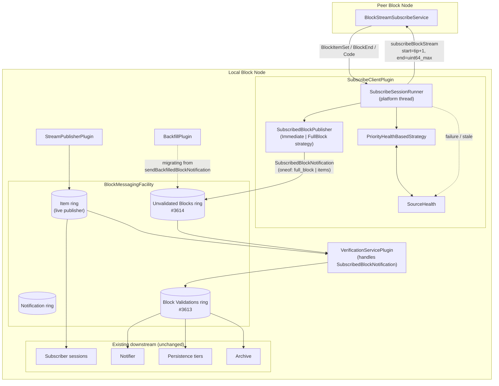
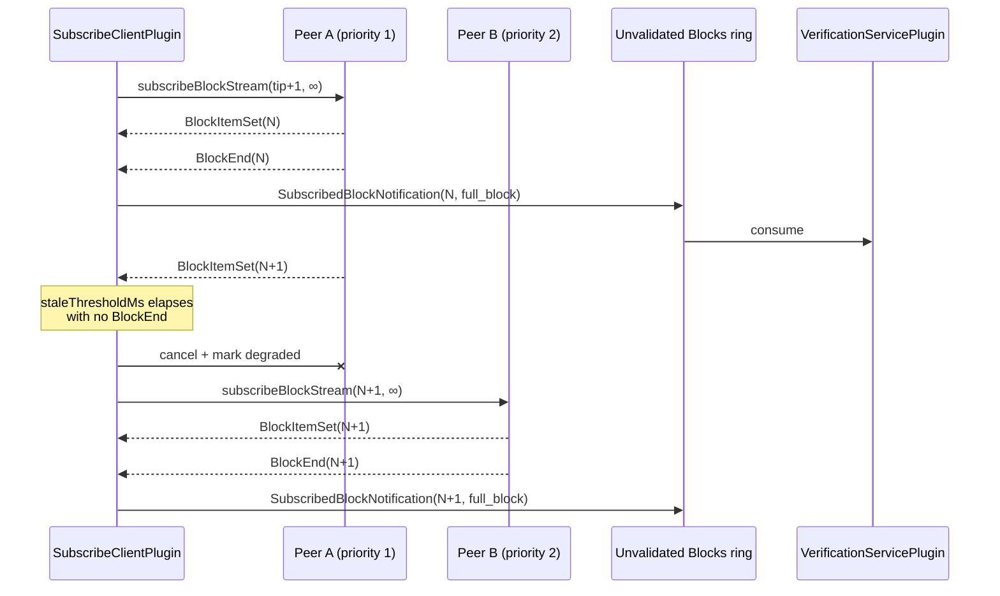

# Subscribe Client Plugin Design Document

## Purpose

Enable a Block Node (BN) to receive blocks from another BN in real time by
consuming a peer's `BlockStreamSubscribeService.subscribeBlockStream` RPC as
a long-lived open-ended live tail. This provides cross-BN replication for
deployments where the receiving BN is not directly connected to consensus
node publishers.

Real-time replication complements the existing `BackfillPlugin` (which
periodically fetches historical gaps). Backfill continues to own catching
up older ranges; this plugin owns the live edge.

## Goals

1. Continuously stream the peer's live block tail into the local BN so it
   stays within a small, bounded number of blocks of the peer's tip.
2. Prefer higher-priority peers and fail over to lower-priority peers when
   the primary is unavailable or meaningfully delayed.
3. Deliver received blocks into the local ingestion pipeline through the
   new **Unvalidated Blocks ring buffer** introduced by Epic #3612 (story
   #3614), keeping this path fully isolated from the live-publisher ring.
4. Support two delivery modes selectable by global config: **immediate**
   (forward each `BlockItemSet` as it arrives, lowest latency) and
   **full-block** (accumulate items and deliver a whole block once
   complete, simplest downstream contract).
5. Reuse the shared BN-to-BN client stack
   (`BlockStreamSubscribeUnparsedClient`, `BlockNodeSource` peer config,
   `PriorityHealthBasedStrategy` selection).
6. Provide operator instrumentation (metrics, logs) that make replication
   lag, reconnects, and failover visible.

## Non-Goals

1. Historical gap detection or backfill. That remains `BackfillPlugin`'s
   responsibility. This plugin only tails live.
2. Reworking the `StreamPublisherPlugin`, `VerificationServicePlugin`, or
   the existing item ring. The design deliberately uses a separate ring
   buffer so the well-tested publisher path is untouched.
3. Multi-source aggregation. Only one peer streams to us at a time; the
   others are standby.
4. Making the two delivery modes selectable per-peer. Mode is a **global
   on/off**; every configured peer uses the same mode.

## Terms

<dl>
  <dt>Subscribe Client</dt>
  <dd>This plugin. Consumes a peer BN's <code>subscribeBlockStream</code> RPC as
      an open-ended live tail (<code>end_block_number = uint64_max</code>).</dd>

  <dt>Peer BN</dt>
  <dd>Another Block Node instance that exposes
      <code>BlockStreamSubscribeService</code>. Described by a
      <code>BlockNodeSourceConfig</code> entry in the peer-sources JSON file.</dd>

  <dt>Live Tail</dt>
  <dd>The RPC mode where the client requests
      <code>start_block_number = local_tip + 1</code> and
      <code>end_block_number = uint64_max</code>, causing the server to stream
      indefinitely until the client half-closes or the connection breaks.</dd>

  <dt>Immediate Mode</dt>
  <dd>Delivery mode where each <code>BlockItemSet</code> received from the peer
      is forwarded downstream as soon as it arrives. Lowest end-to-end latency;
      downstream consumers must handle partial-block streams. Considered a
      "nice to have" — expected to be used sparingly (e.g. Jasper or other
      latency-sensitive downstream consumers).</dd>

  <dt>Full-Block Mode</dt>
  <dd>Delivery mode where item sets are accumulated until a complete block is
      assembled, then delivered as a single whole-block message. Simpler
      downstream contract; higher latency by one block-assembly interval.
      Default mode.</dd>

  <dt>Unvalidated Blocks Ring</dt>
  <dd>The new ring buffer added by Epic #3612 (story #3614) for full blocks
      that have not yet been verified locally. Sources include backfill,
      future tier-two-subscriber plugins (this plugin), and gossip. Isolated
      from the live-publisher item ring so this plugin cannot back-pressure
      the live path.</dd>

  <dt>Meaningfully Delayed</dt>
  <dd>A peer that is still reachable but not delivering blocks at the expected
      cadence. Detected client-side by
      <code>time_since_last_BlockEnd &gt; staleThresholdMs</code>. Triggers
      failover to a lower-priority peer.</dd>

  <dt>Active Peer</dt>
  <dd>The single peer the plugin is currently streaming from. At most one at
      any time.</dd>

  <dt>Failover</dt>
  <dd>Terminating the current subscribe stream (marking the peer degraded in
      <code>SourceHealth</code>) and opening a new subscribe stream against
      the next selectable peer.</dd>

  <dt>SubscribedBlockNotification</dt>
  <dd>New notification message (defined by this plugin) carrying either a
      full <code>BlockUnparsed</code> or a <code>BlockItemSetUnparsed</code>
      via a <code>oneof</code>. Exactly one of the two variants is set per
      notification, driven by the configured delivery mode.</dd>
</dl>

## Entities

- **`SubscribeClientPlugin`** implements `BlockNodePlugin`. Registers itself,
  starts the streaming loop on `start()`, tears it down on `stop()`.
- **`SubscribeClientConfiguration`** — `@ConfigData("subscribe.client")`
  record with mode toggle, peer-sources file path, thresholds, tuning knobs.
- **`SubscribeClientConfigExtension`** — registers the config record.
- **`SubscribeSessionRunner`** — long-lived loop that owns active peer
  selection and drives one `BlockStreamSubscribeUnparsedClient` call at a
  time. Runs on a dedicated platform thread.
- **`SubscribedBlockPublisher`** — thin adapter that receives frames from
  the streaming callback and publishes `SubscribedBlockNotification`s onto
  the **Unvalidated Blocks ring buffer**. Two internal strategies:
  - **`ImmediatePublishStrategy`** — emits one notification per received
    `BlockItemSetUnparsed`.
  - **`FullBlockPublishStrategy`** — buffers item sets keyed by block
    number, emits one notification per `BlockUnparsed` when the block is
    complete (signalled by the peer's `BlockEnd`).
- **`SourceHealth` / `PriorityHealthBasedStrategy`** — reused from
  `backfill`. See Open Question #5 for shared-code location.
- **`BlockNodeSourceConfig`** (proto) — reused as-is; peer's `subscribe_port`
  field is used to dial the subscribe endpoint.

## Design

### Peer Configuration

Peers are configured in an external JSON file whose path is set via
`subscribe.client.blockNodeSourcesPath`. The file is parsed into the shared
PBJ message `BlockNodeSource` (from
`protobuf-sources/src/main/proto/internal/block_node_source.proto`), which
wraps `repeated BlockNodeSourceConfig nodes`. Each entry carries:

- `address`, `port`, `subscribe_port`, `status_port`
- `priority` (lower = higher preference)
- `node_id`, `name`, `scheme`, `protocol`
- `grpc_webclient_tuning`

The plugin dials `subscribe_port` (falling back to `port`) for the subscribe
RPC and `status_port` for pre-flight `serverStatus` checks.

Rationale for reusing `BlockNodeSource`: the proto already carries a
dedicated `subscribe_port` field designed for this use case, and the JSON
format is identical to what operators already maintain for Backfill.

### Source Selection and Failover

Selection reuses `PriorityHealthBasedStrategy`:

1. Filter out peers currently in exponential backoff.
2. Sort by `(priority ASC, healthScore ASC)`.
3. Pick the first candidate whose pre-flight `serverStatus` shows a tip at
   or ahead of our local tip.

**Failover triggers:**

- **Unavailable** — the subscribe RPC returns a terminal error status
  (`ERROR`, `NOT_AVAILABLE`, `INVALID_*`), or the transport fails (HTTP/2
  RST, connection close, gRPC deadline exceeded). Peer is marked failed in
  `SourceHealth`, backoff timer starts, next candidate is selected.

- **Meaningfully delayed** — the receiving side observes
  `time_since_last_BlockEnd > staleThresholdMs`. Current stream is
  cancelled, peer's `SourceHealth` is decremented (not fully failed — it
  may recover), and the next candidate is tried. Default threshold: 3×
  expected block interval (e.g. 3000 ms for a 1 s cadence).

  This is intentionally client-side and cheap. We do **not** poll the peer's
  `serverStatus` during the live stream to compare tips. See Open
  Question #3.

Backoff is exponential per peer: `delay = initialRetryDelay × 2^(attempts-1)`,
capped at `maxBackoffMs`. Reset on successful reconnect.

### Delivery Modes

Two modes, selected globally via `subscribe.client.deliveryMode`:

| Mode | Emits | Latency | Downstream contract |
|---|---|---|---|
| `full-block` (default) | one notification per assembled `BlockUnparsed` | + one block interval | Consumer receives a whole block, ready to verify |
| `immediate` | one notification per received `BlockItemSetUnparsed` | none added | Consumer must reassemble; suitable for tools like Jasper |

The mode is **strictly global on/off** — every configured peer uses the
same mode. Making mode per-peer is deferred (see Open Question #4).

The `SubscribedBlockNotification` message carries the payload in a `oneof`:

```proto
message SubscribedBlockNotification {
  uint64 block_number = 1;
  oneof payload {
    BlockUnparsed full_block = 2;         // full-block mode
    BlockItemSetUnparsed items = 3;       // immediate mode
  }
}
```

Exactly one of `full_block` or `items` is set per notification. Consumers
handle both variants (see Pipeline Integration below).

### Pipeline Integration

Injection is through the **Unvalidated Blocks ring buffer** (Epic #3612 /
story #3614), not the existing item ring. This is deliberate — reworking
the publisher/verification hot path or contending on its single-producer
item ring would demand extensive testing and a longer development cycle.
The new ring exists specifically for full-block payloads from backfill,
tier-two-subscriber (this plugin), and future gossip, isolated from
live-publisher back-pressure.

Flow per received frame:

1. `SubscribeSessionRunner` receives a `BlockItemSetUnparsed` or `BlockEnd`
   from the peer subscribe stream.
2. `SubscribedBlockPublisher` (via the configured strategy) constructs a
   `SubscribedBlockNotification`:
   - Immediate mode: one notification per `BlockItemSetUnparsed` frame.
   - Full-block mode: buffer per block; on `BlockEnd`, assemble
     `BlockUnparsed` and emit one notification.
3. Notification is published on the Unvalidated Blocks ring buffer.

Downstream consumers of the Unvalidated Blocks ring:

- **`VerificationServicePlugin`** — extended to handle
  `SubscribedBlockNotification`. Verification logic is unchanged; a small
  adapter registers a handler on the new ring and routes both `oneof`
  variants into the existing per-block verification pathway. Considered
  low complexity by the plugin owners.
- Persistence tiers, archive, subscriber fan-out, and notifier continue to
  receive their inputs downstream of verification (via the existing
  `VerificationNotification` / `PersistedNotification` mechanism), so no
  changes needed there.

Ordering:

- Immediate mode preserves peer ordering per stream because
  `SubscribeSessionRunner` is single-threaded; item sets are published in
  arrival order per block.
- Full-block mode is strictly ordered by construction: one notification per
  block, emitted only on `BlockEnd`, in ascending block number.

### Relationship to Backfill

Distinct plugins, distinct responsibilities, distinct data paths on the
same new ring buffer:

| Concern | Subscribe Client | Backfill |
|---|---|---|
| Time horizon | Live tail (`local_tip + 1 → ∞`) | Historical gaps |
| Trigger | Continuous open-ended stream | Gap detection + periodic sweep |
| RPC | `subscribeBlockStream` (open-ended) | `subscribeBlockStream` (bounded ranges) |
| Injection ring | Unvalidated Blocks (#3614) | Unvalidated Blocks (#3614) — migrated from `sendBackfilledBlockNotification` |
| Coexist? | Yes — non-overlapping block ranges | Yes — non-overlapping block ranges |

On cold start, if the local BN is far behind, Backfill's historical
scheduler brings the archive current. Subscribe Client sits idle until
`local_tip` is close enough to the peer's tip for a live subscribe to
succeed — the plugin computes `start = local_tip + 1` immediately before
opening the RPC and delegates the "too far behind" decision to the peer's
response code (`NOT_AVAILABLE` when the peer no longer holds the requested
historical start block).

### Coexistence with the Publisher Plugin

`StreamPublisherPlugin` and `SubscribeClientPlugin` publish onto
**different** ring buffers (existing item ring vs new Unvalidated Blocks
ring), so they do not interfere at the messaging-facility layer. Both may
be enabled simultaneously.

However, certain deployment combinations are semantically dubious even if
technically permitted:

- Enabling both on the same BN can result in the local BN receiving the
  same blocks from two independent sources (direct consensus publisher +
  peer BN mirror). The system will not corrupt state because verification
  is idempotent and persistence deduplicates by block number, but it is
  wasteful.

The design **strongly discourages** enabling both in the same deployment
via documented operator guidance rather than a hard `init()`-time mutex.
Startup logs a WARN when both are enabled to make the situation visible.

Typical deployments:

- **Primary BN** — `StreamPublisherPlugin` on, `SubscribeClientPlugin`
  off. Receives directly from consensus.
- **Replica BN** — `SubscribeClientPlugin` on, `StreamPublisherPlugin`
  off. Mirrors a primary BN.

### Startup and Reconnection

Per session (one iteration of the streaming loop):

1. Query local `HistoricalBlockFacility` for `local_tip`.
2. Select next candidate peer via `PriorityHealthBasedStrategy`.
3. Optionally call peer's `serverStatus` for a pre-flight availability
   check (skippable via config).
4. Open `subscribeBlockStream` with
   `start_block_number = local_tip + 1`, `end_block_number = uint64_max`.
5. Consume the response stream:
   - `BlockItemSet` → hand to `SubscribedBlockPublisher`.
   - `BlockEnd` → in full-block mode, trigger notification emit; reset
     stale-watchdog timer.
   - Terminal `Code` (any) → mark peer per code; fall through to reconnect.
6. On any stream termination: sleep `reconnectMinDelayMs`, loop back to
   step 1.

## Diagram



Sequence for a healthy stream with mid-stream failover (full-block mode):



## Configuration

`@ConfigData("subscribe.client")` record:

| Field | Type | Default | Purpose |
|---|---|---|---|
| `enabled` | boolean | `false` | Master switch. |
| `deliveryMode` | enum (`full-block` or `immediate`) | `full-block` | Global mode. Strictly on/off — not per-peer. |
| `blockNodeSourcesPath` | String | `""` | Path to peer-sources JSON (parsed as PBJ `BlockNodeSource`). |
| `staleThresholdMs` | long | `3000` | Time since last `BlockEnd` before failing over. |
| `initialRetryDelayMs` | long | `500` | Base for exponential per-peer backoff. |
| `maxBackoffMs` | long | `60000` | Cap on per-peer backoff. |
| `reconnectMinDelayMs` | long | `250` | Minimum sleep between session iterations. |
| `preflightServerStatus` | boolean | `true` | Whether to call `serverStatus` before opening a subscribe stream. |
| `grpcOverallTimeout` | Duration | `30s` | Per-call gRPC deadline for `serverStatus`. |
| `enableTLS` | boolean | `false` | TLS toggle. Follows Backfill's convention. |
| `maxIncomingBufferSize` | int | `4194304` | Helidon client incoming buffer. |

Peer JSON file: identical schema to Backfill's `block-nodes.json`, reused
via the shared `BlockNodeSource` PBJ message. `subscribe_port` field is
used for the subscribe stream; `status_port` for the pre-flight
`serverStatus` call.

## Metrics

Category: `blocknode`. All names use snake_case:

| Metric | Type | Meaning |
|---|---|---|
| `subscribe_client_active_peer` | ObservableGauge | Index/id of the currently-active peer (-1 if none). |
| `subscribe_client_delivery_mode` | ObservableGauge | 0 = full-block, 1 = immediate. |
| `subscribe_client_blocks_received` | LongCounter | Blocks with a `BlockEnd` received from the peer. |
| `subscribe_client_notifications_emitted` | LongCounter | `SubscribedBlockNotification`s published to the ring. Labeled by mode. |
| `subscribe_client_stream_opens` | LongCounter | Successful subscribe stream openings. |
| `subscribe_client_stream_terminations` | LongCounter | All stream ends, labeled by cause (clean, error, transport, stale). |
| `subscribe_client_failovers` | LongCounter | Failovers triggered. |
| `subscribe_client_reconnects` | LongCounter | Total reconnect attempts. |
| `subscribe_client_lag_ms` | ObservableGauge | `now - lastBlockEndReceivedAt`. |
| `subscribe_client_peer_backoff_active` | ObservableGauge | Count of peers currently in exponential backoff. |
| `subscribe_client_last_block_number` | ObservableGauge | Highest block number for which a notification was emitted. |

## Exceptions

| Situation | Handling |
|---|---|
| Peer returns terminal `Code != SUCCESS` | Mark peer failed in `SourceHealth`, log at WARN with code + peer id, start backoff, reconnect. |
| HTTP/2 transport failure (RST, connection reset, timeout) | Same as above; wrapped as failure in the streaming callback. |
| Ring-buffer publish throws | Log at ERROR, cancel stream, mark peer failed (defensively), backoff, reconnect. Do NOT swallow silently. |
| No peer selectable (all in backoff, or empty file) | Sleep `reconnectMinDelayMs × factor`, retry selection. Log at WARN with a rate-limited cadence. |
| Config validation: `enabled=true` and `blockNodeSourcesPath` missing / unreadable / malformed | Fail-fast at `init()`. |
| Config validation: peer JSON file has zero entries and plugin enabled | Fail-fast at `init()` — misconfiguration. |
| Config validation: both `SubscribeClientPlugin` and `StreamPublisherPlugin` enabled | Log a WARN naming the conflict; do NOT fail-fast. Both plugins use separate ring buffers so this is safe, just wasteful (see [Coexistence with the Publisher Plugin](#coexistence-with-the-publisher-plugin)). |

## Security

- Peer authentication and transport encryption follow the same pattern as
  Backfill (`enableTLS` toggle). No new key material is introduced.
- The peer BN is trusted to send valid blocks, but
  `VerificationServicePlugin` on the Unvalidated Blocks ring re-verifies
  signatures and Merkle roots, so a compromised or byzantine peer cannot
  silently poison local state — the worst case is repeated verification
  failures and eventual peer eviction.
- The peer-sources JSON file contains hostnames and ports; not secret, but
  its integrity matters. Same operational posture as Backfill's peer file.

## Dependencies

This plugin depends on Epic **#3612 — Expand Ring Buffer Architecture in
Block Messaging Facility**:

- **#3614** (required) — new **Unvalidated Blocks ring buffer**. Injection
  point for this plugin. Must merge before this plugin can be implemented.
- **#3615** (recommended) — ring-buffer sizing/back-pressure tuning across
  all four rings. This plugin's realistic throughput ceiling should be
  informed by whatever size/wait strategy #3615 lands on.
- **#3613** (indirect) — new **Block Validations ring buffer**. Doesn't
  affect this plugin directly, but the downstream verification →
  persistence flow lands on that ring, which is the path our
  `SubscribedBlockNotification`s take after `VerificationServicePlugin`
  processes them.

`BackfillPlugin` will migrate `sendBackfilledBlockNotification` onto the
Unvalidated Blocks ring as part of #3614. Coordinating this migration
alongside the Subscribe Client integration is preferred so both producers
land on the ring at the same version.

## Acceptance Tests

**Unit:**

1. `SubscribeSessionRunner` selects the highest-priority reachable peer on
   startup; on peer failure, selects the next by priority.
2. `SubscribedBlockPublisher` in **immediate mode** emits exactly one
   `SubscribedBlockNotification` per received `BlockItemSetUnparsed` with
   the `items` variant set.
3. `SubscribedBlockPublisher` in **full-block mode** buffers item sets and
   emits exactly one notification per complete block with the `full_block`
   variant set, keyed on `BlockEnd`.
4. Stale watchdog fires: given a stream that stops sending `BlockEnd` for
   longer than `staleThresholdMs`, the current stream is cancelled and a
   failover happens.
5. Terminal `Code != SUCCESS` triggers peer failure marking + backoff.
6. Backoff is exponential per peer and resets on successful reconnect.
7. Config validation: missing peer file fails `init()`; zero-entry peer
   file fails `init()`; both-plugins-enabled logs WARN but does NOT fail.

**Integration (uses `block-node-e2e-tests` harness):**

1. Two BNs, one primary (publisher-enabled) and one replica
   (subscribe-client-enabled, full-block mode). Blocks pushed to primary
   appear on replica through the Unvalidated Blocks → Verification path
   with lag under threshold.
2. Same setup, immediate mode. Item sets appear at the verification stage
   before the block is complete.
3. Kill the primary mid-stream: replica logs failover, holds at last block
   until a secondary peer is available, resumes without gap.
4. Two peers configured on the replica: kill primary peer, replica fails
   over to secondary within `staleThresholdMs`, verify no gap.
5. Restart the replica cold with a peer well ahead: replica reconnects,
   `subscribeBlockStream` returns `NOT_AVAILABLE` (peer no longer holds
   the requested historical start block); backfill catches up; subscribe
   client resumes at live tail once `local_tip + 1` is within peer range.
6. Regression: enable both `StreamPublisherPlugin` and
   `SubscribeClientPlugin` on the same BN — startup succeeds with a WARN,
   verification does not double-persist blocks (dedupe holds).

## Open Questions

1. **Immediate-mode consumers.** Full-block mode has a clear downstream
   (verification then persistence). Immediate mode's target consumer set
   isn't final — Jasper is the main motivating case. Do we need any other
   in-tree consumer for immediate mode in v1, or is it enough that the
   notification exists on the ring and external tools can subscribe later?

2. **Persistence of already-verified blocks.** Backfill re-verifies fetched
   blocks locally. This plugin's flow does the same via the shared
   verification hook on the Unvalidated Blocks ring. Is the CPU cost of
   double-verifying every replicated block acceptable, or do we want a
   fast-path that trusts the peer's proof (would require a new
   `BlockSource.SUBSCRIBED` value on `VerificationNotification` /
   `PersistedNotification`, analogous to `PUBLISHER` / `BACKFILL`)?

3. **Peer-tip lag detection.** The client-side stale watchdog catches the
   case where the peer stops sending us blocks. It does NOT catch the case
   where the peer itself is behind consensus and dutifully sends us its
   stale live tail at normal cadence. Defer until observed in production,
   or add a periodic `serverStatus` poll now?

4. **Per-peer mode.** Design fixes mode globally. Are there realistic
   deployments that want immediate mode on one peer and full-block on
   another? If so we lift the "strictly on/off" constraint later.

5. **Plugin location for shared selection logic.** `SourceHealth` and
   `PriorityHealthBasedStrategy` live inside `block-node/backfill/` today.
   Options: (a) duplicate into this plugin, (b) move to `block-node/base/`
   for reuse. Recommend (b) but coordinate with Backfill owners.

6. **`GrpcWebClientTuning` fallback is hardcoded to
   `backfill.grpcOverallTimeout`.** The `GrpcWebClientTuning` proto
   (`internal/block_node_source.proto:77`) documents that unset timeout
   fields fall back to `backfill.grpcOverallTimeout`. If this plugin
   reuses the shared `BlockNodeClient` for WebClient construction,
   per-peer tuning defaults will keep coming from Backfill's config, not
   ours. Options: (a) accept the coupling (operators supply explicit
   per-peer tuning), (b) generalize `BlockNodeClient` to accept a fallback
   timeout from the calling plugin, (c) add a
   `subscribe.client.grpcOverallTimeout` and shadow the fallback
   ourselves. Recommend (b) but out of scope for v1.

7. **Corner cases (from design collab).** Joseph flagged that there may be
   additional edge cases worth thinking through, not fully enumerated in
   the initial catchup. Candidates to review before implementation:
   - Backfill and Subscribe Client both writing to the Unvalidated Blocks
     ring for overlapping block numbers — how does `VerificationServicePlugin`
     dedupe?
   - What happens on `SubscribedBlockNotification` for a block whose items
     were partially delivered in immediate mode and then the stream drops
     mid-block — is the partial state discarded, and how?
   - Downstream persistence race between Backfill's already-verified path
     and our just-verified path when both fill the same block number.