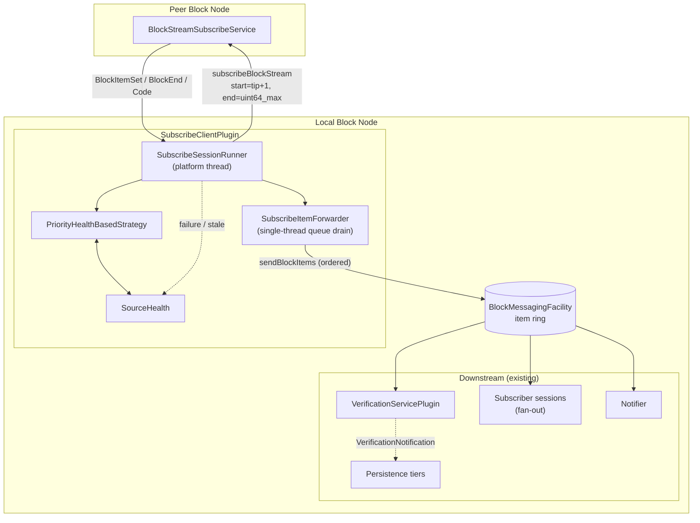
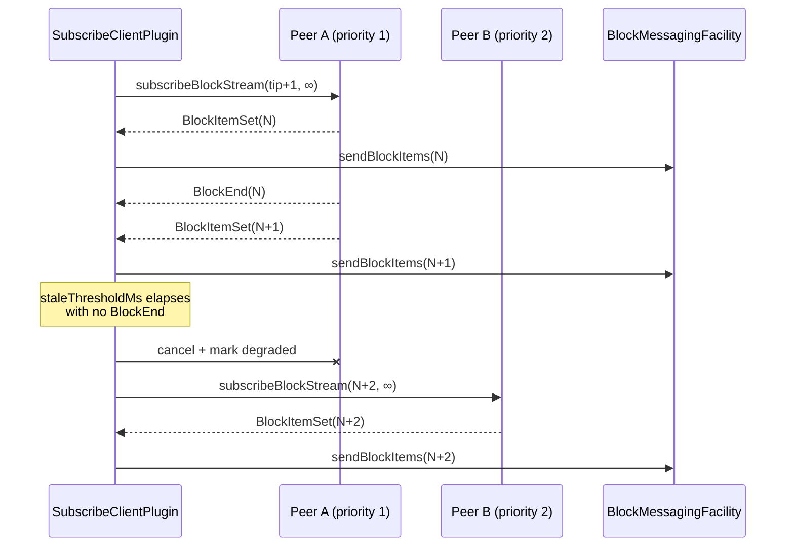

# Subscribe Client Plugin Design Document

## Table of Contents

1. [Purpose](#purpose)
2. [Goals](#goals)
3. [Non-Goals](#non-goals)
4. [Terms](#terms)
5. [Entities](#entities)
6. [Design](#design)
   - [Peer Configuration](#peer-configuration)
   - [Source Selection and Failover](#source-selection-and-failover)
   - [Pipeline Integration](#pipeline-integration)
   - [Relationship to Backfill](#relationship-to-backfill)
   - [Coexistence with the Publisher Plugin](#coexistence-with-the-publisher-plugin)
   - [Startup and Reconnection](#startup-and-reconnection)
7. [Diagram](#diagram)
8. [Configuration](#configuration)
9. [Metrics](#metrics)
10. [Exceptions](#exceptions)
11. [Security](#security)
12. [Acceptance Tests](#acceptance-tests)
13. [Open Questions](#open-questions)

## Purpose

Enable a Block Node (BN) to receive blocks from another BN in real time by
consuming a peer's `BlockStreamSubscribeService.subscribeBlockStream` RPC as
a long-lived open-ended live tail. This provides cross-BN replication for
deployments where the receiving BN is not directly connected to consensus
node publishers.

Real-time replication complements the existing `BackfillPlugin` (which
periodically fetches historical gaps). The Backfill plugin remains
responsible for catching up older ranges; this plugin owns the live edge.

## Goals

1. Continuously stream the peer's live block tail into the local BN so it
   stays within a small, bounded number of blocks of the peer's tip.
2. Prefer higher-priority peers and fail over to lower-priority peers when
   the primary is unavailable or meaningfully delayed.
3. Deliver received blocks into the local ingestion pipeline in a form
   indistinguishable from directly-published blocks, so all downstream
   plugins (verification, persistence, archive, subscriber fan-out) act on
   them automatically.
4. Reuse the shared BN-to-BN client stack (`BlockStreamSubscribeUnparsedClient`,
   `BlockNodeSource` peer config, `PriorityHealthBasedStrategy` selection).
5. Provide operator instrumentation (metrics, logs) that make replication
   lag, reconnects, and failover visible.

## Non-Goals

1. Historical gap detection or backfill. That remains `BackfillPlugin`'s
   responsibility. This plugin only tails live.
2. Publisher-side responsibilities (accepting inbound consensus streams,
   arbitrating between concurrent publishers). This plugin is a **consumer**
   of a peer BN's subscribe stream, not a producer.
3. Multi-source aggregation. Only one peer streams to us at a time; the
   others are standby.
4. Block validation beyond what `VerificationServicePlugin` already applies
   on the item ring.

## Terms

<dl>
  <dt>Subscribe Client</dt>
  <dd>This plugin. Consumes a peer BN's <code>subscribeBlockStream</code> RPC as
      an open-ended live tail (<code>end_block_number = uint64_max</code>).</dd>

  <dt>Peer BN</dt>
  <dd>Another Block Node instance that exposes
      <code>BlockStreamSubscribeService</code>. Described by a
      <code>BlockNodeSourceConfig</code> entry in the peer-sources JSON file.</dd>

  <dt>Live Tail</dt>
  <dd>The RPC mode where the client requests
      <code>start_block_number = local_tip + 1</code> and
      <code>end_block_number = uint64_max</code>, causing the server to stream
      indefinitely until the client half-closes or the connection breaks.</dd>

  <dt>Meaningfully Delayed</dt>
  <dd>A peer that is still reachable but is not delivering blocks to us at the
      expected cadence. Detected client-side by
      <code>time_since_last_BlockEnd &gt; staleThresholdMs</code>. Triggers
      failover to a lower-priority peer.</dd>

  <dt>Active Peer</dt>
  <dd>The single peer the plugin is currently streaming from. At most one at
      any time.</dd>

  <dt>Failover</dt>
  <dd>Terminating the current subscribe stream (marking the peer degraded in
      <code>SourceHealth</code>) and opening a new subscribe stream against
      the next selectable peer.</dd>

  <dt>BlockItems</dt>
  <dd>The record <code>(items, blockNumber, isStartOfNewBlock, isEndOfBlock)</code>
      that <code>BlockMessagingFacility.sendBlockItems</code> accepts. Item
      ring payload.</dd>

  <dt>Item Ring</dt>
  <dd>The LMAX disruptor inside <code>BlockMessagingFacility</code> that
      carries <code>BlockItems</code>. Ordered by contract; single-producer.</dd>
</dl>

## Entities

- **`SubscribeClientPlugin`** implements `BlockNodePlugin`. Registers itself,
  starts the streaming loop on `start()`, tears it down on `stop()`.
- **`SubscribeClientConfiguration`** — `@ConfigData("subscribe.client")`
  record with peer-sources file path, thresholds, and tuning knobs.
- **`SubscribeClientConfigExtension`** — registers the config record.
- **`SubscribeSessionRunner`** — long-lived loop that owns the active
  peer selection and drives one `BlockStreamSubscribeUnparsedClient` call at
  a time. Runs on a dedicated platform thread.
- **`SubscribeItemForwarder`** — receives `BlockItemSetUnparsed` batches from
  the streaming callback and forwards them to
  `BlockMessagingFacility.sendBlockItems`, serializing per-block ordering the
  same way `LiveStreamPublisherManager` does (single forwarder thread draining
  a per-block queue).
- **`SourceHealth` / `PriorityHealthBasedStrategy`** — reused from `backfill`
  (moved to `block-node/base` if needed, or duplicated with divergent
  configuration).
- **`BlockNodeSourceConfig`** (proto) — reused as-is. The peer's
  `subscribe_port` field is used to dial the subscribe endpoint.

## Design

### Peer Configuration

Peers are configured in an external JSON file whose path is set via
`subscribe.client.blockNodeSourcesPath`. The file is parsed into the shared
PBJ message `BlockNodeSource` (from
`protobuf-sources/src/main/proto/internal/block_node_source.proto`), which
wraps `repeated BlockNodeSourceConfig nodes`. Each entry carries:

- `address`, `port`, `subscribe_port`, `status_port`
- `priority` (lower = higher preference)
- `node_id`, `name`, `scheme`, `protocol`
- `grpc_webclient_tuning`

The plugin dials `subscribe_port` (falling back to `port`) for the subscribe
RPC and `status_port` for pre-flight `serverStatus` checks.

Rationale for reusing `BlockNodeSource`: the proto already carries a
dedicated `subscribe_port` field designed for this use case, and the JSON
format is identical to what operators already maintain for Backfill.

### Source Selection and Failover

Selection reuses `PriorityHealthBasedStrategy`:
1. Filter out peers currently in exponential backoff.
2. Sort by `(priority ASC, healthScore ASC)`.
3. Pick the first candidate whose pre-flight `serverStatus` shows a tip at
or ahead of our local tip.

**Failover triggers:**

- **Unavailable** — the subscribe RPC returns a terminal error status
  (`ERROR`, `NOT_AVAILABLE`, `INVALID_*`), or the transport fails (HTTP/2
  RST, connection close, gRPC deadline exceeded). Peer is marked failed in
  `SourceHealth`, backoff timer starts, next candidate is selected.

- **Meaningfully delayed** — the receiving side observes
  `time_since_last_BlockEnd > staleThresholdMs`. The current stream is
  cancelled, the peer's `SourceHealth` is decremented (not fully failed —
  it may recover), and the next candidate is tried. Default threshold: 3×
  expected block interval (e.g. 3000 ms for a 1 s cadence).

  This is intentionally client-side and cheap. We do **not** poll the peer's
  `serverStatus` during the live stream to compare tips; if the peer is
  falling behind while dutifully sending us its stale live tail, we treat
  that as a "peer-tip lag" case addressed in Open Questions.

Backoff is exponential per peer: `delay = initialRetryDelay × 2^(attempts-1)`,
capped at `maxBackoffMs`. Reset on successful reconnect.

### Pipeline Integration

Received blocks are injected via `BlockMessagingFacility.sendBlockItems` —
the same entry point `LiveStreamPublisherManager` uses. This makes replicated
blocks first-class live blocks: the item ring fans them out to verification,
the subscriber-session live handlers, the notifier, and (via the notification
ring, downstream of verification) to persistence, archive, and historic
writers.

**Ordering contract.** `sendBlockItems` is documented as "called by a single
thread, order is significant and preserved" (see
`BlockMessagingFacility.java:17-18`). `SubscribeItemForwarder` maintains this
contract by draining a per-block queue on a single forwarder thread and
constructing the `BlockItems` record with the correct
`isStartOfNewBlock` / `isEndOfBlock` flags derived from the peer's
`BlockItemSet` / `BlockEnd` frames.

**Batching.** The peer's stream already delivers `BlockItemSet` frames of
its own choice; we forward one `sendBlockItems` call per received frame
(preserving batch boundaries) rather than re-chunking.

### Relationship to Backfill

Distinct plugins, distinct responsibilities:

|   Concern    |              Subscribe Client               |                       Backfill                        |
|--------------|---------------------------------------------|-------------------------------------------------------|
| Time horizon | Live tail (`local_tip + 1 → ∞`)             | Historical gaps (any missing range)                   |
| Trigger      | Continuous                                  | Gap detection on start + periodic sweep               |
| RPC          | `subscribeBlockStream` (open-ended)         | `subscribeBlockStream` (bounded ranges)               |
| Injection    | `sendBlockItems` (item ring)                | `sendBackfilledBlockNotification` (notification ring) |
| Coexist?     | Yes, they operate on non-overlapping ranges |

Startup interplay: on cold start, if the local BN is far behind, Backfill's
existing historical scheduler + `NewestBlockKnownToNetwork` mechanism brings
the archive current. Subscribe Client sits idle (or reconnects on every
attempt with `NOT_AVAILABLE` because the requested `start_block_number` is
below the peer's earliest live-tail block) until the local tip is close
enough to the peer's tip for a live subscribe to succeed. Concretely, the
plugin computes `start = local_tip + 1` immediately before opening the RPC
and delegates the "am I too far behind" decision to the peer's `INVALID_*`
response.

### Coexistence with the Publisher Plugin

`sendBlockItems`'s single-producer contract requires that only one component
in a given BN process pushes to the item ring at a time. If both
`StreamPublisherPlugin` (accepts direct consensus streams) and
`SubscribeClientPlugin` (receives from a peer BN) are enabled in the same
deployment, the item ring's ordering guarantee is violated.

**Constraint:** the two plugins are mutually exclusive at deployment. This
is enforced at plugin `init()`:

- If `SubscribeClientPlugin` is enabled and `StreamPublisherPlugin` is also
  present on the plugin classpath and enabled, `init()` throws with a clear
  error message.
- The reverse check lives symmetrically in `StreamPublisherPlugin` (or in a
  shared validator called by both) to avoid coupling to plugin load order.

A "replica BN" deployment profile disables `StreamPublisherPlugin` and
enables `SubscribeClientPlugin`; a "primary BN" deployment does the opposite.

### Startup and Reconnection

Per session (one iteration of the streaming loop):

1. Query local `HistoricalBlockFacility` for `local_tip`.
2. Select next candidate peer via `PriorityHealthBasedStrategy`.
3. Optionally call peer's `serverStatus` for a pre-flight availability
   check (skippable via config).
4. Open `subscribeBlockStream` with
   `start_block_number = local_tip + 1`, `end_block_number = uint64_max`.
5. Consume the response stream:
   - `BlockItemSet` → forward to `SubscribeItemForwarder`.
   - `BlockEnd` → reset the `lastBlockEndReceivedAt` timestamp.
   - Terminal `Code` (any) → mark peer per code (`SUCCESS` = clean, others =
     failed), fall through to reconnect.
6. On any stream termination (clean, error, transport failure, stale
   watchdog): sleep `reconnectMinDelayMs`, loop back to step 1.

## Diagram

Sequence for a healthy stream with mid-stream failover:

## Configuration

`@ConfigData("subscribe.client")` record:

|          Field          |   Type   |  Default  |                                 Purpose                                 |
|-------------------------|----------|-----------|-------------------------------------------------------------------------|
| `enabled`               | boolean  | `false`   | Master switch. Must be `false` when `StreamPublisherPlugin` is enabled. |
| `blockNodeSourcesPath`  | String   | `""`      | Path to peer-sources JSON (parsed as PBJ `BlockNodeSource`).            |
| `staleThresholdMs`      | long     | `3000`    | Time since last `BlockEnd` before failing over.                         |
| `initialRetryDelayMs`   | long     | `500`     | Base for exponential per-peer backoff.                                  |
| `maxBackoffMs`          | long     | `60000`   | Cap on per-peer backoff.                                                |
| `reconnectMinDelayMs`   | long     | `250`     | Minimum sleep between session iterations.                               |
| `preflightServerStatus` | boolean  | `true`    | Whether to call `serverStatus` before opening a subscribe stream.       |
| `grpcOverallTimeout`    | Duration | `30s`     | Per-call gRPC deadline for `serverStatus`.                              |
| `enableTLS`             | boolean  | `false`   | TLS toggle. Follows Backfill's convention.                              |
| `maxIncomingBufferSize` | int      | `4194304` | Helidon client incoming buffer.                                         |

Peer JSON file: identical schema to Backfill's `block-nodes.json`, reused via
the shared `BlockNodeSource` PBJ message. `subscribe_port` field is used for
the subscribe stream; `status_port` for the pre-flight `serverStatus` call.

## Metrics

Category: `blocknode`. All names use snake_case:

|                 Metric                 |      Type       |                                      Meaning                                       |
|----------------------------------------|-----------------|------------------------------------------------------------------------------------|
| `subscribe_client_active_peer`         | ObservableGauge | Index/id of the currently-active peer (or -1 if none).                             |
| `subscribe_client_blocks_received`     | LongCounter     | Blocks with a `BlockEnd` received from the peer.                                   |
| `subscribe_client_items_forwarded`     | LongCounter     | `BlockItems` batches forwarded to the item ring.                                   |
| `subscribe_client_stream_opens`        | LongCounter     | Successful subscribe stream openings.                                              |
| `subscribe_client_stream_terminations` | LongCounter     | All stream ends, labeled by cause (clean, error, transport, stale).                |
| `subscribe_client_failovers`           | LongCounter     | Failovers triggered (unavailable + delayed combined; separate counters if needed). |
| `subscribe_client_reconnects`          | LongCounter     | Total reconnect attempts.                                                          |
| `subscribe_client_lag_ms`              | ObservableGauge | `now - lastBlockEndReceivedAt`.                                                    |
| `subscribe_client_peer_backoff_active` | ObservableGauge | Count of peers currently in exponential backoff.                                   |
| `subscribe_client_last_block_number`   | ObservableGauge | Highest block number forwarded to the item ring.                                   |

Registration pattern mirrors `RsaRosterBootstrapPlugin` (counters via
`MetricKey.of(...).addCategory(METRICS_CATEGORY)`; gauges via
`.observe(() -> field)` in `init()`).

## Exceptions

|                                      Situation                                      |                                                                       Handling                                                                       |
|-------------------------------------------------------------------------------------|------------------------------------------------------------------------------------------------------------------------------------------------------|
| Peer returns terminal `Code != SUCCESS`                                             | Mark peer failed in `SourceHealth`, log at WARN with code + peer id, start backoff, reconnect.                                                       |
| HTTP/2 transport failure (RST, connection reset, timeout)                           | Same as above; wrapped as failure in the streaming callback.                                                                                         |
| Local `sendBlockItems` throws                                                       | Log at ERROR, cancel stream, mark peer failed (defensively — likely a local bug, not the peer's fault), backoff, reconnect. Do NOT swallow silently. |
| No peer selectable (all in backoff, or empty file)                                  | Sleep `reconnectMinDelayMs × factor`, retry selection. Log at WARN with a rate-limited cadence.                                                      |
| Config validation: both `SubscribeClientPlugin` and `StreamPublisherPlugin` enabled | Fail-fast at `init()` with a clear `IllegalStateException`. Plugin does not start.                                                                   |
| Config validation: `blockNodeSourcesPath` missing / unreadable / malformed          | Fail-fast at `init()`.                                                                                                                               |
| Peer JSON file: zero entries                                                        | Fail-fast at `init()` (a plugin enabled with no peers is a misconfiguration).                                                                        |

## Security

- Peer authentication and transport encryption follow the same pattern as
  Backfill (`enableTLS` toggle). No new key material is introduced.
- The peer BN is trusted to send valid blocks. `VerificationServicePlugin`
  on the item ring re-verifies signatures and Merkle roots, so a
  compromised or byzantine peer cannot silently poison local state — the
  worst case is repeated verification failures and eventual peer eviction.
- The peer-sources JSON file contains hostnames and ports; it is not
  secret, but its integrity matters. Same operational posture as Backfill's
  peer file.

## Acceptance Tests

**Unit:**

1. `SubscribeSessionRunner` selects the highest-priority reachable peer on
   startup; on peer failure, selects the next by priority.
2. `SubscribeItemForwarder` preserves per-block ordering: a stream of
   interleaved `BlockItemSet`/`BlockEnd` frames results in `sendBlockItems`
   calls with correctly-set `isStartOfNewBlock` / `isEndOfBlock` flags in
   ascending block order.
3. Stale watchdog fires: given a stream that stops sending `BlockEnd` for
   longer than `staleThresholdMs`, the current stream is cancelled and a
   failover happens.
4. Terminal `Code != SUCCESS` triggers peer failure marking + backoff.
5. Backoff is exponential per peer and resets on successful reconnect.
6. Config validation: both-plugins-enabled fails `init()`; missing peer
   file fails `init()`; zero-entry peer file fails `init()`.

**Integration (uses `block-node-e2e-tests` harness):**

1. Two BNs, one primary (publisher-enabled) and one replica
   (subscribe-client-enabled). Blocks pushed to primary appear on replica
   with lag under threshold.
2. Kill the primary mid-stream: replica logs failover, holds at last block
   until primary returns, resumes streaming without gap.
3. Two peers configured on the replica: kill primary peer, replica fails
   over to secondary within `staleThresholdMs`, verify no gap in received
   block sequence.
4. Restart the replica cold with a peer well ahead: replica reconnects,
   `subscribeBlockStream` returns `NOT_AVAILABLE` (the peer no longer holds
   the requested historical `start_block_number`); backfill catches up;
   subscribe client resumes at live tail once `local_tip + 1` is within the
   peer's live range.

## Open Questions

1. **Coexistence with locally-published blocks.** If a BN is configured with
   both `StreamPublisherPlugin` and `SubscribeClientPlugin` (e.g. a hybrid
   deployment that both accepts consensus publishers and mirrors a peer),
   which producer wins on the item ring? The current design forbids this
   configuration. Do we need a coordinator that lets one plugin be active
   and the other idle-standby, and if so, which is primary?

2. **Persistence of already-verified blocks.** Backfill re-verifies fetched
   blocks locally. The subscribe path also re-verifies (via the item ring's
   `VerificationServicePlugin` handler). Is the CPU cost of double-verifying
   every replicated block acceptable, or do we want a fast-path that trusts
   the peer's proof and skips local re-verification? (This would require a
   new `BlockSource.SUBSCRIBED` value on `VerificationNotification` /
   `PersistedNotification`, analogous to `PUBLISHER` / `BACKFILL`.)

3. **Peer-tip lag detection.** The client-side stale watchdog (Option B in
   design discussion) catches the case where the peer stops sending us
   blocks. It does NOT catch the case where the peer itself is behind
   consensus and dutifully sends us its stale live tail at normal cadence.
   Defer until observed in production, or add a periodic `serverStatus`
   poll now?

4. **Multi-peer aggregation.** Design assumes exactly one active peer at a
   time. A future extension could stream from multiple peers concurrently
   and take the first `BlockItemSet` for each block number, tolerating
   individual peer stalls without failover. Out of scope for v1.

5. **Plugin location for shared selection logic.** `SourceHealth` and
   `PriorityHealthBasedStrategy` live inside `block-node/backfill/` today.
   Options: (a) duplicate into this plugin, (b) move to `block-node/base/`
   for reuse. Recommend (b) but coordinate with Backfill owners.

6. **`GrpcWebClientTuning` fallback is hardcoded to `backfill.grpcOverallTimeout`.**
   The `GrpcWebClientTuning` proto (`internal/block_node_source.proto:77`)
   documents that unset timeout fields fall back to
   `backfill.grpcOverallTimeout`. If this plugin reuses the shared
   `BlockNodeClient` for WebClient construction, per-peer tuning defaults
   will keep coming from Backfill's config, not ours. Options: (a) accept
   the coupling (operators supply explicit per-peer tuning), (b) generalize
   `BlockNodeClient` to accept a fallback timeout from the calling plugin,
   (c) add a `subscribe.client.grpcOverallTimeout` and shadow the fallback
   ourselves. Recommend (b) but out of scope for v1.
