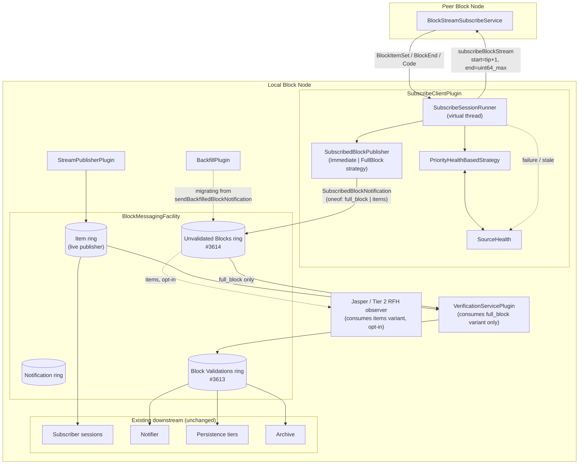
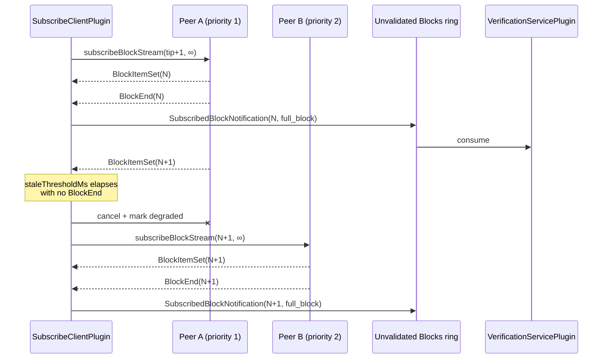

# Subscribe Client Plugin Design Document

## Purpose

Enable a Block Node (BN) to receive blocks from another BN in real time by
consuming a peer's `BlockStreamSubscribeService.subscribeBlockStream` RPC as
a long-lived open-ended live tail. This provides cross-BN replication for
deployments where the receiving BN is not directly connected to consensus
node publishers.

Real-time replication complements the existing `BackfillPlugin` (which
periodically fetches historical gaps). Backfill continues to own catching
up older ranges; this plugin owns the live edge.

## Goals

1. Continuously stream the peer's live block tail into the local BN so it
   stays within a small, bounded number of blocks of the peer's tip.
2. Prefer higher-priority peers and fail over to lower-priority peers when
   the primary is unavailable or meaningfully delayed.
3. Deliver received blocks into the local ingestion pipeline through the
   new **Unvalidated Blocks ring buffer** introduced by Epic
   [#3612](https://github.com/hiero-ledger/hiero-block-node/issues/3612)
   (story [#3614](https://github.com/hiero-ledger/hiero-block-node/issues/3614)),
   keeping this path fully isolated from the live-publisher ring.
4. Support two delivery modes selectable by global config: **immediate**
   (forward each `BlockItemSet` as it arrives, lowest latency) and
   **full-block** (accumulate items and deliver a whole block once
   complete, simplest downstream contract).
5. Reuse the shared BN-to-BN client stack
   (`BlockStreamSubscribeUnparsedClient`, `BlockNodeSource` peer config,
   `PriorityHealthBasedStrategy` selection).
6. Provide operator instrumentation (metrics, logs) that make replication
   lag, reconnects, and failover visible.
7. Tag every plugin-injected notification with a `BlockSource` value
   (`SUBSCRIBER`) so downstream consumers can attribute the origin of
   each block for metrics, dashboards, and their own routing decisions.
   `BackfillPlugin` sets `BlockSource.BACKFILL` on the same ring when
   it migrates onto the Unvalidated Blocks ring buffer, so the
   `BlockSource` value on a ring notification is the plugin-injected
   attribution and consumers can distinguish producers without content
   inspection.

## Non-Goals

1. Historical gap detection or backfill. `BackfillPlugin` owns every
   historical fill (bounded gaps and cold-start catchup alike). This
   plugin only tails live: `start_block_number` is set from the peer's
   current tip at each session open and `end_block_number = uint64_max`
   keeps the stream open indefinitely. It does not request historical
   ranges, does not schedule discrete gap fetches, and does not subsume
   Backfill's greedy mode.
2. Reworking the `StreamPublisherPlugin`, `VerificationServicePlugin`, or
   the existing item ring. The design deliberately uses a separate ring
   buffer so the well-tested publisher path is untouched.
3. Multi-source aggregation. Only one peer streams to us at a time; the
   others are standby.
4. Making the two delivery modes selectable per-peer. Mode is a **global
   on/off**; every configured peer uses the same mode.

## Terms

<dl>
  <dt>Subscribe Client</dt>
  <dd>This plugin. Consumes a peer BN's <code>subscribeBlockStream</code> RPC as
      an open-ended live tail (<code>end_block_number = uint64_max</code>).</dd>

  <dt>Peer BN</dt>
  <dd>Another Block Node instance that exposes
      <code>BlockStreamSubscribeService</code>. Described by a
      <code>BlockNodeSourceConfig</code> entry in the peer-sources JSON file.</dd>

  <dt>Live Tail</dt>
  <dd>The RPC mode where the client requests an <code>end_block_number</code>
      of <code>uint64_max</code>, signalling that the server should keep
      streaming new blocks as they become available. <code>start_block_number</code>
      is set to the peer's current tip (read from a pre-flight
      <code>serverStatus</code>) so the stream begins at "now" regardless
      of how far behind the local BN is; Backfill fills any historical
      gap independently. The stream continues until the client
      half-closes or the connection breaks.</dd>

  <dt>Immediate Mode</dt>
  <dd>Delivery mode where each <code>BlockItemSet</code> received from the peer
      is forwarded downstream as soon as it arrives. Lowest end-to-end latency;
      downstream consumers must handle partial-block streams and there is no
      claim this BN has verified the block. Legitimate use case for
      latency-sensitive downstream consumers such as a Tier 2 RFH BN and Jasper.</dd>

  <dt>Full-Block Mode</dt>
  <dd>Delivery mode where item sets are accumulated by the
      <code>SubscribedBlockPublisher</code> until a complete block is
      assembled, then delivered as a single whole-block message. Simpler
      downstream contract; higher latency by one block-assembly interval.
      Default mode.</dd>

  <dt>Unvalidated Blocks Ring</dt>
  <dd>The new ring buffer added by Epic #3612 (story #3614) for full blocks
      that have not yet been verified locally. Sources include backfill,
      future tier-two-subscriber plugins (this plugin), and gossip. Isolated
      from the live-publisher item ring so this plugin cannot back-pressure
      the live path.</dd>

  <dt>Meaningfully Delayed</dt>
  <dd>A peer that is still reachable but not delivering blocks at the expected
      cadence. Detected client-side by
      <code>time_since_last_BlockEnd &gt; staleThresholdMs</code>. Triggers
      failover to a lower-priority peer.</dd>

  <dt>Active Peer</dt>
  <dd>The single peer the plugin is currently streaming from. At most one at
      any time.</dd>

  <dt>Failover</dt>
  <dd>Terminating the current subscribe stream (marking the peer degraded in
      <code>SourceHealth</code>) and opening a new subscribe stream against
      the next selectable peer.</dd>

  <dt>SubscribedBlockNotification</dt>
  <dd>New notification message (defined by this plugin) carrying either a
      full <code>BlockUnparsed</code> or a <code>BlockItemSetUnparsed</code>
      via a <code>oneof</code>. Exactly one of the two variants is set per
      notification, driven by the configured delivery mode.</dd>
</dl>

## Entities

- **`SubscribeClientPlugin`** implements `BlockNodePlugin`. Registers itself,
  starts the streaming loop on `start()`, tears it down on `stop()`.
- **`SubscribeClientConfiguration`** -- `@ConfigData("subscribe.client")`
  record with mode toggle, peer-sources file path, thresholds, tuning knobs.
- **`SubscribeClientConfigExtension`** implements
  `com.swirlds.config.api.ConfigurationExtension`, discovered via the JPMS
  `provides` clause in `module-info.java` (same pattern
  `BackfillConfigExtension` uses). Its sole job is to return
  `Set.of(SubscribeClientConfiguration.class)` from `getConfigDataTypes()`,
  which makes the `@ConfigData("subscribe.client")` record visible to the
  platform config framework and its values injectable into the plugin.
- **`SubscribeSessionRunner`** -- long-lived loop that owns active peer
  selection and drives one `BlockStreamSubscribeUnparsedClient` call at a
  time. Runs on a virtual thread.
- **`SubscribedBlockPublisher`** -- thin adapter that receives frames from
  the streaming callback and publishes `SubscribedBlockNotification`s onto
  the **Unvalidated Blocks ring buffer**. Two internal strategies:
  - **`ImmediatePublishStrategy`** -- emits one notification per received
    `BlockItemSetUnparsed`.
  - **`FullBlockPublishStrategy`** -- buffers item sets keyed by block
    number, emits one notification per `BlockUnparsed` when the block is
    complete (signalled by the peer's `BlockEnd`).
- **`SourceHealth` / `PriorityHealthBasedStrategy`** -- reused from
  `backfill`. See Open Question #5 for shared-code location.
- **`BlockNodeSourceConfig`** (proto) -- reused as-is; peer's `subscribe_port`
  field is used to dial the subscribe endpoint.

## Design

### Peer Configuration

Peers are configured in an external JSON file whose path is set via
`subscribe.client.blockNodeSourcesPath`. The file is parsed into the shared
PBJ message `BlockNodeSource` (from
`protobuf-sources/src/main/proto/internal/block_node_source.proto`), which
wraps `repeated BlockNodeSourceConfig nodes`. Each entry carries:

- `address`, `port`, `subscribe_port`, `status_port`
- `priority` (lower = higher preference)
- `node_id`, `name`, `scheme`, `protocol`
- `grpc_webclient_tuning`

The plugin dials `subscribe_port` (falling back to `port`) for the subscribe
RPC and `status_port` for pre-flight `serverStatus` checks.

Rationale for reusing `BlockNodeSource`: the proto already carries a
dedicated `subscribe_port` field designed for this use case, and the JSON
format is identical to what operators already maintain for Backfill.

### Source Selection and Failover

Selection reuses `PriorityHealthBasedStrategy` and reduces the peer list to
a single active peer in four steps:

1. Filter out peers currently in exponential backoff.
2. Sort by `(priority ASC, healthScore ASC)`.
3. Reduce to the set of **candidates** -- peers whose pre-flight
   `serverStatus` returns successfully (reachable). The tip they
   advertise becomes each candidate's `start_block_number` when we open
   a stream against them.
4. Pick the candidate with the **lowest observed round-trip latency** on
   the pre-flight call (`serverStatus` RTT). This becomes the active peer.
   Ties are broken by priority.

**Failover triggers:**

- **Unavailable** -- the subscribe RPC returns a terminal error status
  (`ERROR`, `NOT_AVAILABLE`, `INVALID_*`), or the transport fails (HTTP/2
  RST, connection close, gRPC deadline exceeded). Peer is marked failed in
  `SourceHealth`, backoff timer starts, next candidate is selected.

- **Meaningfully delayed** -- the receiving side observes
  `time_since_last_BlockEnd > staleThresholdMs`. Current stream is
  cancelled, peer's `SourceHealth` is decremented (not fully failed -- it
  may recover), and the next candidate is tried. Default threshold: 3×
  expected block interval (e.g. 3000 ms for a 1 s cadence).

- **Peer-tip lag** -- periodic `serverStatus` polls (`peerTipPollInterval`)
  of every backoff-free candidate. If any candidate's advertised tip is
  `peerTipLagThresholdBlocks` ahead of the active peer's advertised tip,
  cancel the current stream and re-select. Catches the case where the
  active peer is reachable and cadenced but itself behind consensus.

Backoff is exponential per peer: `delay = initialRetryDelay × 2^(attempts-1)`,
capped at `maxBackoffMs`. Reset on successful reconnect.

### Delivery Modes

Two modes, selected globally via `subscribe.client.deliveryMode`:

|          Mode          |                        Emits                         |       Latency        |                   Downstream contract                    |
|------------------------|------------------------------------------------------|----------------------|----------------------------------------------------------|
| `full-block` (default) | one notification per assembled `BlockUnparsed`       | + one block interval | Consumer receives a whole block, ready to verify         |
| `immediate`            | one notification per received `BlockItemSetUnparsed` | none added           | Consumer must reassemble; suitable for tools like Jasper |

The mode is **strictly global on/off** -- every configured peer uses the
same mode. Making mode per-peer is deferred (see Open Question #4).

The `SubscribedBlockNotification` message carries the payload in a `oneof`:

```proto
message SubscribedBlockNotification {
  uint64 block_number = 1;
  oneof payload {
    BlockUnparsed full_block = 2;         // full-block mode
    BlockItemSetUnparsed items = 3;       // immediate mode
  }
}
```

Exactly one of `full_block` or `items` is set per notification. Consumers
handle both variants (see Pipeline Integration below).

### Pipeline Integration

Injection is through the **Unvalidated Blocks ring buffer** (Epic #3612 /
story #3614), not the existing item ring. This is deliberate -- reworking
the publisher/verification hot path or contending on its single-producer
item ring would demand extensive testing and a longer development cycle.
The new ring exists specifically for full-block payloads from backfill,
tier-two-subscriber (this plugin), and future gossip, isolated from
live-publisher back-pressure.

Flow per received frame:

1. `SubscribeSessionRunner` receives a `BlockItemSetUnparsed` or `BlockEnd`
   from the peer subscribe stream.
2. `SubscribedBlockPublisher` (via the configured strategy) constructs a
   `SubscribedBlockNotification`:
   - Immediate mode: one notification per `BlockItemSetUnparsed` frame.
   - Full-block mode: buffer per block; on `BlockEnd`, assemble
     `BlockUnparsed` and emit one notification.
3. Notification is published on the Unvalidated Blocks ring buffer.

This plugin's contract ends at the ring publish call. Downstream
consumers subscribe per their own contract; this design does not
prescribe their behaviour.

Known and expected consumers of the ring today:

- **`VerificationServicePlugin`** consumes the `full_block` variant of
  `SubscribedBlockNotification`; verified blocks flow through its
  existing pathway onto the Block Validations ring (#3613) and then to
  persistence, archive, notifier, and subscriber fan-out. Verification
  does **not** subscribe to the `items` variant because verification
  operates on complete blocks only. Adapting the plugin to consume the
  `full_block` variant is considered low complexity by the plugin
  owners.
- The `items` variant is intended for latency-sensitive downstream
  consumers that opt into partial-block streaming (e.g. Jasper, a Tier
  2 RFH observer). Those consumers detect an incomplete block the same
  way today's item-ring consumers do: a new block's start item arrives
  before the current block's `BlockEnd`, so the partial in-flight
  block is dropped.
- Persistence tiers, archive, subscriber fan-out, and notifier are
  fed downstream of verification via the existing
  `VerificationNotification` / `PersistedNotification` mechanism; no
  new subscriptions are added on this ring for them.

**Provenance -- `BlockSource.SUBSCRIBER`.** Every
`SubscribedBlockNotification` published by this plugin carries a
`BlockSource` value that resolves to a new `SUBSCRIBER` entry on the
existing `BlockSource` enum (currently `UNKNOWN`, `PUBLISHER`,
`BACKFILL`, `HISTORY`). This is a one-line addition to
`BlockSource.java`. `BlockSource` is set on the ring notification
itself; downstream messages (`VerificationNotification`,
`PersistedNotification`) may propagate the value if their owners choose
to, but this plugin does not depend on any particular propagation and
does not prescribe consumer behaviour.

`BackfillPlugin` will do the same when it migrates onto the Unvalidated
Blocks ring: notifications it publishes will carry `BlockSource.BACKFILL`.
Coordinating the two migrations means the ring's producer set is
uniformly attributed from day one, no orphan producers without a source
tag.

**Ordering guarantees.**

- **Per-block, per-stream:** `SubscribeSessionRunner` is single-threaded
  (one active peer, one open subscribe RPC). Frames from the peer arrive
  in wire order -- items ascending within a block, `BlockEnd` marking
  each block boundary, blocks ascending by block number. Multiple blocks'
  items therefore *cannot* interleave at the plugin's input.
- **Immediate mode:** the plugin publishes one `SubscribedBlockNotification`
  per received `BlockItemSetUnparsed` in arrival order. Because the plugin
  is single-threaded, items for block N always land on the Unvalidated
  Blocks ring before any items for block N+1. Each notification carries
  the explicit `block_number`, so a downstream consumer never needs to
  infer boundaries from ordering alone -- it can partition by
  `block_number` even if the ring reorders (it doesn't, but this is
  defensive). Detecting a block that never finishes is the same mechanism
  the live-publisher item ring uses today: when a downstream consumer
  sees the start of block N+1 before the `BlockEnd` for block N, it
  drops the partial in-flight state for N. The plugin does not need to
  emit an explicit abort marker because the block-start signal already
  is one.
- **Full-block mode:** trivially ordered -- one notification per assembled
  block, emitted only on `BlockEnd`, in ascending block number. The
  plugin's per-block buffer is drained in the same single thread.
- **What `VerificationServicePlugin` already enforces on the item ring:**
  per-block ordering via `BlockItems.blockNumber` +
  `isStartOfNewBlock`/`isEndOfBlock` flags on `sendBlockItems`. The
  Unvalidated Blocks ring uses a different message shape
  (`SubscribedBlockNotification` with explicit `block_number` and a
  `oneof`), so the plugin's ordering contract is delivered by the
  notification schema itself rather than by ring semantics. No new
  cross-plugin ordering primitives are required.
- **Failover:** on a peer switch mid-stream, the new session opens with
  `start_block_number = new_peer_tip` (see the Startup and Reconnection
  section). The new stream can therefore begin at, ahead of, or slightly
  behind the previous session's last-seen block; downstream consumers
  handle it identically because every `SubscribedBlockNotification`
  carries an explicit `block_number` and verification deduplicates by
  block number.

### Relationship to Backfill

Distinct plugins, distinct responsibilities, distinct data paths on the
same new ring buffer:

|    Concern     |                Subscribe Client                 |                                   Backfill                                    |
|----------------|-------------------------------------------------|-------------------------------------------------------------------------------|
| Time horizon   | Peer tip -> ∞ (`end_block_number = uint64_max`) | Historical gaps and cold-start catchup                                        |
| Trigger        | Continuous open-ended stream                    | Gap detection + periodic sweep                                                |
| RPC            | `subscribeBlockStream` (open-ended)             | `subscribeBlockStream` (bounded ranges)                                       |
| Injection ring | Unvalidated Blocks (#3614)                      | Unvalidated Blocks (#3614) -- migrated from `sendBackfilledBlockNotification` |
| Coexist?       | Yes -- non-overlapping block ranges             | Yes -- non-overlapping block ranges                                           |

On cold start, if the local BN is far behind, the two plugins run in
parallel on non-overlapping ranges:

- **Subscribe Client** opens a live subscribe stream at
  `start_block_number = current peer tip` (from the pre-flight
  `serverStatus`) and streams blocks from *now* forward. It does not wait
  for the archive to catch up.
- **Backfill** closes the historical gap between the local tip and the
  Subscribe Client's first received block, independently.

The two ranges are non-overlapping by construction, so
`VerificationServicePlugin` never sees the same block twice from these
two producers. A cold-starting BN therefore holds a growing archive-side
front (advanced by Backfill) and an established live-side tail (advanced
by Subscribe Client) simultaneously; the two meet when Backfill's cursor
reaches the block Subscribe Client started at.

If the peer no longer holds the block that Subscribe Client's pre-flight
picked (a rare race), the subscribe RPC returns `NOT_AVAILABLE`, the
runner picks up a new tip from the next `serverStatus`, and reopens.

### Coexistence with the Publisher Plugin

`StreamPublisherPlugin` and `SubscribeClientPlugin` publish onto
**different** ring buffers (existing item ring vs new Unvalidated Blocks
ring), so they do not interfere at the messaging-facility layer. Both may
be enabled simultaneously.

However, certain deployment combinations are semantically dubious even if
technically permitted:

- Enabling both on the same BN can result in the local BN receiving the
  same blocks from two independent sources (direct consensus publisher +
  peer BN mirror). Local state stays correct: verification is idempotent
  by block number, and persistence deduplicates the same way (a plugin
  such as the fast NVMe live-store simply overwrites the same block with
  the same content). The waste is on the *external* side: the peer BN
  we subscribe to serves us blocks we already have from consensus, and
  the local BN spends CPU on redundant verification.

In practice, `SubscribeClientPlugin` is a Tier 2 plugin and
`StreamPublisherPlugin` is a Tier 1 plugin, so operators following the
prescribed chart plugin combinations do not enable both on the same BN
and no startup warning is needed. The plugins remain safe together in
edge deployments (verification is idempotent and persistence deduplicates
by block number), but the design does not treat that as a supported
operating mode.

Typical deployments:

- **Tier 1 BN (primary)** -- `StreamPublisherPlugin` deployed,
  `SubscribeClientPlugin` not deployed. Receives directly from consensus.
- **Tier 2 BN (replica)** -- `SubscribeClientPlugin` deployed,
  `StreamPublisherPlugin` not deployed. Mirrors a Tier 1 BN.

### Startup and Reconnection

Plugin lifecycle follows the standard `BlockNodePlugin` split:

- **`init()`** -- parse and validate the peer-sources JSON file, register
  the config-data type via `SubscribeClientConfigExtension`, and prepare
  the `SubscribeSessionRunner` (but do not start it). Fail-fast on any
  validation error before the plugin transitions to running.
- **`start()`** -- launch the `SubscribeSessionRunner` on its dedicated
  thread. This is where the subscribe RPC is actually opened.
- **`stop()`** -- signal the runner to shut down, cancel the active stream,
  and release the `BlockNodeClient`.

Per session (one iteration of the streaming loop, driven inside `start()`):

1. Select the active peer via `PriorityHealthBasedStrategy`.
2. Call the peer's `serverStatus` for a pre-flight availability check.
   This confirms the peer is reachable, records the RTT for latency-based
   selection, and reads the peer's current tip.
3. Compute `start_block_number = peer_tip` -- the stream always begins at
   the peer's current tip. Backfill is responsible for filling any gap
   between the local BN's tip and this start block.
4. Open `subscribeBlockStream` with `start_block_number` and
   `end_block_number = uint64_max`.
5. Consume the response stream:
   - `BlockItemSet` -> hand to `SubscribedBlockPublisher`.
   - `BlockEnd` -> in full-block mode, trigger notification emit; reset
     stale-watchdog timer.
   - Terminal `Code` (any) -> mark peer per code; fall through to reconnect.
6. Periodically (`peerTipPollInterval`) re-issue `serverStatus` against
   the active peer and each backoff-free candidate; if a candidate's tip
   is `peerTipLagThresholdBlocks` ahead of the active peer's tip, close
   the current stream and loop to step 1 (peer-tip-lag failover).
7. On any stream termination: sleep `reconnectMinDelayMs`, loop back to
   step 1.

## Diagram


```mermaid
flowchart TB
  subgraph Peer["Peer Block Node"]
    PSS["BlockStreamSubscribeService"]
  end

  subgraph Local["Local Block Node"]
    subgraph Plugin["SubscribeClientPlugin"]
      SSR["SubscribeSessionRunner<br/>(virtual thread)"]
      SBP["SubscribedBlockPublisher<br/>(Immediate | FullBlock strategy)"]
      SEL["PriorityHealthBasedStrategy"]
      SH["SourceHealth"]
    end

    subgraph Facility["BlockMessagingFacility"]
      IR[("Item ring<br/>(live publisher)")]
      NR[("Notification ring")]
      VR[("Block Validations ring<br/>#3613")]
      UR[("Unvalidated Blocks ring<br/>#3614")]
    end

    SPP["StreamPublisherPlugin"]
    BFP["BackfillPlugin"]

    VER["VerificationServicePlugin<br/>(consumes full_block variant only)"]

    JAS["Jasper / Tier 2 RFH observer<br/>(consumes items variant, opt-in)"]

    subgraph Downstream["Existing downstream (unchanged)"]
      SUB["Subscriber sessions"]
      NOT["Notifier"]
      PER["Persistence tiers"]
      ARC["Archive"]
    end
  end

  SSR -->|"subscribeBlockStream<br/>start=tip+1, end=uint64_max"| PSS
  PSS -->|"BlockItemSet / BlockEnd / Code"| SSR
  SSR --> SBP
  SBP -->|"SubscribedBlockNotification<br/>(oneof: full_block | items)"| UR
  BFP -.->|"migrating from<br/>sendBackfilledBlockNotification"| UR
  SPP --> IR
  IR --> VER
  UR -->|"full_block only"| VER
  UR -.->|"items, opt-in"| JAS
  VER --> VR
  VR --> PER
  VR --> ARC
  VR --> NOT
  IR --> SUB

  SEL <--> SH
  SSR --> SEL
  SSR -.->|"failure / stale"| SH
```

Sequence for a healthy stream with mid-stream failover (full-block mode):


```mermaid
sequenceDiagram
    participant SC as SubscribeClientPlugin
    participant P1 as Peer A (priority 1)
    participant P2 as Peer B (priority 2)
    participant UR as Unvalidated Blocks ring
    participant VER as VerificationServicePlugin

    SC->>P1: subscribeBlockStream(tip+1, ∞)
    P1-->>SC: BlockItemSet(N)
    P1-->>SC: BlockEnd(N)
    SC->>UR: SubscribedBlockNotification(N, full_block)
    UR->>VER: consume
    P1-->>SC: BlockItemSet(N+1)
    Note over SC: staleThresholdMs elapses<br/>with no BlockEnd
    SC-x P1: cancel + mark degraded
    SC->>P2: subscribeBlockStream(N+1, ∞)
    P2-->>SC: BlockItemSet(N+1)
    P2-->>SC: BlockEnd(N+1)
    SC->>UR: SubscribedBlockNotification(N+1, full_block)
```

## Configuration

`@ConfigData("subscribe.client")` record:

|            Field            |                Type                |   Default    |                                                                    Purpose                                                                    |
|-----------------------------|------------------------------------|--------------|-----------------------------------------------------------------------------------------------------------------------------------------------|
| `deliveryMode`              | enum (`full-block` or `immediate`) | `full-block` | Global mode. Strictly on/off -- not per-peer.                                                                                                 |
| `blockNodeSourcesPath`      | String                             | `""`         | Path to peer-sources JSON (parsed as PBJ `BlockNodeSource`).                                                                                  |
| `staleThresholdMs`          | long                               | `3000`       | Time since last `BlockEnd` before failing over.                                                                                               |
| `initialRetryDelayMs`       | long                               | `500`        | Base for exponential per-peer backoff.                                                                                                        |
| `maxBackoffMs`              | long                               | `60000`      | Cap on per-peer backoff.                                                                                                                      |
| `reconnectMinDelayMs`       | long                               | `250`        | Minimum sleep between session iterations.                                                                                                     |
| `grpcOverallTimeout`        | Duration                           | `30s`        | Per-call gRPC deadline for `serverStatus`.                                                                                                    |
| `peerTipPollInterval`       | Duration                           | `30s`        | Cadence for polling the active peer's `serverStatus` mid-stream to detect peer-tip lag.                                                       |
| `peerTipLagThresholdBlocks` | long                               | `50`         | Block-count gap between the active peer's advertised tip and another candidate's tip that triggers a failover to the further-ahead candidate. |
| `enableTLS`                 | boolean                            | `false`      | TLS toggle. Follows Backfill's convention.                                                                                                    |
| `maxIncomingBufferSize`     | int                                | `4194304`    | Helidon client incoming buffer.                                                                                                               |

Pre-flight `serverStatus` calls are unconditional -- there is no toggle to
skip them because every reconnect must confirm the peer is up and holds
the required block range before opening the stream.

Peer JSON file: identical schema to Backfill's `block-nodes.json`, reused
via the shared `BlockNodeSource` PBJ message. `subscribe_port` field is
used for the subscribe stream; `status_port` for the pre-flight
`serverStatus` call.

## Metrics

Category: `blocknode`. All names use snake_case. Trimmed to the metrics
with a concrete operator use case; anything the caller can already infer
from the ones below is omitted.

|                 Metric                 |      Type       |                                                                                                             Meaning                                                                                                             |
|----------------------------------------|-----------------|---------------------------------------------------------------------------------------------------------------------------------------------------------------------------------------------------------------------------------|
| `subscribe_client_active_peer`         | ObservableGauge | `node_id` of the currently-active peer (or `-1` if none). Value comes from `BlockNodeSourceConfig.node_id` in the peer-sources JSON, which is operator-assigned and stable across upgrades. Answers "which peer are we on now". |
| `subscribe_client_blocks_received`     | LongCounter     | Blocks with a `BlockEnd` received from the peer. Throughput signal.                                                                                                                                                             |
| `subscribe_client_stream_terminations` | LongCounter     | All stream ends, labeled by cause (`clean`, `error`, `transport`, `stale`). One metric covers both "how many streams ended" and "why" -- subsumes a separate failovers counter.                                                 |
| `subscribe_client_lag_ms`              | ObservableGauge | `now - lastBlockEndReceivedAt`. Primary operator health signal: rising lag = peer or transport in trouble.                                                                                                                      |
| `subscribe_client_last_block_number`   | ObservableGauge | Highest block number for which a notification was emitted. Cross-check with the local BN's tip and (optionally) a peer's `serverStatus` to see how far behind consensus we are.                                                 |

## Exceptions

|                                            Situation                                             |                                                                                                                         Handling                                                                                                                         |
|--------------------------------------------------------------------------------------------------|----------------------------------------------------------------------------------------------------------------------------------------------------------------------------------------------------------------------------------------------------------|
| Peer returns terminal `Code != SUCCESS`                                                          | Mark peer failed in `SourceHealth`, log at WARN with code + peer id, start backoff, reconnect.                                                                                                                                                           |
| HTTP/2 transport failure (RST, connection reset, timeout)                                        | Same as above; wrapped as failure in the streaming callback.                                                                                                                                                                                             |
| Ring-buffer publish throws                                                                       | Log at ERROR, cancel stream, mark peer failed (defensively), backoff, reconnect. Do NOT swallow silently.                                                                                                                                                |
| No peer selectable (all in backoff, or empty file)                                               | Sleep `reconnectMinDelayMs × factor`, retry selection. Log at WARN with a rate-limited cadence.                                                                                                                                                          |
| Config validation: `blockNodeSourcesPath` missing / unreadable / malformed                       | Fail-fast at `init()`.                                                                                                                                                                                                                                   |
| Config validation: peer JSON file has zero entries and plugin enabled                            | Fail-fast at `init()` -- misconfiguration.                                                                                                                                                                                                               |
| Plugin never reaches a healthy state (init failure, or every peer stays in backoff indefinitely) | Reported via the block-node health plugin once its API is finalised. A plugin that cannot make progress must surface as unhealthy rather than silently no-op. Wiring is out of scope for this design and lands with the health-plugin integration story. |

## Security

- Peer authentication and transport encryption follow the same pattern as
  Backfill (`enableTLS` toggle). No new key material is introduced.
- Every block from a peer is verified locally by
  `VerificationServicePlugin` on the Unvalidated Blocks ring -- this is a
  general BN invariant, not a peer-specific mitigation. A compromised or
  byzantine peer produces repeated verification failures and eventual
  peer eviction; local state is not corruptible via this path.
- The peer-sources JSON file contains hostnames and ports; not secret, but
  its integrity matters. Same operational posture as Backfill's peer file.

## Dependencies

This plugin depends on Epic **#3612 -- Expand Ring Buffer Architecture in
Block Messaging Facility**:

- **#3614** (required) -- new **Unvalidated Blocks ring buffer**. Injection
  point for this plugin. Must merge before this plugin can be implemented.
- **#3615** (recommended) -- ring-buffer sizing/back-pressure tuning across
  all four rings. This plugin's realistic throughput ceiling should be
  informed by whatever size/wait strategy #3615 lands on.
- **#3613** (indirect) -- new **Block Validations ring buffer** for
  verified blocks that reach persistence, archive, subscriber fan-out,
  and notifier. This plugin does not read or write it, but the
  `full_block` variant of `SubscribedBlockNotification` reaches that
  ring after `VerificationServicePlugin` finishes verification, so

  # 3613 is on the downstream path even though this plugin is oblivious

  to it.

`BackfillPlugin` will migrate `sendBackfilledBlockNotification` onto the
Unvalidated Blocks ring as part of #3614. Coordinating this migration
alongside the Subscribe Client integration is preferred so both producers
land on the ring at the same version.

## Acceptance Tests

**Unit:**

1. `SubscribeSessionRunner` selects the highest-priority reachable peer on
   startup; on peer failure, selects the next by priority.
2. `SubscribedBlockPublisher` in **immediate mode** emits exactly one
   `SubscribedBlockNotification` per received `BlockItemSetUnparsed` with
   the `items` variant set.
3. `SubscribedBlockPublisher` in **full-block mode** buffers item sets and
   emits exactly one notification per complete block with the `full_block`
   variant set, keyed on `BlockEnd`.
4. Stale watchdog fires: given a stream that stops sending `BlockEnd` for
   longer than `staleThresholdMs`, the current stream is cancelled and a
   failover happens.
5. Terminal `Code != SUCCESS` triggers peer failure marking + backoff.
6. Backoff is exponential per peer and resets on successful reconnect.
7. Config validation: missing peer file fails `init()`; zero-entry peer
   file fails `init()`; both-plugins-enabled logs WARN but does NOT fail.

**Integration** (uses the `block-node-e2e-tests` harness -- the existing
JUnit-driven Testcontainers harness under
`tools-and-tests/block-node-e2e-tests/` that spins up BNs via the block
node chart and drives them with the `blocks` CLI):

1. **Tier 1 -> Tier 2, full-block mode.** One Tier 1 BN (publisher-enabled)
   and one Tier 2 BN (subscribe-client-enabled, `deliveryMode=full-block`).
   Blocks pushed to Tier 1 appear on Tier 2 through the Unvalidated Blocks
   -> Verification path with lag under threshold.
2. **Tier 1 -> Tier 2, immediate mode.** Same as (1) but
   `deliveryMode=immediate`. Item sets appear at the verification stage
   before the block is complete.
3. **Mid-stream Tier 1 death.** Kill the Tier 1 peer mid-stream. Tier 2
   logs failover, holds at last block, resumes without gap once the peer
   is back.
4. **Two Tier 1 peers, one dies.** Tier 2 configured with two Tier 1
   peers. Kill the active one. Tier 2 fails over to the second within
   `staleThresholdMs`, verify no gap in the received block sequence.
5. **Cold-start Tier 2 with `backfill.greedy=true`, historical gap.**
   Tier 2 starts far behind. Subscribe Client opens a live subscribe at
   the peer's current tip, Backfill greedily fills the historical gap in
   parallel. The two ranges meet cleanly with no duplicates and no gap.
6. **Cold-start Tier 2 with `backfill.greedy=false`, gap between last
   stored and live.** Same setup as (5) but Backfill only runs on gap
   detection. Subscribe Client still holds the live tail; the historical
   gap fills at the Backfill cadence. Ends up with the same final state.
7. **Overlap race.** Backfill and Subscribe Client both target the same
   block number briefly (Backfill nearing the range Subscribe Client is
   currently on). Verification dedupes, persistence writes each block
   once, `subscribe_client_blocks_received` and Backfill counters both
   increment for the overlap.
8. **Mid-block stream drop, immediate mode.** Peer stops sending mid-block
   after emitting one or two `BlockItemSet`s. Tier 2 discards the partial
   in-flight block (nothing written to persistence), fails over, and the
   new session starts from the still-un-verified block.
9. **Both plugins enabled on the same BN.** Enable both
   `StreamPublisherPlugin` and `SubscribeClientPlugin` on one BN, feed
   blocks via both paths for the same range. Verification does not
   double-persist (dedupe holds), and metrics reflect blocks arriving
   from both `PUBLISHER` and `SUBSCRIBER` sources.

## Open Questions

1. **Immediate-mode consumers.** Full-block mode has a clear downstream
   (verification then persistence). Immediate mode's primary consumers
   are Tier 2 RFH BNs and Jasper -- a Tier 1 shipping `BlockItemSet`s to
   a Tier 2 with sub-block latency is one of the key drivers for this
   plugin. Confirmed as in-scope for v1. Any additional in-tree consumer
   (beyond the RFH and Jasper cases) is a later add.

2. **Persistence of already-verified blocks.** Backfill re-verifies
   fetched blocks locally. This plugin's flow does the same via the
   shared verification hook on the Unvalidated Blocks ring. Verification
   already runs at most once per block (idempotent by block number), so
   there is no double-verification in flight even when Backfill and
   Subscribe Client both target the same range briefly. A trusts-the-peer
   fast-path is not proposed; the value of `BlockSource.SUBSCRIBER` is
   pipeline-attribution and downstream prioritisation, not skipping
   verification.

3. **Peer-tip lag detection.** The client-side stale watchdog catches
   the case where the peer stops sending us blocks. It does NOT catch
   the case where the peer itself is behind consensus and dutifully
   sends us its stale live tail at normal cadence. Resolution: add a
   periodic `serverStatus` poll of the current peer, and if another
   candidate peer's advertised tip is meaningfully further ahead
   (bounded by a threshold), fail over to that peer. The threshold and
   poll cadence are tuning knobs (`peerTipLagThresholdBlocks`,
   `peerTipPollInterval`); starting values in the Configuration table.

4. **Plugin location for shared selection logic.** Resolved: move
   `SourceHealth` and `PriorityHealthBasedStrategy` out of
   `block-node/backfill/` into
   `block-node/base/src/main/java/org/hiero/block/node/base/client`,
   coordinating with Backfill owners. Both plugins depend on the shared
   package at that path.

5. **`GrpcWebClientTuning` fallback.** The `GrpcWebClientTuning` proto
   (`internal/block_node_source.proto:77`) documents that unset timeout
   fields fall back to `backfill.grpcOverallTimeout`. Needs verification:
   this comment may pre-date the introduction of a shared
   `BlockNodeClient` and reflect a Backfill-specific behaviour rather
   than a hard coupling. Action: audit the current `BlockNodeClient`
   construction path and, if the fallback is real, tighten it to
   read from the calling plugin's own `grpcOverallTimeout`
   (`subscribe.client.grpcOverallTimeout` is already in the Config
   table). If it is only a stale comment, update the proto docstring.
