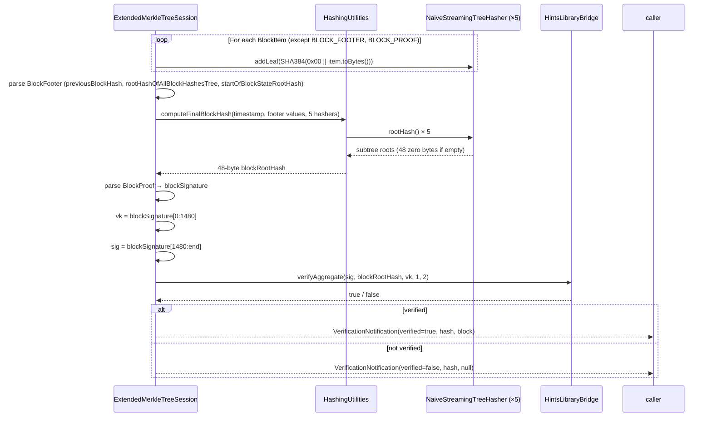
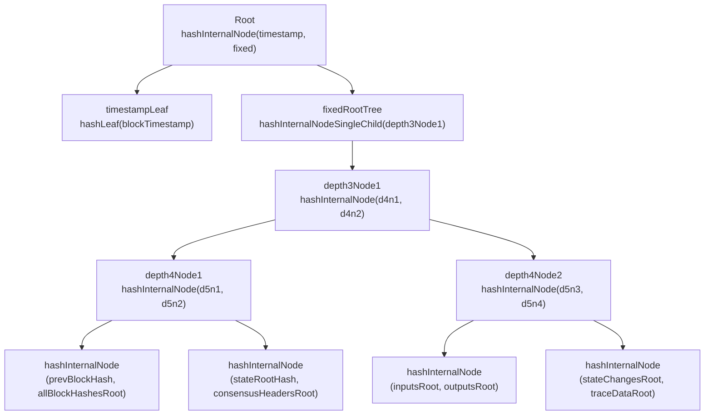

# TSS Block Proof Verification

## Table of Contents

1. [Purpose](#purpose)
2. [Goals](#goals)
3. [Terms](#terms)
4. [Entities](#entities)
5. [Design](#design)
6. [Diagram](#diagram)
7. [Configuration](#configuration)
8. [Exceptions](#exceptions)
9. [Acceptance Tests](#acceptance-tests)

## Purpose

TSS block proof verification lets the Block Node cryptographically confirm that blocks received
from a Consensus Node were signed by a threshold of network stake. It covers both TSS-only and
TssWraps operational modes, and handles blocks across the full hinTS lifecycle — from genesis
("before settled") through stable operation ("after settled").

This document is the Block Node–specific reference for implementing and understanding TSS
verification. For CN-side mechanics (how blocks are produced and signed), see
[`tss-tmp/tss-block-proofs.md`](../../tss-tmp/tss-block-proofs.md). For the broader block
verification design, see [`docs/design/block-verification.md`](block-verification.md).

## Goals

1. Recompute the 48-byte block root hash from raw block items using the extended Merkle tree algorithm.
2. Split the composite `blockSignature` field into a verification key and a BLS aggregate signature.
3. Verify the BLS aggregate signature with `HintsLibraryBridge.verifyAggregate()`.
4. Support both TSS-only (3,112-byte signature) and TssWraps (3,176-byte signature) block proofs.
5. Detect the proof type from the `BlockProof` oneof field — no configuration needed.

## Terms

<dl>
<dt>hinTS</dt>
<dd>Hiero's threshold signature scheme. Consensus Nodes hold partial BLS private keys; each signs
the block hash independently; an aggregator combines the partial signatures into one compact BLS
aggregate signature that any verifier can check against the single verification key.</dd>

<dt>BLS aggregate signature</dt>
<dd>A 1,632-byte compact proof that nodes holding at least the configured threshold of stake
weight signed the block hash. Produced by aggregating partial signatures from individual nodes.</dd>

<dt>verificationKey (VK)</dt>
<dd>A 1,480-byte BLS public key representing the aggregated network key for a hinTS construction.
It is embedded verbatim as the first 1,480 bytes of every TSS <code>blockSignature</code>.</dd>

<dt>LedgerId</dt>
<dd>The network's public key stored in roster service state. Identical to the active
<code>verificationKey</code>; no state scan is needed since the VK is already embedded in the proof.</dd>

<dt>TssSignedBlockProof</dt>
<dd>The <code>BlockProof</code> variant produced when <code>tss.hintsEnabled=true</code> on CN.
Its <code>blockSignature</code> field carries the composite VK + BLS signature bytes.</dd>

<dt>blockSignature</dt>
<dd>A composite byte sequence: <code>vk (1,480 bytes) || blsAggSig (1,632 bytes) || [chainOfTrustProof (64 bytes)]</code>.
The trailing <code>chainOfTrustProof</code> is present only in TssWraps mode.</dd>

<dt>chainOfTrustProof (WRAPS proof)</dt>
<dd>An optional 64-byte Schnorr-based proof appended to <code>blockSignature</code> when
<code>tss.historyEnabled=true</code>. The BLS verifier tolerates its presence when the suffix is
included in the <code>sig</code> slice.</dd>

<dt>TSS-only mode</dt>
<dd>CN configuration: <code>hintsEnabled=true</code>, <code>historyEnabled=false</code>.
<code>blockSignature</code> is 3,112 bytes: 1,480 (VK) + 1,632 (BLS sig).</dd>

<dt>TssWraps mode</dt>
<dd>CN configuration: <code>hintsEnabled=true</code>, <code>historyEnabled=true</code>.
<code>blockSignature</code> is 3,176 bytes: 1,480 (VK) + 1,632 (BLS sig) + 64 (WRAPS proof).</dd>

<dt>before settled</dt>
<dd>Blocks produced while the hinTS preprocessing construction is still in progress (typically
block 0). These blocks carry additional <code>STATE_CHANGES</code> items with stateIds for
<code>HINTS_KEY_SETS</code> (37), <code>ACTIVE_HINTS_CONSTRUCTION</code> (38),
<code>PREPROCESSING_VOTES</code> (40), and <code>CRS</code> (49).</dd>

<dt>after settled</dt>
<dd>Blocks produced after the hinTS construction is complete (e.g., block 50). The same
verification key remains valid; no TSS-specific state change items are present.</dd>

<dt>domain-separated hashing</dt>
<dd>SHA-384 with a single-byte prefix to distinguish hash types: <code>0x00</code> for leaf
nodes, <code>0x01</code> for single-child internal nodes, <code>0x02</code> for two-child
internal nodes.</dd>

<dt>ZERO_BLOCK_HASH</dt>
<dd>48 zero bytes. Used as the empty subtree root when a <code>NaiveStreamingTreeHasher</code>
has no leaves, and as the genesis block's <code>previousBlockRootHash</code>. Not the same as
<code>SHA384(0x00 || "")</code>.</dd>
</dl>

## Entities

### ExtendedMerkleTreeSession

`block-node/verification/src/main/java/org/hiero/block/node/verification/session/impl/ExtendedMerkleTreeSession.java`

The per-block session that coordinates hash computation and signature verification. It:

- Maintains five `NaiveStreamingTreeHasher` instances (inputs, outputs, consensus headers,
  state changes, trace data).
- Routes each `BlockItemUnparsed` to the appropriate hasher as items stream in.
- On end-of-block, calls `HashingUtilities.computeFinalBlockHash()` and then `verifySignature()`.
- The current `verifySignature()` implementation is a placeholder that checks
  `SHA384(blockHash)`. TSS integration replaces it with the BLS path described below.

### HashingUtilities

`common/src/main/java/org/hiero/block/common/hasher/HashingUtilities.java`

Static utility methods for domain-separated SHA-384 hashing:

- `computeFinalBlockHash()` — assembles the 48-byte root hash from the five subtree roots,
  the block timestamp, and the three footer values.
- `hashLeaf(byte[])` — `SHA384(0x00 || leafData)`
- `hashInternalNode(byte[], byte[])` — `SHA384(0x02 || left || right)`
- `hashInternalNodeSingleChild(byte[])` — `SHA384(0x01 || child)`
- `getBlockItemHash(BlockItemUnparsed)` — computes the leaf hash for a block item

### NaiveStreamingTreeHasher

`common/src/main/java/org/hiero/block/common/hasher/NaiveStreamingTreeHasher.java`

A streaming Merkle tree hasher using the fold-up algorithm. Leaves are added one at a time;
sibling pairs are combined eagerly. Empty tree returns 48 zero bytes (ZERO_BLOCK_HASH
convention). `rootHash()` finalizes any remaining pending roots by folding right-to-left.

### HintsLibraryBridge

Provided by `com.hedera.cryptography:hedera-cryptography-hints:3.2.0`.

The native BLS library entry point. The single method used for verification is:

```java
boolean verified = HintsLibraryBridge.getInstance()
    .verifyAggregate(blsSig, blockHash, vk, 1L, 2L);
```

The last two arguments represent the signing threshold as a fraction: `1L/2L` means ≥50% of
stake weight must have contributed. This matches the CN default
(`tss.signingThresholdDivisor=2`).

## Design

TSS block proof verification is a two-phase process applied to every block that carries a
`TssSignedBlockProof`.

### Phase 1 — Block Root Hash Computation

Block items are routed to one of five `NaiveStreamingTreeHasher` instances as they arrive.
`BLOCK_FOOTER` and `BLOCK_PROOF` items are not hashed.

| Block item kind | Subtree hasher |
|---|---|
| `BLOCK_HEADER` | outputTreeHasher |
| `ROUND_HEADER`, `EVENT_HEADER` | consensusHeaderHasher |
| `SIGNED_TRANSACTION` | inputTreeHasher |
| `TRANSACTION_RESULT`, `TRANSACTION_OUTPUT` | outputTreeHasher |
| `STATE_CHANGES` | stateChangesHasher |
| `TRACE_DATA` | traceDataHasher |
| `BLOCK_FOOTER` | not hashed |
| `BLOCK_PROOF` | not hashed |

Each leaf hash is: `SHA384(0x00 || BlockItemUnparsed.PROTOBUF.toBytes(item))`

Three values come from the `BlockFooter`, written by CN just before `BLOCK_PROOF`:

- `previousBlockRootHash` — root hash of the previous block (48 zero bytes at genesis)
- `rootHashOfAllBlockHashesTree` — streaming Merkle root of all block hashes 0..N−1
- `startOfBlockStateRootHash` — state hash at block start; empty field treated as 48 zero bytes

`HashingUtilities.computeFinalBlockHash()` assembles the 48-byte root hash using this tree
structure (mirrors `BlockStreamManagerImpl.combine()` in CN exactly):

```
Root = hashInternalNode(timestampLeaf, hashInternalNodeSingleChild(depth3Node1))

timestampLeaf = hashLeaf(Timestamp.PROTOBUF.toBytes(blockHeader.blockTimestamp()))

depth3Node1   = hashInternalNode(depth4Node1, depth4Node2)
  depth4Node1 = hashInternalNode(
                  hashInternalNode(previousBlockRootHash, rootHashOfAllBlockHashesTree),
                  hashInternalNode(startOfBlockStateRootHash, consensusHeadersRoot))
  depth4Node2 = hashInternalNode(
                  hashInternalNode(inputsRoot, outputsRoot),
                  hashInternalNode(stateChangesRoot, traceDataRoot))
```

### Phase 2 — BLS Signature Verification

After the block root hash is computed, the `blockSignature` composite bytes are split:

```java
private static final int VK_LENGTH = 1480;

Bytes blockSig = proof.signedBlockProof().blockSignature();
Bytes vk  = blockSig.slice(0, VK_LENGTH);
Bytes sig = blockSig.slice(VK_LENGTH, blockSig.length() - VK_LENGTH);

boolean verified = HintsLibraryBridge.getInstance()
    .verifyAggregate(sig.toByteArray(), hash.toByteArray(), vk.toByteArray(), 1L, 2L);
```

The `sig` slice spans everything after the 1,480-byte VK to the end of `blockSignature`. In
TssWraps mode this includes the 64-byte `chainOfTrustProof` suffix. The native `verifyAggregate`
implementation tolerates the suffix — all four tests (TSS × TssWraps, block-0 × block-50)
pass with this single slice formula.

### Proof Type Detection

The `BlockProof` message uses a protobuf oneof field. TSS verification applies only when
`proof.hasSignedBlockProof()` returns `true`. Other proof variants (`block_state_proof`,
`aggregated_node_signatures`, `signed_record_file_proof`) are out of scope for this document.

### TSS Operational Modes at a Glance

| Mode | CN config | `blockSignature` format | Total bytes |
|---|---|---|---|
| No TSS (default) | `hintsEnabled=false` | `SHA384(blockHash)` — not a real signature | 48 |
| TSS-only | `hintsEnabled=true`, `historyEnabled=false` | `vk (1,480) \|\| blsSig (1,632)` | 3,112 |
| TssWraps | `hintsEnabled=true`, `historyEnabled=true` | `vk (1,480) \|\| blsSig (1,632) \|\| wrapsProof (64)` | 3,176 |

### Verification Key Lineage

The 1,480-byte verification key appears in three equivalent places. No state scan is required:

```
HintsContext.verificationKeyOrThrow()
  = HintsConstruction.hintsSchemeOrThrow().preprocessedKeysOrThrow().verificationKey()
  ≡ blockSignature[0:1480]     ← embedded in every proof
  ≡ LedgerId.ledger_id         ← roster service state
```

The key remains valid across blocks until a roster transition triggers a new hinTS construction.

## Diagram

### Sequence: TSS Block Proof Verification



### Merkle Tree Structure



The five subtree roots (`consensusHeadersRoot`, `inputsRoot`, `outputsRoot`,
`stateChangesRoot`, `traceDataRoot`) are the outputs of the five `NaiveStreamingTreeHasher`
instances. An empty subtree returns 48 zero bytes (ZERO_BLOCK_HASH).

## Configuration

No Block Node configuration is needed to select TSS verification mode. The proof type is
detected automatically from the `BlockProof` oneof field at runtime.

The following module dependency is required in
`block-node/verification/src/main/java/module-info.java`:

```java
requires com.hedera.cryptography.hints;
```

Gradle wiring (already in place):

| Location | Entry |
|---|---|
| `hiero-dependency-versions/build.gradle.kts` | version constraint `3.2.0` for `hedera-cryptography-hints` and `2.0.2` for `hedera-common-nativesupport` |

`hedera-common-nativesupport` is a transitive runtime dependency of `hedera-cryptography-hints`
that loads the native BLS library. No explicit `requires` entry is needed for it.

## Exceptions

| Condition | Outcome |
|---|---|
| `verifyAggregate` returns `false` | `VerificationNotification(verified=false)` — triggers `SIGNATURE_INVALID` handling |
| `blockSignature.length() < VK_LENGTH` (< 1,480 bytes) | Malformed proof; treat as `SIGNATURE_INVALID` |
| `startOfBlockStateRootHash` is empty (`Bytes.EMPTY`) | Treated as 48 zero bytes by `computeFinalBlockHash` — valid at genesis and empty-state blocks |
| `BlockFooter` is absent | Early exit: `VerificationNotification(verified=false)` — cannot compute hash |
| Block carries no `signedBlockProof` | TSS path is skipped; other proof types are handled separately |

## Acceptance Tests

`block-node/verification/src/test/java/org/hiero/block/node/verification/session/impl/TssBlockProofVerificationTest.java`

Four tests, all green, covering the full cross-product of mode × lifecycle:

| Test | Mode | Block | Description |
|---|---|---|---|
| `shouldVerifyTssBlock0_beforeSettled` | TSS-only | 0 | Genesis block with hinTS preprocessing state changes |
| `shouldVerifyTssBlock50_afterSettled` | TSS-only | 50 | Stable block post-settlement, no TSS state changes |
| `shouldVerifyTssWrapsBlock0_beforeSettled` | TssWraps | 0 | Genesis block with WRAPS proof suffix |
| `shouldVerifyTssWrapsBlock50_afterSettled` | TssWraps | 50 | Stable block with WRAPS proof suffix |

Test fixtures:

```
block-node/app/src/testFixtures/resources/test-blocks/tss/
  TSS/
    000000000000000000000000000000000000.blk.gz   (block 0, TSS-only)
    000000000000000000000000000000000050.blk.gz   (block 50, TSS-only)
  TssWraps/
    000000000000000000000000000000000000.blk.gz   (block 0, TssWraps)
    000000000000000000000000000000000050.blk.gz   (block 50, TssWraps)
```
