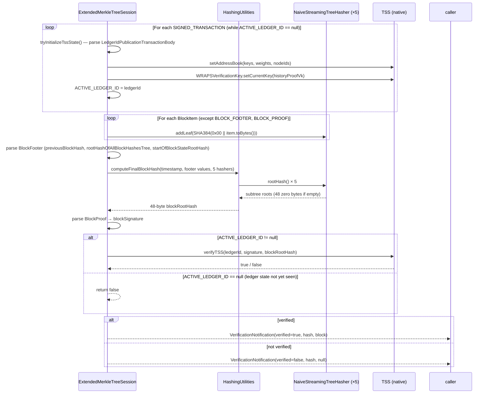
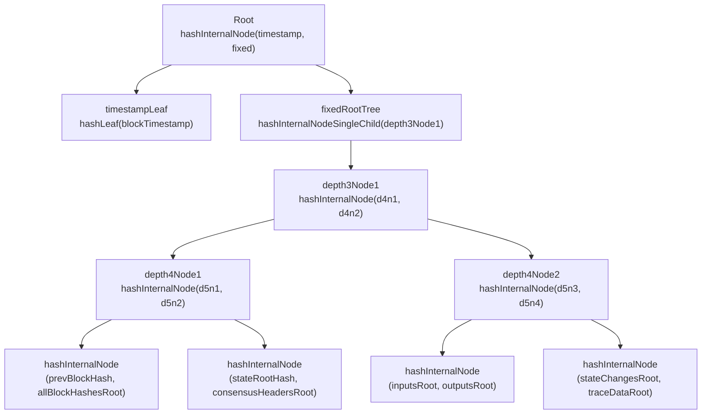

# TSS Block Proof Verification

## Table of Contents

1. [Purpose](#purpose)
2. [Goals](#goals)
3. [Terms](#terms)
4. [Entities](#entities)
5. [Design](#design)
6. [Diagram](#diagram)
7. [Configuration](#configuration)
8. [Exceptions](#exceptions)
9. [Acceptance Tests](#acceptance-tests)

## Purpose

TSS block proof verification lets the Block Node cryptographically confirm that blocks received
from a Consensus Node were signed by a threshold of network stake. It covers the TssWraps
operational mode and handles blocks across the full hinTS lifecycle — from genesis
("before settled") through stable operation ("after settled").

This document is the Block Node–specific reference for implementing and understanding TSS
verification. For CN-side mechanics (how blocks are produced and signed), see
[`tss-tmp/tss-block-proofs.md`](../../tss-tmp/tss-block-proofs.md). For the broader block
verification design, see [`docs/design/block-verification.md`](block-verification.md).

## Goals

1. Recompute the 48-byte block root hash from raw block items using the extended Merkle tree algorithm.
2. Verify the composite `blockSignature` against the chain-of-trust using `TSS.verifyTSS()`.
3. Parse `LedgerIdPublicationTransactionBody` from block 0 to bootstrap TSS ledger state (address
   book and WRAPS verification key).
4. Support TssWraps block proofs: 2,920 bytes (genesis, Schnorr aggregate) and 3,432 bytes
   (settled, WRAPS compressed proof).
5. Detect the proof type from the `BlockProof` oneof field — no configuration needed.

## Terms

<dl>
<dt>hinTS</dt>
<dd>Hiero's threshold signature scheme. Consensus Nodes hold partial BLS private keys; each signs
the block hash independently; an aggregator combines the partial signatures into one compact BLS
aggregate signature that any verifier can check against the single verification key.</dd>

<dt>BLS aggregate signature</dt>
<dd>A 1,632-byte compact proof that nodes holding at least the configured threshold of stake
weight signed the block hash. Produced by aggregating partial signatures from individual nodes.</dd>

<dt>verificationKey (VK)</dt>
<dd>A 1,096-byte BLS public key representing the aggregated network key for a hinTS construction.
It is embedded verbatim as the first 1,096 bytes of every TSS <code>blockSignature</code>.</dd>

<dt>LedgerId</dt>
<dd>The network identity derived from the address book. Published in block 0 via
<code>LedgerIdPublicationTransactionBody</code> and used as the root of trust for
<code>TSS.verifyTSS()</code>.</dd>

<dt>TssSignedBlockProof</dt>
<dd>The <code>BlockProof</code> variant produced when <code>tss.hintsEnabled=true</code> on CN.
Its <code>blockSignature</code> field carries the composite VK + BLS signature bytes.</dd>

<dt>blockSignature</dt>
<dd>A composite byte sequence: <code>vk (1,096 bytes) || blsAggSig (1,632 bytes) || chainOfTrustProof</code>.
The <code>chainOfTrustProof</code> suffix is either 192 bytes (genesis, Schnorr aggregate) or
704 bytes (settled, WRAPS compressed proof). Total: 2,920 or 3,432 bytes.</dd>

<dt>chainOfTrustProof</dt>
<dd>A proof appended to <code>blockSignature</code> that establishes the VK was derived from the
network address book. Before WRAPS settles: 192-byte aggregate Schnorr signature verified against
the address book set via <code>TSS.setAddressBook()</code>. After WRAPS settles: 704-byte WRAPS
compressed proof verified against the VK set via <code>WRAPSVerificationKey.setCurrentKey()</code>.</dd>

<dt>TssWraps mode</dt>
<dd>CN configuration: <code>hintsEnabled=true</code>, <code>historyEnabled=true</code>.
<code>blockSignature</code> is 2,920 bytes at genesis (192-byte Schnorr aggregate suffix) or
3,432 bytes after WRAPS settles (704-byte WRAPS compressed proof suffix).</dd>

<dt>before settled</dt>
<dd>Blocks produced while the hinTS preprocessing construction is still in progress (typically
block 0). These blocks carry additional <code>STATE_CHANGES</code> items with stateIds for
<code>HINTS_KEY_SETS</code> (37), <code>ACTIVE_HINTS_CONSTRUCTION</code> (38),
<code>PREPROCESSING_VOTES</code> (40), and <code>CRS</code> (49).</dd>

<dt>after settled</dt>
<dd>Blocks produced after the hinTS construction is complete (e.g., block 50). The same
verification key remains valid; no TSS-specific state change items are present.</dd>

<dt>domain-separated hashing</dt>
<dd>SHA-384 with a single-byte prefix to distinguish hash types: <code>0x00</code> for leaf
nodes, <code>0x01</code> for single-child internal nodes, <code>0x02</code> for two-child
internal nodes.</dd>

<dt>ZERO_BLOCK_HASH</dt>
<dd>48 zero bytes. Used as the empty subtree root when a <code>NaiveStreamingTreeHasher</code>
has no leaves, and as the genesis block's <code>previousBlockRootHash</code>. Not the same as
<code>SHA384(0x00 || "")</code>.</dd>
</dl>

## Entities

### ExtendedMerkleTreeSession

`block-node/verification/src/main/java/org/hiero/block/node/verification/session/impl/ExtendedMerkleTreeSession.java`

The per-block session that coordinates hash computation and signature verification. It:

- Maintains five `NaiveStreamingTreeHasher` instances (inputs, outputs, consensus headers,
  state changes, trace data).
- Routes each `BlockItemUnparsed` to the appropriate hasher as items stream in. For
  `SIGNED_TRANSACTION` items, also calls `tryInitializeTssState()` while `ACTIVE_LEDGER_ID` is
  unset, to parse any `LedgerIdPublicationTransactionBody` and bootstrap TSS native state.
- On end-of-block, calls `HashingUtilities.computeFinalBlockHash()` and then `verifySignature()`.
- `verifySignature()` dispatches on `blockSignature.length()` and `ACTIVE_LEDGER_ID`:
  - **48 bytes** — legacy path: non-TSS test blocks carry `SHA384(blockHash)` as the signature
    (temporary; to be removed before production).
  - **&lt; 1,096 bytes** (but not 48) — malformed proof; returns `false`.
  - **&ge; 1,096 bytes, ledger state known** — TSS path: delegates to
    `TSS.verifyTSS(ledgerId, signature, hash)` for full chain-of-trust verification.
  - **&ge; 1,096 bytes, ledger state unknown** — `ACTIVE_LEDGER_ID` not yet set (node started
    mid-stream, block 0 not seen); returns `false`.

The static field `ACTIVE_LEDGER_ID` is process-level state shared across all per-block session
instances. This matches the native library model: `TSS.setAddressBook()` and
`WRAPSVerificationKey.setCurrentKey()` configure native global state once on startup.

### LedgerIdPublicationTransactionBody

`com.hedera.hapi.node.tss.LedgerIdPublicationTransactionBody` (PBJ-generated)

A system transaction carried in `SIGNED_TRANSACTION` block items. Always present in block 0 when
TSS is enabled; repeated on VK rotation (roster transition). Fields used for TSS initialization:

- `ledgerId` — the network identity, used as the root-of-trust argument to `TSS.verifyTSS()`.
- `historyProofVerificationKey` — the WRAPS VK; passed to `WRAPSVerificationKey.setCurrentKey()`.
- `nodeContributions` — list of `LedgerIdNodeContribution` entries, each carrying `nodeId`,
  `weight`, and `historyProofKey`; collectively passed to `TSS.setAddressBook()`.

### HashingUtilities

`common/src/main/java/org/hiero/block/common/hasher/HashingUtilities.java`

Static utility methods for domain-separated SHA-384 hashing:

- `computeFinalBlockHash()` — assembles the 48-byte root hash from the five subtree roots,
  the block timestamp, and the three footer values.
- `hashLeaf(byte[])` — `SHA384(0x00 || leafData)`
- `hashInternalNode(byte[], byte[])` — `SHA384(0x02 || left || right)`
- `hashInternalNodeSingleChild(byte[])` — `SHA384(0x01 || child)`
- `getBlockItemHash(BlockItemUnparsed)` — computes the leaf hash for a block item

### NaiveStreamingTreeHasher

`common/src/main/java/org/hiero/block/common/hasher/NaiveStreamingTreeHasher.java`

A streaming Merkle tree hasher using the fold-up algorithm. Leaves are added one at a time;
sibling pairs are combined eagerly. Empty tree returns 48 zero bytes (ZERO_BLOCK_HASH
convention). `rootHash()` finalizes any remaining pending roots by folding right-to-left.

## Design

TSS block proof verification is a two-phase process applied to every block that carries a
`TssSignedBlockProof`.

### Phase 1 — Block Root Hash Computation

Block items are routed to one of five `NaiveStreamingTreeHasher` instances as they arrive.
`BLOCK_FOOTER` and `BLOCK_PROOF` items are not hashed.

|              Block item kind               |    Subtree hasher     |
|--------------------------------------------|-----------------------|
| `BLOCK_HEADER`                             | outputTreeHasher      |
| `ROUND_HEADER`, `EVENT_HEADER`             | consensusHeaderHasher |
| `SIGNED_TRANSACTION`                       | inputTreeHasher       |
| `TRANSACTION_RESULT`, `TRANSACTION_OUTPUT` | outputTreeHasher      |
| `STATE_CHANGES`                            | stateChangesHasher    |
| `TRACE_DATA`                               | traceDataHasher       |
| `BLOCK_FOOTER`                             | not hashed            |
| `BLOCK_PROOF`                              | not hashed            |

Each leaf hash is: `SHA384(0x00 || BlockItemUnparsed.PROTOBUF.toBytes(item))`

Three values come from the `BlockFooter`, written by CN just before `BLOCK_PROOF`:

- `previousBlockRootHash` — root hash of the previous block (48 zero bytes at genesis)
- `rootHashOfAllBlockHashesTree` — streaming Merkle root of all block hashes 0..N−1
- `startOfBlockStateRootHash` — state hash at block start; empty field treated as 48 zero bytes

`HashingUtilities.computeFinalBlockHash()` assembles the 48-byte root hash using this tree
structure (mirrors `BlockStreamManagerImpl.combine()` in CN exactly):

```
Root = hashInternalNode(timestampLeaf, hashInternalNodeSingleChild(depth3Node1))

timestampLeaf = hashLeaf(Timestamp.PROTOBUF.toBytes(blockHeader.blockTimestamp()))

depth3Node1   = hashInternalNode(depth4Node1, depth4Node2)
  depth4Node1 = hashInternalNode(
                  hashInternalNode(previousBlockRootHash, rootHashOfAllBlockHashesTree),
                  hashInternalNode(startOfBlockStateRootHash, consensusHeadersRoot))
  depth4Node2 = hashInternalNode(
                  hashInternalNode(inputsRoot, outputsRoot),
                  hashInternalNode(stateChangesRoot, traceDataRoot))
```

### Phase 2 — Signature Verification

After the block root hash is computed, `verifySignature()` is called with the full
`blockSignature` bytes. `TSS.verifyTSS(ledgerId, signature, hash)` handles dispatch
internally based on the proof suffix appended after the 2,728-byte `vk || blsSig` prefix:

```java
TSS.verifyTSS(ledgerId.toByteArray(), blockSignature.toByteArray(), blockRootHash.toByteArray())
```

`TSS.verifyTSS()` slices the signature internally:
- `vk      = signature[0 : 1096]`
- `blsSig  = signature[1096 : 2728]`
- `proof   = signature[2728 : end]`

And dispatches on `proof.length`:
- **192 bytes** — genesis path: aggregate Schnorr signature verified against the address book
set via `TSS.setAddressBook()` (used before WRAPS settles).
- **704 bytes** — post-genesis path: WRAPS compressed proof verified against the VK set via
`WRAPSVerificationKey.setCurrentKey()`.
- **any other length** — rejected with `IllegalArgumentException` (caught, returns `false`).

### Proof Type Detection

The `BlockProof` message uses a protobuf oneof field. TSS verification applies only when
`proof.hasSignedBlockProof()` returns `true`. Other proof variants (`block_state_proof`,
`aggregated_node_signatures`, `signed_record_file_proof`) are out of scope for this document.

### TSS Operational Modes at a Glance

|       Mode       |                 CN config                  |                      `blockSignature` format                       | Total bytes |
|------------------|--------------------------------------------|--------------------------------------------------------------------|-------------|
| No TSS (default) | `hintsEnabled=false`                       | `SHA384(blockHash)` — not a real signature                         | 48          |
| TssWraps genesis | `hintsEnabled=true`, `historyEnabled=true` | `vk (1,096) \|\| blsSig (1,632) \|\| aggregate_schnorr_sig (192)`  | 2,920       |
| TssWraps settled | `hintsEnabled=true`, `historyEnabled=true` | `vk (1,096) \|\| blsSig (1,632) \|\| wraps_compressed_proof (704)` | 3,432       |

Both TssWraps variants are handled by a single `TSS.verifyTSS()` call; the library dispatches
on the proof suffix length internally.

## Diagram

### Sequence: TSS Block Proof Verification


```mermaid
sequenceDiagram
    participant S as ExtendedMerkleTreeSession
    participant H as HashingUtilities
    participant T as NaiveStreamingTreeHasher (×5)
    participant TSS as TSS (native)

    loop For each SIGNED_TRANSACTION (while ACTIVE_LEDGER_ID == null)
        S->>S: tryInitializeTssState() — parse LedgerIdPublicationTransactionBody
        S->>TSS: setAddressBook(keys, weights, nodeIds)
        S->>TSS: WRAPSVerificationKey.setCurrentKey(historyProofVk)
        S->>S: ACTIVE_LEDGER_ID = ledgerId
    end

    loop For each BlockItem (except BLOCK_FOOTER, BLOCK_PROOF)
        S->>T: addLeaf(SHA384(0x00 || item.toBytes()))
    end

    S->>S: parse BlockFooter (previousBlockHash, rootHashOfAllBlockHashesTree, startOfBlockStateRootHash)
    S->>H: computeFinalBlockHash(timestamp, footer values, 5 hashers)
    H->>T: rootHash() × 5
    T-->>H: subtree roots (48 zero bytes if empty)
    H-->>S: 48-byte blockRootHash

    S->>S: parse BlockProof → blockSignature

    alt ACTIVE_LEDGER_ID != null
        S->>TSS: verifyTSS(ledgerId, signature, blockRootHash)
        TSS-->>S: true / false
    else ACTIVE_LEDGER_ID == null (ledger state not yet seen)
        S-->>S: return false
    end

    alt verified
        S-->>caller: VerificationNotification(verified=true, hash, block)
    else not verified
        S-->>caller: VerificationNotification(verified=false, hash, null)
    end
```

### Merkle Tree Structure


```mermaid
graph TD
    R["Root<br/>hashInternalNode(timestamp, fixed)"]
    TS["timestampLeaf<br/>hashLeaf(blockTimestamp)"]
    FX["fixedRootTree<br/>hashInternalNodeSingleChild(depth3Node1)"]
    D3["depth3Node1<br/>hashInternalNode(d4n1, d4n2)"]
    D4N1["depth4Node1<br/>hashInternalNode(d5n1, d5n2)"]
    D4N2["depth4Node2<br/>hashInternalNode(d5n3, d5n4)"]
    D5N1["hashInternalNode<br/>(prevBlockHash, allBlockHashesRoot)"]
    D5N2["hashInternalNode<br/>(stateRootHash, consensusHeadersRoot)"]
    D5N3["hashInternalNode<br/>(inputsRoot, outputsRoot)"]
    D5N4["hashInternalNode<br/>(stateChangesRoot, traceDataRoot)"]

    R --> TS
    R --> FX
    FX --> D3
    D3 --> D4N1
    D3 --> D4N2
    D4N1 --> D5N1
    D4N1 --> D5N2
    D4N2 --> D5N3
    D4N2 --> D5N4
```

The five subtree roots (`consensusHeadersRoot`, `inputsRoot`, `outputsRoot`,
`stateChangesRoot`, `traceDataRoot`) are the outputs of the five `NaiveStreamingTreeHasher`
instances. An empty subtree returns 48 zero bytes (ZERO_BLOCK_HASH).

## Configuration

No Block Node configuration is needed to select TSS verification mode. The proof type is
detected automatically from the `BlockProof` oneof field at runtime.

The following module dependencies are required in
`block-node/verification/src/main/java/module-info.java`:

```java
requires com.hedera.cryptography.wraps;
```

Gradle wiring:

|                   Location                   |                                            Entry                                             |
|----------------------------------------------|----------------------------------------------------------------------------------------------|
| `gradle/modules.properties`                  | `com.hedera.cryptography.wraps=com.hedera.cryptography:hedera-cryptography-wraps`            |
| `gradle/modules.properties`                  | `com.hedera.common.nativesupport=com.hedera.common:hedera-common-nativesupport`              |
| `hiero-dependency-versions/build.gradle.kts` | version constraint `3.6.0` for `hedera-cryptography-wraps` and `hedera-common-nativesupport` |

`hedera-common-nativesupport` is a transitive runtime dependency of `hedera-cryptography-wraps`
that loads the native BLS library. No explicit `requires` entries are needed for transitive
dependencies in `module-info.java`.

## Exceptions

|                      Condition                       |                                            Outcome                                            |
|------------------------------------------------------|-----------------------------------------------------------------------------------------------|
| `TSS.verifyTSS()` returns `false`                    | `VerificationNotification(verified=false)` — triggers `SIGNATURE_INVALID` handling            |
| `TSS.verifyTSS()` throws `IllegalArgumentException`  | Caught; treated as `VerificationNotification(verified=false)` — unsupported proof format      |
| `blockSignature.length() == 48`                      | Legacy path: verified as `SHA384(blockHash)` — non-TSS test blocks only; removed before prod  |
| `blockSignature.length() < VK_LENGTH` (not 48)       | Malformed proof; treat as `SIGNATURE_INVALID`                                                 |
| `ACTIVE_LEDGER_ID` is null at verification time      | Returns `false` — block 0 with `LedgerIdPublicationTransactionBody` was not yet seen          |
| `startOfBlockStateRootHash` is empty (`Bytes.EMPTY`) | Treated as 48 zero bytes by `computeFinalBlockHash` — valid at genesis and empty-state blocks |
| `BlockFooter` is absent                              | Early exit: `VerificationNotification(verified=false)` — cannot compute hash                  |
| Block carries no `signedBlockProof`                  | TSS path is skipped; other proof types are handled separately                                 |

## Acceptance Tests

### `TssBlockProofVerificationTest`

`block-node/verification/src/test/java/org/hiero/block/node/verification/session/impl/TssBlockProofVerificationTest.java`

End-to-end verification tests using `TSS.verifyTSS()` directly on extracted signatures,
covering both TssWraps proof variants and tamper-rejection:

|                    Test                    | Block |                                Description                                |
|--------------------------------------------|-------|---------------------------------------------------------------------------|
| `shouldVerifyTssWrapsBlock0_beforeSettled` | 0     | Genesis block: 192-byte Schnorr aggregate suffix verifies                 |
| `shouldVerifyTssWrapsBlock50`              | 50    | Block 50 (also genesis path in fixture): 192-byte Schnorr suffix verifies |
| `shouldRejectTamperedSignature`            | 0     | Flipping one signature byte causes verification failure                   |
| `shouldRejectTamperedBlockHash`            | 0     | Flipping one hash byte causes verification failure                        |

### `ExtendedMerkleTreeSessionTest`

`block-node/verification/src/test/java/org/hiero/block/node/verification/session/impl/ExtendedMerkleTreeSessionTest.java`

Session-level tests covering the full pipeline including TSS ledger state initialization and
signature dispatch:

|                    Test                    |  Path  |                                 Description                                  |
|--------------------------------------------|--------|------------------------------------------------------------------------------|
| `happyPath`                                | Legacy | HAPI 0.72.0 block 21 with SHA384 signature verifies                          |
| `shouldVerifyTssWrapsBlock_throughSession` | TSS    | TssWraps block 0 verifies via TSS.verifyTSS() through session pipeline       |
| `shouldInitializeTssStateFromBlock0`       | TSS    | ACTIVE_LEDGER_ID set after processing block 0 with LedgerIdPublicationTxBody |
| `shouldRejectMalformedShortSignature`      | Reject | 10-byte signature rejected (too short for VK prefix)                         |
| `shouldRejectGarbageTssWrapsSignature`     | Reject | 2,920-byte zero-filled signature does not verify                             |

Test fixtures:

```
block-node/app/src/testFixtures/resources/test-blocks/tss/
  TssWraps/
    0.blk.gz    (block 0, TssWraps genesis)
    50.blk.gz   (block 50, TssWraps settled)
```

All fixtures produced by CN with HAPI 0.72 and `hedera-cryptography-wraps:3.6.0`.
