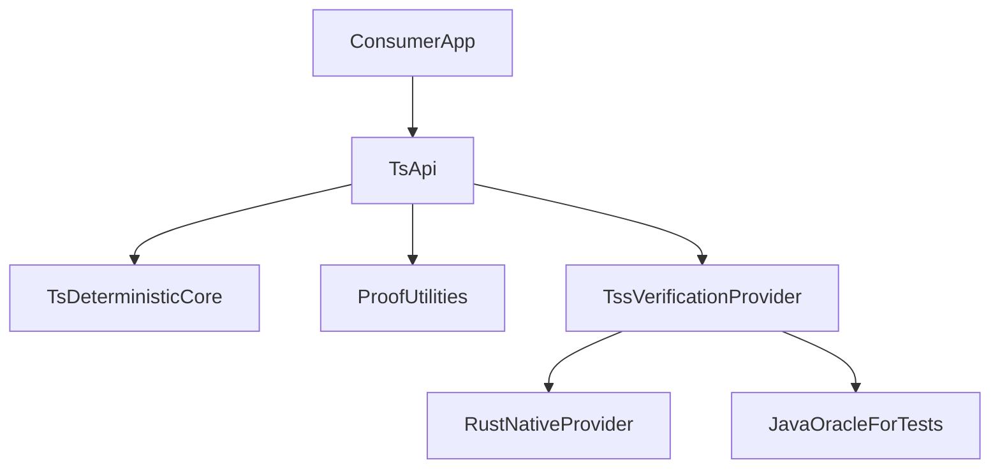
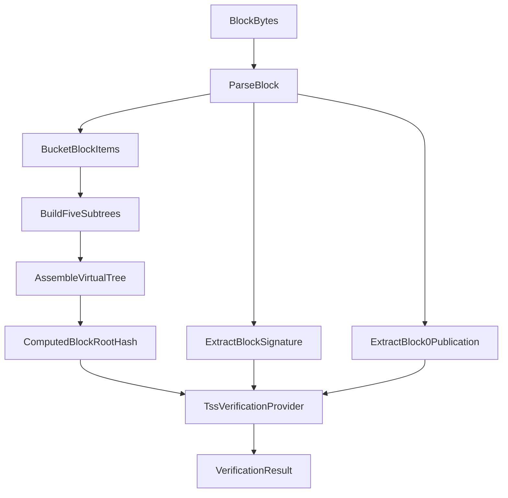

# JS/TS TSS Verification Library

## Purpose

Provide a community-oriented JavaScript/TypeScript library that helps users independently verify
Hedera block data produced under HIP-1056, including the TSS-based proof model described in
HIP-1200.

The library should serve two audiences:

1. Community users who want a practical verifier they can use in their own applications.
2. Engineers who want a clear reference design for building compatible verifiers in their own
   DApps, indexers, wallets, relayers, or other software.

This document proposes the engineering approach for that library. It is intentionally comparative:
it explores the main implementation paths, highlights trade-offs, and ends with a recommended
approach.

This proposal should be read alongside:

1. `docs/design/tss-block-proof-verification.md`
2. `docs/design/block-verification.md`
3. `docs/design/proofs/block-content-proof.md`

## Goals

### P0

1. Verify block integrity without TSS signature verification by recomputing the block root hash.
2. Parse block-proof data and prepare it for TSS verification.
3. Verify a block root with TSS signature support using an open-source implementation path.

### P1

1. Generate block contents proofs from a block.
2. Verify block contents proofs against a trusted block root or trusted block proof.

### P2

1. Define a practical path toward smart-contract verification of block proofs.

### Non-Goals

1. Replacing the existing Java verifier used by the block node in the short term.
2. Shipping browser-first full TSS verification in the initial version.
3. Recommending a preferred implementation path that depends on closed-source or not-yet-open-source
   cryptography.
4. Providing block storage, indexing, transport, or subscription features.

## Terms

<dl>
  <dt>BlockRootHash</dt>
  <dd>The final Merkle root for a block as defined by HIP-1056 and reconstructed by the current verifier implementation.</dd>

  <dt>LedgerId</dt>
  <dd>The network identity used as an input to chain-of-trust verification. It should not be treated as the only trust input needed for full protocol-correct verification.</dd>

  <dt>LedgerIdPublicationTransactionBody</dt>
  <dd>A publication used by the current Java verifier to bootstrap TSS-related state. In repo behavior it is treated as a container for ledger ID, node contributions, and history-proof verification-key data; however, the protocol trust model still depends on genesis and chain-of-trust assumptions beyond this publication alone.</dd>

  <dt>hinTS</dt>
  <dd>The threshold signature scheme described by HIP-1200. This document avoids pinning exact threshold semantics because the currently available specification material and implementation-facing comments are not perfectly aligned.</dd>

  <dt>WRAPS</dt>
  <dd>A recursive proof format associated with the chain-of-trust flow described in HIP-1200. In the current Java verifier, WRAPS handling is delegated to native verification logic rather than modeled explicitly in application code.</dd>

  <dt>ChainOfTrustProof</dt>
  <dd>A protocol-level concept from HIP-1200 for establishing verification-key provenance. This document uses the term only at a high level; the current Java verifier largely delegates these distinctions to the native TSS library.</dd>

  <dt>BlockContentsProof</dt>
  <dd>A Merkle inclusion proof showing that a block item is part of a block whose root is already trusted or whose proof can be verified.</dd>
</dl>

## Entities

### `js-tss-verification-core`

The TypeScript core package that owns deterministic logic:

1. Block parsing and proof decoding.
2. Block-item bucketing.
3. Merkle subtree construction.
4. Virtual block tree assembly.
5. Root-hash recomputation.
6. Block contents proof generation and verification.
7. Extraction of TSS bootstrap data from block 0.

### `TssVerificationProvider`

An abstraction boundary for full cryptographic verification. This keeps the public TS API stable
even if the underlying TSS implementation path changes.

Responsibilities:

1. Initialize trust inputs from a publication, trusted bootstrap material, or equivalent trusted
   data source.
2. Validate proof data at the level supported by the chosen implementation phase.
3. Validate direct TSS signatures on block roots when the chosen backend supports them.
4. Return explicit error types for malformed proofs and backend incompatibilities.

### Conformance Fixtures

Real block fixtures and expected outputs derived from existing verifier behavior.

These are required because this project is primarily a protocol-conformance effort, not just a new
greenfield library.

## Design

### Design Constraints From Current Behavior

The existing block-node implementation establishes the main design constraints for this library:

1. The deterministic part of verification is separable from the cryptographic part. Block parsing,
   item bucketing, subtree hashing, virtual-tree assembly, and proof reconstruction are regular
   application logic and are portable to TS.
2. Real TSS verification is currently a dedicated cryptographic boundary. The Java verifier
   delegates proof checking to `TSS.verifyTSS(...)` rather than implementing the cryptographic
   details inline.
3. Block 0 bootstrap is first-class. The current system initializes TSS state from
   `LedgerIdPublicationTransactionBody` found in block 0, or restores the same data from a
   persisted file.
4. The current verifier only finalizes verification for a direct `signedBlockProof` and expects
   exactly one such proof.
5. A stale simplification exists in `docs/design/block-verification.md`, which still describes
   signature verification as `signature == SHA-384(blockHash)`. The current verifier only keeps
   that as a temporary legacy fallback for 48-byte signatures. The JS/TS design should model the
   real TSS flow, not that legacy shortcut.

### Decision Drivers

Each approach should be evaluated against the same criteria:

1. Correctness parity with HIP-1056, HIP-1200, and current verifier behavior.
2. Open-source community buildability.
3. Node-first usability for the likely first adopters.
4. Browser implications and future flexibility.
5. Packaging and distribution complexity.
6. Long-term maintainability.

### Proposed Library Scope By Phase

#### Phase 1

1. Parse blocks and proof data in TS.
2. Recompute block root hashes in TS.
3. Provide a library-level hash-only verification mode as a proposed capability, even though the
   current Java verifier always expects a proof to finalize verification.
4. Generate and verify block contents proofs in TS as a new library capability aligned with the
   proof-service design direction.
5. Extract and persist bootstrap publication data for later verification experiments and
   compatibility work.

#### Phase 2

1. Add full TSS verification behind a provider interface.
2. Validate compatibility against golden fixtures and existing verifier behavior.
3. Keep the public TS API stable while proving the crypto backend path.

#### Phase 3

1. Reassess browser-capable full verification.
2. Evaluate smart-contract verification outputs and proof-shaping needs.

### Trust And Bootstrap Model

The library must be explicit about trust assumptions:

1. The protocol-level root of trust is not created by the library. At the HIP level, genesis trust
   assumptions and chain-of-trust validation matter; a publication alone is not the full story.
2. The current Java verifier uses a practical bootstrap shortcut: while processing block 0, it
   reads `LedgerIdPublicationTransactionBody`, initializes TSS state immediately, and then uses
   that state to verify block 0 itself.
3. A JS/TS library may choose to support that same bootstrap mode for compatibility, but the
   document should describe it as current implementation behavior, not as the full protocol trust
   model.
4. Consumers should not be given a misleading `verify(block)` API that implies stronger trust
   guarantees than the provided bootstrap material actually supports.

### Approach Options

#### Option A: Pure TS From Scratch

Description:

Implement the full verifier, including hinTS and WRAPS verification, directly in TS using existing
JS cryptography libraries.

Pros:

1. Best package ergonomics for JS/TS users.
2. Strongest long-term browser story in principle.
3. Avoids cross-language packaging complexity.

Cons:

1. Highest correctness and maintenance risk.
2. The hardest part of the problem is not ordinary application logic; it is byte-level proof
   compatibility and specialized cryptographic verification.
3. The JS ecosystem is stronger for general BLS work than for exact BN254 and Groth16
   interoperability with the kinds of proof artifacts expected here.

Assessment:

This is attractive as a long-term aspiration, but it is too risky as the recommended initial path.

#### Option B: Rust-Backed Open-Source Crypto Backend

Description:

Keep parsing, hashing, and proofs in TS, but implement authoritative full TSS verification in an
open-source Rust backend exposed to Node through a stable provider interface.

Pros:

1. Best fit for exact, performance-sensitive cryptographic verification outside the JVM.
2. Keeps the public library TS-friendly while isolating cryptographic complexity.
3. Preserves a cleaner path to future WASM work than a Java-based approach.

Cons:

1. Introduces packaging and release complexity.
2. Browser support becomes a follow-on decision rather than an initial guarantee.
3. Requires careful API design so the Rust boundary remains narrow and stable.

Assessment:

This is the strongest open-source candidate for authoritative full verification.

#### Option C: Java Or Sidecar Reuse

Description:

Reuse the existing Java and native verifier behavior through a sidecar, subprocess, or bridge.

Pros:

1. Closest to current verifier behavior.
2. Useful as a short-term oracle during development.

Cons:

1. Poor fit for a community JS/TS library.
2. Weak browser story.
3. Heavy operational model for consumers.

Assessment:

This is reasonable as a test oracle or migration aid, but not as the recommended library
architecture.

#### Option D: Phased Hybrid

Description:

Build a TS-first deterministic verifier core with a pluggable crypto provider, then add the best
open-source full-verification backend once compatibility is proven.

Pros:

1. Separates low-risk deterministic work from high-risk crypto work.
2. Delivers useful value early without locking the project into the wrong backend too soon.
3. Matches the boundary already visible in the current implementation.

Cons:

1. Requires discipline around API boundaries.
2. Some full-verification capability arrives later than hash-only verification.

Assessment:

This is the best overall architectural shape. The main remaining decision is which backend should
be recommended for authoritative full verification.

### Recommended Approach

The document should remain comparative, but it should still make a clear recommendation.

Recommended conclusion:

1. Use a phased hybrid architecture.
2. Implement the deterministic verifier core in TS.
3. Recommend an open-source Rust-backed provider as the most credible authoritative path for full
   TSS verification in the near term.
4. Use Java and the existing verifier only as a correctness oracle for tests and conformance
   validation.
5. Defer browser-capable full verification until Node parity and serialization compatibility are
   proven.

Why this wins:

1. It aligns with the boundaries already present in the current verifier.
2. It keeps the library usable and understandable by the JS ecosystem.
3. It avoids overcommitting to pure TS cryptography before proof-format interoperability is proven.
4. It avoids turning a short-term compatibility bridge into a long-term architectural trap.

### Public API Shape

The public API should separate deterministic verification from full proof verification.

The examples below are illustrative API shapes for the proposed library. They are not intended to
claim that the current Java verifier already exposes these exact semantics, and they should not be
read as a complete encoding of the broader proof surface that may need support over time.

```ts
export interface VerifyHashResult {
  valid: boolean;
  blockRootHash: Uint8Array;
  error?: string;
}

export interface TrustBootstrap {
  publicationBytes?: Uint8Array;
  trustedLedgerId?: Uint8Array;
}

export interface VerifyDirectProofInput {
  blockRootHash: Uint8Array;
  blockProofBytes: Uint8Array;
  bootstrap?: TrustBootstrap;
}

export interface VerifyProofResult extends VerifyHashResult {
  proofValid: boolean;
  details?: string;
}

export interface TssVerificationProvider {
  initializeTrustContext(bootstrap: TrustBootstrap): Promise<void>;
  verifyDirectBlockProof(input: VerifyDirectProofInput): Promise<VerifyProofResult>;
}

export function verifyBlockHash(blockBytes: Uint8Array): VerifyHashResult;
export function generateBlockContentsProof(
  blockBytes: Uint8Array,
  itemIndex: number
): Uint8Array;
export function verifyBlockContentsProof(
  proofBytes: Uint8Array,
  trustedBlockRootHash: Uint8Array
): boolean;
```

Notes:

1. The API should not expose curve-specific point types.
2. The API should be byte-oriented and protobuf-oriented.
3. It should be possible to add broader `BlockProof` support later without breaking the initial
   direct-proof API.
4. Strict and non-strict verification modes may be appropriate where current server behavior falls
   back to footer-provided values.

### Testing Strategy

The implementation approach should not be "just TDD".

Recommended testing strategy:

1. Use TDD for deterministic TS components such as:
   1. parsing helpers
   2. block-item bucketing
   3. Merkle leaf hashing
   4. internal-node hashing
   5. virtual-tree assembly
   6. proof generation and proof verification
2. Use fixture-driven conformance testing for protocol behavior:
   1. block 0 bootstrap handling
   2. direct proof inputs supported by the chosen implementation phase
   3. tampered roots and signatures
   4. malformed proof inputs
3. Use parity testing against the existing verifier for:
   1. expected root-hash results
   2. full TSS validation semantics
   3. serialization compatibility checks

Reasoning:

1. This project is mainly a protocol-conformance and compatibility effort, not a greenfield domain
   model where tests alone should drive discovery.
2. A pure TDD approach can lock in incorrect assumptions too early, especially around proof
   formats, bootstrap handling, and cryptographic serialization.

## Diagram

### Proposed Layering



### Verification Flow



## Configuration

Expected library configuration:

1. `strictVerification`
   Enables strict local recomputation and avoids fallback behavior where trust would be weakened.
2. `trustedPublicationPath`
   Optional file path for a trusted serialized `LedgerIdPublicationTransactionBody`.
3. `provider`
   The chosen TSS verification provider implementation.
4. `proofMode`
   Controls whether the library supports hash-only verification, full TSS verification, or both.

## Metrics

Recommended metrics for implementers or benchmark tooling:

1. `block_parse_duration_ms`
2. `block_hash_duration_ms`
3. `proof_generation_duration_ms`
4. `proof_verification_duration_ms`
5. `tss_verification_duration_ms`
6. `verification_success_total`
7. `verification_failure_total`
8. `unsupported_proof_mode_total`

## Exceptions

Expected error categories:

1. `ParseError`
   Invalid block bytes, malformed protobuf, or unsupported version.
2. `MerkleError`
   Invalid tree assembly, bad item ordering, or hash mismatch.
3. `BootstrapError`
   Missing or invalid trust bootstrap data.
4. `UnsupportedProofModeError`
   Proof mode is recognized conceptually but not yet supported by the chosen provider.
5. `TssVerificationError`
   Full proof verification failed.
6. `ProviderCompatibilityError`
   The selected provider cannot parse or validate the required serialized proof data.

## Acceptance Tests

### Phase 1

1. Parse known block fixtures successfully.
2. Recompute block root hashes that match known expected values.
3. Verify hash-only mode for valid blocks.
4. Reject tampered blocks in hash-only mode.
5. Generate valid block contents proofs.
6. Verify valid block contents proofs against trusted roots.
7. Reject invalid or malformed block contents proofs.

### Phase 2

1. Verify supported direct proof inputs using the chosen provider.
2. Verify block 0 in the chosen compatibility mode and document the trust assumptions used.
3. Verify later blocks after bootstrap has been established.
4. Reject tampered signatures.
5. Reject tampered block-root hashes.
6. Match expected results from existing verifier behavior on the same golden fixtures.
7. Add stronger classification tests only when fixture coverage proves the proof distinctions being
   asserted.

### Phase 3

1. Define proof shapes or exported verification artifacts suitable for smart-contract validation.
2. Reassess browser-capable verification only after Node-first parity is established.