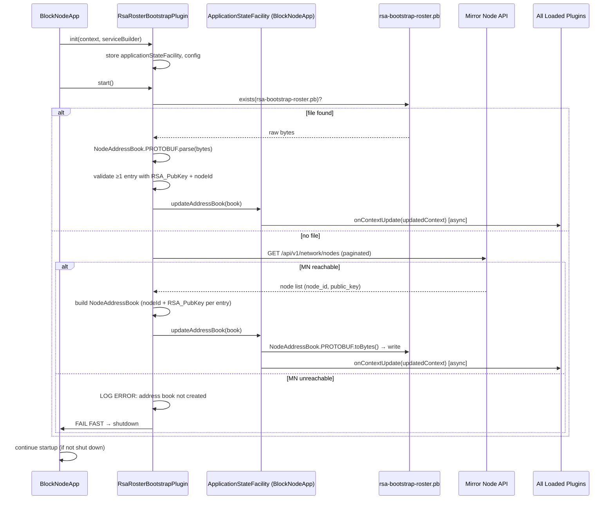
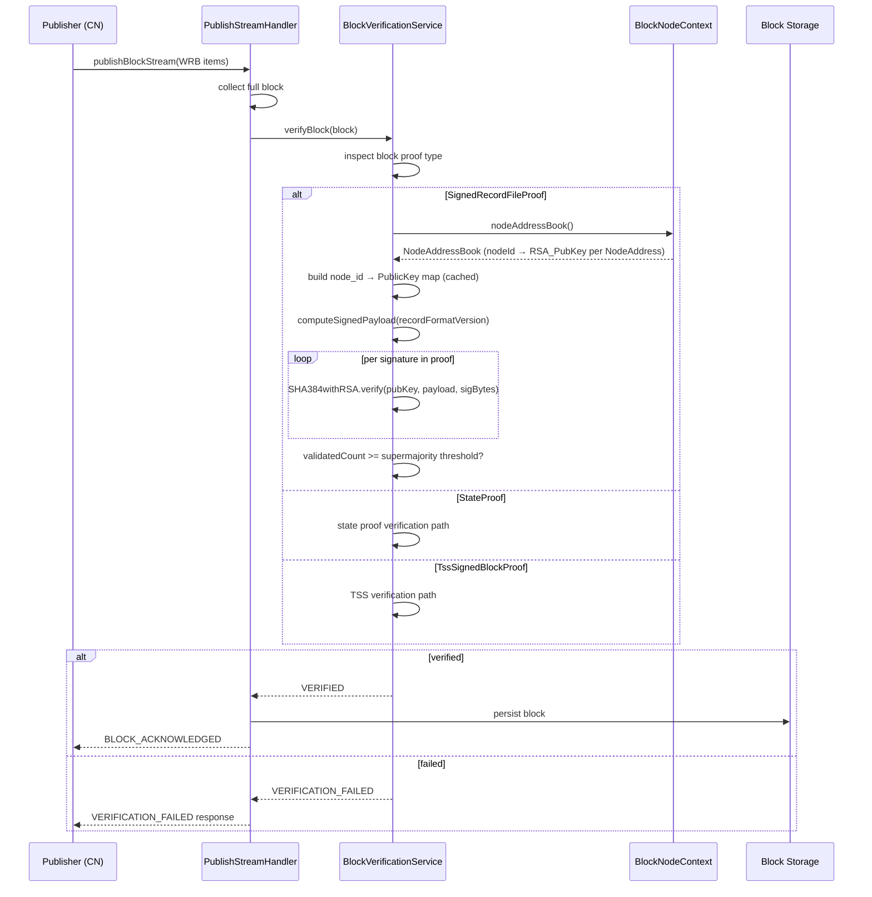

# Bootstrap RSA Roster Plugin — Design Document

---

## Table of Contents

1. [Purpose](#1-purpose)
2. [Goals](#2-goals)
3. [Terms](#3-terms)
4. [Design](#4-design)
   - 4.1 [Plugin Structure](#41-plugin-structure)
   - 4.2 [Bootstrap File Format](#42-bootstrap-file-format)
   - 4.3 [Mirror Node Fetch](#43-mirror-node-fetch)
   - 4.4 [Startup Sequence](#44-startup-sequence)
   - 4.5 [RSA Signature Verification](#45-rsa-signature-verification)
   - 4.6 [Phase 2b Transition](#46-phase-2b-transition)
5. [Diagram](#5-diagram)
6. [Configuration](#6-configuration)
7. [Metrics](#7-metrics)
8. [Security](#8-security)
9. [Operator Tooling](#9-operator-tooling)
10. [Acceptance Tests](#10-acceptance-tests)
11. [Follow-on Ticket Mapping](#11-follow-on-ticket-mapping)
12. [Open Questions and Deferred Items](#12-open-questions-and-deferred-items)

**Issue:** [#2560](https://github.com/hiero-ledger/hiero-block-node/issues/2560)
**Informs:** [#2561](https://github.com/hiero-ledger/hiero-block-node/issues/2561), [#2562](https://github.com/hiero-ledger/hiero-block-node/issues/2562), [#2563](https://github.com/hiero-ledger/hiero-block-node/issues/2563)

---

## 1. Purpose

Phase 2a of the Hiero network upgrade introduces **Wrapped Record Blocks (WRBs)** — block stream blocks whose proof is
a `SignedRecordFileProof` containing RSA signatures from every consensus node in the current roster. Before the Block
Node (BN) can verify these proofs it must know the current address books: specifically the mapping of
`node_id → RSA public key` for every active consensus node.

This design document specifies the **Bootstrap RSA Roster Plugin** (roster-bootstrap-rsa) — a `BlockNodePlugin` that
loads this mapping at BN startup and makes it available to the proof verification layer via `ApplicationStateFacility`.
It follows the same structural pattern as the `TssBootstrapPlugin`.

The BN automatically determines which proof type to verify based on the proof present in each incoming block
(`SignedRecordFileProof`, `StateProof`, or `TssSignedBlockProof`). No operator-configured proof mode is required.

---

## 2. Goals

**In scope:**

- Load the latest reference consensus node address book (node IDs + RSA public keys) from disk at BN startup.
- Fetch the roster from the Hedera Mirror Node `GET /api/v1/network/nodes` API when no local bootstrap file is present.
- Persist the loaded roster to a local bootstrap file via `ApplicationStateFacility` so subsequent restarts do not
  require network calls.
- Expose the loaded roster to all BN plugins via `ApplicationStateFacility.updateAddressBook()`, which updates
  `BlockNodeContext` and notifies all plugins via `onContextUpdate`.
- Fail fast with a clear error log when the Mirror Node API is unreachable and no local bootstrap file exists.
- Define the RSA signature verification algorithm precisely enough to be implemented from this document. Initially only
  v6 record files will be supported.
- Support verification of `SignedRecordFileProof`, `StateProof`, and `TssSignedBlockProof` — the BN determines which
  verification path to invoke based on the proof type present in the block.

**Out of scope (deferred to follow-on tickets):**

- Mid-instance address book reload without restart — not required for Phase 2a. The plugin loads once at `start()` and
  does not watch for roster changes at runtime. (#2563)
- On-chain address book tracking via record file parsing — deferred to a future plugin iteration.
- Cloud upload path changes for WRBs — handled separately.
- Block simulator support for generating valid `SignedRecordFileProof` blocks — flagged as a testing gap; tracked
  under #2561.
- Verification of v2 and v5 record files.

---

## 3. Terms

<dl>
  <dt>WRB (Wrapped Record Block)</dt>
  <dd>A block in the Hiero Block Stream format whose content is a wrapped record file. Produced by a Consensus Node
    wrapping a record file it has already generated. Identified by a <code>SignedRecordFileProof</code> block proof.
  </dd>

  <dt>SignedRecordFileProof</dt>
  <dd>The block proof type used in Phase 2a WRBs. Contains one RSA signature per consensus node in the current roster,
    produced over a deterministic payload derived from the record file.
  </dd>

  <dt>StateProof</dt>
  <dd>A block proof type supported in both Phase 2a and Phase 2b. Contains a state-based proof attesting to the
    validity of the block. The BN handles <code>StateProof</code> verification independently of the RSA roster.
  </dd>

  <dt>Roster</dt>
  <dd>The set of active consensus nodes contributing to consensus at a given point in time. Represented in this plugin as a
    <code>NodeAddressBook</code> protobuf message in which each <code>NodeAddress</code> entry carries the node's
    <code>nodeId</code> and <code>RSA_PubKey</code>.
  </dd>

  <dt>NodeAddressBook / NodeAddress</dt>
  <dd>Protobuf messages defined in <code>basic_types.proto</code> of the Hedera services API
    (<a href="https://github.com/hiero-ledger/hiero-consensus-node/blob/main/hapi/hedera-protobuf-java-api/src/main/proto/services/basic_types.proto">hiero-consensus-node</a>).
    <code>NodeAddressBook</code> is a container of <code>repeated NodeAddress</code> entries. <code>NodeAddress</code>
    carries several fields; this plugin uses only <code>nodeId</code> (field 5) and <code>RSA_PubKey</code> (field 4).
  </dd>

  <dt>Bootstrap File</dt>
  <dd>A binary protobuf file (serialized <code>NodeAddressBook</code>) persisted locally at the configured path. Used to
    avoid a Mirror Node network call on every restart.
  </dd>

  <dt>ApplicationStateFacility</dt>
  <dd>An interface (implemented by <code>BlockNodeApp</code>) through which plugins notify the application of state
    changes. For the RSA roster plugin, it exposes <code>updateAddressBook(NodeAddressBook)</code>, which writes the
    bootstrap file and broadcasts <code>onContextUpdate</code> to all loaded plugins.
  </dd>

  <dt>Phase 2a</dt>
  <dd>The cutover at which Consensus Nodes begin streaming WRBs to Block Nodes. RSA proofs are used.</dd>

  <dt>Phase 2b</dt>
  <dd>The subsequent cutover at which Consensus Nodes switch to full Block Streams with TSS/hinTS proofs. Record file
    production ceases.</dd>
</dl>

---

## 4. Design

### 4.1 Plugin Structure

The `RsaRosterBootstrapPlugin` follows the same structure as `TssBootstrapPlugin` (PR #2492):

- Implements `BlockNodePlugin` (registered via Java SPI).
- Declares a config record (`BootstrapRosterConfig`) via `configDataTypes()`.
- Performs all roster loading work in `start()` (not `init()`). The plugin does **not** start background threads;
  there is no mid-instance reload.
- Stores the `ApplicationStateFacility` reference during `init()` for use in `start()`.
- Makes the loaded address book available to the rest of the BN by calling
  `applicationStateFacility.updateAddressBook(book)`. The `ApplicationStateFacility` implementation in
  `BlockNodeApp` then writes the bootstrap file (if the roster was fetched from Mirror Node) and calls
  `onContextUpdate(context)` on all loaded plugins so they receive the populated `NodeAddressBook`.

**Module declaration:**

```java
// module-info.java
import org.hiero.block.node.roster.bootstrap.rsa.RsaRosterBootstrapPlugin;

module org.hiero.block.node.roster.bootstrap.rsa {
    requires transitive org.hiero.block.node.spi;
    requires com.hedera.hapi;          // NodeAddressBook, NodeAddress (basic_types.proto)
    requires com.hedera.pbj.runtime;   // PBJ serialization / deserialization
    requires java.net.http;            // Mirror Node HTTP client

    provides org.hiero.block.node.spi.BlockNodePlugin with
            RsaRosterBootstrapPlugin;
}
```

**Plugin skeleton:**

```java
public class RsaRosterBootstrapPlugin implements BlockNodePlugin {

    private ApplicationStateFacility applicationStateFacility;
    private BootstrapRosterConfig config;

    @Override
    public List<Class<? extends Record>> configDataTypes() {
        return List.of(BootstrapRosterConfig.class);
    }

    @Override
    public void init(BlockNodeContext context, ServiceBuilder serviceBuilder) {
        this.applicationStateFacility = Objects.requireNonNull(context.applicationStateFacility());
        this.config = context.configuration().getConfigData(BootstrapRosterConfig.class);
    }

    @Override
    public void start() {
        final NodeAddressBook book = loadOrFetchAddressBook(config);
        // ApplicationStateFacility handles file persistence and onContextUpdate broadcast
        applicationStateFacility.updateAddressBook(book);
    }
}
```

**`ApplicationStateFacility` extension:** `ApplicationStateFacility` currently exposes `updateTssData`.
A new `updateAddressBook(NodeAddressBook)` method must be added, following the same pattern:
- `BlockNodeApp` implements the method.
- The method updates the `nodeAddressBook` field in `BlockNodeContext`.
- The method writes the bootstrap file if the address book was fetched from Mirror Node (file did not previously
  exist).
- The method calls `plugin.onContextUpdate(updatedContext)` for each loaded plugin so downstream consumers (e.g.
  `BlockVerificationService`) receive the populated address book before they begin verifying blocks.

> **Thread safety note:** `onContextUpdate()` is called from a different thread than the plugin's own `start()` thread
> (as documented in `BlockNodePlugin`). Downstream plugins that consume the `NodeAddressBook` must update their
> internal state in a thread-safe manner.

---

### 4.2 Bootstrap File Format

The bootstrap file is a **binary protobuf serialization** of the `NodeAddressBook` message from `basic_types.proto`.
This reuses a well-known, stable message definition from the Hedera services API rather than introducing a bespoke
schema, and it is directly compatible with the on-chain address book format stored at file `0.0.102`.

**Proto definition (from `hiero-consensus-nodehapi/hedera-protobuf-java-api/src/main/proto/services/basic_types.proto`):**

```protobuf
/**
 * A list of nodes and their metadata that contains details of the nodes
 * running the network.
 *
 * Used to parse the contents of system files 0.0.101 and 0.0.102.
 */
message NodeAddressBook {
    repeated NodeAddress nodeAddress = 1;
}

message NodeAddress {
    // ... (other fields omitted — only the two below are used by this plugin)

    /**
     * A hexadecimal String encoding of an X509 public key.
     * Used to verify record stream files.
     * Stored as a UTF-8 hex string of the DER-encoded public key bytes.
     */
    string RSA_PubKey = 4;

    /**
     * A numeric identifier for the node.
     */
    int64 nodeId = 5;
}
```

**Fields used by this plugin:**

| `NodeAddress` field | Field # |   Type   |                                                           Purpose                                                            |
|---------------------|---------|----------|------------------------------------------------------------------------------------------------------------------------------|
| `RSA_PubKey`        | 4       | `string` | Hex-encoded DER X.509 SubjectPublicKeyInfo RSA public key. Used to construct the `PublicKey` for RSA signature verification. |
| `nodeId`            | 5       | `int64`  | Numeric node identifier. Used as the lookup key when verifying a signature from a specific node.                             |

All other `NodeAddress` fields (`ipAddress`, `portno`, `memo`, `nodeAccountId`, `nodeCertHash`, `serviceEndpoint`,
`description`, `stake`) are left unset in the persisted file.

**Serialization and deserialization (PBJ):**

```java
// Write
final Bytes encoded = NodeAddressBook.PROTOBUF.toBytes(nodeAddressBook);
Files.write(filePath, encoded.toByteArray());

// Read
final byte[] raw = Files.readAllBytes(filePath);
final NodeAddressBook nodeAddressBook =
        NodeAddressBook.PROTOBUF.parse(BufferedData.wrap(raw));
```

**Default file path:** `data/config/rsa-bootstrap-roster.pb`

**Notes:**
- The `RSA_PubKey` string in `NodeAddress` is the raw hex-encoded DER bytes without an `0x` prefix. Mirror Node
  returns the key with a leading `0x` which must be stripped before storing.
- The file does not embed metadata such as network name or generation timestamp. Operators wishing to annotate the
  file should maintain a separate sidecar file or rely on filesystem timestamps.

---

### 4.3 Mirror Node Fetch

When no local bootstrap file is present, the plugin queries the Mirror Node REST API endpoint:

```
GET {mirrorNodeBaseUrl}/api/v1/network/nodes
```

and maps the response into a `NodeAddressBook` by populating only `nodeId` and `RSA_PubKey` in
each `NodeAddress` entry.

**Pagination:** The API returns up to 100 nodes per page (default 25). The implementation must follow `links.next` until
it is `null` to collect all nodes.

**Field mapping:**

| Mirror Node JSON field | `NodeAddress` protobuf field |               Notes               |
|------------------------|------------------------------|-----------------------------------|
| `node_id`              | `nodeId` (field 5)           | Direct mapping (int64)            |
| `public_key`           | `RSA_PubKey` (field 4)       | Strip leading `0x` before storing |

**Filtering:** Only include nodes where `public_key` is non-null and non-empty. Nodes without a public key are not
eligible for RSA verification and must be excluded from the `NodeAddressBook`.

**Pseudo-implementation:**

```java
private NodeAddressBook fetchFromMirrorNode(BootstrapRosterConfig config) {
    final List<NodeAddress> entries = new ArrayList<>();
    String nextPath = "/api/v1/network/nodes?limit=100&order=asc";

    while (nextPath != null) {
        final JsonNode page = httpGet(config.mirrorNodeBaseUrl() + nextPath);
        for (JsonNode node : page.get("nodes")) {
            final String pubKey = node.path("public_key").asText(null);
            if (pubKey == null || pubKey.isBlank()) continue;

            // Strip the 0x prefix that Mirror Node includes
            final String rsaPubKeyHex = pubKey.replaceFirst("^0x", "");

            entries.add(NodeAddress.newBuilder()
                    .nodeId(node.get("node_id").asLong())
                    .rsaPubKey(rsaPubKeyHex)
                    .build());
        }
        nextPath = page.path("links").path("next").asText(null);
    }

    if (entries.isEmpty()) {
        throw new RosterFetchException(
                "Mirror Node returned zero nodes with RSA public keys");
    }
    return NodeAddressBook.newBuilder().nodeAddress(entries).build();
}
```

**Timeouts and retries:** The HTTP client must be configured with a per-request connect timeout (default 5 s) and read
timeout (default 10 s). Three retries with exponential backoff (initial delay 1 s) are sufficient. If the call fails
after retries the plugin logs a clear error and fails fast (see §4.4 for MN-down handling).

---

### 4.4 Startup Sequence

The plugin follows a **file-first** strategy consistent with `TssBootstrapPlugin`. The file check and any network call
happen in `start()`, after `init()` has stored the facility reference.

```
start() called
   │
   ├─ Bootstrap file exists at config path (rsa-bootstrap-roster.pb)?
   │       │
   │       YES ──► Read bytes → NodeAddressBook.PROTOBUF.parse() → validate (≥1 entry)
   │       │        │
   │       │        ├─ On parse error or empty book: LOG ERROR → FAIL FAST (throw)
   │       │        │
   │       │        └─ applicationStateFacility.updateAddressBook(book)
   │       │              └─ BlockNodeApp notifies all plugins via onContextUpdate
   │       │
   │       NO ──► Query Mirror Node API (paginated GET /api/v1/network/nodes)
   │               │
   │               ├─ SUCCESS: build NodeAddressBook (nodeId + RSA_PubKey per entry)
   │               │     └─ applicationStateFacility.updateAddressBook(book)
   │               │           ├─ BlockNodeApp writes rsa-bootstrap-roster.pb
   │               │           └─ BlockNodeApp notifies all plugins via onContextUpdate
   │               │
   │               └─ FAILURE (API unreachable / timeout / empty response):
   │                     LOG ERROR: "RSA address book could not be created — Mirror Node
   │                                 API unavailable. BN cannot verify WRB proofs."
   │                     FAIL FAST → shutdown BN
   │                     (see Open Question #1 below)
   │
   └─ Startup complete
```

**File-first rationale:** If the bootstrap file already exists there is no need to contact the Mirror Node. The file
was written on a previous successful startup and represents a known-good address book. Calling Mirror Node on every
restart would add latency and introduce a network dependency for what is otherwise a deterministic local load.

**Mirror Node down — fail-fast rationale:** An absent or unreadable roster means the BN cannot verify any WRB proof.
If the address book was not created the BN is in an unhealthy state. A clear error log at shutdown time is preferable
to silently accepting or rejecting all blocks without a functioning verification layer. Operators are expected to ensure
either the bootstrap file is present or the Mirror Node is reachable before starting the BN.

> **Open Question (see §12 #1):** Should the BN shut down immediately when the Mirror Node call fails, or should it
> start but leave RSA verification failing until the address book is populated? The current recommendation is **fail
> fast**. Additionally, publicly available snapshots of the on-chain `NodeAddressBook` (file `0.0.102`) can serve as
> a fallback source for operators who cannot reach the Mirror Node API.

**No mid-instance reload:** The roster is loaded once at `start()` and does not change for the lifetime of the BN
instance. Roster updates (e.g., a node leaving the network) require a BN restart with a refreshed bootstrap file or
by deleting the file so the next startup fetches a fresh copy from Mirror Node. Runtime reload is tracked in #2563.

---

### 4.5 RSA Signature Verification

This section specifies the verification algorithm precisely enough to be implemented without reference to external code.
The algorithm is derived from the existing `SignatureValidation`, `SignatureDataExtractor`, and `SigFileUtils` classes
in `tools-and-tests/tools`, which in turn match the verification logic used by Hedera Mirror Node.

> **Proof type routing:** The BN determines which verification path to invoke based on the proof type present in each
> block. No configuration flag is required:
>
> | Block proof type         | Verification path                              |
> |--------------------------|------------------------------------------------|
> | `SignedRecordFileProof`  | RSA roster verification (this plugin)          |
> | `StateProof`             | State proof verification (Phase 2a and 2b)     |
> | `TssSignedBlockProof`    | TSS verification (`TssBootstrapPlugin`)        |
>
> Both Phase 2a and Phase 2b support `StateProof`. No operator-configured proof mode is needed.

> **Placement in the pipeline:** RSA verification is performed by the block verification layer
> (`BlockVerificationService`) immediately after a complete WRB is received from the publisher, before the block is
> written to storage. The `RsaRosterBootstrapPlugin` supplies the `NodeAddressBook` via `onContextUpdate`; the
> verification service reads it from `BlockNodeContext.nodeAddressBook()`.

#### 4.5.1 Identifying a WRB

A block is a WRB if its `BlockProof` contains a `SignedRecordFileProof` (as opposed to a `TssSignedBlockProof` or
`StateProof`). The proof type is indicated in the protobuf structure — no additional block-level flag is needed.

#### 4.5.2 Building the Verification Key Map

When the verification service first processes a WRB proof it builds an in-memory lookup map from the `NodeAddressBook`
stored in `BlockNodeContext`:

```java
// Built once and cached for the lifetime of the BN instance.
Map<Long, PublicKey> keyByNodeId = new HashMap<>();
for (NodeAddress addr : context.nodeAddressBook().nodeAddress()) {
    if (addr.rsaPubKey().isBlank()) continue;
    keyByNodeId.put(addr.nodeId(), SigFileUtils.decodePublicKey(addr.rsaPubKey()));
}
```

The `addr.rsaPubKey()` value is the raw hex DER string (no `0x` prefix) as stored in the bootstrap file.
`SigFileUtils.decodePublicKey()` supports both `X.509` `SubjectPublicKeyInfo` and `X.509` certificate `DER` formats,
with an in-memory cache keyed by hex string to avoid repeated `DER` parsing.

#### 4.5.3 Signed Payload Computation

The payload that was signed by each consensus node depends on the record file format version embedded in the WRB:

| Version |                                         Payload computation                                         |
|---------|-----------------------------------------------------------------------------------------------------|
| **v6**  | `SHA-384( int32(6) \|\| rawRecordStreamFileBytes )`                                                 |
| **v5**  | Reconstruct the v5 binary record file from parsed items, then `SHA-384(v5Bytes)`                    |
| **v2**  | Reconstruct v2 binary record, compute `SHA-384` of reconstructed bytes, then `SHA-384` of that hash |

The `rawRecordStreamFileBytes` in v6 is the verbatim serialised proto bytes of the record stream file contained in the
WRB, not re-serialised from a parsed representation.

Reference implementation: `SignatureDataExtractor.computeSignedHash()` in `tools-and-tests/tools`.

#### 4.5.4 RSA Signature Verification Steps

For each signature in the `SignedRecordFileProof`:

1. Extract the signing `node_id` and the raw RSA signature bytes.
2. Look up the `PublicKey` for `node_id` in the map built from the `NodeAddressBook`. If absent, skip this signature and
   increment `roster_mismatch_total`.
3. Verify using `SHA384withRSA`:

   ```
   Signature sig = Signature.getInstance("SHA384withRSA");
   sig.initVerify(publicKey);
   sig.update(computedPayload);        // 48-byte SHA-384 hash
   boolean valid = sig.verify(signatureBytes);
   ```

   Use a `ThreadLocal<Signature>` engine to avoid per-call allocation under high throughput.

4. If `valid`, add `1` to `validatedCount` (equal-weight; stake-weighted threshold is deferred).

#### 4.5.5 Threshold Requirements

A WRB proof is **accepted** when:

```
validatedCount >= 2 * ceil(rosterSize / 3) + 1
```

This matches the supermajority threshold used by Mirror Node and the WRB CLI. Stake-weighted threshold (using
`NodeAddress.stake`, which is deprecated in the proto but may be populated) is deferred to a follow-on improvement and
tracked in #2562.

#### 4.5.6 Failure Modes

|                      Condition                      |                          Action                          |
|-----------------------------------------------------|----------------------------------------------------------|
| Zero valid signatures                               | Reject block; increment `rsa_verification_failure_total` |
| `validatedCount < threshold`                        | Reject block; increment `rsa_verification_failure_total` |
| `node_id` not in `NodeAddressBook`                  | Skip signature; increment `roster_mismatch_total`        |
| Zeroed signature bytes (all 0x00)                   | Skip signature; log at DEBUG level                       |
| Malformed DER public key in `RSA_PubKey`            | Skip signature; log at WARN level                        |

Rejected blocks are **not** written to storage. The publisher receives the appropriate `PublishStreamResponse` error code.

---

### 4.6 Phase 2b Transition

When the network transitions from Phase 2a to Phase 2b:

1. Consensus nodes stop emitting WRBs and emit full block stream blocks with `TssSignedBlockProof`.
2. The BN automatically routes `TssSignedBlockProof` blocks to the TSS verification path — no configuration change is
   required. The `RsaRosterBootstrapPlugin` remains loaded and the `NodeAddressBook` remains in context but the
   verification layer stops using it for new blocks.
3. WRBs stored during Phase 2a remain fully queryable via `getBlock` and `subscribeBlockStream` — they are stored as
   regular `.blk` files and no migration is required.
4. The `RsaRosterBootstrapPlugin` may be removed from the deployment in a future release once all Phase 2a blocks are
   within the finality window for retroactive TSS proofs (epic #1846).

---

## 5. Diagram

### Startup sequence



### WRB verification (Phase 2a)



---

## 6. Configuration

All properties are under the `roster.bootstrap` namespace.

|                      Property                       |  Type   |                    Default                     |                                                                                 Description                                                                                  |
|-----------------------------------------------------|---------|------------------------------------------------|------------------------------------------------------------------------------------------------------------------------------------------------------------------------------|
| `roster.bootstrap.enabled`                          | boolean | `true`                                         | Whether the plugin is active. Set to `false` to disable roster loading (unsafe; for testing only).                                                                           |
| `roster.bootstrap.filePath`                         | string  | `data/config/rsa-bootstrap-roster.pb`          | Path to the local bootstrap file (binary protobuf). Relative to BN working directory.                                                                                        |
| `roster.bootstrap.mirrorNode.baseUrl`               | string  | `https://mainnet-public.mirrornode.hedera.com` | Base URL for Mirror Node REST API calls. Used when no local bootstrap file is present.                                                                                       |
| `roster.bootstrap.mirrorNode.connectTimeoutSeconds` | integer | `5`                                            | TCP connect timeout for Mirror Node HTTP calls.                                                                                                                              |
| `roster.bootstrap.mirrorNode.readTimeoutSeconds`    | integer | `10`                                           | Read timeout for Mirror Node HTTP calls.                                                                                                                                     |
| `roster.bootstrap.mirrorNode.pageSize`              | integer | `100`                                          | Items per page for paginated Mirror Node calls. Max 100.                                                                                                                     |

**Environment variable overrides** follow the standard Swirlds Config pattern (uppercase, `_` for `.` and `-`). For example:

```
ROSTER_BOOTSTRAP_MIRROR_NODE_BASE_URL=https://testnet.mirrornode.hedera.com
```

---

## 7. Metrics

All metrics use the BN-standard category `blocknode` and must follow existing naming conventions.

|                 Metric name                  |   Type    |           Labels            |                                         Description                                          |
|----------------------------------------------|-----------|-----------------------------|----------------------------------------------------------------------------------------------|
| `blocknode_rsa_verification_total`           | Counter   | `result={success,failure}`  | Count of WRB RSA proof verifications by result.                                              |
| `blocknode_rsa_verification_latency_seconds` | Histogram | —                           | Latency of the full RSA verification step per block (p50, p95, p99 buckets).                 |
| `blocknode_roster_entries_loaded`            | Gauge     | `source={file,mirror_node}` | Number of `NodeAddress` entries loaded at startup, labelled by source.                       |
| `blocknode_roster_mismatch_total`            | Counter   | —                           | Count of signatures where the signing node ID was not found in the loaded `NodeAddressBook`. |
| `blocknode_roster_load_duration_seconds`     | Gauge     | `source={file,mirror_node}` | Time taken to load the roster at startup (for alerting on slow Mirror Node calls).           |

---

## 8. Security

### 8.1 Bootstrap file integrity

The `rsa-bootstrap-roster.pb` file contains the public keys used for proof verification. A tampered file would allow an
attacker to substitute keys and have the BN accept forged proofs.

**Mitigations:**
- **File permissions:** `rsa-bootstrap-roster.pb` should be readable only by the BN process user (`chmod 600`). Document
this in the operator guide.
- **Checksum (deferred):** An optional SHA-256 checksum of the raw file bytes could be stored alongside the file and
verified at load time. This is not required for Phase 2a but is tracked as a follow-on hardening item.
- **Mirror Node TLS:** The initial fetch uses HTTPS. Operators deploying a private Mirror Node should ensure TLS is configured.
- **Binary format note:** The binary protobuf format is not human-editable, which reduces accidental modification risk
compared to a JSON file. Intentional modification still requires a protobuf tool (e.g., `protoc --decode`, `prototext`).

### 8.2 Replay attack handling

The `SignedRecordFileProof` payload includes the record file content and the running hash chain. The block number
sequencing enforced by the publisher handshake (`publishBlockStream` protocol) prevents replay of an old WRB at a
different block number. No additional anti-replay logic is needed in the verification layer.

### 8.3 Credential handling

The Mirror Node public API requires no authentication. If a private Mirror Node is configured, any API key should be
supplied via environment variable (`ROSTER_BOOTSTRAP_MIRROR_NODE_API_KEY`), never embedded in a config file on disk.

---

## 9. Operator Tooling

A script `tools-and-tests/scripts/node-operations/generate-roster-bootstrap.sh` should be provided. Its responsibilities:

1. Accept `--network <mainnet|testnet|previewnet>` and optionally `--mirror-node-url <url>`.
2. Query `GET /api/v1/network/nodes` (with pagination) to collect all nodes with non-empty `public_key`.
3. Build a `NodeAddressBook` protobuf, setting only `nodeId` and `RSA_PubKey` (stripped of `0x` prefix) per `NodeAddress` entry.
4. Serialize with `NodeAddressBook.PROTOBUF.toBytes()` and write to `rsa-bootstrap-roster.pb`.
5. Print a summary: number of entries written, file path, file size.

**Expected usage before a Phase 2a cutover:**

```bash
generate-roster-bootstrap.sh --network mainnet \
  --output /opt/blocknode/data/config/rsa-bootstrap-roster.pb
```

Operators must regenerate and restart the BN if the address book changes (new nodes added, nodes removed).
The `blocknode_roster_entries_loaded` gauge metric provides a quick sanity check that the expected number of nodes was
loaded at startup.

**Fallback — public NodeAddressBook snapshot:** If the Mirror Node API is unavailable at the time of the pre-cutover
setup, operators can obtain a copy of the on-chain `NodeAddressBook` (file `0.0.102`) from a publicly available
snapshot of Hedera state (e.g., a Mirror Node state snapshot or community-maintained archive). The binary contents of
`0.0.102` are directly compatible with the binary protobuf format expected by the plugin.

**Inspecting the generated file:**

The binary protobuf can be inspected using `protoc` with the `NodeAddressBook` proto definition:

```bash
protoc --decode=NodeAddressBook basic_types.proto < rsa-bootstrap-roster.pb
```

---

## 10. Acceptance Tests

- [ ] Plugin parses a valid `rsa-bootstrap-roster.pb` (binary `NodeAddressBook`); `roster_entries_loaded{source="file"}`
  gauge equals expected entry count; all loaded plugins receive `onContextUpdate` with a populated `nodeAddressBook`.
- [ ] Plugin fetches from Mirror Node when no bootstrap file is present; `applicationStateFacility.updateAddressBook()`
  is called; `rsa-bootstrap-roster.pb` is written; gauge reads `{source="mirror_node"}`.
- [ ] Deserializing the written `rsa-bootstrap-roster.pb` produces the same `NodeAddressBook` as was fetched.
- [ ] BN startup fails fast with a clear error log when no bootstrap file exists and Mirror Node is unreachable.
- [ ] A WRB block with a passing RSA proof (supermajority count) is accepted and persisted.
- [ ] A WRB block with an insufficient RSA proof (below threshold) is rejected;
  `rsa_verification_total{result="failure"}` increments.
- [ ] A WRB block with a signature from a `node_id` absent from the `NodeAddressBook` increments `roster_mismatch_total`
  without a panic.
- [ ] A block with a `StateProof` is routed to the state proof verification path regardless of plugin state.
- [ ] A block with a `TssSignedBlockProof` is routed to the TSS verification path.
- [ ] `generate-roster-bootstrap.sh` produces a file that the plugin loads without errors.
- [ ] Testnet `rsa-bootstrap-roster.pb` generated from `testnet.mirrornode.hedera.com` loads without errors.

---

## 11. Follow-on Ticket Mapping

|                                Ticket                                 |                                                                                                                              Scope                                                                                                                              |
|-----------------------------------------------------------------------|-----------------------------------------------------------------------------------------------------------------------------------------------------------------------------------------------------------------------------------------------------------------|
| [#2561](https://github.com/hiero-ledger/hiero-block-node/issues/2561) | Implement `RsaRosterBootstrapPlugin` per this design. Includes extending `ApplicationStateFacility` with `updateAddressBook`, extending `BlockNodeContext` with `NodeAddressBook nodeAddressBook`, PBJ read/write of `rsa-bootstrap-roster.pb`, and unit + integration tests. |
| [#2562](https://github.com/hiero-ledger/hiero-block-node/issues/2562) | Implement RSA `SignedRecordFileProof` verification in `BlockVerificationService`. Reads `NodeAddressBook` from context via `onContextUpdate`, builds `node_id → PublicKey` map, applies the algorithm in §4.5. Includes proof-type routing logic and per-block verification metrics. |
| [#2563](https://github.com/hiero-ledger/hiero-block-node/issues/2563) | Implement `generate-roster-bootstrap.sh` operator script and document the Phase 2a cutover runbook.                                                                                                                                                             |

---

## 12. Open Questions and Deferred Items

| # |                                                                                                   Question                                                                                                   |                                                                                 Status                                                                                  |
|---|--------------------------------------------------------------------------------------------------------------------------------------------------------------------------------------------------------------|-------------------------------------------------------------------------------------------------------------------------------------------------------------------------|
| 1 | **Mirror Node down at startup — fail fast or degrade gracefully?** When the MN API is unreachable and no local file exists the current recommendation is to fail fast and shut the BN down. An alternative is to allow the BN to start but leave RSA verification failing until the address book is available. Operators who cannot reach MN can use a publicly available `NodeAddressBook` snapshot (on-chain file `0.0.102`) as a fallback to pre-populate the bootstrap file. | **Open.** Recommendation: fail fast. Final decision pending review. |
| 2 | Should the bootstrap file include a separate SHA-256 checksum sidecar for integrity verification?                                                                                                            | Deferred — document the risk, implement in Phase 2a operational hardening if time allows.                                                                               |
| 3 | What is the exact protobuf field path within `SignedRecordFileProof` for the signature list and node IDs?                                                                                                    | To be confirmed against `block_proof.proto` before implementing #2562. Reference: `tools-and-tests/tools/.../SignatureValidation.java`.                                 |
| 4 | Does the block stream simulator need to generate valid `SignedRecordFileProof` blocks for integration testing?                                                                                               | Yes — flagged as a testing gap. If not available for Phase 2a, integration tests will use pre-recorded WRB blocks.                                                      |
| 5 | Should stake-weighted threshold be used instead of equal-weight once the `NodeAddress.stake` field is confirmed populated in the on-chain address book?                                                      | Deferred to #2562 — the equal-weight threshold is correct for Phase 2a. Stake-weighting can be added as an enhancement without changing the bootstrap file format.      |
| 6 | Should the roster structure used map to the `AddressBook` or the `TSSRoster`? If `AddressBook` then BN will support 2 types, if `TSSRoster` we may have to default certain values and couple the plugin.    | Open.                                                                                                                                                                   |
| 7 | Should the BN at startup check if there have been AddressBook changes that it can quickly retrieve from MN? This would ensure that upgrades are light on the node operator and a simple restart is needed.   | Open.                                                                                                                                                                   |
