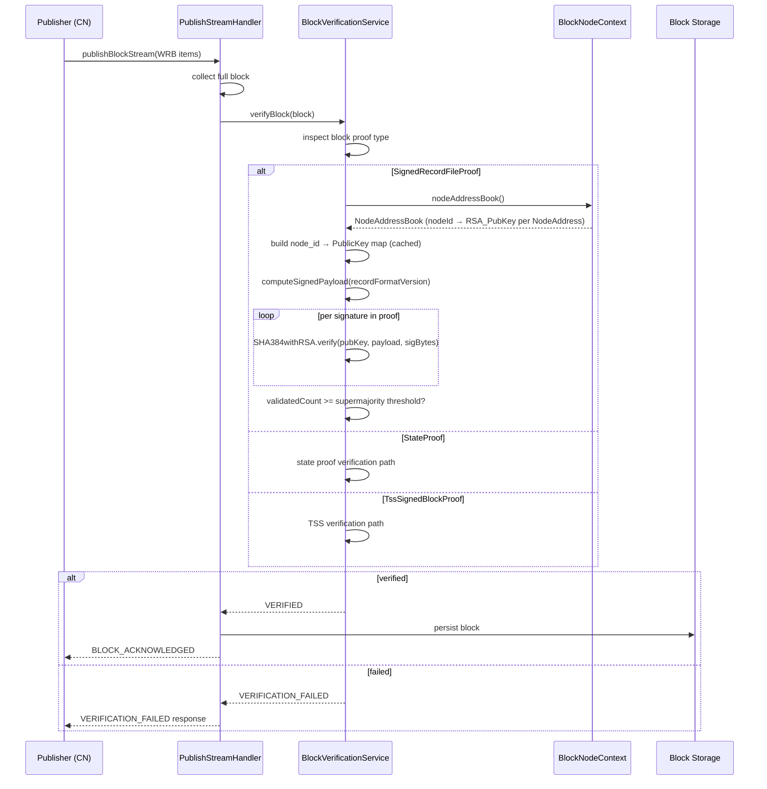

# Bootstrap RSA Roster Plugin — Design Document

---

## Table of Contents

1. [Purpose](#1-purpose)
2. [Goals](#2-goals)
3. [Terms](#3-terms)
4. [Design](#4-design)
    - 4.1 [Plugin Structure](#41-plugin-structure)
    - 4.2 [Bootstrap File Format](#42-bootstrap-file-format)
    - 4.3 [Mirror Node Fetch](#43-mirror-node-fetch)
    - 4.4 [Startup Sequence & Address Book Lifecycle](#44-startup-sequence--address-book-lifecycle)
    - 4.5 [RSA Signature Verification](#45-rsa-signature-verification)
    - 4.6 [Phase 2b Transition](#46-phase-2b-transition)
5. [Diagram](#5-diagram)
6. [Configuration](#6-configuration)
7. [Metrics](#7-metrics)
8. [Security](#8-security)
    - 8.1 [Bootstrap File Integrity](#81-bootstrap-file-integrity)
9. [Operator Tooling](#9-operator-tooling)
10. [Acceptance Tests](#10-acceptance-tests)
11. [Follow-on Ticket Mapping](#11-follow-on-ticket-mapping)
12. [Open Questions and Deferred Items](#12-open-questions-and-deferred-items)

**Issue:** [#2560](https://github.com/hiero-ledger/hiero-block-node/issues/2560)
**Informs:** [#2561](https://github.com/hiero-ledger/hiero-block-node/issues/2561), [#2562](https://github.com/hiero-ledger/hiero-block-node/issues/2562), [#2563](https://github.com/hiero-ledger/hiero-block-node/issues/2563)

---

## 1. Purpose

Phase 2a of the Hiero network upgrade introduces **Wrapped Record Blocks (WRBs)** — Block Stream blocks whose proof is
a `SignedRecordFileProof` containing RSA signatures from every Consensus Node in the current roster. Before the Block
Node (BN) can verify these proofs it must know the current address books: specifically the mapping of
`node_id → RSA public key` for every active Consensus Node.

This design document specifies the **Bootstrap RSA Roster Plugin** (roster-bootstrap-rsa) — a `BlockNodePlugin` that
loads this mapping at BN startup and makes it available to the proof verification layer via `ApplicationStateFacility`.
It follows the same structural pattern as the `TssBootstrapPlugin`.

The BN automatically determines which proof type to verify based on the proof present in each incoming block
(`SignedRecordFileProof`, `StateProof`, or `TssSignedBlockProof`). No operator-configured proof mode is required.

---

## 2. Goals

**In scope:**

- Load the latest reference Consensus Node address book (node IDs + RSA public keys) from disk at BN startup.
- Fetch the roster from the Hedera Mirror Node `GET /api/v1/network/nodes` API when no local bootstrap file is present.
- Persist the loaded roster to a local bootstrap file via `ApplicationStateFacility` so subsequent restarts do not
  require network calls.
- Expose the loaded roster to all BN plugins via `ApplicationStateFacility.updateAddressBook()`, which updates
  `BlockNodeContext` and notifies all plugins via `onContextUpdate`.
- Fail fast with a clear error log when the Mirror Node API is unreachable and no local bootstrap file exists.
- Define the RSA signature verification algorithm precisely enough to be implemented from this document. Initially only
  v6 record files will be supported.
- Support verification of `SignedRecordFileProof`, `StateProof`, and `TssSignedBlockProof` — the BN determines which
  verification path to invoke based on the proof type present in the block.

**Out of scope (deferred to follow-on tickets):**

- Mid-instance address book reload without restart — not required for Phase 2a. The plugin loads once at `start()` and
  does not watch for roster changes at runtime. (#2563)
- On-chain address book tracking via record file parsing — deferred to a future plugin iteration.
- Cloud upload of individual WRBs — handled separately.
- Block simulator support for generating valid `SignedRecordFileProof` blocks — flagged as a testing gap; delayed and
  hopefully not needed.
- Verification of v2 and v5 record files.

---

## 3. Terms

<dl>
  <dt>WRB (Wrapped Record Block)</dt>
  <dd>A block in the Hiero Block Stream format whose content is a wrapped record file. Produced by a Consensus Node
    wrapping a record file it has already generated. Identified by a <code>SignedRecordFileProof</code> block proof.
  </dd>

  <dt>SignedRecordFileProof</dt>
  <dd>The block proof type used in Phase 2a WRBs. Contains one RSA signature per Consensus Node in the current roster,
    produced over a deterministic payload derived from the record file.
  </dd>

  <dt>StateProof</dt>
  <dd>A block proof type supported in both Phase 2a and Phase 2b. Contains a state-based proof attesting to the
    validity of the block. The BN handles <code>StateProof</code> verification independently of the RSA roster.
  </dd>

  <dt>Roster</dt>
  <dd>The set of active Consensus Nodes contributing to consensus at a given point in time. Represented in this plugin as a
    <code>NodeAddressBook</code> protobuf message in which each <code>NodeAddress</code> entry carries the node's
    <code>nodeId</code> and <code>RSA_PubKey</code>.
  </dd>

  <dt>NodeAddressBook / NodeAddress</dt>
  <dd>Protobuf messages defined in <code>basic_types.proto</code> of the Hedera services API
    (<a href="https://github.com/hiero-ledger/hiero-consensus-node/blob/main/hapi/hedera-protobuf-java-api/src/main/proto/services/basic_types.proto">hiero-consensus-node</a>).
    <code>NodeAddressBook</code> is a container of <code>repeated NodeAddress</code> entries. <code>NodeAddress</code>
    carries several fields; this plugin uses only <code>nodeId</code> (field 5) and <code>RSA_PubKey</code> (field 4).
  </dd>

  <dt>Bootstrap File</dt>
  <dd>A binary protobuf file (serialized <code>NodeAddressBook</code>) persisted locally at the configured path. Used to
    avoid a Mirror Node network call on every restart.
  </dd>

  <dt>ApplicationStateFacility</dt>
  <dd>An interface (implemented by <code>BlockNodeApp</code>) through which plugins notify the application of state
    changes. For the RSA roster plugin, it exposes <code>updateAddressBook(NodeAddressBook)</code>, which writes the
    bootstrap file and broadcasts <code>onContextUpdate</code> to all loaded plugins.
  </dd>

  <dt>Phase 2a</dt>
  <dd>The cutover at which Consensus Nodes begin streaming WRBs to Block Nodes. RSA proofs are used.</dd>

  <dt>Phase 2b</dt>
  <dd>The subsequent cutover at which Consensus Nodes switch to full Block Streams with TSS/hinTS proofs. Record file
    production ceases.</dd>
</dl>

---

## 4. Design

### 4.1 Plugin Structure

The `RsaRosterBootstrapPlugin` follows the same structure as `TssBootstrapPlugin` (PR #2492):

- Implements `BlockNodePlugin` (registered via Java SPI).
- Declares a config record (`BootstrapRosterConfig`) via `configDataTypes()`.
- Performs all roster loading work in `start()` (not `init()`). The plugin does **not** start background threads;
  there is no mid-instance reload.
- Stores the `ApplicationStateFacility` reference during `init()` for use in `start()`.
- Makes the loaded address book available to the rest of the BN by calling
  `applicationStateFacility.updateAddressBook(book)`. The `ApplicationStateFacility` implementation in
  `BlockNodeApp` then writes the bootstrap file (if the roster was fetched from Mirror Node) and calls
  `onContextUpdate(context)` on all loaded plugins so they receive the populated `NodeAddressBook`.

**Module declaration:**

```java
// module-info.java
import org.hiero.block.node.roster.bootstrap.rsa.RsaRosterBootstrapPlugin;

module org.hiero.block.node.roster.bootstrap.rsa {
    requires transitive org.hiero.block.node.spi;
    requires com.hedera.hapi;          // NodeAddressBook, NodeAddress (basic_types.proto)
    requires com.hedera.pbj.runtime;   // PBJ serialization / deserialization
    requires java.net.http;            // Mirror Node HTTP client

    provides org.hiero.block.node.spi.BlockNodePlugin with
            RsaRosterBootstrapPlugin;
}
```

**Plugin skeleton:**

```java
public class RsaRosterBootstrapPlugin implements BlockNodePlugin {

    private ApplicationStateFacility applicationStateFacility;
    private BootstrapRosterConfig config;

    @Override
    public List<Class<? extends Record>> configDataTypes() {
        return List.of(BootstrapRosterConfig.class);
    }

    @Override
    public void init(BlockNodeContext context, ServiceBuilder serviceBuilder) {
        this.applicationStateFacility = Objects.requireNonNull(context.applicationStateFacility());
        this.config = context.configuration().getConfigData(RsaRosterBootstrapConfig.class);
    }

    @Override
    public void start() {
        NodeAddressBook book = context.nodeAddressBook();
        if (book == null) {
            // No bootstrap file was loaded by BlockNodeApp.loadApplicationState()
            book = fetchFromMirrorNode();
            // ApplicationStateFacility handles file persistence and onContextUpdate broadcast
            applicationStateFacility.updateAddressBook(book);
        }
    }
}
```

**Node details status endpoint:** Once the `NodeAddressBook` is loaded it must be included in the
`ServerStatusDetailResponse` returned by `BlockNodeService.serverStatusDetail()`. The `node_service.proto` response
message will carry the full address book as field 4:

```protobuf
message ServerStatusDetailResponse {
    // ... existing fields ...

    /**
     * RSA Node Address Book Data from the block node server.
     * Node Id, rsa public key information
     */
    NodeAddressBook node_address_book = 4;
}
```

This allows any caller of `serverStatusDetail` to inspect the full set of loaded `NodeAddress` entries (node ID and
RSA public key per entry) without restarting the BN.

**`ApplicationStateFacility` extension:** A new `updateAddressBook(NodeAddressBook)` method must be added:
- `BlockNodeApp` implements the method.
- The method updates the `nodeAddressBook` field in `BlockNodeContext`.
- The method writes the bootstrap file if the address book was fetched from Mirror Node (file did not previously
  exist).
- The method calls `plugin.onContextUpdate(updatedContext)` for each loaded plugin so downstream consumers (e.g.
  `BlockVerificationService`) receive the populated address book before they begin verifying blocks.

> **Thread safety note:** `onContextUpdate()` is called from a different thread than the plugin's own `start()` thread
> (as documented in `BlockNodePlugin`). Downstream plugins that consume the `NodeAddressBook` must update their
> internal state in a thread-safe manner.

---

### 4.2 Bootstrap File Format

The bootstrap file is a **JSON serialization** of the `NodeAddressBook` protobuf message from `basic_types.proto`,
written and read via PBJ's `NodeAddressBook.JSON` codec. This reuses a well-known, stable message definition from
the Hedera services API rather than introducing a bespoke schema.

**Proto definition (from `hiero-consensus-nodehapi/hedera-protobuf-java-api/src/main/proto/services/basic_types.proto`):**

```protobuf
/**
 * A list of nodes and their metadata that contains details of the nodes
 * running the network.
 *
 * Used to parse the contents of system files 0.0.101 and 0.0.102.
 */
message NodeAddressBook {
    repeated NodeAddress nodeAddress = 1;
}

message NodeAddress {
    // ... (other fields omitted — only the two below are used by this plugin)

    /**
     * A hexadecimal String encoding of an X509 public key.
     * Used to verify Record Stream files.
     * Stored as a UTF-8 hex string of the DER-encoded public key bytes.
     */
    string RSA_PubKey = 4;

    /**
     * A numeric identifier for the node.
     */
    int64 nodeId = 5;
}
```

**Fields used by this plugin:**

| `NodeAddress` field | Field # |   Type   |                                                           Purpose                                                            |
|---------------------|---------|----------|------------------------------------------------------------------------------------------------------------------------------|
| `RSA_PubKey`        | 4       | `string` | Hex-encoded DER X.509 SubjectPublicKeyInfo RSA public key. Used to construct the `PublicKey` for RSA signature verification. |
| `nodeId`            | 5       | `int64`  | Numeric node identifier. Used as the lookup key when verifying a signature from a specific node.                             |

All other `NodeAddress` fields (`ipAddress`, `portno`, `memo`, `nodeAccountId`, `nodeCertHash`, `serviceEndpoint`,
`description`, `stake`) are left unset in the persisted file.

**Serialization and deserialization (PBJ):**

```java
// Write (via BlockNodeApp.persistNodeAddressBook)
final Bytes encoded = NodeAddressBook.JSON.toBytes(nodeAddressBook);
Files.write(filePath, encoded.toByteArray());

// Read (via BlockNodeApp.loadApplicationState)
final byte[] raw = Files.readAllBytes(filePath);
final NodeAddressBook nodeAddressBook =
        NodeAddressBook.JSON.parse(Bytes.wrap(raw));
```

**Default file path:** `/opt/hiero/block-node/node/rsa-bootstrap-roster.json`
(Configured via `app.state.rsaBootstrapFilePath`.)

**Notes:**
- The `RSA_PubKey` string in `NodeAddress` is the raw hex-encoded DER bytes without an `0x` prefix. Mirror Node
  returns the key with a leading `0x` which must be stripped before storing.
- The file does not embed metadata such as network name or generation timestamp. Operators wishing to annotate the
  file should maintain a separate sidecar file or rely on filesystem timestamps.
- Writes use an atomic `.tmp`-then-move strategy to avoid corrupt files on process crash.

---

### 4.3 Mirror Node Fetch

When no local bootstrap file is present, the plugin queries the Mirror Node REST API endpoint:

```
GET {mirrorNodeBaseUrl}/api/v1/network/nodes
```

and maps the response into a `NodeAddressBook` by populating only `nodeId` and `RSA_PubKey` in
each `NodeAddress` entry.

**Pagination:** The API returns up to 100 nodes per page (default 25). The implementation must follow `links.next` until
it is `null` to collect all nodes.

**Field mapping:**

| Mirror Node JSON field | `NodeAddress` protobuf field |               Notes               |
|------------------------|------------------------------|-----------------------------------|
| `node_id`              | `nodeId` (field 5)           | Direct mapping (int64)            |
| `public_key`           | `RSA_PubKey` (field 4)       | Strip leading `0x` before storing |

**Filtering:** Only include nodes where `public_key` is non-null and non-empty. Nodes without a public key are not
eligible for RSA verification and must be excluded from the `NodeAddressBook`.

**Active-entry filtering:** The API is queried with `order=desc` so the most-recently-active entries
(`timestamp.to == null`) arrive first. Pagination stops on the first entry with a non-null `timestamp.to`, since
all remaining entries in descending order are also historical.

**Pseudo-implementation:**

```java
private NodeAddressBook fetchFromMirrorNode(RsaRosterBootstrapConfig config) {
    final List<NodeAddress> entries = new ArrayList<>();
    // Use order=desc so active entries (timestamp.to == null) arrive first.
    String nextUrl = config.mirrorNodeBaseUrl()
            + "/api/v1/network/nodes?limit=" + config.mirrorNodePageSize() + "&order=desc";

    outer:
    while (nextUrl != null) {
        final MirrorNodeNodesResponse page = fetchAndParseWithRetry(client, nextUrl);
        for (MirrorNodeNodesResponse.NodeEntry entry : page.nodes()) {
            // A non-null timestamp.to means this entry has been superseded — stop.
            if (entry.timestamp() != null && entry.timestamp().to() != null) break outer;

            if (entry.publicKey() == null || entry.publicKey().isBlank()) continue;

            // Strip the 0x prefix that Mirror Node includes
            final String hexKey = entry.publicKey().startsWith("0x")
                    ? entry.publicKey().substring(2) : entry.publicKey();

            entries.add(NodeAddress.newBuilder()
                    .nodeId(entry.nodeId())
                    .rsaPubKey(hexKey)
                    .build());
        }
        // Mirror Node may return a relative path; resolve against the base URL.
        final String rawNext = page.nextLink();
        nextUrl = (rawNext == null) ? null
                : rawNext.startsWith("http") ? rawNext : config.mirrorNodeBaseUrl() + rawNext;
    }

    if (entries.isEmpty()) {
        throw new IllegalStateException(
                "Mirror Node returned zero nodes with a non-blank public_key");
    }
    return NodeAddressBook.newBuilder().nodeAddress(entries).build();
}
```

**Timeouts and retries:** The HTTP client must be configured with a per-request connect timeout (default 5 s) and read
timeout (default 10 s). Three retries with exponential backoff (initial delay 1 s) are sufficient. If the call fails
after retries the plugin logs a clear error and fails fast (see §4.4 for MN-down handling).

---

### 4.4 Startup Sequence & Address Book Lifecycle

The plugin follows a **file-load + MN-freshness-check** strategy. If a local bootstrap file exists it is loaded first
so the BN has an immediately usable address book. The Mirror Node is then queried (when configured) to check for
updates. If the file does not exist, the MirrorNode is queried at the `initialQueryIntervalMillis` interval until an
address book is returned. This allows for Mirror Nodes being started after Block Nodes. The Mirror Node
will be queried at the `subsequentQueryIntervalMillis` interval if a file is found or when an initial query returns an
address book.

```
BlockNodeApp.loadApplicationState() [before any plugin is started]
   │
   ├─ rsa-bootstrap-roster.json exists at app.state.rsaBootstrapFilePath?
   │       │
   │       YES ──► NodeAddressBook.JSON.parse() → validate (≥1 entry)
   │       │        │
   │       │        ├─ On parse error or empty book: FAIL FAST (throw IllegalStateException)
   │       │        │
   │       │        └─ pendingAddressBook.set(book) [flushed to context before plugins start]
   │       │
   │       NO ──► (no-op; context.nodeAddressBook() will be null when plugins start)
   │
RsaRosterBootstrapPlugin.start() called
   │
   ├─ mirrorNodeBaseUrl blank?
   │       │
   │       YES ──► context.nodeAddressBook() != null?
   │       │               YES ──► record metrics, log success, return
   │       │               NO  ──► LOG WARNING → return (degraded; no address book available)
   │       │
   │       NO ──► Query Mirror Node API (paginated GET /api/v1/network/nodes, order=desc)
   │               │
   │               ├─ SUCCESS: build NodeAddressBook (nodeId + RSA_PubKey per entry)
   │               │     └─ book differs from loaded book (or no book loaded)?
   │               │           YES ──► applicationStateFacility.updateAddressBook(book)
   │               │           │           ├─ BlockNodeApp writes rsa-bootstrap-roster.json (atomic)
   │               │           │           └─ BlockNodeApp notifies all plugins via onContextUpdate [async]
   │               │           NO  ──► log "address book is current", record metrics, continue
   │               │
   │               └─ FAILURE (API unreachable / timeout / empty response after retries):
   │                     context.nodeAddressBook() != null?
   │                     │
   │                     YES ──► LOG WARNING → continue on loaded file; schedule background retry
   │                     │
   │                     NO  ──► LOG ERROR → retry with exponential backoff (5-min intervals)
   │                               until reachable; do not shut down BN
   │                               (see §12 #1 for evolution once plugin health reporting exists)
   │
   ├─ Schedule periodic MN poll (default: every 60 min) via background thread
   │       └─ On each poll: repeat MN query; call updateAddressBook if book has changed
   │
   └─ Startup complete (with address book from file, MN, or both)
```

**File-load + MN-freshness rationale:** Loading the bootstrap file first ensures the BN has an immediately usable
address book at the cost of zero network latency. The subsequent MN query detects any address book changes that
occurred since the file was written (e.g., nodes added or removed after the last restart) and updates the book in
place. The periodic background poll keeps the address book current for long-running instances without requiring a
restart.

**Mirror Node unreachable — retry rationale:** When the MN API is unreachable but a local file exists, the BN can
proceed with the cached address book and retry in the background. When no file exists, the BN retries with exponential
backoff at 5-minute intervals rather than shutting down, since a transient network outage should not force a full
restart. Once plugin health reporting is available, the plugin should surface its unhealthy state through that
mechanism instead of failing fast. See §12 #1.

**Nodes with no public key:** Nodes returned by the Mirror Node with a null or blank `public_key` should be excluded
from the `NodeAddressBook`. Such entries should not normally exist; if encountered, the plugin increments
`blocknode_rsa_roster_mismatch_total` and logs a WARNING rather than silently discarding them.

---

### 4.5 RSA Signature Verification

This section specifies the verification algorithm precisely enough to be implemented without reference to external code.
The algorithm is derived from the existing `SignatureValidation`, `SignatureDataExtractor`, and `SigFileUtils` classes
in `tools-and-tests/tools`, which in turn match the verification logic used by Hedera Mirror Node.

> **Proof type routing:** The BN determines which verification path to invoke based on the proof type present in each
> block. No configuration flag is required:
>
> |    Block proof type     |             Verification path              |
> |-------------------------|--------------------------------------------|
> | `SignedRecordFileProof` | RSA roster verification (this plugin)      |
> | `StateProof`            | State proof verification (Phase 2a and 2b) |
> | `TssSignedBlockProof`   | TSS verification (`TssBootstrapPlugin`)    |
>
> Both Phase 2a and Phase 2b support `StateProof`. No operator-configured proof mode is needed.
>
> **Multiple proofs:** When a block contains more than one proof type, the verification layer attempts to validate
> each available proof. The priority ordering and acceptance criteria for multiple simultaneous proofs will need to
> evolve as the network moves through Phase 2a and Phase 2b stages; this is tracked as an open design item (see §12).
>
> **Placement in the pipeline:** RSA verification is performed by the block verification layer
> (`BlockVerificationService`) immediately after a complete WRB is received from the publisher, before the block is
> written to storage. The `NodeAddressBook` is supplied to the verification service by `ApplicationStateFacility`
> via `onContextUpdate`; the service reads it from `BlockNodeContext.nodeAddressBook()`.

#### 4.5.1 Identifying a WRB

A block is a WRB if its `BlockProof` contains a `SignedRecordFileProof` (as opposed to a `TssSignedBlockProof` or
`StateProof`). The proof type is indicated in the protobuf structure — no additional block-level flag is needed.

#### 4.5.2 Building the Verification Key Map

When the verification service first processes a WRB proof it builds an in-memory lookup map from the `NodeAddressBook`
stored in `BlockNodeContext`:

```java
// Built once and cached for the lifetime of the BN instance.
Map<Long, PublicKey> keyByNodeId = new HashMap<>();
for (NodeAddress addr : context.nodeAddressBook().nodeAddress()) {
    if (addr.rsaPubKey().isBlank()) continue;
    keyByNodeId.put(addr.nodeId(), SigFileUtils.decodePublicKey(addr.rsaPubKey()));
}
```

The `addr.rsaPubKey()` value is the raw hex DER string (no `0x` prefix) as stored in the bootstrap file.
`SigFileUtils.decodePublicKey()` supports both `X.509` `SubjectPublicKeyInfo` and `X.509` certificate `DER` formats,
with an in-memory cache keyed by hex string to avoid repeated `DER` parsing.

#### 4.5.3 Signed Payload Computation

The payload that was signed by each Consensus Node depends on the record file format version embedded in the WRB:

| Version |                                         Payload computation                                         |
|---------|-----------------------------------------------------------------------------------------------------|
| **v6**  | `SHA-384( int32(6) \|\| rawRecordStreamFileBytes )`                                                 |
| **v5**  | Reconstruct the v5 binary record file from parsed items, then `SHA-384(v5Bytes)`                    |
| **v2**  | Reconstruct v2 binary record, compute `SHA-384` of reconstructed bytes, then `SHA-384` of that hash |

The `rawRecordStreamFileBytes` in v6 is the verbatim serialised proto bytes of the Record Stream file contained in the
WRB, not re-serialised from a parsed representation.

Reference implementation: `SignatureDataExtractor.computeSignedHash()` in `tools-and-tests/tools`.

#### 4.5.4 RSA Signature Verification Steps

For each signature in the `SignedRecordFileProof`:

1. Extract the signing `node_id` and the raw RSA signature bytes.
2. Look up the `PublicKey` for `node_id` in the map built from the `NodeAddressBook`. If absent, skip this signature and
   increment `roster_mismatch_total`.
3. Verify using `SHA384withRSA`:

   ```
   Signature sig = Signature.getInstance("SHA384withRSA");
   sig.initVerify(publicKey);
   sig.update(computedPayload);        // 48-byte SHA-384 hash
   boolean valid = sig.verify(signatureBytes);
   ```

   Use a `ThreadLocal<Signature>` engine to avoid per-call allocation under high throughput.

4. If `valid`, add `1` to `validatedCount` (equal-weight; stake-weighted threshold is deferred).

#### 4.5.5 Threshold Requirements

A WRB proof is **accepted** when:

```
validatedCount >= 2 * ceil(rosterSize / 3) + 1
```

This matches the supermajority threshold used by Mirror Node and the WRB CLI. Stake-weighted threshold (using
`NodeAddress.stake`, which is deprecated in the proto but may be populated) is deferred to a follow-on improvement and
tracked in #2562.

#### 4.5.6 Failure Modes

|                Condition                 |                                        Action                                         |
|------------------------------------------|---------------------------------------------------------------------------------------|
| Zero valid signatures                    | Reject block; increment `verification_proof_total{proof_type="rsa",result="failure"}` |
| `validatedCount < threshold`             | Reject block; increment `verification_proof_total{proof_type="rsa",result="failure"}` |
| `node_id` not in `NodeAddressBook`       | Skip signature; increment `roster_mismatch_total`                                     |
| Zeroed signature bytes (all 0x00)        | Skip signature; log at DEBUG level                                                    |
| Malformed DER public key in `RSA_PubKey` | Skip signature; log at WARN level                                                     |

Rejected blocks are **not** written to storage. The publisher receives the appropriate `PublishStreamResponse` error
code.

---

### 4.6 Phase 2b Transition

When the network transitions from Phase 2a to Phase 2b:

1. Consensus nodes stop emitting WRBs and emit full Block Stream blocks with `TssSignedBlockProof`.
2. The BN automatically routes `TssSignedBlockProof` blocks to the TSS verification path — no configuration change is
   required. The `RsaRosterBootstrapPlugin` remains loaded and the `NodeAddressBook` remains in context but the
   verification layer stops using it for new blocks.
3. WRBs stored during Phase 2a remain fully queryable via `getBlock` and `subscribeBlockStream` — they are stored as
   regular `.blk` files and no migration is required. Notably WRBs have no state data or event data and will not
   support state management services.

---

## 5. Diagram

### Startup sequence

```mermaid
sequenceDiagram
    participant App as BlockNodeApp
    participant Plugin as RsaRosterBootstrapPlugin
    participant Facility as ApplicationStateFacility (BlockNodeApp)
    participant File as rsa-bootstrap-roster.pb
    participant MN as Mirror Node API
    participant Plugins as All Loaded Plugins

    App->>File: loadApplicationState() — exists(rsa-bootstrap-roster.json)?
    alt file found
        File-->>App: raw bytes
        App->>App: NodeAddressBook.JSON.parse(bytes), validate ≥1 entry
        App->>App: pendingAddressBook.set(book)
        App->>App: checkForApplicationStateUpdates() [flush to context before plugins start]
    end
    App->>Plugin: init(context, serviceBuilder)
    Plugin->>Plugin: store applicationStateFacility, config
    App->>Plugin: start()
    alt mirrorNodeBaseUrl is blank
        Plugin->>Plugin: log success (file) or LOG WARNING (no address book)
    else mirrorNodeBaseUrl configured
        Plugin->>MN: GET /api/v1/network/nodes (paginated, order=desc)
        alt MN reachable
            MN-->>Plugin: node list (node_id, public_key, timestamp)
            Plugin->>Plugin: build NodeAddressBook (active entries only)
            alt book changed or no prior book
                Plugin->>Facility: updateAddressBook(book)
                Facility->>File: NodeAddressBook.JSON.toBytes() → atomic write
                Facility->>Plugins: onContextUpdate(updatedContext) [async]
            else book unchanged
                Plugin->>Plugin: log "address book is current"
            end
        else MN unreachable after retries
            alt file was loaded
                Plugin->>Plugin: LOG WARNING → continue on cached book; schedule retry
            else no file
                Plugin->>Plugin: LOG ERROR → retry every 5 min in background
            end
        end
        Plugin->>Plugin: schedule periodic poll (default every 60 min)
    end
    App->>App: continue startup
```

### WRB verification (Phase 2a)



---

## 6. Configuration

Bootstrap file path is in the `app.state` namespace (shared application state config):

|             Property             |  Type  |                        Default                         |                          Description                          |
|----------------------------------|--------|--------------------------------------------------------|---------------------------------------------------------------|
| `app.state.rsaBootstrapFilePath` | string | `/opt/hiero/block-node/node/rsa-bootstrap-roster.json` | Path to the JSON-serialized `NodeAddressBook` bootstrap file. |

Mirror Node fallback is in the `roster.bootstrap.rsa` namespace:

|                        Property                        |  Type   |  Default  |                                  Description                                  |
|--------------------------------------------------------|---------|-----------|-------------------------------------------------------------------------------|
| `roster.bootstrap.rsa.mirrorNodeBaseUrl`               | string  | *(blank)* | Base URL for Mirror Node REST API calls. Blank disables Mirror Node fallback. |
| `roster.bootstrap.rsa.mirrorNodeConnectTimeoutSeconds` | integer | `5`       | TCP connect timeout for Mirror Node HTTP calls.                               |
| `roster.bootstrap.rsa.mirrorNodeReadTimeoutSeconds`    | integer | `10`      | Read timeout for Mirror Node HTTP calls.                                      |
| `roster.bootstrap.rsa.mirrorNodePageSize`              | integer | `100`     | Items per page for paginated Mirror Node calls. Max 100.                      |

**Environment variable overrides** follow the standard Swirlds Config pattern (uppercase, `_` for `.` and `-`). For example:

```
APP_STATE_RSA_MIRROR_NODE_BASE_URL=https://testnet.mirrornode.hedera.com
```

---

## 7. Metrics

All metrics use the BN-standard category `blocknode` and must follow existing naming conventions.

**Plugin metrics** (`RsaRosterBootstrapPlugin` — category `blocknode`):

|              Metric name               |  Type   | Labels |                                          Description                                          |
|----------------------------------------|---------|--------|-----------------------------------------------------------------------------------------------|
| `blocknode_roster_entries_loaded`      | Gauge   | —      | Number of `NodeAddress` entries loaded at startup.                                            |
| `blocknode_roster_load_duration_ms`    | Gauge   | —      | Time to load the RSA roster at startup in milliseconds.                                       |
| `blocknode_rsa_roster_creation_failed` | Counter | —      | Incremented each time the roster cannot be created (file corrupt or Mirror Node unreachable). |

**Verification service metrics** (`BlockVerificationService` — category `blocknode`):

|                 Metric name                  |   Type    |                             Labels                             |                                         Description                                          |
|----------------------------------------------|-----------|----------------------------------------------------------------|----------------------------------------------------------------------------------------------|
| `blocknode_verification_proof_total`         | Counter   | `proof_type={rsa,state_proof,tss}`, `result={success,failure}` | Count of block proof verifications, broken down by proof type and result.                    |
| `blocknode_rsa_verification_latency_seconds` | Histogram | —                                                              | Latency of the full RSA verification step per block (p50, p95, p99 buckets).                 |
| `blocknode_rsa_roster_mismatch_total`        | Counter   | —                                                              | Count of signatures where the signing node ID was not found in the loaded `NodeAddressBook`. |

---

## 8. Security

### 8.1 Bootstrap file integrity

The `rsa-bootstrap-roster.json` file contains the public keys used for proof verification. Tampering requires
filesystem access to the BN host; at that point the system is already compromised beyond what key substitution could
add. The practical mitigation is to restrict file access at the OS level:

- **File permissions:** `rsa-bootstrap-roster.json` should be readable only by the BN process user (`chmod 600`).
  Document this in the operator guide.
- **Mirror Node TLS:** Mirror Node queries use HTTPS. Operators deploying a private Mirror Node should ensure TLS is
  configured.

---

## 9. Operator Tooling

A script `tools-and-tests/scripts/node-operations/generate-roster-rsa-bootstrap.sh` should be provided. Its responsibilities:

1. Accept `--network <mainnet|testnet|previewnet>` and optionally `--mirror-node-url <url>`.
2. Query `GET /api/v1/network/nodes` (with pagination) to collect all nodes with non-empty `public_key`. Investigate
   whether the Mirror Node API offers a single-call bulk address book endpoint that could replace pagination; if one
   exists use it and document the choice here. The Mirror Node gRPC service provides a call which will return all nodes.
   Perhaps grpcurl can be used in the script to get all the nodes in one shot.
3. Build a `NodeAddressBook` protobuf, setting only `nodeId` and `RSA_PubKey` (stripped of `0x` prefix) per `NodeAddress` entry.
4. Embed a generation timestamp in a sidecar file (e.g., `rsa-bootstrap-roster.json.meta`) so the plugin can compare
   file freshness against data returned by Mirror Node.
5. Serialize with `NodeAddressBook.JSON.toBytes()` and write to `rsa-bootstrap-roster.json`.
6. Print a summary: number of entries written, file path, file size, generation timestamp.

**Expected usage before a Phase 2a cutover:**

```bash
generate-rsa-roster-bootstrap.sh --network mainnet --output /opt/hiero/block-node/node/rsa-bootstrap-roster.json
```

Because the plugin polls Mirror Node hourly and updates the address book in place, operators do **not** need to
regenerate the bootstrap file or restart the BN when nodes are added or removed. The pre-generated file serves only
as a fast-start seed for the first startup or when Mirror Node is temporarily unreachable.

The `blocknode_roster_entries_loaded` gauge metric provides a quick sanity check that the expected number of nodes was
loaded at startup.

> **Lifecycle note:** The `rsa-bootstrap-roster.json` file and this plugin are Phase 2a transitional artifacts. The
> bootstrap file is generated synthetically from Mirror Node data shortly after the Phase 2a upgrade and may not be
> produced much longer. Once all WRBs carry a `TssSignedBlockProof` or `StateProof`, the RSA roster is no longer
> needed for new blocks (see §4.6 and §12 #7).

**Inspecting the generated file:**

The JSON file is human-readable and can be inspected directly:

```bash
cat /opt/hiero/block-node/node/rsa-bootstrap-roster.json | python3 -m json.tool | head -40
```

---

## 10. Acceptance Tests

- [x] Plugin parses a valid `rsa-bootstrap-roster.json`; `blocknode_roster_entries_loaded` gauge equals expected entry
  count; all loaded plugins receive `onContextUpdate` with a populated `nodeAddressBook`.
- [x] Plugin fetches from Mirror Node when no bootstrap file is present; `applicationStateFacility.updateAddressBook()`
  is called; `rsa-bootstrap-roster.json` is written; gauge reflects the loaded count.
- [x] Plugin queries Mirror Node even when a bootstrap file already exists; if the returned book differs, the file is
  updated and `onContextUpdate` is broadcast to all plugins.
- [ ] Deserializing the written `rsa-bootstrap-roster.json` produces the same `NodeAddressBook` as was fetched.
- [ ] When Mirror Node is unreachable and no bootstrap file exists, the BN retries with exponential backoff and does
  not shut down; a clear error is logged on each retry.
- [ ] When Mirror Node is unreachable but a bootstrap file exists, the BN continues on the cached book and logs a
  WARNING.
- [ ] A Mirror Node response containing a node with a blank `public_key` increments `blocknode_rsa_roster_mismatch_total`
  and logs a WARNING.
- [x] A WRB block with a passing RSA proof (supermajority count) is accepted and persisted.
- [x] A WRB block with an insufficient RSA proof (below threshold) is rejected;
  `blocknode_verification_proof_total{proof_type="rsa",result="failure"}` increments.
- [ ] A WRB block with a signature from a `node_id` absent from the `NodeAddressBook` increments
  `blocknode_rsa_roster_mismatch_total` without a panic.
- [x] A block with a `StateProof` is routed to the state proof verification path regardless of plugin state.
- [x] A block with a `TssSignedBlockProof` is routed to the TSS verification path.
- [ ] `generate-roster-bootstrap.sh` produces a file that the plugin loads without errors.
- [ ] Testnet `rsa-bootstrap-roster.json` generated from `testnet.mirrornode.hedera.com` loads without errors.

---

## 11. Follow-on Ticket Mapping

|                                Ticket                                 |                                                                                                                                        Scope                                                                                                                                         |
|-----------------------------------------------------------------------|--------------------------------------------------------------------------------------------------------------------------------------------------------------------------------------------------------------------------------------------------------------------------------------|
| [#2561](https://github.com/hiero-ledger/hiero-block-node/issues/2561) | Implement `RsaRosterBootstrapPlugin` per this design. Includes extending `ApplicationStateFacility` with `updateAddressBook`, extending `BlockNodeContext` with `NodeAddressBook nodeAddressBook`, PBJ read/write of `rsa-bootstrap-roster.pb`, and unit + integration tests.        |
| [#2562](https://github.com/hiero-ledger/hiero-block-node/issues/2562) | Implement RSA `SignedRecordFileProof` verification in `BlockVerificationService`. Reads `NodeAddressBook` from context via `onContextUpdate`, builds `node_id → PublicKey` map, applies the algorithm in §4.5. Includes proof-type routing logic and per-block verification metrics. |
| [#2660](https://github.com/hiero-ledger/hiero-block-node/issues/2660) | Implement `generate-roster-bootstrap.sh` operator script and document the Phase 2a cutover runbook.                                                                                                                                                                                  |

---

## 12. Open Questions and Deferred Items

| # |                                                                                                                                                                                                                              Question                                                                                                                                                                                                                               |                                                                                                                                                                                                         Status                                                                                                                                                                                                         |
|---|---------------------------------------------------------------------------------------------------------------------------------------------------------------------------------------------------------------------------------------------------------------------------------------------------------------------------------------------------------------------------------------------------------------------------------------------------------------------|------------------------------------------------------------------------------------------------------------------------------------------------------------------------------------------------------------------------------------------------------------------------------------------------------------------------------------------------------------------------------------------------------------------------|
| 1 | **Mirror Node down at startup — fail fast or retry with backoff?** When the MN API is unreachable and no local file exists the BN retries with exponential backoff at 5-minute intervals and does not shut down. When a local file is present, the BN continues on the cached book and retries in the background. Operators who cannot reach MN can pre-populate the bootstrap file from a publicly available `NodeAddressBook` snapshot (on-chain file `0.0.102`). | **Resolved.** Direction: retry-with-backoff, not fail-fast. Once plugin health reporting is available, the plugin should surface its unhealthy state through that mechanism so the BN can remain running while signalling degraded operation.                                                                                                                                                                          |
| 2 | Does the Block Stream simulator need to generate valid `SignedRecordFileProof` blocks for integration testing?                                                                                                                                                                                                                                                                                                                                                      | Yes — flagged as a testing gap. If not available for Phase 2a, integration tests will use pre-recorded WRB blocks.                                                                                                                                                                                                                                                                                                     |
| 3 | Should stake-weighted threshold be used instead of equal-weight once the `NodeAddress.stake` field is confirmed populated in the on-chain address book?                                                                                                                                                                                                                                                                                                             | Deferred to #2562 — the equal-weight threshold is correct for Phase 2a. Stake-weighting can be added as an enhancement without changing the bootstrap file format.                                                                                                                                                                                                                                                     |
| 4 | Should the roster structure used map to the `AddressBook` or the `TSSRoster`? If `AddressBook` then BN will support 2 types, if `TSSRoster` we may have to default certain values and couple the plugin.                                                                                                                                                                                                                                                            | `AddressBook` was chosen to utilize the same pathway explored by MN and WRB CLI as well as support record files from genesis outside of the Phase 2a timeline.                                                                                                                                                                                                                                                         |
| 5 | Should the BN poll Mirror Node hourly for address book updates, or only at startup?                                                                                                                                                                                                                                                                                                                                                                                 | **Resolved.** The plugin queries MN at every startup (even when a local file exists) and schedules a periodic background poll (default 60 min, configurable via `app.state.rsaAddressBookPollIntervalMinutes`). This mirrors the SDK approach and avoids requiring a restart for roster changes.                                                                                                                       |
| 6 | Should `RsaRosterBootstrapPlugin` have a defined lifetime? Should we note a timeline after which it can be removed?                                                                                                                                                                                                                                                                                                                                                 | **Resolved.** The plugin can be retired once all WRBs in the network carry a `TssSignedBlockProof` or `StateProof` — at that point there is no generally applicable reason to maintain RSA address books for new blocks. Until that transition is complete the plugin remains active. Historical WRB verification (querying blocks stored during Phase 2a) is a separate concern and may be handled by a lighter shim. |
| 7 | What is the correct priority order when a block contains more than one proof type (`SignedRecordFileProof`, `StateProof`, `TssSignedBlockProof`)?                                                                                                                                                                                                                                                                                                                   | **Open.** The verification layer should attempt each available proof and accept the block if any proof passes. The priority and acceptance rules may need to change several times as the network moves through Phase 2a and Phase 2b stages.                                                                                                                                                                           |
| 8 | Should we have a `app.state.rsaFailOnFetchError` flag to avoid needing a real file?                                                                                                                                                                                                                                                                                                                                                                                 | No, better to create a default `data/config/rsa-bootstrap-roster.json` file for use.                                                                                                                                                                                                                                                                                                                                   |