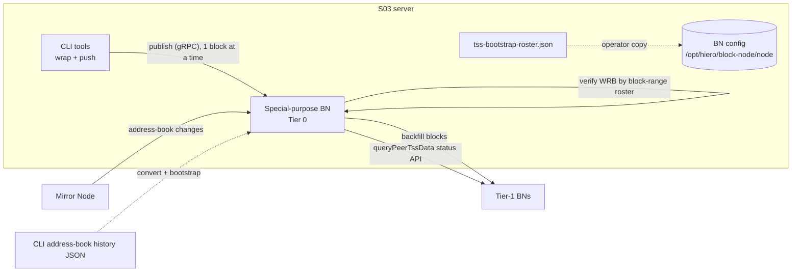

# Special-Purpose WRB Block Node — Design

## Table of Contents

1. [Purpose](#purpose)
2. [Goals](#goals)
3. [Terms](#terms)
4. [Entities](#entities)
5. [Design](#design)
6. [Diagram](#diagram)
7. [Configuration](#configuration)
8. [Metrics](#metrics)
9. [Exceptions](#exceptions)
10. [Acceptance Tests](#acceptance-tests)
11. [Open Questions](#open-questions)

## Purpose

Distribute historical and live **Wrapped Record Blocks (WRBs)** and **TSS** data from the CLI
conversion server (S03) to Council-operated **Tier-1 Block Nodes**, ready before the WRB release
(release 75, July). A co-located **special-purpose Block Node** on S03 acts as the initial source
("Tier 0"): the CLI pushes blocks into it through the normal ingestion path, and Tier-1 nodes pull
blocks (backfill) and query TSS (status API) from it. To serve *historical* WRBs, the Block Node must
verify each block against the address book that was in effect for that block, not just the current one.

This is intended as the durable long-term solution (historical address-book verification), not
throwaway migration code.

## Goals

- Push historical WRBs from the CLI's existing wrapped-block storage into the special-purpose BN,
  one block at a time, via the existing ingestion (publish) API — no disk-layout restructuring, no BN
  restarts.
- Keep the special-purpose BN current during the ~2-month transition by pushing each new WRB live as
  the CLI produces it (no 6-hour zip-batch floods).
- Verify any historical WRB by selecting the address book in effect for that block's number.
- Let Tier-1 nodes use the special-purpose BN as a backfill source and as a TSS peer (existing paths).
- Reuse existing code: the CLI's wrapped-block storage + Mirror-Node address-book tooling, the gRPC
  publish client, and the BN's RSA roster / verification plugins.

## Terms

<dl>
  <dt>WRB (Wrapped Record Block)</dt>
  <dd>A legacy Hedera record file wrapped into the Block Stream block format, carrying a
      <code>SignedRecordFileProof</code> verified against node RSA keys.</dd>
  <dt>TSS data</dt>
  <dd>Threshold-signature-scheme material (ledger id, roster, WRAPS verification key) the BN needs;
      produced by the CLI as <code>tss-bootstrap-roster.json</code>.</dd>
  <dt>Special-purpose BN ("Tier 0")</dt>
  <dd>A Block Node co-located with the CLI on S03 that serves as the initial WRB source and TSS peer
      for Tier-1 nodes, effectively replacing the consensus node for WRB distribution.</dd>
  <dt>Address book roster</dt>
  <dd>An ordered set of historical address books, each scoped to a block-number range, used to verify
      a WRB against the keys that were valid when its underlying record file was signed.</dd>
  <dt>CLI</dt>
  <dd>The picocli tool <code>org.hiero.block.tools.BlockStreamTool</code> under
      <code>tools-and-tests/tools</code> (commands <code>blocks</code>, <code>days</code>,
      <code>mirror</code>, <code>networkCapacity</code>, …).</dd>
</dl>

## Entities

- **CLI (`tools-and-tests/tools`)** — already wraps record files into WRBs (`blocks wrap`,
  `days live-sequential`), maintains address-book history (`mirror generateAddressBook*`,
  `compareAddressBooks`), and can push blocks over gRPC (`networkCapacity` client). Extended here with
  backfill-push and live-push.
- **Special-purpose Block Node (S03)** — standard BN deployment that ingests pushed blocks, stores
  them, verifies WRBs against the historical roster, and serves Tier-1 nodes.
- **Tier-1 Block Nodes** — Council-run; pull blocks via their existing backfill plugin and query TSS
  via `RosterBootstrapTssPlugin.queryPeerTssData()`.
- **Mirror Node** — source of address-book changes over time, used to build/maintain the roster.
- **Address-book roster store** — the BN-side representation of historical address books keyed by
  block range (bootstrapped from CLI history, maintained from Mirror Node).

## Design

### 1. Push-based ingestion (CLI → special BN)

The CLI pushes blocks into the BN through the normal publish/ingestion endpoint so the BN performs its
usual validation and formatting; no on-disk restructuring and no restarts.

- **Backfill (one-time):** a CLI command reads the existing wrapped-block zips (10k blocks/zip,
  produced ~every 6 hours) and publishes them **one block at a time**, in order. Reuses the gRPC
  publish client already present for `networkCapacity` (and the simulator's
  `PublishStreamGrpcClient`). Resumable from the BN's latest block so a restart continues where it
  left off.
- **Live (continuous):** the CLI's live wrap pipeline (`days live-sequential` / `download-live2`) is
  extended to publish each WRB immediately as it is produced, bypassing the in-memory 6-hour batching
  for the distribution path. Reuses the same publish client.

One-block-at-a-time ingestion (vs. a 6-hour batch flood) is the safer, simpler operational model and
keeps the special-purpose BN continuously current.

### 2. Historical address-book roster (BN)

Today the BN verifies WRBs against a single, current address book (`RsaRosterBootstrapPlugin` loads one
`NodeAddressBook`). To verify *historical* WRBs the BN holds a **roster of address books, each scoped
to a `[startBlock, endBlock]` range**:

- **Model + store:** an ordered, range-keyed collection with O(log n) lookup by block number; extends
  `RsaRosterBootstrapPlugin` / `RsaRosterBootstrapConfig`.
- **Bootstrap:** load the CLI's historical address-book history (the ~20 JSON files the CLI already
  maintains) converted into the roster format. The conversion is an operator script/CLI step (see
  §Configuration and the tickets).
- **Maintenance:** the BN queries Mirror Node for address-book changes from genesis forward, translates
  the change's consensus time to a block number, and appends a new roster entry — extending the RSA
  plugin's existing Mirror-Node query path.

### 3. Historical WRB verification by block number

WRB verification (`ExtendedMerkleTreeSession`, today a single `rsaKeyByNodeId` map) selects the address
book whose range contains the block being verified, and validates the `SignedRecordFileProof` against
that era's node RSA keys. A block with no matching roster entry fails verification with a clear cause.

### 4. TSS distribution (no new code)

Tier-1 retrieval already exists via `RosterBootstrapTssPlugin.queryPeerTssData()` against the
special-purpose BN's status API. The only operational step is moving the CLI-produced
`/mnt/wrb-operations/wrappedBlocks/tss-bootstrap-roster.json` to the BN's
`/opt/hiero/block-node/node/` — a documented operator/script action, **not** an engineering change.
Multiple processes must not write the same location; use a copy/move, not a shared path.

### Reuse summary

|                    Need                     |                                                   Reused code                                                   |
|---------------------------------------------|-----------------------------------------------------------------------------------------------------------------|
| Push blocks over gRPC                       | `tools/.../capacity/NetworkCapacityClient`, simulator `PublishStreamGrpcClient`; server side `stream-publisher` |
| Wrapped-block source + address-book history | CLI `blocks`/`days`/`mirror` commands                                                                           |
| Current RSA roster + WRB verification       | `RsaRosterBootstrapPlugin`, `block-verification`/`verification` `ExtendedMerkleTreeSession`                     |
| TSS peer retrieval                          | `RosterBootstrapTssPlugin.queryPeerTssData()`                                                                   |

## Diagram

## Configuration

New / affected configuration (final keys decided per ticket; plugins own their own config):

- **Address-book roster** (BN, RSA bootstrap plugin): path/format for the historical roster file and
  its bootstrap source; replaces the single-address-book assumption.
- **Mirror-Node roster maintenance** (BN): enable flag + MN endpoint (reuse the RSA plugin's existing
  MN settings).
- **CLI backfill-push**: source wrapped-block directory, target BN publish endpoint, start/resume block.
- **CLI live-push**: target BN publish endpoint (and enable/disable of the live distribution path).
- **TSS (operator step, no config change):** copy
  `/mnt/wrb-operations/wrappedBlocks/tss-bootstrap-roster.json` →
  `/opt/hiero/block-node/node/`.

## Metrics

- CLI backfill: blocks pushed, push rate, failures/retries, last-pushed block.
- BN ingestion: blocks accepted from the push source (existing publisher metrics).
- Verification: WRBs verified per address-book era, verification failures with "no roster entry"
  reason count.
- Roster: number of address-book entries, last Mirror-Node roster update time.

## Exceptions

- **Push failure / BN unavailable:** CLI retries with backoff; backfill is resumable from the BN's
  latest block; live push buffers/retries without dropping blocks.
- **No matching address book for a block:** verification fails fast with a clear cause; surfaced as a
  metric and log, not a silent pass.
- **Mirror-Node unavailable during maintenance:** roster keeps its last-known entries; retry later;
  bootstrap remains valid.
- **Duplicate/out-of-order pushes:** rely on the BN's normal ingestion validation (idempotent on
  already-stored blocks).

## Acceptance Tests

- Backfill pushes the full historical WRB set into the special-purpose BN, one block at a time, and is
  resumable after interruption.
- Live push keeps the special-purpose BN current as the CLI produces new WRBs (no 6-hour gaps).
- A historical WRB from an earlier address-book era verifies successfully against the correct era's
  roster entry; a block outside any roster range fails with the documented cause.
- A Tier-1 BN backfills blocks from the special-purpose BN and verifies them.
- After the operator moves `tss-bootstrap-roster.json` into the BN config dir, a Tier-1 BN's
  `queryPeerTssData()` retrieves TSS data successfully.

## Open Questions

- **Address-book file delivery:** ship the roster as a code resource vs. require operator loading
  (leaning toward a documented script/tool that converts the CLI's address-book history).
- **Backfill-source API plugin:** whether the special-purpose BN should run a simplified API plugin
  set to minimize failure points (discussed, undecided).
- **Consensus-time → block-number translation:** authoritative source/precision for mapping address-book
  change times to block ranges (CLI block-times data vs. Mirror Node).
- **Council positioning:** how to present the "Tier 0" classification without confusion (non-engineering).
- **TSS JSON ↔ BN schema:** confirm the CLI's `tss-bootstrap-roster.json` matches the BN's expected
  format (verification task; no code expected, but a gap here would add one).
