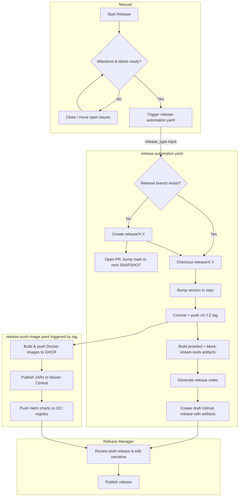
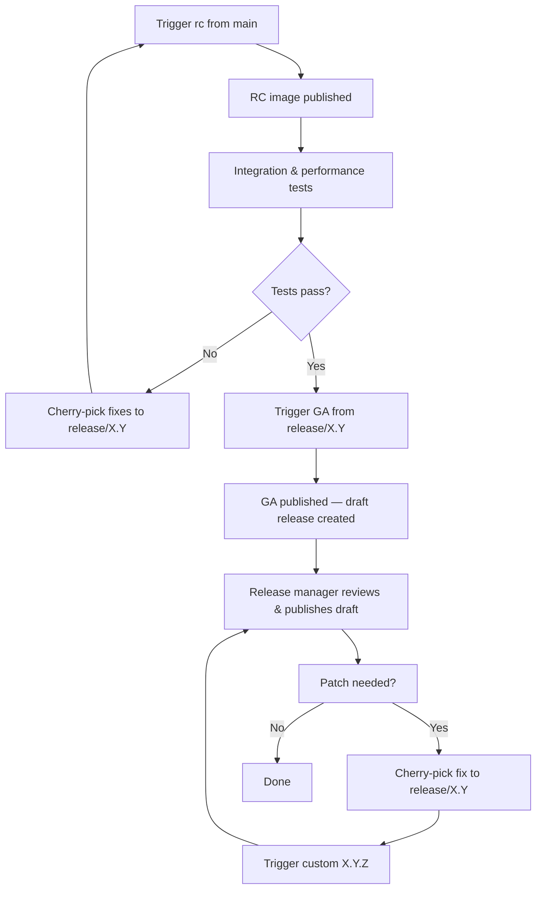

# Release Process Documentation

## Table of Contents

1. [Overview](#overview)
2. [Kickstart Release Process](#kickstart-release-process)
3. [Workflow Reference](#workflow-reference)
   1. [release-automation.yaml](#release-automationyaml)
   2. [release-notes-generator.yaml](#release-notes-generatoryaml)
   3. [release-push-image.yaml](#release-push-imageyaml)
4. [End-to-End Release Steps](#end-to-end-release-steps)
   1. [Release Candidate](#release-candidate)
   2. [General Availability](#general-availability)
   3. [Patch / Hotfix](#patch--hotfix)
5. [Artifact Reference](#artifact-reference)
6. [Release Flow Diagram](#release-flow-diagram)
7. [Release Meta Process](#release-meta-process)
8. [Troubleshooting](#troubleshooting)

---

## Overview

Releases are fully automated via GitHub Actions. A release manager triggers a single workflow
(`release-automation.yaml`), and the rest — branch management, version bumping, tagging,
artifact building, release notes, and the draft GitHub release — happen automatically. Docker
images, JARs, and Helm charts are published by a separate workflow that fires on the tag push.

---

## Kickstart Release Process

Before triggering any workflow:

1. **Milestone and label check** — Ensure all PRs and issues in the target milestone are closed
   or moved to the next milestone. A CI check enforces labels and milestones on every PR.
2. **Cherry-picks** — Confirm all required fixes have been cherry-picked from `main` to
   `release/X.Y` (for RC2+, GA, and patch runs).
3. **Branch selection** — First RC for a new minor: dispatch from `main`. All subsequent runs
   (RC2+, GA, patch): dispatch from `release/X.Y`.

---

## Workflow Reference

### `release-automation.yaml`

**Trigger:** `workflow_dispatch` only — must be run manually by a release manager.

**Inputs:**

|      Input       |            Values             |                          Description                           |
|------------------|-------------------------------|----------------------------------------------------------------|
| `release_type`   | `rc`, `alpha`, `GA`, `custom` | Determines how the next version is derived from `version.txt`. |
| `custom_version` | free text                     | Required only when `release_type` is `custom` (e.g. `0.39.1`). |

**What it does, in order:**

| Step | Effect |
|------|--------|
| Compute version | Derives the next semver from `version.txt` on the dispatching branch and `release_type`. `rc` increments the RC counter (or starts at `rc1` from SNAPSHOT). `GA` strips the pre-release suffix. |
| Create / switch release branch | Creates `release/X.Y` from `main` if it doesn't exist, or checks it out. **GA only, if a prior rc/alpha exists:** checks out that exact tag as a detached HEAD instead, so drift on the branch since the last rc can't sneak into GA untested. |
| Bump version | Runs `./gradlew versionAsSpecified` to write the new version into `version.txt`, chart files, etc. |
| Close milestone | GA runs only: closes the GitHub milestone matching the release version. |
| Commit + tag | GPG-signs the bump commit and pushes the `vX.Y.Z` tag. The tag push simultaneously triggers `release-push-image.yaml`. **GA only:** the commit and signed tag are pushed as just the tag (no branch push, since HEAD may be detached) — the release branch is then separately fast-forwarded/merged up to the tag in a follow-up step, never force-pushed. |
| Build protobuf artifact | Runs `:protobuf-sources:generateBlockNodeProtoArtifact` on the already-checked-out repo. |
| Build block-stream-tools artifact | Runs `:tools:shadowJar` and renames to `block-stream-tools-X.Y.Z.jar`. |
| Upload artifacts | Both artifacts are uploaded as workflow artifacts within the same run so `create_release` can retrieve them without a separate racing job. |
| Generate release notes | Calls the reusable `release-notes-generator.yaml` (see below). |
| Create draft release | Creates (or updates) a **draft** GitHub release with notes and artifacts attached. The release stays draft until the release manager manually publishes it. |
| Bump main snapshot | When `release/X.Y` is newly created, opens a PR on `main` to advance `version.txt` to `X.(Y+1).0-SNAPSHOT`. |

**Result:** GPG-signed tag, draft GitHub release with notes and artifacts, and (on first cut of
a minor) an open PR bumping `main` to the next snapshot.

---

### `release-notes-generator.yaml`

**Trigger:** Called automatically by `release-automation.yaml` (`workflow_call`), or manually
via `workflow_dispatch` to regenerate or preview notes.

**What it does:** Checks out the release branch, resolves the latest semver tag on it, installs
git-cliff, generates the changelog, and uploads it as a workflow artifact.

|        Release type         |                            Changelog range                            |
|-----------------------------|-----------------------------------------------------------------------|
| RC (`is_prerelease: true`)  | Incremental — commits since the previous tag (`--latest`).            |
| GA (`is_prerelease: false`) | Full cycle — all commits from the previous stable GA tag to this one. |

The generated notes include a placeholder header asking the release manager to add a 2–4 sentence
narrative summary before publishing.

**Result:** Workflow artifact `release-notes-<tag>` containing `release_notes.md`.

---

### `release-push-image.yaml`

**Trigger:** Automatically on `v*` tag push and `main` branch push; also `workflow_dispatch`.

**What it does:**

|              Job               |                                                                         Output                                                                         |
|--------------------------------|--------------------------------------------------------------------------------------------------------------------------------------------------------|
| `publish-app`                  | Builds the block-node server and solo-dev Docker images; pushes to GHCR (`ghcr.io/hiero-ledger/hiero-block-node:<version>` and `-solo-dev:<version>`). |
| `publish-jars`                 | Publishes all project JARs to Maven Central (release versions) or Maven Central Snapshots (SNAPSHOT versions). Requires GPG signing.                   |
| `publish-simulator`            | Builds and pushes the simulator Docker image to GHCR.                                                                                                  |
| `helm-chart-release-app`       | Packages and pushes the `block-node-server` Helm chart to the OCI registry on GHCR.                                                                    |
| `helm-chart-release-simulator` | Packages and pushes the `blockstream-simulator` Helm chart.                                                                                            |

**Mutable `main` tag:** A push to `main` (not a version tag) publishes images tagged with the
branch name, providing a rolling latest-snapshot image for integration environments.

**Result:** Docker images, JARs, and Helm charts published. This workflow does **not** create or
update the GitHub release — that is `release-automation.yaml`'s responsibility. The two
workflows run concurrently after the tag push.

---

## End-to-End Release Steps

### Release Candidate

1. Go to **Actions → Release Automation → Run workflow**.
2. Select the branch: `main` for the first RC of a new minor, or `release/X.Y` for RC2+.
3. Set `release_type` to `rc`. Leave `custom_version` empty.
4. Click **Run workflow** and wait (~10–15 min).
5. If this was the **first RC**, a PR bumping `main` to `X.(Y+1).0-SNAPSHOT` is opened
   automatically — review and merge it promptly.
6. `release-push-image.yaml` fires in parallel and publishes Docker images and JARs.
7. Open the draft release on GitHub. Add a 2–4 sentence narrative above the changelog (replace
   the placeholder line). Keep the release as **draft** — do not publish yet.
8. Share the draft image tag with the team for integration and performance testing.
9. For subsequent RCs: cherry-pick any fixes to `release/X.Y` and repeat from step 1 with
   `release/X.Y` as the branch.

### General Availability

1. Confirm all integration and performance tests pass on the latest RC image.
2. Cherry-pick any remaining fixes from `main` to `release/X.Y`.
3. Go to **Actions → Release Automation → Run workflow**.
4. Select branch `release/X.Y`. Set `release_type` to `GA`.
5. Click **Run workflow** and wait (~10–15 min). The workflow:
   - Strips the `-rcN` suffix (e.g. `0.39.0-rc3` → `0.39.0`).
   - Builds from the exact commit tagged as the last rc (a detached HEAD), not the release
     branch tip — any commit that landed on the branch after that rc is excluded. Falls back to
     the branch tip if no rc was ever cut for this version.
   - Closes the milestone.
   - Creates the GA tag and a new draft release with full-cycle notes and artifacts.
   - Syncs `release/X.Y` back up to the GA tag via a merge (never a force-push), so the branch
     doesn't silently fall behind its own latest tag.
6. `release-push-image.yaml` fires simultaneously and publishes GA images to GHCR and JARs
   to Maven Central.
7. Open the draft release. Review:
   - The full-cycle changelog (all commits since the previous GA tag).
   - Attached artifacts: `block-node-protobuf-X.Y.Z.tgz`, `block-stream-tools-X.Y.Z.jar`.
   - Helm charts (added by `release-push-image.yaml` — may take a few minutes longer).
8. Add or refine the narrative summary at the top.
9. Click **Publish release** to make it public and mark it as the latest release.

### Patch / Hotfix

1. Cherry-pick the fix commit(s) from `main` to `release/X.Y`.
2. Go to **Actions → Release Automation → Run workflow**.
3. Select branch `release/X.Y`. Set `release_type` to `custom`.
4. Enter the exact version string in `custom_version` (e.g. `0.39.1`).
5. Follow steps 6–9 from the GA flow above.

---

## Artifact Reference

|                  Artifact                   |                 Built by                  |                                 Published / attached by                                 |
|---------------------------------------------|-------------------------------------------|-----------------------------------------------------------------------------------------|
| `block-node-protobuf-X.Y.Z.tgz`             | `release-automation.yaml` (`release` job) | `release-automation.yaml` (`create_release` job) — attached to the GitHub draft release |
| `block-stream-tools-X.Y.Z.jar`              | `release-automation.yaml` (`release` job) | `release-automation.yaml` (`create_release` job) — attached to the GitHub draft release |
| Docker images (server, solo-dev, simulator) | `release-push-image.yaml`                 | GHCR (not attached to the GitHub release page)                                          |
| `block-node-server` Helm chart              | `release-push-image.yaml`                 | OCI registry on GHCR                                                                    |
| JARs                                        | `release-push-image.yaml`                 | Maven Central (release) / Maven Central Snapshots (SNAPSHOT)                            |

---

## Release Flow Diagram

---

## Release Meta Process

The typical lifecycle for a minor version:

1. **Release Candidates** — Trigger `rc` one or more times from `main` / `release/X.Y`.
   Perform integration and performance testing on each RC image. Cherry-pick fixes as needed.
2. **General Availability** — Once testing passes, trigger `GA` from `release/X.Y`. GA is built
   from the exact commit tagged as the last rc (not whatever the release branch currently points
   to), so any commit that landed on the branch after the last rc is excluded from GA. If no rc
   was ever released for this version, GA falls back to building from the release branch tip.
3. **Patch Versions** — Cherry-pick fixes from `main` to `release/X.Y` and trigger `custom`
   with the patch version string.

---

## Troubleshooting

**Draft release has no artifacts attached.**
The `create_release` job runs with `continue-on-error: true` so a failed artifact download
does not block release creation. Check the `release` job logs to confirm both artifact upload
steps succeeded, then re-run the `create_release` job individually from the Actions UI.

**`release-push-image.yaml` failed after the tag was pushed.**
Re-run the failed jobs from the Actions UI. Docker publish and JAR publish are idempotent; re-running is safe.

**Release notes are missing or incorrect.**
Trigger `release-notes-generator.yaml` manually with the correct `release_branch` and
`is_prerelease` inputs. Download the `release-notes-<tag>` artifact and paste the content into
the draft release body on GitHub.

**Milestone close failed on a GA run.**
Close the milestone manually from **GitHub → Issues → Milestones**. The rest of the release is unaffected.

**"Sync Release Branch with GA Tag" failed on a GA run.**
The GA tag itself already succeeded by this point — only the release branch's catch-up merge
failed, which only happens on a genuine conflict (a commit drifted onto the branch after the last
rc and touches the same bumped files as the GA tag). Fetch `release/X.Y`, merge the GA tag in
manually, resolve the conflict, and push. The draft release and artifacts are unaffected.

**Version bump PR on `main` was not opened.**
This PR is only created when a new `release/X.Y` branch is first cut. If it was missed, manually
bump `version.txt` on `main` to `X.(Y+1).0-SNAPSHOT` and open a PR.
