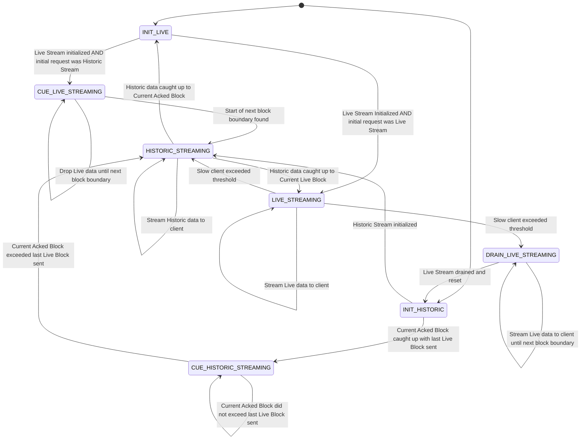

# Open-Range Historic Block Streaming Design

## Table of Contents

1. [Purpose](#purpose)
2. [Goals](#goals)
3. [Terms](#terms)
4. [Entities](#entities)
5. [Design](#design-overview)
6. [Finite State Machine](#finite-state-machine)
7. [Configuration](#configuration)
8. [Metrics](#metrics)
9. [Exceptions](#exceptions)
10. [Acceptance Tests](#acceptance-tests)

## Purpose

The purpose of the Open-Range Historic Block Streaming feature is to provide a mechanism for
consumers to request an open-ended stream of blocks starting from an existing historic
block and continuing to the present live stream of blocks using the `subscribeBlockStream` rpc
endpoint via the `SubscribeStreamRequest` message. The `starting_block_number` parameter can specify
any existing persisted block and the `end_block_number` parameter can specify a zero value to indicate
an infinite stream of blocks (transition to live blocks).

See the `block_service.proto` file definition [here](https://github.com/hashgraph/hedera-protobufs/blob/c0ca3524f2e80e5d5e545e36fcb5d23d64c31fb5/block/block_service.proto#L531-L562).

## Goals

1. Provide a stream of historic blocks, which transitions to the current live stream, to a
   downstream observer.

## Terms

See the range specification in the  `block_service.proto` file definition [here](https://github.com/hashgraph/hedera-protobufs/blob/c0ca3524f2e80e5d5e545e36fcb5d23d64c31fb5/block/block_service.proto#L531-L562).
`SubscribeStreamResponse` definition [here](https://github.com/hashgraph/hedera-protobufs/blob/c0ca3524f2e80e5d5e545e36fcb5d23d64c31fb5/block/block_service.proto#L582-L622)

## Entities

### PbjBlockStreamServiceProxy

- An entity which is responsible for reading the gRPC `SubscribeStreamRequest` message, validating the
  `start_block_number` and `end_block_number` and building/injecting all other necessary entities to
  stream the historic blocks back to the client.

### BlockReader

- An entity which is responsible for reading block items from the persistence service.

### HistoricDataPoller

- An entity which is responsible for polling the BlockReader for historic block items.

### LiveStreamPoller

- An entity which is responsible for polling the RingBuffer for live block items.

### ConsumerStreamResponseObserver

- An entity which manages a connection to a streaming client provided by Helidon and which receives data from an
  HistoricToLiveBlockStreamSupplier. It is responsible for sending the data to the streaming client.

### OpenRangeStreamManager

- An entity which is responsible for supplying historic block items to a ConsumerStreamResponseObserver and for
  transitioning from an historic stream of block items to the live stream of block items once it catches up.

### ConsumerStreamRunnable

- A runnable executed by virtual threads which continuously loops calling the `execute` method of the
  OpenRangeStreamManager until it returns false or an exception is thrown.

## Design Overview

1. The `PbjBlockStreamServiceProxy` is called by Helidon when a client makes a request to the `subscribeBlockStream` rpc
   endpoint. After validating the `start_block_number` and `end_block_number`, it creates an
   `OpenRangeStreamManager` with the requested block range, an `HistoricDataPoller`, a `LiveStreamPoller`, a `ConsumerStreamResponseObserver` and
   a `ConsumerStreamRunnable`.
2. The `ConsumerStreamRunnable` continuously calls the `OpenRangeStreamManager` which polls block items from the `HistoricDataPoller`
   and sends them to the client via the `ConsumerStreamResponseObserver`. Once the stream catches up to the live blocks, the `OpenRangeStreamManager`
   will transition to polling the live stream from the `LiveStreamPoller`.
3. The `OpenRangeStreamManager` will continue to stream blocks to the client until the client disconnects
   or the stream is closed.

## Finite State Machine

The `OpenRangeStreamManager` will leverage a Finite State Machine to dynamically manage the transitions between block item
stream sources.

### Dynamic Toggling between Historic Streaming to Live Streaming State Diagram

### Client can request:

1) Live Streaming starting with the latest block
2) Historic Streaming starting with a specific block and transitioning to Live Streaming

### Live Streaming:

1) Continue to stream the latest live data unless the client is too slow
2) Transition to Historic Streaming if the client exceeds a threshold

### Historic Streaming:

1) Start streaming from the requested block
2) When the client catches up to the latest acknowledged block, initialize the Live Streaming. Live Streaming requires Ring Buffer resources that should not be allocated until necessary
3) Cue up the Live Streaming to the next block boundary. Transitions between streaming sources must occur at block boundaries
4) Continue to stream the Historic data to the client until the Historic Stream reaches the Live Stream block boundary
5) Transition to Live Streaming
6) Continue to stream the latest live data unless the client is too slow
7) Transition to Historic Streaming if the client exceeds a threshold

## Configuration

This feature will leverage one of our standard Config objects to communicate properties.
- `maxBlockItemBatchSize` - An integer used to determine the max size of each block item batch a block from the BlockReader
is broken up into before being sent to a client.

## Metrics

<dl>
<dt>HistoricBlockItemsConsumed</dt><dd>Counter for the number of historic block items consumed by each BlockNodeEventHandler</dd>
<dt>HistoricToLiveStreamTransitions</dt><dd>Counter for the number of transitions from historic-streaming to live-streaming</dd>
<dt>LiveToHistoricStreamTransitions</dt><dd>Counter for the number of transitions from live-streaming to historic-streaming</dd>
<dt>HistoricBlockStreamError</dt><dd>Counter for the number of errors encountered by an HistoricBlockStreamSupplier</dd>
</dl>

## Exceptions

Based on the `SubscribeStreamRequest` specification, the following error response messages may be returned to the client:

### READ_STREAM_INVALID_START_BLOCK_NUMBER

- The `start_block_number` is greater than the `end_block_number`.
- The `start_block_number` is invalid.

### READ_STREAM_INVALID_END_BLOCK_NUMBER

- The `end_block_number` is invalid.

### READ_STREAM_NOT_AVAILABLE

- Sent if the service is unavailable.

## Acceptance Tests

- Negative tests for the following:
  - `start_block_number` is greater than the `end_block_number`
  - `start_block_number` is invalid
  - `end_block_number` is invalid
  - Service unavailable
  - Mocked BlockReader and client object should verify that an error response is sent to the client.
