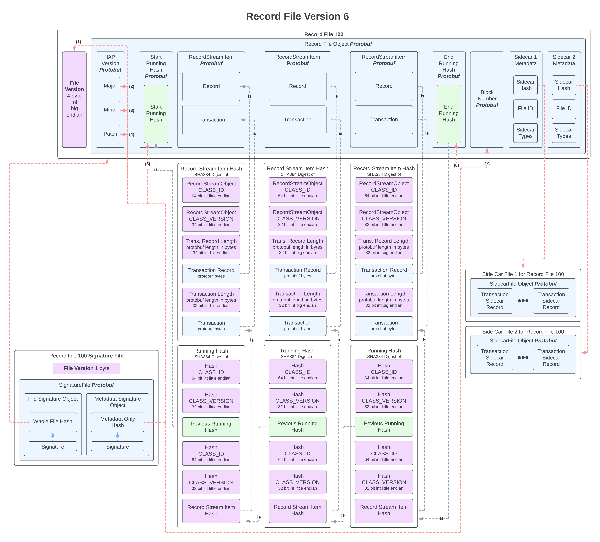

# Record and Event Stream File Formats

## Overview

The Hedera network produces a blockchain of **record stream files** that capture chronological information about
transactions that took place on the network.

- A **record stream file** (`.rcd`) contains a series of transactions in chronological order that occurred within a
  two-second interval, including a transaction record for each transaction in that file.
- For each record stream file there is a corresponding **signature file** (`.rcd_sig`) that includes the node’s signature.
- Record stream v6 files can also have sidecar files that contain additional information about the transactions.

---

## Version Migration

|          File Type           | Historical Versions | Current Version |
|------------------------------|---------------------|-----------------|
| Record Stream File           | 2, 5                | 6               |
| Record Stream Signature File | 4                   | 5               |

**Note:** Record stream files start with a 4 byte integer version number in big endian format.

**Note:** Current record signature files (`.rcd_sig`). The first byte’s value is `4`, which denotes a marker. To
maintain backwards compatibility, the first byte in the new version stream signature file is `5`, which denotes the
version. Thus, version **5** is used as the next version number.

---

## Version 2 Record Stream File Format

Record files are written and read with Java DataInputStream and DataOutputStream, hence they use big endian byte order.

### Record Stream File Names

A record stream file name is a string representation of the **Instant** of the consensus timestamp of the first
transaction in the file using **ISO-8601** representation, with colons converted to underscores for Windows
compatibility. The nano-of-second outputs zero, three, six, or nine digits as necessary.

**Examples**
- Record: `2020-10-19T21_35_39Z.rcd`
Signature: `2020-10-19T21_35_39Z.rcd_sig`
- Record: `2020-10-19T21_35_39.454265Z.rcd`
Signature: `2020-10-19T21_35_39.454265Z.rcd_sig`

### Record Stream File Format (`.rcd`)

The table describes the content that can be parsed from a record file.

|               Name                | Type (Bytes) |                          Description                          |
|-----------------------------------|--------------|---------------------------------------------------------------|
| Record Stream File Format Version | int (4)      | Value: **2**                                                  |
| HAPI Version                      | int (4)      | HAPI protocol version. Value: **3**                           |
| Prev File Hash Marker             | byte         | Value: **1**                                                  |
| Prev File Hash                    | byte[48]     | SHA-384 hash of previous file; if not present then all zeroes |
| Record Marker                     | byte         | Value: **2**                                                  |
| Length of Transaction             | int (4)      | Byte size of the following `Transaction` message              |
| Transaction                       | byte[]       | Serialized `Transaction` bytes                                |
| Length of TransactionRecord       | int (4)      | Byte size of the following `TransactionRecord` message        |
| TransactionRecord                 | byte[]       | Serialized `TransactionRecord` bytes                          |
| Record Marker                     | byte         | Value: **2** (repeats for subsequent records)                 |

> The `.rcd_sig` signature file signs the hash of the corresponding `.rcd` file.

### Record Stream Signature File Format (`.rcd_sig`)

*(Note: Version number not present in v2 signature files.)*

|        Name         | Type (Bytes) |                Description                 |
|---------------------|--------------|--------------------------------------------|
| File Hash Marker    | byte         | Value: **4**                               |
| File Hash           | byte[48]     | SHA-384 hash of corresponding `.rcd` file  |
| Signature Marker    | byte         | Value: **3**                               |
| Length of Signature | int (4)      | Byte size of the following signature bytes |
| Signature           | byte[]       | Signature bytes                            |

#### File Hash Calculation (v2)

`h[i] = hash(p[i-1] || h[i-1] || hash(c[i-1]))`

Where:
- `||` denotes concatenation
- `h[i]` is the hash of file i
- `p[i-1]` is the contents before `PREV_FILE_HASH`
- `h[i-1]` is the hash of file i-1 (i.e., `PREV_FILE_HASH`)
- `c[i-1]` is the contents after `PREV_FILE_HASH`

---

## Version 5 Record Stream File Format

Record files are written and read with Java DataInputStream and DataOutputStream, hence they use big endian byte order.

### Record Stream File Names

- ISO-8601 with colons replaced by underscores.
- Nano-of-second **always** has **nine digits** (padded as necessary) to ensure fixed-length filenames and proper sorting.

**Examples**
- Record: `2020-10-19T21_35_39.000000000Z.rcd`
Signature: `2020-10-19T21_35_39.000000000Z.rcd_sig`
- Record: `2020-10-19T21_35_39.454265000Z.rcd`
Signature: `2020-10-19T21_35_39.454265000Z.rcd_sig`

### Record Stream File Format (`.rcd`)

#### MD – Meta Data

|               Name                | Type (Bytes) |                                                 Description                                                 |
|-----------------------------------|--------------|-------------------------------------------------------------------------------------------------------------|
| Record Stream File Format Version | int (4)      | Value: **5**                                                                                                |
| HAPI Proto Major Version          | int (4)      | Matches `NetworkGetVersionInfo.hapiProtoVersion` (Major.Minor.Patch: Major **0**, Minor **9**, Patch **0**) |
| HAPI Proto Minor Version          | int (4)      | —                                                                                                           |
| HAPI Proto Patch Version          | int (4)      | —                                                                                                           |
| Object Stream Version             | int (4)      | Value: **1** — defines format of remainder of file (used by swirlds-common parsers)                         |
| Start Object Running Hash         | byte[]       | Running hash of all `RecordStreamObject`s before writing this file (see **Hash Object**)                    |
| 1st RecordStreamObject            | byte[]       | Serialized `RecordStreamObject` bytes (see table below)                                                     |
| 2nd RecordStreamObject, …         | byte[]       | —                                                                                                           |
| End Object Running Hash           | byte[]       | Running hash of all `RecordStreamObject`s before closing this file                                          |

#### Hash Object

|      Name      | Type (Bytes) |                      Description                       |
|----------------|--------------|--------------------------------------------------------|
| Class ID       | long (8)     | Value: `0xf422da83a251741e`                            |
| Class Version  | int (4)      | Value: **1** (updates when Hash serialization changes) |
| Digest Type    | int (4)      | Value: `0x58ff811b` (denotes **SHA-384**)              |
| Length of Hash | int (4)      | Value: **48** for SHA-384                              |
| Hash Bytes     | byte[]       | Serialized hash bytes                                  |

#### Record Stream Object

|            Name             | Type (Bytes) |             Description              |
|-----------------------------|--------------|--------------------------------------|
| Class ID                    | long (8)     | Value: `0xe370929ba5429d8b`          |
| Class Version               | int (4)      | Value: **1**                         |
| Length of TransactionRecord | int (4)      | Byte size of `TransactionRecord`     |
| TransactionRecord           | byte[]       | Serialized `TransactionRecord` bytes |
| Length of Transaction       | int (4)      | Byte size of `Transaction`           |
| Transaction                 | byte[]       | Serialized `Transaction` bytes       |

### Record Stream Signature File Format (`.rcd_sig`) – v5

In v5, the record stream signature file format is the same as the event stream signature file format.

|                   Name                   | Type (Bytes) |                                    Description                                     |
|------------------------------------------|--------------|------------------------------------------------------------------------------------|
| Signature File Format Version            | byte         | Value: **5**                                                                       |
| Object Stream Signature Version          | int (4)      | Value: **1** — format of remainder of signature file (used by swirlds-common)      |
| Entire Hash of corresponding file        | byte[]       | Hash of the **entire** corresponding `.rcd` file                                   |
| Signature on hash bytes of Entire Hash   | byte[]       | Signature object over the hash bytes of the Entire Hash (see **Signature Object**) |
| Metadata Hash of corresponding file      | byte[]       | Hash over metadata bytes                                                           |
| Signature on hash bytes of Metadata Hash | byte[]       | Signature object over the hash bytes of the Metadata Hash                          |

#### Signature Object

|        Name         | Type (Bytes) |               Description                |
|---------------------|--------------|------------------------------------------|
| Class ID            | long (8)     | Value: `0x13dc4b399b245c69`              |
| Class Version       | int (4)      | Value: **1**                             |
| SignatureType       | int (4)      | Value: **1** (denotes **SHA384withRSA**) |
| Length of Signature | int (4)      | Byte size of signature bytes             |
| CheckSum            | int (4)      | `101 - length(signature bytes)`          |
| Signature bytes     | byte[]       | Serialized signature bytes               |

#### File Hash Calculation (v5)

There are **three** hashes calculated:

1. **Object Running Hash**
   - Calculated from the hash of each object, allowing removal of object contents while maintaining an unbroken chain of hashes.
   - Saved in state so reconnecting nodes can continue generating identical stream files.
   - Formula:
     `hash(ObjectRunningHash || hash(OBJECT))`
     (In record stream files, `OBJECT` is the **Record Stream Object**.)
2. **Entire `.rcd` Hash**
   - Calculated across **all** bytes of a `.rcd` file.
   - With this hash, mirror nodes can download valid `.rcd` files whose entire hash is agreed upon by valid signatures of at least 1/3 of nodes.
   - If file contents are `f[i] = head[i] || startHash[i] || contents[i] || endHash[i]`, then:
     `entireHash[i] = hash(head[i] || startHash[i] || contents[i] || endHash[i])`
3. **Metadata `.rcd` Hash**
   - Calculated over metadata bytes only (as denoted in the tables).
   - Remains valid even if some contents of an object are removed.
   - `metaHash[i] = hash(head[i] || startHash[i] || endHash[i])`

**Migration from v2 to v5:**
`Hash Bytes` in `Start Object Running Hash` of the **first v5** `.rcd` file equals the `File Hash` in the **last v2** `.rcd_sig` file (the hash of the last v2 `.rcd` file).

---

## Version 6 Record Stream File Format

Complete description of V6 format including how hashes are produced which is missing from the HIP and non-obvious. A record file is the record of execution of one block which is 2 seconds of consensus time.

### Record File Names

The name of the record file is the consensus time of the first transaction in a block which may be a user or preceding
child transaction. Formatted as ISO-8601 representation, with colons converted to underscores for Windows compatibility.
Each record file will have multiple accompanying signature files for each node that signed the file.

- Record File: `2022-10-19T21_35_39.000000000Z.rcd.gz`
  - Sidecar Record File 1: `2022-10-19T21_35_39.000000000Z_01.rcd.gz`
  - Sidecar Record File 2: `2022-10-19T21_35_39.000000000Z_02.rcd.gz`
  - Record Signature File: `2022-10-19T21_35_39.000000000Z.rcd_sig`

### Record File Format

The V6 record file format has a header int version followed by protobuf data.

- V6 HIP Spec https://hips.hedera.com/hip/hip-435

### **Diagram**

**Key**
- **Blue** box contents are protobuf format message objects
- **Purple** is not protobuf format
- **White** boxes are mixed format
- **Green** is running hashes
- **Red** arrows are point from a hash to the data included in computing that hash

### **The Protobuf Definition**

#### Record File

Record files have a header version before the start of protobuf content. It is a single 32bit integer version number in big endian format and will equal 0x00000006 for V6 record files

**`message RecordStreamFile`**

- `SemanticVersion hapi_proto_version = 1;`  Version of HAPI that was used to serialize the file.
- `HashObject start_object_running_hash = 2;` Running Hash of all RecordStreamItems before writing this file.
- `repeated RecordStreamItem record_stream_items = 3;` List of all the record stream items from that period.
- `HashObject end_object_running_hash = 4;` Running Hash of all RecordStreamItems before closing this file.
- `int64 block_number = 5;` The block number associated with this period.
- `repeated SidecarMetadata sidecars = 6;` List of the hashes of all the sidecar record files created for the same period. Allows multiple sidecar files to be linked to this RecordStreamFile.

**`message RecordStreamItem`**

- `Transaction transaction = 1;`
- `TransactionRecord record = 2;`

Information about a single sidecar file.

**`*message SidecarMetadata`***

- `HashObject hash = 1;` The hash of the entire file.
- `int32 id = 2;` The id of the sidecar record file
- `repeated SidecarType types = 3;` The types of sidecar records that will be included in the file.

#### Signature File

A record signature file is created for each record stream file. The record signature file that is created for each record stream file signs the hash of the bytes of the entire corresponding stream file as well signing the metadata bytes on their own. The list of sidecar file hashes is included in the record stream file.

This way mirror nodes or any interested party can download the record stream file and all sidecar files and verify that:

1. repeated SidecarMetadata sidecars is correct;
2. the signature file signed the correct hash of the entire record stream file;

**`message SignatureFile`**

- `SignatureObject file_signature = 1;` Signature for the file
- `SignatureObject metadata_signature = 2;` Metadata signature

**`message SignatureObject`**

- `SignatureType type = 1;` The signature type (`SIGNATURE_TYPE_UNKNOWN` or `SHA_384_WITH_RSA`)
- `int32 length = 2;` Signature length
- `int32 checksum = 3;` Signature checksum
- `bytes signature = 4;` Signature bytes
- `HashObject hash_object = 5;`  The hash that is signed by this signature

**`message HashObject`**

- `HashAlgorithm algorithm = 1;`  Specifies the hashing algorithm (`HASH_ALGORITHM_UNKNOWN` or `SHA_384`)
- `int32 length = 2;` Hash length
- `bytes hash = 3;` Specifies the result of the hashing operation in bytes

#### Sidecar File

Sidecar files contain extra data that can be chosen to be optionally read by mirror nodes. Sidecar files do not have a version header outside the protobuf, so they are a pure single protobuf message.

**`message SidecarFile`**

- `repeated TransactionSidecarRecord sidecar_records = 1;` List of sidecar records

**`message TransactionSidecarRecord`**

- `Timestamp consensus_timestamp = 1;` Consensus timestamp will be the same as the consensus timestamp of the transaction the side car is related to. This offers a convenient way to match record to sidecar.
- `bool migration = 2;` Whether sidecar is from migration.
- `oneof sidecar_records` List of sidecar types. In future there will be other categories.
  - `ContractStateChanges state_changes = 3;`
  - `ContractActions actions = 4;`
  - `ContractBytecode bytecode = 5;`

### Hashes

We have 4 main types of hashes:

#### (1) Running Hashes of Record Stream Items

First each record stream item is hashed into a single SHA384 hash. That hash includes:

- RecordStreamObject Class ID `0xe370929ba5429d8b`as 64bit long little endian
- RecordStreamObject Version Number `1` as 32bit int little endian
- Length in bytes of Protobuf encoded `TransactionRecord` 32bit int ***big*** endian
- Protobuf encoded `TransactionRecord`
- Length in bytes of Protobuf encoded `Transaction` 32bit int ***big*** endian
- Protobuf encoded `Transaction`

Then we take that computed hash and combine it in new SH384 to compute the new running hash. The bytes digested in that hash are:

- Hash Class ID `-854880720348154850` as 64bit long little endian
- Hash Version Number `1` as  32bit int little endian
- 48 bytes of SHA384 previous running hash
- Hash Class ID `-854880720348154850` as 64bit long little endian
- Hash Version Number `1` as  32bit int little endian
- 48 bytes of SHA384 of record stream item from above

#### (2) SignatureFile Whole File Hash

This is a SHA384 hash of all the bytes of the record file.

#### (3) Signature File Metadata Only Hash

This is a SHA384 hash with the following exact data in order

- Record file version 32bit int little endian
- HAPI version major number 32bit int little endian
- HAPI version minor number 32bit int little endian
- HAPI version patch number 32bit int little endian
- SHA384 hash for starting running hash at beginning of file
- SHA384 hash for end running hash at end of file
- Block Number 64bit long little endian

#### (4) Sidecar Hash

The sidecar hash used in **`*SidecarMetadata`*** objects is as simple as the SHA384 hash of all the sidecar file bytes.
